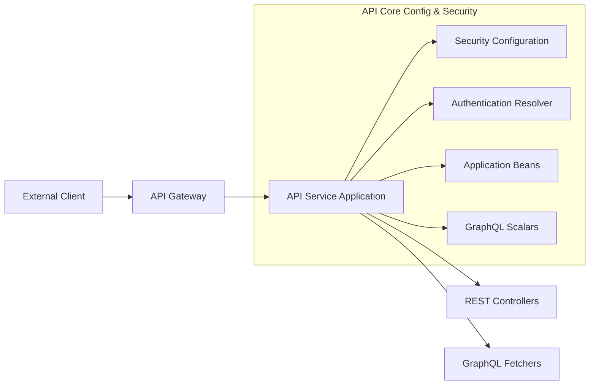
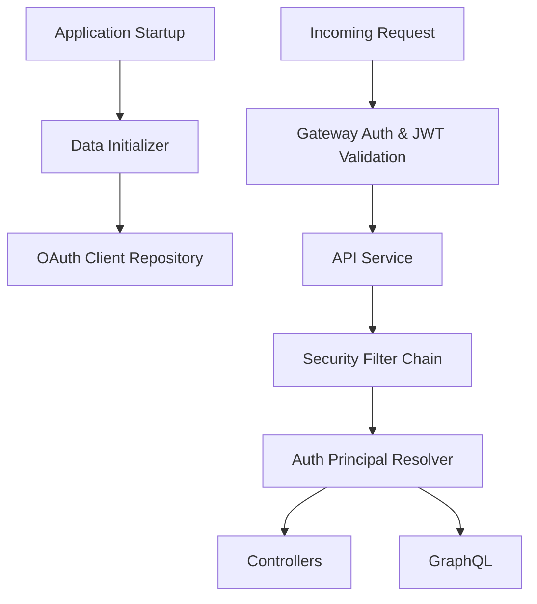

# API Service Core – Configuration & Security

## Overview

The **api_service_core_config_security** module provides foundational configuration, security wiring, and GraphQL scalar support for the OpenFrame API service. It is intentionally lightweight in terms of authorization logic, delegating most security enforcement to the Gateway service, while still enabling:

- Consistent password encoding
- OAuth2/JWT principal resolution for controllers and GraphQL fetchers
- Centralized initialization of core OAuth client data
- Shared REST and GraphQL infrastructure beans

This module is consumed by the main API application and supports REST controllers and GraphQL data fetchers across the platform.

---

## Position in the System Architecture

At runtime, this module sits between the **Gateway Service** (which performs authentication and authorization) and the **API REST / GraphQL layers** that implement business logic.

**Key architectural principle:**
> The API service trusts the Gateway for access control and focuses on identity propagation and request handling.

---

## Core Responsibilities

### 1. Application-Level Bean Configuration

Provides common Spring beans shared across the API service:

- Password encoding
- HTTP client utilities

See: [Application Configuration](Application Configuration.md)

---

### 2. Authentication & Security Integration

Enables identity propagation from JWTs issued and validated by the Gateway:

- Resolves authenticated principals in controllers
- Configures OAuth2 Resource Server support
- Caches JWT authentication providers by issuer

See: [Authentication Integration](Authentication Integration.md)

---

### 3. OAuth Client Bootstrapping

Ensures required OAuth client records exist and remain synchronized with environment configuration during application startup.

See: [Data Initialization](Data Initialization.md)

---

### 4. GraphQL Scalar Extensions

Adds custom scalar support for strongly typed date and time handling in GraphQL APIs.

See: [GraphQL Scalars](GraphQL Scalars.md)

---

## Runtime Flow Summary

---

## Design Considerations

- **No endpoint-level authorization rules** are defined here; all requests are permitted at this layer.
- **JWT validation is issuer-aware**, supporting multi-tenant or multi-issuer deployments.
- **Stateless by design**, relying on upstream services and shared data stores.
- **Reusable across services** that expose GraphQL or REST APIs under the OpenFrame platform.

---

## Related Modules (Conceptual)

- Gateway Service – request authentication, authorization, and routing
- Authorization Service – OAuth2 and OIDC flows
- API REST Controllers – business-facing HTTP endpoints
- API GraphQL Fetchers – data access and aggregation layer

(Refer to platform documentation for details on these modules.)

---

## Summary

The **api_service_core_config_security** module establishes the baseline runtime environment for the OpenFrame API service. By separating infrastructure concerns from business logic, it ensures consistent security behavior, clean controller signatures, and predictable startup behavior across all API deployments.