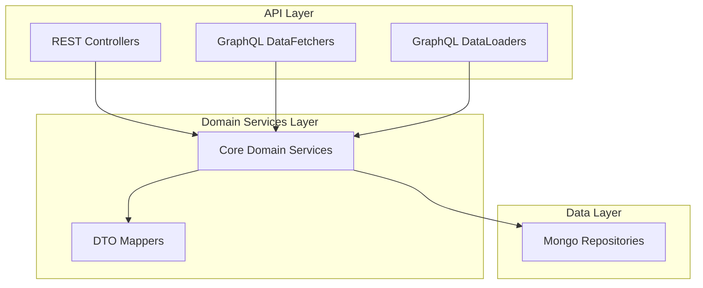

# API Service Core Domain Services

## Overview

The **api_service_core_domain_services** module contains core business-domain services and mappers that sit between the API layers (REST and GraphQL) and the data layer. These components encapsulate reusable domain logic, entity-to-DTO transformations, and default processing hooks used across the OpenFrame API service.

This module is intentionally lightweight and stateless, focusing on:

- Domain-centric services used by GraphQL DataLoaders and REST controllers
- Shared mappers between persistence models and API DTOs
- Default processors that can be overridden by downstream services

## Core Responsibilities

- Provide batch-oriented domain services optimized for GraphQL DataLoaders
- Centralize entity ↔ DTO mapping logic
- Offer extensible processing hooks with safe defaults

## Architecture Context

This module is consumed primarily by:

- **api_service_graphql_layer** (DataFetchers and DataLoaders)
- **api_service_rest_controllers**
- **api_dto_and_filter_models**
- **data_layer_mongo_documents_and_repos**

It does **not** expose HTTP or GraphQL endpoints directly.

## High-Level Architecture

## Sub-Modules

The module is composed of the following logical sub-modules:

- **Organization Mapping** – Shared entity/DTO transformations
- **Installed Agent Domain Service** – Installed agent lookup and batching
- **Tool Connection Domain Service** – Tool-to-machine relationship access
- **Device Status Processing** – Default lifecycle hooks

Detailed documentation for each sub-module is provided below:

- [Organization Mapper](organization_mapper.md)
- [Installed Agent Service](installed_agent_service.md)
- [Tool Connection Service](tool_connection_service.md)
- [Device Status Processor](default_device_status_processor.md)

## Design Principles

- **Batch-first APIs**: Methods are designed to accept lists to support GraphQL DataLoader patterns.
- **Separation of concerns**: Mapping, persistence access, and processing hooks are clearly separated.
- **Extensibility**: Default processors are replaceable via Spring bean overrides.
- **Shared usage**: Components are safe to use from both REST and GraphQL layers.

## Usage Notes

- Services in this module are Spring-managed beans and should be injected, not instantiated.
- No transactional write logic is implemented here unless explicitly required by the service.
- This module should remain free of API-layer concepts such as HTTP, GraphQL schemas, or request context.

---

This module forms a stable foundation for higher-level API functionality while remaining independent of transport and presentation concerns.