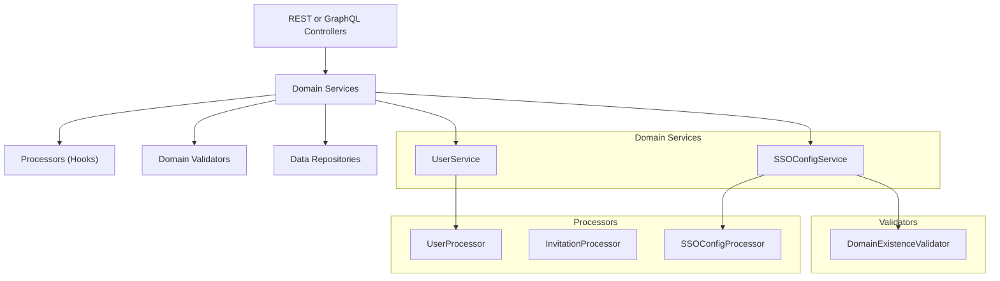
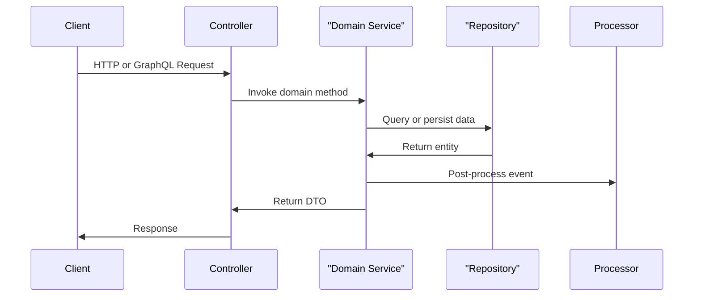

# api_service_core_domain_services_processors

## Overview
This module contains the **core domain services and processors** for the OpenFrame API service. It encapsulates business logic that sits between REST/GraphQL controllers and persistence layers, and provides extensibility hooks via *processor* and *validator* abstractions.

Key goals of this module:
- Centralize domain-level business rules (users, invitations, SSO configuration)
- Provide safe defaults via `Default*` implementations
- Allow SaaS or tenant-specific services to override behavior using Spring’s conditional beans

This module is primarily consumed by:
- REST controllers in `api_service_core_rest_controllers`
- GraphQL fetchers/loaders in `api_service_core_graphql_fetchers_loaders`
- Security and configuration modules during authentication and SSO flows

---

## High-Level Architecture

---

## Core Responsibilities

### 1. Domain Services
Domain services implement business use cases and enforce rules. They orchestrate repositories, mappers, validators, and processors.

- **User lifecycle management** (list, update, soft-delete)
- **SSO configuration management** (CRUD, enable/disable, validation)

### 2. Processors (Extension Hooks)
Processors are callback-style components invoked after key domain events. Default implementations log activity only, but tenants or SaaS deployments can override them to:
- Publish events
- Trigger workflows
- Sync with external systems

### 3. Validators
Validators encapsulate cross-cutting validation rules. Defaults are permissive and intended to be overridden in stricter environments.

---

## Sub-Modules

This module is composed of the following logical sub-modules:

- **Domain Validators**
  - DefaultDomainExistenceValidator

- **SSO Domain Services & Processors**
  - SSOConfigService
  - DefaultSSOConfigProcessor

- **User Domain Services & Processors**
  - UserService
  - DefaultUserProcessor

- **Invitation Processors**
  - DefaultInvitationProcessor

Each sub-module is documented in detail in its own file:

- [domain_validators.md](domain_validators.md)
- [sso_services_and_processors.md](sso_services_and_processors.md)
- [user_services_and_processors.md](user_services_and_processors.md)
- [invitation_processors.md](invitation_processors.md)

---

## Integration Notes

- **Spring Boot Conditional Beans**: All `Default*` implementations are annotated with `@ConditionalOnMissingBean`, enabling safe overrides without modifying core code.
- **Multi-tenant SaaS Overrides**: SaaS deployments typically replace validators and processors to enforce stricter policies.
- **No Direct Controller Logic**: Controllers should remain thin and delegate all business logic to this module.

---

## Typical Request Flow

---

## Summary

The `api_service_core_domain_services_processors` module defines the **business backbone** of the OpenFrame API service. By separating domain logic, extensibility hooks, and validation concerns, it enables clean customization for SaaS and tenant-specific requirements while maintaining a stable core.