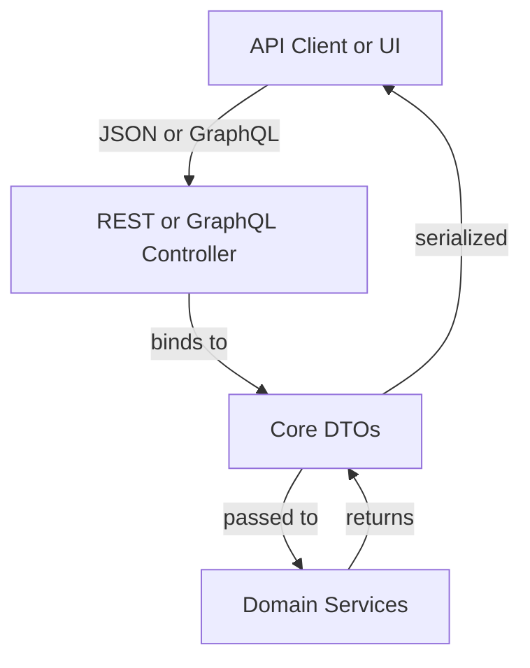
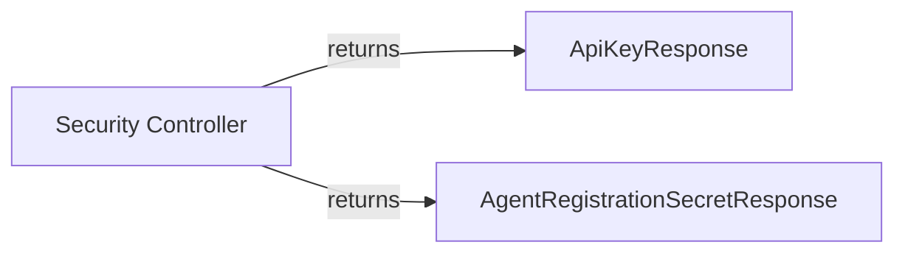
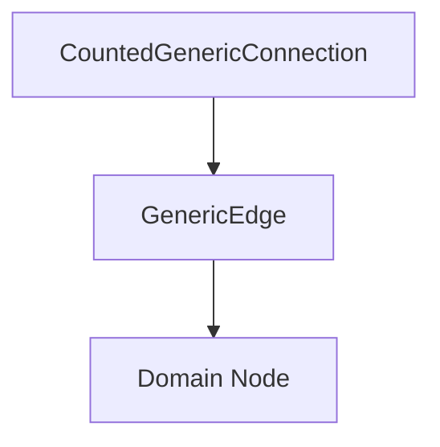
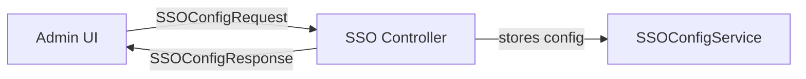
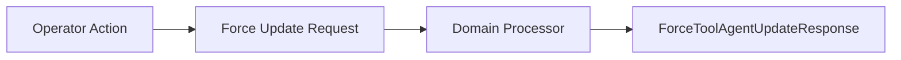
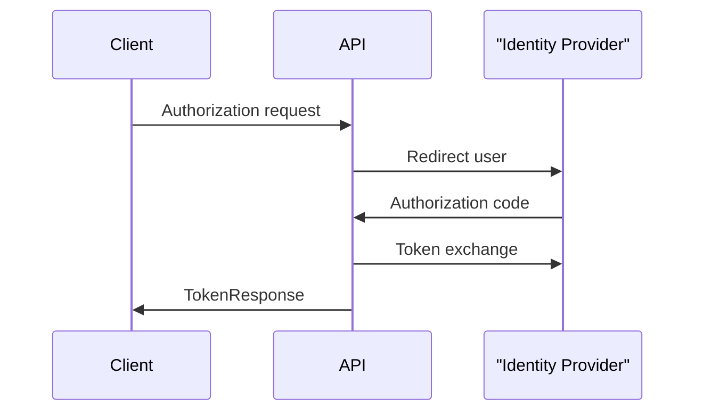

# api_service_core_dtos

## Overview

The **api_service_core_dtos** module defines the canonical Data Transfer Objects (DTOs) used by the OpenFrame API service. These DTOs act as the **contract layer** between:

- REST controllers
- GraphQL resolvers (DataFetchers and DataLoaders)
- Domain services and processors
- External clients (UI, agents, integrations)

The module is intentionally **framework-light and side‑effect free**. DTOs contain no business logic; they only describe request and response payloads, validation rules, and pagination or filtering structures.

This module is consumed heavily by:
- `api_service_core_rest_controllers`
- `api_service_core_graphql_fetchers_loaders`
- `api_service_core_domain_services_processors`

---

## Responsibilities

- Define **REST and GraphQL request/response schemas**
- Enforce **input validation constraints** close to API boundaries
- Provide **pagination and connection models** for GraphQL
- Represent **OAuth, OIDC, SSO, and security-related payloads**
- Provide **filter inputs** optimized for querying and aggregation

---

## Architectural Position

DTOs are shared across REST and GraphQL layers to ensure:
- Consistent schemas
- Predictable serialization
- Stable API evolution

---

## DTO Categories

### 1. Security, API Keys, and Agent Registration

These DTOs support authentication, authorization, and agent onboarding flows.

**Key DTOs**
- `AgentRegistrationSecretResponse`
- `ApiKeyResponse`

**Usage**
- Returned by security and management endpoints
- Expose metadata without leaking secrets

---

### 2. Client Configuration

Used to expose runtime configuration to OpenFrame clients.

**Key DTOs**
- `ClientConfigurationResponse`

**Usage**
- Client version checks
- Compatibility and rollout control

---

### 3. Pagination and GraphQL Connection Models

These DTOs implement Relay-style pagination and counted result sets.

**Key DTOs**
- `GenericEdge`
- `CountedGenericConnection`

**Conceptual Model**

**Responsibilities**
- Cursor-based pagination
- Total and filtered counts for UI efficiency

---

### 4. SSO and Identity Provider Configuration

These DTOs support configuring and inspecting SSO providers.

**Key DTOs**
- `SSOConfigRequest`
- `SSOConfigResponse`
- `SSOConfigStatusResponse`
- `SSOProviderInfo`

**Typical Flow**

**Notable Features**
- Auto‑provisioning controls
- Domain allow‑listing
- Provider‑specific metadata

---

### 5. Audit Logs and Eventing (GraphQL Inputs)

Optimized input DTOs for querying logs and events.

**Key DTOs**
- `LogFilterInput`
- `CreateEventInput`
- `EventFilterInput`

**Usage**
- GraphQL filtering
- Time‑range and multi‑criteria queries

---

### 6. Device, Organization, and Tool Filtering

Filter inputs aligned with GraphQL schemas and backend query models.

**Key DTOs**
- `DeviceFilterInput`
- `OrganizationFilterInput`
- `ToolFilterInput`

These DTOs are intentionally **query‑oriented**, not persistence‑oriented.

---

### 7. Forced Actions and Updates

DTOs that trigger bulk or targeted actions across clients and tools.

**Key DTO Groups**

- Client updates
- Tool installation, reinstallation, and updates

**Examples**
- `ForceClientUpdateRequest`
- `ForceToolUpdateRequest`
- `ForceToolReinstallationRequest`
- `ForceToolAgentUpdateResponse`

---

### 8. Invitations and User Lifecycle

DTOs supporting user onboarding, invitations, and lifecycle management.

**Key DTOs**
- `CreateInvitationRequest`
- `UpdateInvitationStatusRequest`
- `InvitationPageResponse`
- `UpdateUserRequest`
- `UserResponse`
- `UserPageResponse`

**Responsibilities**
- Input validation
- Pagination for admin UIs
- Safe exposure of user state

---

### 9. OAuth and OIDC Flows

DTOs that model OAuth2 and OpenID Connect interactions.

**Key DTOs**
- `AuthorizationResponse`
- `GoogleTokenRequest`
- `SocialAuthRequest`
- `TokenResponse`
- `OpenIDConfiguration`
- `UserInfo`
- `UserInfoRequest`

**Interaction Overview**

---

## Design Principles

- **Immutable where possible** using builders
- **Validation annotations** close to API boundaries
- **No persistence annotations**
- **No business logic**
- **Shared between REST and GraphQL**

---

## How This Module Fits the System

- Controllers depend on DTOs for request binding and responses
- Services consume DTOs as command or query objects
- GraphQL schemas map directly to DTO inputs and outputs
- Other services never persist or mutate DTOs directly

This makes **api_service_core_dtos** a stable, low‑churn foundation for the entire OpenFrame API surface.
