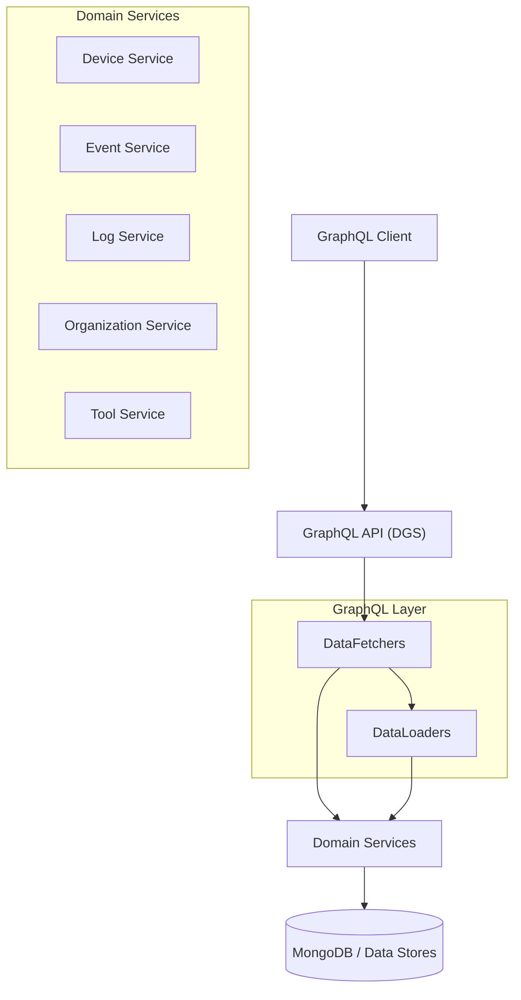

# api_service_core_graphql_fetchers_loaders

## Overview

The **api_service_core_graphql_fetchers_loaders** module implements the GraphQL query, mutation, and field-resolution layer for the OpenFrame API service. Built on top of **Netflix DGS**, it exposes domain data through GraphQL **DataFetchers** and optimizes nested data access using **DataLoaders** to avoid N+1 query problems.

This module sits between:
- **GraphQL schema & clients** (UI, BFF, integrations)
- **Domain services** (device, event, log, organization, tool services)
- **Persistence & external integrations** (MongoDB, other services)

It translates GraphQL inputs into domain filter options, delegates execution to services, and maps results back into GraphQL-friendly connection and edge models.

---

## Responsibilities

- Expose GraphQL **queries and mutations** for core domains (devices, events, logs, organizations, tools)
- Provide **cursor-based pagination** and filtering
- Resolve nested GraphQL fields efficiently using **DataLoaders**
- Enforce input validation at the GraphQL boundary
- Keep GraphQL concerns isolated from domain logic

---

## High-Level Architecture

**Key points:**
- DataFetchers handle GraphQL queries and mutations.
- DataLoaders batch and cache nested field lookups per request.
- Domain services encapsulate business logic and persistence.

---

## Module Composition

This module is composed of two main sub-modules:

1. **GraphQL DataFetchers** – entry points for GraphQL queries and mutations
2. **GraphQL DataLoaders** – batch loaders for nested fields

Each sub-module is documented separately:

- [GraphQL DataFetchers](GraphQL DataFetchers.md)
- [GraphQL DataLoaders](GraphQL DataLoaders.md)

---

## How This Module Fits in the System

- Works alongside **REST controllers** for non-GraphQL use cases
- Relies on **DTOs and mappers** from the API core
- Delegates all business rules to **domain services and processors**
- Uses shared **Mongo data models** and repositories

This separation ensures GraphQL remains a thin orchestration layer, while domain logic stays reusable and testable.

---

## Design Principles

- **Thin GraphQL layer**: no business logic in fetchers
- **Explicit pagination**: cursor-based pagination everywhere
- **Performance first**: DataLoaders for all N+1-prone relations
- **Strong typing & validation**: validated inputs at schema boundary
- **Observability**: structured debug logging for queries and mutations
