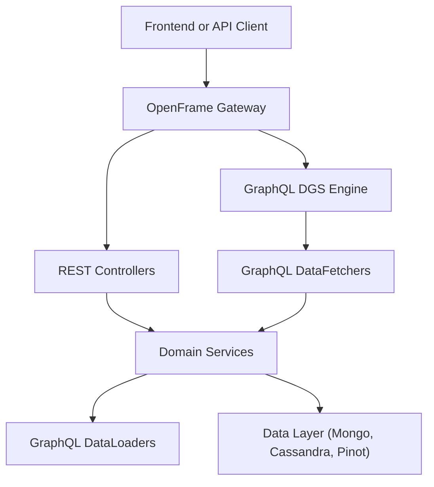
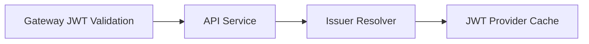
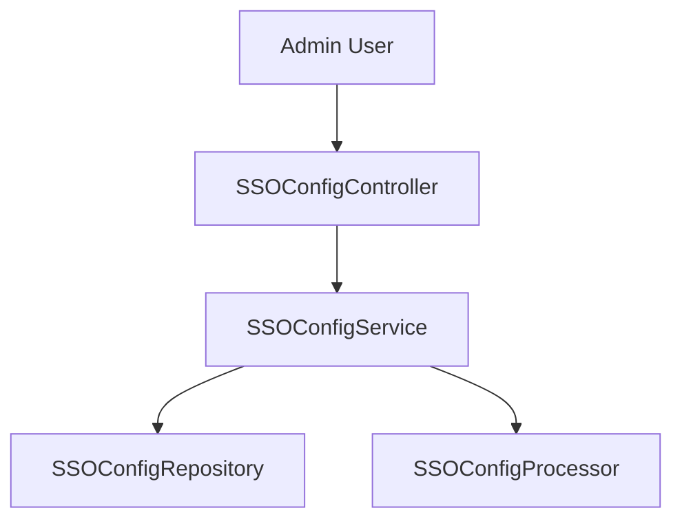
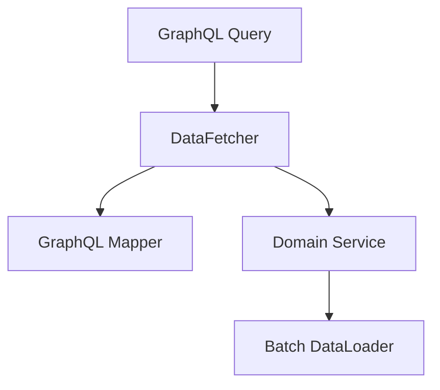

# API Service Core – GraphQL & REST

The **api_service_core_graphql_rest** module is the central backend API layer of the OpenFrame platform. It exposes **REST endpoints** for command-style operations and **GraphQL (Netflix DGS)** endpoints for rich, query-oriented access to platform data such as devices, organizations, logs, events, and tools.

This module is designed to sit **behind the OpenFrame Gateway**, relying on the gateway for authentication, authorization, and request normalization, while focusing on domain logic, GraphQL composition, and internal REST APIs.

---

## Responsibilities

- Provide **REST APIs** for mutations, commands, and internal operations
- Provide **GraphQL APIs** for read-heavy, filterable, paginated queries
- Register custom **GraphQL scalars** and data loaders
- Integrate with shared OpenFrame API libraries (DTOs, services, mappers)
- Act as the primary API surface for frontend clients and internal services

---

## High-Level Architecture

**Key points:**
- Authentication is enforced at the **Gateway** level
- This module enables `@AuthenticationPrincipal` for downstream services
- GraphQL avoids N+1 queries using **DGS DataLoaders**

---

## Configuration Layer

### ApiApplicationConfig
- Registers shared infrastructure beans
- Provides a `PasswordEncoder` using BCrypt

### AuthenticationConfig
- Registers `AuthPrincipalArgumentResolver`
- Enables injection of authenticated user context into REST controllers

### SecurityConfig
- Minimal Spring Security configuration
- Enables OAuth2 Resource Server for JWT principal resolution
- Delegates authorization decisions to the Gateway
- Uses a **Caffeine cache** for issuer-based JWT decoders

### DataInitializer
- Initializes a default OAuth client on startup
- Ensures client credentials stay synchronized with configuration

### RestTemplateConfig
- Exposes a shared `RestTemplate` bean for outbound HTTP calls

### GraphQL Scalar Configuration

- **DateScalarConfig** – Handles `yyyy-MM-dd` formatted dates
- **InstantScalarConfig** – Handles ISO-8601 timestamps

These scalars ensure consistent serialization and validation across GraphQL APIs.

---

## REST API Controllers

REST controllers primarily handle **command-style operations**, internal APIs, and lifecycle management.

### HealthController
- `GET /health`
- Lightweight health check endpoint

### MeController
- `GET /me`
- Returns the currently authenticated user context

### ApiKeyController
- Manage user-scoped API keys
- Create, list, update, regenerate, and delete API keys

### AgentRegistrationSecretController
- Manages secrets used by client agents during registration

### DeviceController
- Internal endpoint for device state updates
- Used by downstream services and agents

### OrganizationController
- Command-side organization management
- Create, update, and delete organizations
- Read-side queries are handled elsewhere

### InvitationController
- Manages user invitations
- Create, list, revoke, and resend invitations

### UserController
- User lifecycle management
- Update user profile
- Soft-delete users with role and self-deletion safeguards

### SSOConfigController
- Full lifecycle management of SSO providers
- Enable, disable, configure, and delete SSO integrations

### ForceAgentController
- Triggers forced operations across agents
- Includes installs, updates, reinstalls, and bulk operations

### ReleaseVersionController
- Exposes current platform release version metadata

---

## GraphQL Layer (Netflix DGS)

GraphQL is the primary **read API** for the OpenFrame frontend and integrations.

### DataFetchers

#### DeviceDataFetcher
- Query devices with filters, pagination, search, and sorting
- Resolve nested fields using DataLoaders:
  - Tags
  - Tool connections
  - Installed agents
  - Organization

#### EventDataFetcher
- Query and mutate platform events
- Supports cursor-based pagination

#### LogDataFetcher
- Query audit logs with advanced filters
- Fetch detailed log entries

#### OrganizationDataFetcher
- Query organizations by filters or identifiers

#### ToolsDataFetcher
- Query integrated tools and available filters

---

## GraphQL DataLoaders

To prevent N+1 query problems, this module defines several DGS DataLoaders:

- **InstalledAgentDataLoader** – Batch loads installed agents per machine
- **OrganizationDataLoader** – Batch loads organizations by ID
- **TagDataLoader** – Batch loads tags per machine
- **ToolConnectionDataLoader** – Batch loads tool connections

These loaders aggregate requests per GraphQL execution and resolve them efficiently.

---

## DTOs and Input Models

This module defines GraphQL-optimized input DTOs that map cleanly to shared API contracts:

- Device, Event, Log, Organization, Tool filter inputs
- Cursor-based pagination inputs
- User, invitation, and SSO configuration requests

These DTOs act as a **GraphQL-facing facade** over shared service-layer DTOs.

---

## Service Layer Extensions

While most core business logic lives in shared libraries, this module provides API-specific services and processors:

### SSOConfigService
- Orchestrates SSO configuration lifecycle
- Encrypts secrets
- Validates domains and auto-provisioning rules
- Triggers post-processing hooks

### Default Processors

These are fallback hooks used unless overridden by tenant-specific implementations:

- DefaultInvitationProcessor
- DefaultSSOConfigProcessor
- DefaultUserProcessor
- DefaultDomainExistenceValidator

They enable **safe extensibility** without modifying core logic.

---

## Integration with Other Modules

This module depends heavily on:

- **api_lib_contracts_and_services** – Shared DTOs, services, and mappers
- **security_oauth_bff_core** – Authentication primitives and principals
- **data_layer_mongo / cassandra / pinot** – Persistence and analytics
- **gateway_service_core** – Authentication, routing, and security enforcement

It is consumed by:

- Frontend services
- External APIs
- Internal management and automation services

---

## Summary

The **api_service_core_graphql_rest** module is the backbone API layer of OpenFrame:

- ✅ Combines REST and GraphQL in a single cohesive service
- ✅ Optimized for frontend-driven, filter-heavy data access
- ✅ Secure by design through Gateway delegation
- ✅ Extensible via processors and validators
- ✅ Scales efficiently with GraphQL DataLoaders

This module provides a clean, maintainable, and scalable API foundation for the OpenFrame platform.
