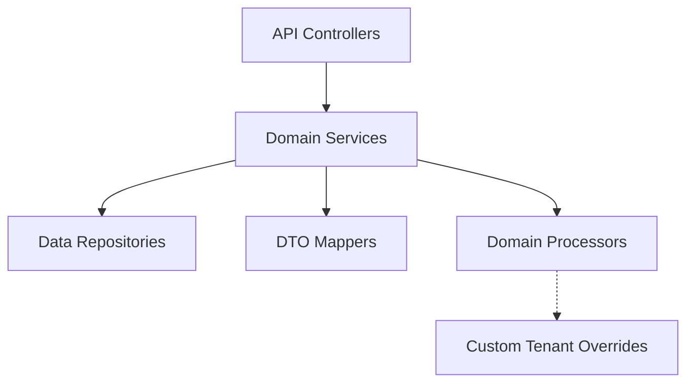
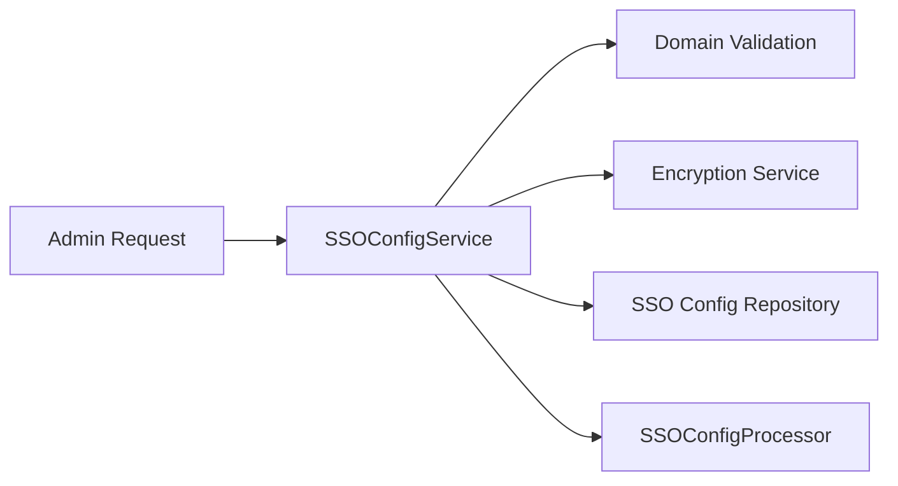
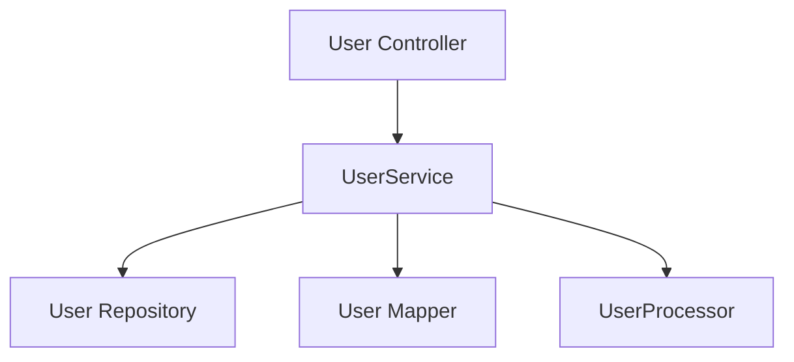
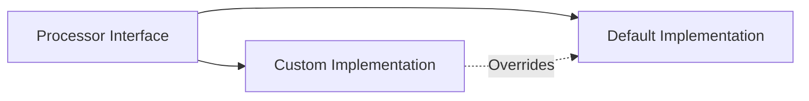

# Api Service Domain Services And Processors

## Overview

The **Api Service Domain Services And Processors** module contains the core domain-level services and extensibility processors that implement business logic for the OpenFrame API service. It sits between REST/GraphQL entry points and the persistence layer, enforcing domain rules, coordinating repositories and mappers, and providing well-defined extension hooks for tenant-specific or product-specific customization.

This module is intentionally designed around **Spring Boot conditional beans**, allowing downstream services or SaaS tenants to override default behavior without modifying the core API service library.

---

## Responsibilities

This module is responsible for:

- Domain validation that influences API behavior (for example, domain existence checks)
- User lifecycle business logic (listing, updating, soft deletion)
- SSO configuration management and validation
- Post-processing hooks for invitations, users, and SSO configuration events
- Providing safe default implementations that can be overridden by custom beans

---

## High-Level Architecture

The Api Service Domain Services And Processors module is consumed by REST controllers and GraphQL fetchers, and in turn coordinates repositories, mappers, and processors.

**Key idea:** domain services execute core logic, while processors act as **event hooks** that can be replaced to integrate with other services or workflows.

---

## Core Components

### Domain Validation

#### DefaultDomainExistenceValidator

**Component:**
- `DefaultDomainExistenceValidator`

**Purpose:**
Provides a default implementation of domain existence checks used during SSO configuration validation.

**Behavior:**
- Always returns `false` for existence checks
- Effectively disables domain blocking in the base library
- Intended to be overridden by SaaS or enterprise deployments that need real domain validation

**Design Notes:**
- Registered only if no other `DomainExistenceValidator` bean is present
- Enables safe defaults for open-source usage

---

### SSO Configuration Domain Service

#### SSOConfigService

**Component:**
- `SSOConfigService`

**Purpose:**
Manages the full lifecycle of Single Sign-On configuration for the API service.

**Key Responsibilities:**
- Retrieve enabled SSO providers for login flows
- Expose available provider metadata from configuration
- Create, update, delete, and toggle SSO configurations
- Validate domain and auto-provisioning rules
- Coordinate encryption and persistence of sensitive data

**Key Collaborators:**
- SSO configuration repository (persistence)
- Encryption service (client secret handling)
- Domain validation service
- SSO configuration processor (post-action hooks)

**Validation Rules Enforced:**
- Domains are normalized (lowercase, trimmed, deduplicated)
- Generic public domains are rejected
- Domain existence validation is applied
- Auto-provisioning requires at least one allowed domain
- Microsoft auto-provisioning requires a tenant identifier

---

### User Domain Service

#### UserService

**Component:**
- `UserService`

**Purpose:**
Encapsulates user-related domain logic independent of API transport concerns.

**Key Responsibilities:**
- Retrieve users by email or identifier
- Check for active user existence
- Paginated user listing
- Update user profile fields
- Perform soft deletion with business rule enforcement

**Business Rules:**
- Users cannot delete themselves
- Owner accounts cannot be deleted
- Deletions are soft deletes via status updates

**Post-Processing:**
User lifecycle events are forwarded to the configured `UserProcessor` for extensibility.

---

## Processor Extension Points

Processors provide **non-invasive extension hooks** that are triggered after domain events occur.

### DefaultInvitationProcessor

**Purpose:**
Acts as a post-processing hook for invitation lifecycle events.

**Triggered Events:**
- Invitation creation
- Invitation revocation

**Default Behavior:**
- Logs debug-level information only

---

### DefaultSSOConfigProcessor

**Purpose:**
Handles post-processing of SSO configuration changes.

**Triggered Events:**
- Configuration saved
- Configuration deleted
- Configuration enabled or disabled

**Default Behavior:**
- Emits structured debug logs

---

### DefaultUserProcessor

**Purpose:**
Handles post-processing of user-related actions.

**Triggered Events:**
- User deletion
- User updates
- User list retrieval

**Default Behavior:**
- Emits debug logs for observability

---

## Extensibility Model

All default processors and validators in this module are guarded by conditional bean registration.

**Override Strategy:**

- Provide a custom Spring bean implementing the same interface
- The default implementation will not be loaded
- No modification to core API service code is required

This pattern enables:
- SaaS-specific behavior
- Tenant-aware integrations
- Side effects such as audit logging, notifications, or external sync

---

## How This Module Fits in the System

- **Upstream:** Invoked by REST controllers and GraphQL data fetchers
- **Downstream:** Uses repositories from the data layer and mappers from API libraries
- **Cross-cutting:** Integrates with security, encryption, and validation services

The Api Service Domain Services And Processors module forms the **business logic backbone** of the API service, ensuring that transport layers remain thin and that customization remains safe and maintainable.

---

## Summary

The **Api Service Domain Services And Processors** module:

- Centralizes API service business logic
- Enforces domain-specific rules for users and SSO
- Provides safe defaults for open-source usage
- Enables powerful customization through conditional processors

This design ensures that OpenFrame can scale from community deployments to complex multi-tenant SaaS environments without forking core logic.
