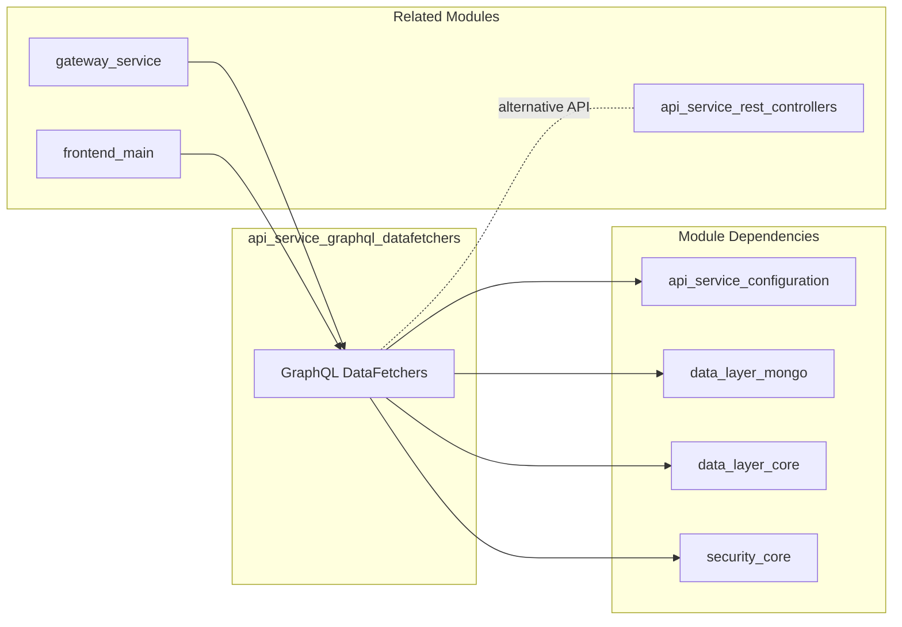
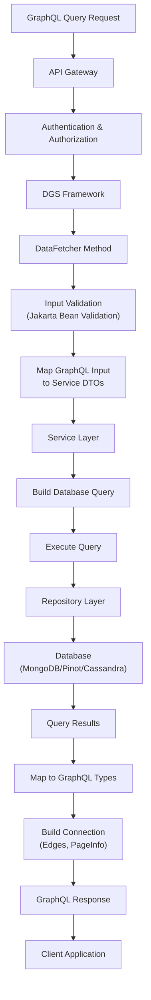
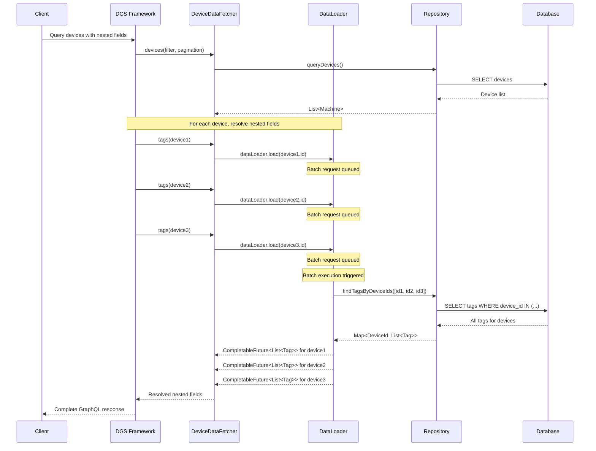
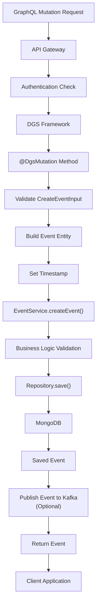
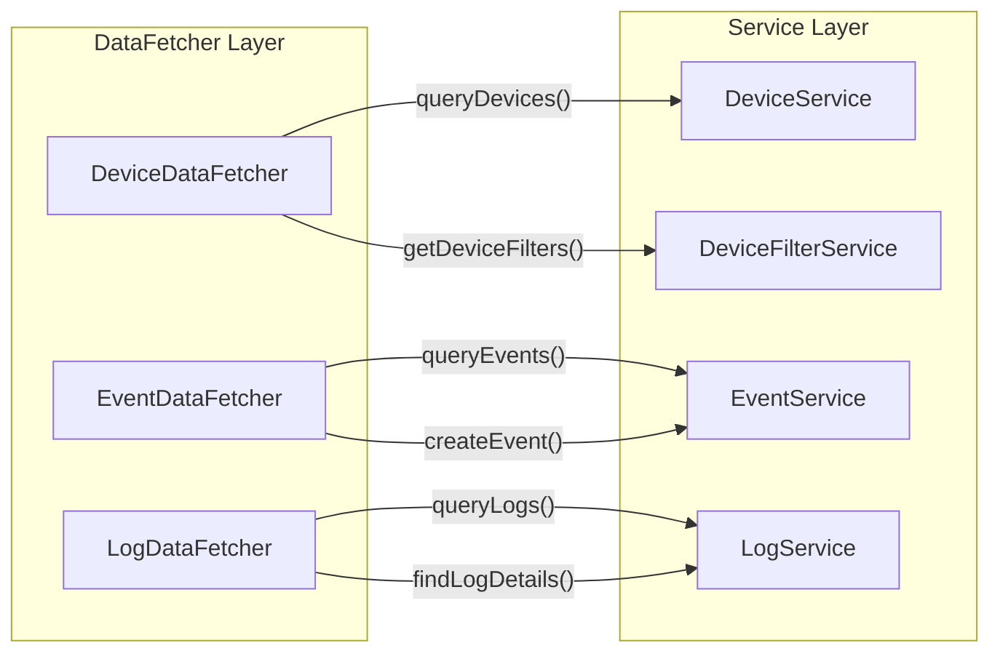
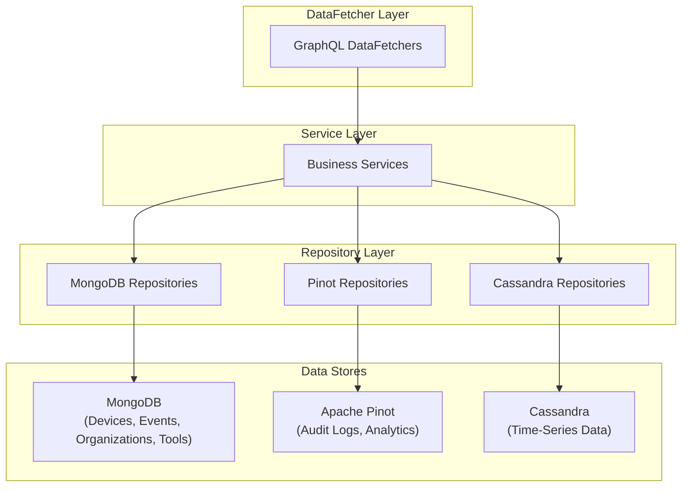
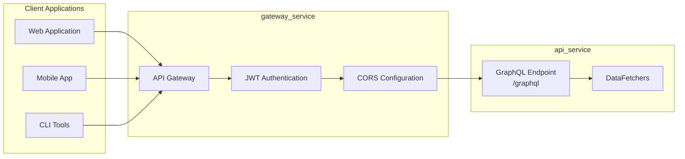

# API Service GraphQL DataFetchers

## Overview

The **API Service GraphQL DataFetchers** module provides the GraphQL query and mutation layer for the OpenFrame API Service. Built on Netflix DGS (Domain Graph Service) framework, this module implements GraphQL resolvers (DataFetchers) that expose device management, event tracking, audit logging, organization management, and integrated tool capabilities through a unified GraphQL API.

This module serves as the primary GraphQL interface for frontend applications and external clients, offering type-safe, efficient data fetching with support for cursor-based pagination, advanced filtering, and DataLoader-based batch loading to prevent N+1 query problems.

**Key Capabilities:**
- **GraphQL Query Resolution**: Implements DGS DataFetchers for devices, events, logs, organizations, and tools
- **Cursor-Based Pagination**: Relay-style pagination for efficient large dataset handling
- **Advanced Filtering**: Multi-dimensional filtering with dynamic filter options
- **Batch Data Loading**: DataLoader integration for optimized nested field resolution
- **Input Validation**: Jakarta Bean Validation for type-safe input handling
- **Async Processing**: CompletableFuture-based asynchronous data fetching

---

## Architecture

### High-Level Component Architecture

```mermaid
flowchart TD
    subgraph Client["Client Layer"]
        Frontend["Frontend Applications"]
        GraphQLClient["GraphQL Clients"]
    end

    subgraph Gateway["API Gateway"]
        GatewayService["Gateway Service"]
    end

    subgraph DataFetchers["GraphQL DataFetchers Module"]
        DeviceDF["DeviceDataFetcher"]
        EventDF["EventDataFetcher"]
        LogDF["LogDataFetcher"]
        OrgDF["OrganizationDataFetcher"]
        ToolDF["ToolsDataFetcher"]
    end

    subgraph Services["Business Logic Layer"]
        DeviceService["DeviceService"]
        EventService["EventService"]
        LogService["LogService"]
        OrgService["OrganizationQueryService"]
        ToolService["ToolService"]
        FilterService["DeviceFilterService"]
    end

    subgraph Mappers["Data Mapping Layer"]
        DeviceMapper["GraphQLDeviceMapper"]
        EventMapper["GraphQLEventMapper"]
        LogMapper["GraphQLLogMapper"]
        OrgMapper["GraphQLOrganizationMapper"]
        ToolMapper["GraphQLToolMapper"]
    end

    subgraph DataLoaders["DataLoader Layer"]
        TagLoader["tagDataLoader"]
        ToolConnLoader["toolConnectionDataLoader"]
        AgentLoader["installedAgentDataLoader"]
        OrgLoader["organizationDataLoader"]
    end

    subgraph DataLayer["Data Access Layer"]
        MongoDB["MongoDB Repositories"]
        Pinot["Apache Pinot"]
        Cassandra["Cassandra"]
    end

    Frontend --> GatewayService
    GraphQLClient --> GatewayService
    GatewayService --> DeviceDF
    GatewayService --> EventDF
    GatewayService --> LogDF
    GatewayService --> OrgDF
    GatewayService --> ToolDF

    DeviceDF --> DeviceService
    DeviceDF --> FilterService
    DeviceDF --> DeviceMapper
    DeviceDF --> TagLoader
    DeviceDF --> ToolConnLoader
    DeviceDF --> AgentLoader
    DeviceDF --> OrgLoader

    EventDF --> EventService
    EventDF --> EventMapper

    LogDF --> LogService
    LogDF --> LogMapper

    OrgDF --> OrgService
    OrgDF --> OrgMapper

    ToolDF --> ToolService
    ToolDF --> ToolMapper

    DeviceService --> MongoDB
    EventService --> MongoDB
    LogService --> Pinot
    OrgService --> MongoDB
    ToolService --> MongoDB

    TagLoader --> MongoDB
    ToolConnLoader --> MongoDB
    AgentLoader --> MongoDB
    OrgLoader --> MongoDB
```



### Module Dependencies



---

## Core Components

### 1. DeviceDataFetcher

**Purpose**: GraphQL resolver for device-related queries with advanced filtering, pagination, and nested field resolution.

**Key Responsibilities:**
- Query devices with multi-dimensional filtering
- Provide dynamic filter options based on current data
- Resolve nested fields (tags, toolConnections, installedAgents, organization) using DataLoaders
- Support cursor-based pagination for efficient large dataset handling

**GraphQL Operations:**

| Operation | Type | Description |
|-----------|------|-------------|
| `deviceFilters` | Query | Returns available filter options for devices |
| `devices` | Query | Paginated device list with filtering and search |
| `device` | Query | Single device by machineId |
| `tags` | Field Resolver | Batch-loaded tags for a device |
| `toolConnections` | Field Resolver | Batch-loaded tool connections |
| `installedAgents` | Field Resolver | Batch-loaded installed agents |
| `organization` | Field Resolver | Batch-loaded organization details |

**Key Features:**

```java
@DgsComponent
@Slf4j
@Validated
@RequiredArgsConstructor
public class DeviceDataFetcher {
    private final DeviceService deviceService;
    private final DeviceFilterService deviceFilterService;
    private final GraphQLDeviceMapper mapper;

    // Query with filtering, pagination, and search
    @DgsQuery
    public CountedGenericConnection<GenericEdge<Machine>> devices(
            @InputArgument @Valid DeviceFilterInput filter,
            @InputArgument @Valid CursorPaginationInput pagination,
            @InputArgument String search) {
        // Converts GraphQL inputs to service layer DTOs
        DeviceFilterOptions filterOptions = mapper.toDeviceFilterOptions(filter);
        CursorPaginationCriteria paginationCriteria = mapper.toCursorPaginationCriteria(pagination);
        
        // Executes query and returns Relay-style connection
        CountedGenericQueryResult<Machine> result = 
            deviceService.queryDevices(filterOptions, paginationCriteria, search);
        return mapper.toDeviceConnection(result);
    }

    // DataLoader-based nested field resolution
    @DgsData(parentType = "Machine")
    public CompletableFuture<List<Tag>> tags(DgsDataFetchingEnvironment dfe) {
        DataLoader<String, List<Tag>> dataLoader = dfe.getDataLoader("tagDataLoader");
        Machine machine = dfe.getSource();
        return dataLoader.load(machine.getId());
    }
}
```

**DataLoader Integration:**

The DeviceDataFetcher uses four DataLoaders to prevent N+1 query problems:

1. **tagDataLoader**: Batch loads tags by device ID
2. **toolConnectionDataLoader**: Batch loads tool connections by machineId
3. **installedAgentDataLoader**: Batch loads installed agents by machineId
4. **organizationDataLoader**: Batch loads organization details by organizationId

**Example GraphQL Query:**

```graphql
query GetDevices($filter: DeviceFilterInput, $pagination: CursorPaginationInput) {
  devices(filter: $filter, pagination: $pagination) {
    totalCount
    pageInfo {
      hasNextPage
      hasPreviousPage
      startCursor
      endCursor
    }
    edges {
      cursor
      node {
        id
        machineId
        hostname
        platform
        osVersion
        tags {
          name
          value
        }
        toolConnections {
          toolType
          toolId
        }
        installedAgents {
          agentType
          version
        }
        organization {
          id
          name
        }
      }
    }
  }
}
```

---

### 2. EventDataFetcher

**Purpose**: GraphQL resolver for event management including queries, mutations, and filtering.

**Key Responsibilities:**
- Query events with filtering, pagination, and search
- Create and update events via GraphQL mutations
- Provide event filter options
- Retrieve individual events by ID

**GraphQL Operations:**

| Operation | Type | Description |
|-----------|------|-------------|
| `events` | Query | Paginated event list with filtering |
| `eventById` | Query | Single event by ID |
| `eventFilters` | Query | Available filter options |
| `createEvent` | Mutation | Create new event |
| `updateEvent` | Mutation | Update existing event |

**Key Features:**

```java
@DgsComponent
@RequiredArgsConstructor
@Slf4j
@Validated
public class EventDataFetcher {
    private final EventService eventService;
    private final GraphQLEventMapper eventMapper;

    // Query with cursor-based pagination
    @DgsQuery
    public GenericConnection<GenericEdge<Event>> events(
            @InputArgument @Valid EventFilterInput filter,
            @InputArgument @Valid CursorPaginationInput pagination,
            @InputArgument String search) {
        
        EventFilterOptions filterOptions = eventMapper.toEventFilterOptions(filter);
        CursorPaginationCriteria paginationCriteria = 
            eventMapper.toCursorPaginationCriteria(pagination);
        
        GenericQueryResult<Event> result = 
            eventService.queryEvents(filterOptions, paginationCriteria, search);
        return eventMapper.toEventConnection(result);
    }

    // Mutation for creating events
    @DgsMutation
    public Event createEvent(@InputArgument @Valid CreateEventInput input) {
        Event event = Event.builder()
                .userId(input.getUserId())
                .type(input.getType())
                .payload(input.getData())
                .timestamp(Instant.now())
                .build();
        return eventService.createEvent(event);
    }
}
```

**Example GraphQL Mutation:**

```graphql
mutation CreateEvent($input: CreateEventInput!) {
  createEvent(input: $input) {
    id
    userId
    type
    payload
    timestamp
  }
}
```

---

### 3. LogDataFetcher

**Purpose**: GraphQL resolver for audit log queries with advanced filtering and detail retrieval.

**Key Responsibilities:**
- Query audit logs from Apache Pinot with filtering and pagination
- Provide dynamic log filter options
- Retrieve detailed log information by composite key
- Support time-based and event-type filtering

**GraphQL Operations:**

| Operation | Type | Description |
|-----------|------|-------------|
| `logs` | Query | Paginated log list with filtering |
| `logDetails` | Query | Detailed log by composite key |
| `logFilters` | Query | Available filter options |

**Key Features:**

```java
@DgsComponent
@Slf4j
@Validated
@AllArgsConstructor
public class LogDataFetcher {
    private final LogService logService;
    private final GraphQLLogMapper logMapper;

    // Query logs with filtering and pagination
    @DgsQuery
    public GenericConnection<GenericEdge<LogEvent>> logs(
            @InputArgument @Valid LogFilterInput filter,
            @InputArgument @Valid CursorPaginationInput pagination,
            @InputArgument String search) {
        
        LogFilterOptions filterOptions = logMapper.toLogFilterOptions(filter);
        CursorPaginationCriteria paginationCriteria = 
            logMapper.toCursorPaginationCriteria(pagination);
        
        var result = logService.queryLogs(filterOptions, paginationCriteria, search);
        return logMapper.toLogConnection(result);
    }

    // Retrieve detailed log by composite key
    @DgsQuery
    public LogDetails logDetails(
            @InputArgument @NotBlank String ingestDay,
            @InputArgument @NotBlank String toolType,
            @InputArgument @NotBlank String eventType,
            @InputArgument Instant timestamp,
            @InputArgument @NotBlank String toolEventId) {
        
        Optional<LogDetails> details = logService.findLogDetails(
            ingestDay, toolType, eventType, timestamp, toolEventId);
        return details.orElse(null);
    }
}
```

**Composite Key Structure:**

Log details are retrieved using a composite key that includes:
- `ingestDay`: Partition key for time-based data organization
- `toolType`: Source tool type (e.g., FleetDM, TacticalRMM)
- `eventType`: Type of event logged
- `timestamp`: Event timestamp
- `toolEventId`: Unique event identifier from source tool

**Example GraphQL Query:**

```graphql
query GetLogDetails(
  $ingestDay: String!
  $toolType: String!
  $eventType: String!
  $timestamp: Instant!
  $toolEventId: String!
) {
  logDetails(
    ingestDay: $ingestDay
    toolType: $toolType
    eventType: $eventType
    timestamp: $timestamp
    toolEventId: $toolEventId
  ) {
    id
    message
    level
    source
    metadata
  }
}
```

---

### 4. OrganizationDataFetcher

**Purpose**: GraphQL resolver for organization queries with filtering and pagination.

**Key Responsibilities:**
- Query organizations with filtering and pagination
- Retrieve organizations by ID or organizationId
- Support search across organization fields
- Provide counted pagination results

**GraphQL Operations:**

| Operation | Type | Description |
|-----------|------|-------------|
| `organizations` | Query | Paginated organization list |
| `organization` | Query | Single organization by ID |
| `organizationByOrganizationId` | Query | Organization by organizationId |

**Key Features:**

```java
@DgsComponent
@RequiredArgsConstructor
@Slf4j
@Validated
public class OrganizationDataFetcher {
    private final OrganizationService organizationService;
    private final OrganizationQueryService organizationQueryService;
    private final GraphQLOrganizationMapper mapper;

    @DgsQuery
    public CountedGenericConnection<GenericEdge<Organization>> organizations(
            @InputArgument @Valid OrganizationFilterInput filter,
            @InputArgument @Valid CursorPaginationInput pagination,
            @InputArgument String search) {
        
        OrganizationFilterOptions filterOptions = mapper.toFilterOptions(filter);
        CursorPaginationCriteria paginationCriteria = 
            mapper.toCursorPaginationCriteria(pagination);
        
        CountedGenericQueryResult<Organization> result = 
            organizationQueryService.queryOrganizations(
                filterOptions, paginationCriteria, search);
        return mapper.toOrganizationConnection(result);
    }
}
```

**Example GraphQL Query:**

```graphql
query GetOrganizations($filter: OrganizationFilterInput, $pagination: CursorPaginationInput) {
  organizations(filter: $filter, pagination: $pagination) {
    totalCount
    edges {
      node {
        id
        organizationId
        name
        description
        createdAt
        updatedAt
      }
    }
    pageInfo {
      hasNextPage
      endCursor
    }
  }
}
```

---

### 5. ToolsDataFetcher

**Purpose**: GraphQL resolver for integrated tool queries and filter management.

**Key Responsibilities:**
- Query integrated tools with filtering and search
- Provide available tool filter options
- Support tool type and status filtering

**GraphQL Operations:**

| Operation | Type | Description |
|-----------|------|-------------|
| `integratedTools` | Query | Filtered list of integrated tools |
| `toolFilters` | Query | Available filter options |

**Key Features:**

```java
@DgsComponent
@RequiredArgsConstructor
@Slf4j
@Validated
public class ToolsDataFetcher {
    private final ToolService toolService;
    private final GraphQLToolMapper toolMapper;

    @DgsQuery
    public ToolList integratedTools(
            @InputArgument @Valid ToolFilterInput filter,
            @InputArgument String search) {
        
        ToolFilterOptions filterOptions = toolMapper.toToolFilterOptions(filter);
        return toolService.queryTools(filterOptions, search);
    }

    @DgsQuery
    public ToolFilters toolFilters() {
        return toolService.getToolFilters();
    }
}
```

**Example GraphQL Query:**

```graphql
query GetIntegratedTools($filter: ToolFilterInput, $search: String) {
  integratedTools(filter: $filter, search: $search) {
    tools {
      id
      toolType
      name
      status
      configuration
    }
  }
  
  toolFilters {
    toolTypes
    statuses
  }
}
```

---

## Data Flow

### Query Execution Flow



### DataLoader Batch Loading Flow



### Mutation Flow (Event Creation)



---

## Integration Points

### 1. Netflix DGS Framework Integration

The module uses Netflix DGS annotations for GraphQL schema mapping:

| Annotation | Purpose | Example |
|------------|---------|---------|
| `@DgsComponent` | Marks class as GraphQL component | `@DgsComponent public class DeviceDataFetcher` |
| `@DgsQuery` | Maps method to GraphQL query | `@DgsQuery public Machine device(...)` |
| `@DgsMutation` | Maps method to GraphQL mutation | `@DgsMutation public Event createEvent(...)` |
| `@DgsData` | Resolves nested field | `@DgsData(parentType = "Machine") public CompletableFuture<List<Tag>> tags(...)` |
| `@InputArgument` | Maps GraphQL argument to parameter | `@InputArgument @Valid DeviceFilterInput filter` |

### 2. Service Layer Integration

DataFetchers delegate business logic to service layer components:



### 3. Mapper Integration

GraphQL mappers convert between GraphQL DTOs and service layer objects:

**Mapping Responsibilities:**

| Mapper | Input Mapping | Output Mapping |
|--------|---------------|----------------|
| `GraphQLDeviceMapper` | `DeviceFilterInput` → `DeviceFilterOptions`<br/>`CursorPaginationInput` → `CursorPaginationCriteria` | `CountedGenericQueryResult<Machine>` → `CountedGenericConnection<GenericEdge<Machine>>` |
| `GraphQLEventMapper` | `EventFilterInput` → `EventFilterOptions`<br/>`CreateEventInput` → `Event` | `GenericQueryResult<Event>` → `GenericConnection<GenericEdge<Event>>` |
| `GraphQLLogMapper` | `LogFilterInput` → `LogFilterOptions` | `GenericQueryResult<LogEvent>` → `GenericConnection<GenericEdge<LogEvent>>` |
| `GraphQLOrganizationMapper` | `OrganizationFilterInput` → `OrganizationFilterOptions` | `CountedGenericQueryResult<Organization>` → `CountedGenericConnection<GenericEdge<Organization>>` |
| `GraphQLToolMapper` | `ToolFilterInput` → `ToolFilterOptions` | Service results → `ToolList` |

### 4. Data Layer Integration

DataFetchers access data through multiple data stores:



**Data Store Usage:**

- **MongoDB**: Primary data store for devices, events, organizations, users, and integrated tools
- **Apache Pinot**: OLAP store for audit logs and analytics queries
- **Cassandra**: Time-series data for metrics and historical tracking

### 5. Gateway Integration

The GraphQL API is exposed through the Gateway Service:



For gateway configuration details, see [gateway_service.md](gateway_service.md).

---

## Common Patterns

### 1. Cursor-Based Pagination Pattern

All list queries use Relay-style cursor-based pagination:

**Input Structure:**

```java
@InputArgument @Valid CursorPaginationInput pagination

// CursorPaginationInput fields:
// - first: Int (number of items to fetch)
// - after: String (cursor to start after)
// - last: Int (number of items from end)
// - before: String (cursor to end before)
```

**Output Structure:**

```java
CountedGenericConnection<GenericEdge<T>> {
    totalCount: Long
    edges: List<GenericEdge<T>> {
        cursor: String
        node: T
    }
    pageInfo: PageInfo {
        hasNextPage: Boolean
        hasPreviousPage: Boolean
        startCursor: String
        endCursor: String
    }
}
```

**Example Implementation:**

```java
@DgsQuery
public CountedGenericConnection<GenericEdge<Machine>> devices(
        @InputArgument @Valid DeviceFilterInput filter,
        @InputArgument @Valid CursorPaginationInput pagination,
        @InputArgument String search) {
    
    // 1. Map GraphQL inputs to service DTOs
    DeviceFilterOptions filterOptions = mapper.toDeviceFilterOptions(filter);
    CursorPaginationCriteria paginationCriteria = mapper.toCursorPaginationCriteria(pagination);
    
    // 2. Execute query
    CountedGenericQueryResult<Machine> result = 
        deviceService.queryDevices(filterOptions, paginationCriteria, search);
    
    // 3. Map to GraphQL connection
    return mapper.toDeviceConnection(result);
}
```

### 2. Filter Options Pattern

Dynamic filter options are provided based on current data:

**Filter Query:**

```java
@DgsQuery
public DeviceFilters deviceFilters(@InputArgument @Valid DeviceFilterInput filter) {
    DeviceFilterOptions filterOptions = mapper.toDeviceFilterOptions(filter);
    return deviceFilterService.getDeviceFilters(filterOptions);
}
```

**Filter Response:**

```java
DeviceFilters {
    platforms: List<String>      // Available OS platforms
    osVersions: List<String>      // Available OS versions
    toolTypes: List<String>       // Available tool types
    organizationIds: List<String> // Available organizations
    tags: List<Tag>               // Available tags
}
```

**Usage Pattern:**

1. Client requests available filters
2. User selects filter values from available options
3. Client sends query with selected filters
4. Results are filtered based on selections

### 3. DataLoader Pattern

Prevent N+1 queries when resolving nested fields:

**DataLoader Registration (in Configuration):**

```java
@Bean
public DataLoader<String, List<Tag>> tagDataLoader(TagRepository tagRepository) {
    return DataLoader.newDataLoader((keys) -> 
        CompletableFuture.supplyAsync(() -> {
            // Batch load tags for all device IDs
            Map<String, List<Tag>> tagsByDeviceId = 
                tagRepository.findByDeviceIdIn(keys)
                    .stream()
                    .collect(Collectors.groupingBy(Tag::getDeviceId));
            
            // Return results in same order as keys
            return keys.stream()
                .map(key -> tagsByDeviceId.getOrDefault(key, Collections.emptyList()))
                .collect(Collectors.toList());
        })
    );
}
```

**DataLoader Usage in DataFetcher:**

```java
@DgsData(parentType = "Machine")
public CompletableFuture<List<Tag>> tags(DgsDataFetchingEnvironment dfe) {
    DataLoader<String, List<Tag>> dataLoader = dfe.getDataLoader("tagDataLoader");
    Machine machine = dfe.getSource();
    return dataLoader.load(machine.getId());
}
```

**Benefits:**

- Single batch query instead of N individual queries
- Automatic request coalescing
- Caching within request scope
- Improved performance for nested field resolution

### 4. Input Validation Pattern

Jakarta Bean Validation ensures type-safe inputs:

```java
@DgsQuery
public CountedGenericConnection<GenericEdge<Machine>> devices(
        @InputArgument @Valid DeviceFilterInput filter,  // Validated
        @InputArgument @Valid CursorPaginationInput pagination,  // Validated
        @InputArgument String search) {  // Optional, no validation
    // Method implementation
}

@DgsQuery
public Machine device(@InputArgument @NotBlank String machineId) {  // Must not be blank
    return deviceService.findByMachineId(machineId).orElse(null);
}
```

**Validation Annotations:**

- `@Valid`: Triggers nested validation
- `@NotBlank`: String must not be null or empty
- `@NotNull`: Value must not be null
- Custom validators on input classes

### 5. Async Processing Pattern

CompletableFuture for asynchronous field resolution:

```java
@DgsData(parentType = "Machine")
public CompletableFuture<Organization> organization(DgsDataFetchingEnvironment dfe) {
    DataLoader<String, Organization> dataLoader = dfe.getDataLoader("organizationDataLoader");
    Machine machine = dfe.getSource();
    String organizationId = machine.getOrganizationId();
    
    // Handle null organizationId
    if (organizationId == null) {
        return CompletableFuture.completedFuture(null);
    }
    
    // Async load via DataLoader
    return dataLoader.load(organizationId);
}
```

**Benefits:**

- Non-blocking I/O operations
- Parallel field resolution
- Better resource utilization
- Improved response times

---

## Configuration

### GraphQL Schema Location

The GraphQL schema files are typically located in:

```text
src/main/resources/schema/
├── device.graphqls
├── event.graphqls
├── log.graphqls
├── organization.graphqls
├── tool.graphqls
└── common.graphqls
```

### DGS Configuration

DGS framework configuration in `application.yml`:

```yaml
dgs:
  graphql:
    schema-locations:
      - classpath:schema/**/*.graphqls
    path: /graphql
    graphiql:
      enabled: true
      path: /graphiql
    introspection:
      enabled: true
```

### DataLoader Configuration

DataLoaders are registered as Spring beans in the configuration module. See [api_service_configuration.md](api_service_configuration.md) for details.

### Validation Configuration

Jakarta Bean Validation is enabled via Spring Boot auto-configuration:

```java
@Configuration
@EnableValidation
public class ValidationConfig {
    @Bean
    public Validator validator() {
        return Validation.buildDefaultValidatorFactory().getValidator();
    }
}
```

---

## Error Handling

### GraphQL Error Types

The module handles various error scenarios:

| Error Type | HTTP Status | GraphQL Error Code | Description |
|------------|-------------|-------------------|-------------|
| Validation Error | 400 | `BAD_REQUEST` | Invalid input arguments |
| Not Found | 404 | `NOT_FOUND` | Resource not found |
| Authentication Error | 401 | `UNAUTHENTICATED` | Missing or invalid authentication |
| Authorization Error | 403 | `FORBIDDEN` | Insufficient permissions |
| Internal Error | 500 | `INTERNAL_ERROR` | Unexpected server error |

### Error Response Format

GraphQL errors follow the standard format:

```json
{
  "errors": [
    {
      "message": "Validation failed for argument 'filter'",
      "locations": [{"line": 2, "column": 3}],
      "path": ["devices"],
      "extensions": {
        "classification": "ValidationError",
        "validationErrors": [
          {
            "field": "filter.platformIds",
            "message": "must not be empty"
          }
        ]
      }
    }
  ],
  "data": null
}
```

### Exception Handling

DataFetchers use try-catch for graceful error handling:

```java
@DgsQuery
public Machine device(@InputArgument @NotBlank String machineId) {
    log.debug("Fetching device with ID: {}", machineId);
    try {
        return deviceService.findByMachineId(machineId)
            .orElse(null);  // Return null for not found (GraphQL convention)
    } catch (Exception e) {
        log.error("Error fetching device: {}", machineId, e);
        throw new DgsException("Failed to fetch device", e);
    }
}
```

---

## Performance Considerations

### 1. DataLoader Batching

**Problem**: N+1 query problem when resolving nested fields

**Solution**: DataLoader batches multiple requests into single query

**Example**:
- Without DataLoader: 1 query for devices + N queries for tags = N+1 queries
- With DataLoader: 1 query for devices + 1 batched query for all tags = 2 queries

### 2. Cursor-Based Pagination

**Benefits**:
- Consistent results even when data changes
- Efficient for large datasets
- Supports forward and backward pagination
- No offset calculation overhead

**Implementation**:
- Cursors encode position in result set
- Database queries use indexed fields for cursor comparison
- PageInfo provides navigation metadata

### 3. Field Selection Optimization

DGS framework only resolves requested fields:

```graphql
# Only fetches basic device fields
query {
  devices {
    edges {
      node {
        id
        hostname
      }
    }
  }
}

# Fetches devices + nested tags (triggers DataLoader)
query {
  devices {
    edges {
      node {
        id
        hostname
        tags {
          name
          value
        }
      }
    }
  }
}
```

### 4. Query Complexity Analysis

DGS supports query complexity limits to prevent expensive queries:

```yaml
dgs:
  graphql:
    query-complexity:
      enabled: true
      max-complexity: 1000
```

### 5. Caching Strategies

**Request-Scoped Caching**:
- DataLoaders cache within single request
- Prevents duplicate loads for same key

**Application-Level Caching**:
- Service layer can implement caching for filter options
- Redis integration for distributed caching

---

## Testing

### Unit Testing DataFetchers

```java
@ExtendWith(MockitoExtension.class)
class DeviceDataFetcherTest {
    
    @Mock
    private DeviceService deviceService;
    
    @Mock
    private DeviceFilterService deviceFilterService;
    
    @Mock
    private GraphQLDeviceMapper mapper;
    
    @InjectMocks
    private DeviceDataFetcher deviceDataFetcher;
    
    @Test
    void testDeviceQuery() {
        // Given
        String machineId = "machine-123";
        Machine expectedMachine = Machine.builder()
            .machineId(machineId)
            .hostname("test-host")
            .build();
        
        when(deviceService.findByMachineId(machineId))
            .thenReturn(Optional.of(expectedMachine));
        
        // When
        Machine result = deviceDataFetcher.device(machineId);
        
        // Then
        assertThat(result).isEqualTo(expectedMachine);
        verify(deviceService).findByMachineId(machineId);
    }
}
```

### Integration Testing with DGS

```java
@SpringBootTest
@AutoConfigureGraphQlTester
class DeviceDataFetcherIntegrationTest {
    
    @Autowired
    private GraphQlTester graphQlTester;
    
    @Test
    void testDevicesQuery() {
        String query = """
            query {
              devices(pagination: {first: 10}) {
                totalCount
                edges {
                  node {
                    id
                    hostname
                  }
                }
              }
            }
            """;
        
        graphQlTester.document(query)
            .execute()
            .path("devices.totalCount").entity(Long.class).isGreaterThan(0L)
            .path("devices.edges").entityList(Object.class).hasSizeGreaterThan(0);
    }
}
```

---

## Security

### Authentication

GraphQL requests are authenticated via JWT tokens validated by the Gateway Service. See [gateway_service.md](gateway_service.md) for authentication details.

### Authorization

Field-level authorization can be implemented using Spring Security:

```java
@DgsQuery
@PreAuthorize("hasRole('ADMIN')")
public CountedGenericConnection<GenericEdge<Organization>> organizations(...) {
    // Only accessible to users with ADMIN role
}
```

### Input Sanitization

All inputs are validated using Jakarta Bean Validation to prevent injection attacks:

```java
@DgsQuery
public Machine device(@InputArgument @NotBlank @Pattern(regexp = "^[a-zA-Z0-9-]+$") String machineId) {
    // machineId is validated against pattern before processing
}
```

---

## Monitoring and Observability

### Logging

All DataFetchers use SLF4J logging:

```java
@Slf4j
public class DeviceDataFetcher {
    @DgsQuery
    public Machine device(@InputArgument String machineId) {
        log.debug("Fetching device with ID: {}", machineId);
        // Implementation
    }
}
```

**Log Levels**:
- `DEBUG`: Query parameters and execution details
- `INFO`: Successful operations
- `WARN`: Validation failures, not found scenarios
- `ERROR`: Exceptions and failures

### Metrics

DGS provides built-in metrics for:
- Query execution time
- Error rates
- Field resolution time
- DataLoader batch sizes

Metrics are exposed via Spring Boot Actuator:

```yaml
management:
  endpoints:
    web:
      exposure:
        include: metrics, health
  metrics:
    export:
      prometheus:
        enabled: true
```

### Tracing

Distributed tracing can be enabled with Spring Cloud Sleuth:

```yaml
spring:
  sleuth:
    enabled: true
    sampler:
      probability: 1.0
```

---

## Related Documentation

- **[api_service.md](api_service.md)**: Parent module overview
- **[api_service_configuration.md](api_service_configuration.md)**: Configuration and DataLoader setup
- **[api_service_rest_controllers.md](api_service_rest_controllers.md)**: Alternative REST API endpoints
- **[gateway_service.md](gateway_service.md)**: API Gateway and routing
- **[data_layer_mongo.md](data_layer_mongo.md)**: MongoDB data access layer
- **[data_layer_core.md](data_layer_core.md)**: Pinot and Cassandra data access
- **[frontend_main.md](frontend_main.md)**: Frontend GraphQL client integration

---

## Best Practices

### 1. Use DataLoaders for Nested Fields

✅ **DO:**
```java
@DgsData(parentType = "Machine")
public CompletableFuture<List<Tag>> tags(DgsDataFetchingEnvironment dfe) {
    DataLoader<String, List<Tag>> dataLoader = dfe.getDataLoader("tagDataLoader");
    Machine machine = dfe.getSource();
    return dataLoader.load(machine.getId());
}
```

❌ **DON'T:**
```java
@DgsData(parentType = "Machine")
public List<Tag> tags(DgsDataFetchingEnvironment dfe) {
    Machine machine = dfe.getSource();
    return tagRepository.findByDeviceId(machine.getId()); // N+1 query problem
}
```

### 2. Validate All Inputs

✅ **DO:**
```java
@DgsQuery
public Machine device(@InputArgument @NotBlank String machineId) {
    // Input is validated before method execution
}
```

❌ **DON'T:**
```java
@DgsQuery
public Machine device(@InputArgument String machineId) {
    if (machineId == null || machineId.isBlank()) {
        throw new IllegalArgumentException("machineId is required");
    }
    // Manual validation is error-prone
}
```

### 3. Use Cursor-Based Pagination

✅ **DO:**
```java
@DgsQuery
public CountedGenericConnection<GenericEdge<Machine>> devices(
        @InputArgument @Valid CursorPaginationInput pagination) {
    // Cursor-based pagination for consistency
}
```

❌ **DON'T:**
```java
@DgsQuery
public List<Machine> devices(@InputArgument int page, @InputArgument int size) {
    // Offset-based pagination has consistency issues
}
```

### 4. Return Null for Not Found

✅ **DO:**
```java
@DgsQuery
public Machine device(@InputArgument String machineId) {
    return deviceService.findByMachineId(machineId).orElse(null);
}
```

❌ **DON'T:**
```java
@DgsQuery
public Machine device(@InputArgument String machineId) {
    return deviceService.findByMachineId(machineId)
        .orElseThrow(() -> new NotFoundException("Device not found"));
}
```

### 5. Log Query Parameters

✅ **DO:**
```java
@DgsQuery
public Machine device(@InputArgument String machineId) {
    log.debug("Fetching device with ID: {}", machineId);
    return deviceService.findByMachineId(machineId).orElse(null);
}
```

---

## Troubleshooting

### Common Issues

#### 1. N+1 Query Problem

**Symptom**: Slow query performance when fetching nested fields

**Solution**: Implement DataLoader for batch loading

**Verification**:
```sql
-- Check database query logs for repeated queries
SELECT * FROM tags WHERE device_id = 'device-1';
SELECT * FROM tags WHERE device_id = 'device-2';
SELECT * FROM tags WHERE device_id = 'device-3';
-- Should be replaced with:
SELECT * FROM tags WHERE device_id IN ('device-1', 'device-2', 'device-3');
```

#### 2. Validation Errors Not Showing

**Symptom**: Invalid inputs not rejected

**Solution**: Ensure `@Valid` annotation is present on input arguments

```java
@DgsQuery
public Machine device(@InputArgument @Valid @NotBlank String machineId) {
    // Both @Valid and constraint annotations needed
}
```

#### 3. DataLoader Not Batching

**Symptom**: DataLoader making individual queries instead of batching

**Solution**: Ensure DataLoader is registered as singleton bean and request scope is properly configured

#### 4. Cursor Pagination Inconsistencies

**Symptom**: Duplicate or missing items when paginating

**Solution**: Ensure cursor field is indexed and stable (doesn't change during pagination)

---

## Future Enhancements

### Planned Features

1. **Subscription Support**: Real-time updates via GraphQL subscriptions
2. **Field-Level Caching**: Cache individual field results across requests
3. **Query Cost Analysis**: Prevent expensive queries with cost limits
4. **Federated Schema**: Support for GraphQL federation across services
5. **Enhanced Filtering**: Support for complex filter expressions (AND/OR/NOT)
6. **Aggregation Queries**: Support for count, sum, avg, min, max operations
7. **Bulk Mutations**: Support for batch create/update/delete operations

---

## Additional Resources

- **Netflix DGS Documentation**: https://netflix.github.io/dgs/
- **GraphQL Specification**: https://spec.graphql.org/
- **Relay Cursor Connections**: https://relay.dev/graphql/connections.htm
- **DataLoader Pattern**: https://github.com/graphql/dataloader
- **Jakarta Bean Validation**: https://beanvalidation.org/

---

**Questions or Issues?**

For questions about the GraphQL DataFetchers module, please consult the OpenMSP Slack community:
- **Slack**: https://www.openmsp.ai/
- **Join**: https://join.slack.com/t/openmsp/shared_invite/zt-36bl7mx0h-3~U2nFH6nqHqoTPXMaHEHA
