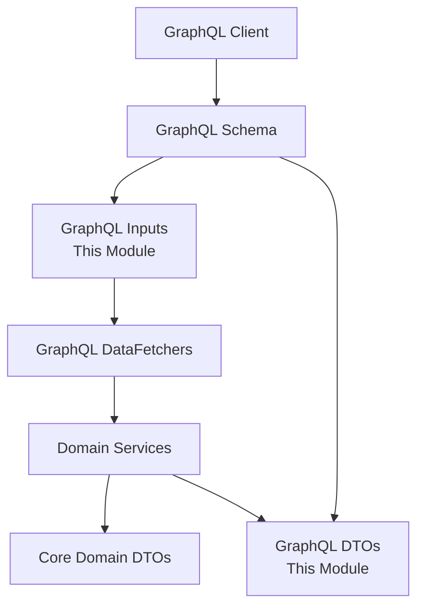

# API Service – GraphQL DTOs and Inputs

This module defines the **GraphQL-facing Data Transfer Objects (DTOs), inputs, and connection models** used by the OpenFrame API service. It acts as the contract layer between the GraphQL schema and the internal domain, services, and data fetchers.

The classes in this module are intentionally **schema-oriented**:
- They map closely to GraphQL `type`, `input`, and `connection` definitions
- They are immutable or validation-focused where appropriate
- They isolate GraphQL concerns from core domain DTOs located in `api_dto_and_filter_models`

---

## Responsibilities

- Provide **GraphQL input types** for filtering, mutations, and commands
- Provide **GraphQL response DTOs** for queries and mutations
- Implement **Relay-style pagination helpers** (edges and connections)
- Encapsulate **authentication, SSO, OAuth, and user management payloads**

This module does **not**:
- Contain business logic
- Perform persistence or mapping
- Replace core domain DTOs

---

## Architectural Context

---

## Relationship to Other Modules

- **api_service_graphql_layer**  
  Uses these DTOs and inputs directly in `DataFetcher` method signatures.

- **api_dto_and_filter_models**  
  Provides domain-level DTOs and filter models that may be transformed into these GraphQL-specific structures.

- **api_service_rest_controllers**  
  Shares several response DTOs (for example user, invitation, and API key responses) for REST and GraphQL parity.

---

## DTO Categories

The module can be understood as a set of focused DTO groups.

---

## Pagination and Connection Models

### GenericEdge
Represents a single Relay-style edge.

**Purpose**
- Wraps a node with a cursor
- Enables cursor-based pagination in GraphQL

**Key Fields**
- `node` – the actual data object
- `cursor` – opaque pagination cursor

---

### CountedGenericConnection
Extends a generic connection with additional count metadata.

**Purpose**
- Provide total or filtered counts alongside paginated results
- Commonly used in list queries with server-side filtering

**Key Fields**
- `edges` – list of `GenericEdge`
- `pageInfo` – cursor pagination info
- `filteredCount` – number of items matching applied filters

---

## Filtering Inputs (GraphQL Inputs)

These inputs are optimized for GraphQL query arguments and differ intentionally from REST or persistence-layer filters.

### LogFilterInput
Filters audit and activity logs.

**Typical Usage**
- Logs page
- Security and compliance views

**Fields**
- Date range
- Event types
- Tool types
- Severities
- Organization and device scoping

---

### DeviceFilterInput
Filters devices in inventory queries.

**Fields**
- Device statuses
- Device types
- Operating system types
- Organization IDs
- Tag names

---

### EventFilterInput
Filters event records.

**Fields**
- User IDs
- Event types
- Date range

---

### OrganizationFilterInput
Filters organizations at query time.

**Fields**
- Category
- Employee count range
- Contract status

---

### ToolFilterInput
Filters integrated tools.

**Fields**
- Enabled flag
- Tool type
- Category
- Platform category

---

## Mutation and Command Inputs

These DTOs represent **intent-driven actions** rather than simple data updates.

### Event Creation

**CreateEventInput**
- Used by event mutation resolvers
- Validated for required fields

---

### Forced Actions (Client and Tool Operations)

Used by administrative mutations to trigger actions on agents or tools.

**Client Updates**
- `ForceClientUpdateRequest`

**Tool Operations**
- `ForceToolInstallationAllRequest`
- `ForceToolReinstallationRequest`
- `ForceToolUpdateRequest`
- `ForceToolAgentUpdateAllRequest`
- `ForceToolAgentUpdateRequest`

**Response**
- `ForceToolAgentUpdateResponse` – per-agent execution results

---

## Authentication, OAuth, and OIDC DTOs

These DTOs support OAuth2, PKCE, and OpenID Connect flows.

### OAuth Flow

- `AuthorizationResponse` – authorization code redirect payload
- `TokenResponse` – access and refresh tokens
- `GoogleTokenRequest` and `SocialAuthRequest` – provider-specific token exchanges

---

### OpenID Connect

- `OpenIDConfiguration` – provider discovery document
- `UserInfo` – OIDC user claims response
- `UserInfoRequest` – internal request wrapper

---

## SSO Configuration DTOs

These DTOs support tenant-level SSO configuration and status queries.

### SSOConfigRequest
Input for creating or updating SSO provider configuration.

**Includes**
- Client credentials
- Auto-provisioning rules
- Domain allowlists

---

### SSOConfigResponse and Status

- `SSOConfigResponse` – full configuration details
- `SSOConfigStatusResponse` – lightweight enabled/status view
- `SSOProviderInfo` – provider discovery metadata

---

## User and Invitation DTOs

### User Management

- `UserResponse` – GraphQL-safe user projection
- `UserPageResponse` – paginated user lists
- `UpdateUserRequest` – profile updates

---

### Invitations

- `CreateInvitationRequest`
- `UpdateInvitationStatusRequest`
- `InvitationPageResponse`

These DTOs are shared between REST and GraphQL flows to ensure consistent behavior.

---

## API Key and Client Configuration DTOs

### API Keys

- `ApiKeyResponse` – metadata-only view of API keys

### Client Configuration

- `ClientConfigurationResponse` – client versioning and compatibility
- `AgentRegistrationSecretResponse` – agent bootstrap credentials

---

## Design Principles

- **GraphQL-first**: DTOs align with schema, not persistence
- **Validation at the edge**: Inputs enforce constraints early
- **Separation of concerns**: No business logic or persistence
- **Consistency across APIs**: Shared where REST and GraphQL overlap

---

## Summary

The `api_service_graphql_dtos_and_inputs` module is a **critical contract layer** of the OpenFrame platform. It ensures that GraphQL queries and mutations remain stable, expressive, and decoupled from internal implementation details while supporting advanced features such as cursor pagination, rich filtering, SSO, and OAuth flows.

For execution logic and data resolution, see the GraphQL data fetcher module and domain services.