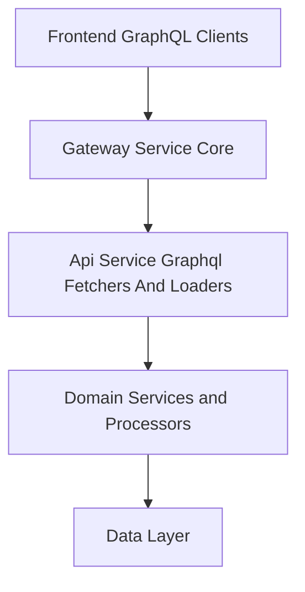
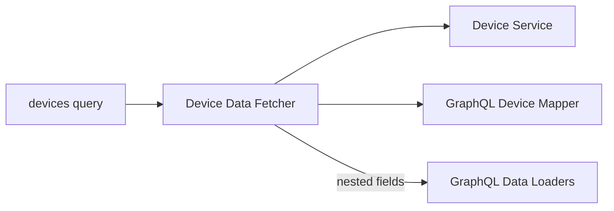
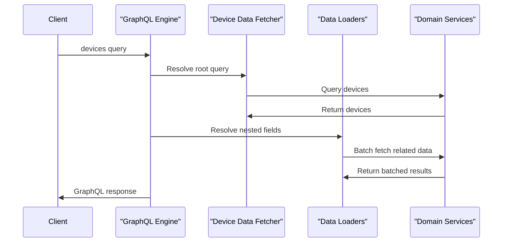

# Api Service Graphql Fetchers And Loaders

## Overview

The **Api Service Graphql Fetchers And Loaders** module implements the GraphQL query, mutation, and field-resolution layer for the OpenFrame API Service. Built on **Netflix DGS**, it acts as the bridge between the GraphQL schema and the underlying domain services, repositories, and data layer.

This module is responsible for:

- Exposing GraphQL **queries** and **mutations** for core domain objects such as Devices, Events, Logs, Organizations, and Tools
- Translating GraphQL inputs into domain-specific filter, pagination, and sort models
- Mapping domain results back into GraphQL connection-based responses
- Preventing **N+1 query problems** using GraphQL **DataLoaders**
- Orchestrating efficient, batched access to services and repositories

It sits above the domain services layer and below the frontend and API gateway layers, ensuring a clean separation between API concerns and business logic.

---

## Position in the System Architecture

The Api Service Graphql Fetchers And Loaders module is part of the API Service and interacts closely with other layers:

- **Frontend applications** consume GraphQL queries and mutations
- **Gateway Service Core** routes authenticated requests to the API service
- **Domain Services and Processors** implement business rules
- **Data Layer** persists and retrieves data from MongoDB, Pinot, Kafka, and Redis

---

## Core Responsibilities

### GraphQL Data Fetchers

Data Fetchers define how GraphQL fields, queries, and mutations are resolved. Each fetcher:

- Validates GraphQL inputs
- Converts GraphQL DTOs into domain filter and pagination objects
- Delegates execution to domain services
- Maps domain results back into GraphQL-compatible response types

### GraphQL Data Loaders

Data Loaders batch and cache backend calls during GraphQL execution to avoid repeated queries when resolving nested fields. They are critical for performance when querying relational data such as:

- Devices → Tags
- Devices → Installed Agents
- Devices → Tool Connections
- Devices → Organizations

---

## Data Fetchers

### Device Data Fetcher

**Purpose:**
Handles GraphQL queries and nested field resolution related to devices (machines).

**Key capabilities:**

- Query paginated devices with filters, search, and sorting
- Fetch a single device by machine identifier
- Resolve nested fields on a device using DataLoaders

**Main GraphQL operations:**

- `deviceFilters`
- `devices`
- `device`

**Resolved nested fields:**

- Tags
- Tool Connections
- Installed Agents
- Organization

---

### Event Data Fetcher

**Purpose:**
Provides GraphQL access to system and user events.

**Key capabilities:**

- Query events using filters, pagination, search, and sorting
- Fetch a single event by identifier
- Expose available event filters
- Create and update events via mutations

**Main GraphQL operations:**

- `events`
- `eventById`
- `eventFilters`
- `createEvent`
- `updateEvent`

This fetcher delegates all business logic to the Event Service, ensuring that GraphQL remains a thin orchestration layer.

---

### Log Data Fetcher

**Purpose:**
Exposes audit and activity logs through GraphQL.

**Key capabilities:**

- Query logs with advanced filters and cursor-based pagination
- Fetch log details for a specific tool event
- Expose available log filter options

**Main GraphQL operations:**

- `logFilters`
- `logs`
- `logDetails`

Logs are typically backed by analytical storage (such as Pinot) and optimized for read-heavy access patterns.

---

### Organization Data Fetcher

**Purpose:**
Handles GraphQL queries related to organizations and tenants.

**Key capabilities:**

- Query organizations with filters, pagination, search, and sorting
- Fetch organizations by internal ID or organization identifier

**Main GraphQL operations:**

- `organizations`
- `organization`
- `organizationByOrganizationId`

This fetcher integrates both query-focused services and standard CRUD-oriented services.

---

### Tools Data Fetcher

**Purpose:**
Provides GraphQL access to integrated tools and their metadata.

**Key capabilities:**

- Query integrated tools with filters, search, and sorting
- Retrieve available tool filters

**Main GraphQL operations:**

- `integratedTools`
- `toolFilters`

---

## Data Loaders

Data Loaders are registered with the DGS framework and automatically used during GraphQL execution to batch requests.

### Installed Agent Data Loader

**Responsibility:**

- Batch loads installed agents for multiple machines in a single backend call

**Input:**

- Machine identifiers

**Output:**

- Lists of installed agents per machine

---

### Organization Data Loader

**Responsibility:**

- Batch loads organizations by organization identifier
- Preserves input order and filters out soft-deleted organizations

This loader is critical when resolving organization data for multiple devices in a single query.

---

### Tag Data Loader

**Responsibility:**

- Batch loads tags associated with multiple machines

---

### Tool Connection Data Loader

**Responsibility:**

- Batch loads tool connection information for multiple machines

---

## GraphQL Execution Flow

The following diagram illustrates a typical GraphQL request lifecycle for a device query with nested fields:

---

## Design Principles

- **Thin GraphQL layer**: No business logic lives in data fetchers
- **Strong validation**: GraphQL inputs are validated before processing
- **Separation of concerns**: Mapping, querying, and persistence are clearly separated
- **Performance-aware**: DataLoaders eliminate N+1 query issues
- **Consistency**: Cursor-based pagination and connection models are used throughout

---

## Summary

The **Api Service Graphql Fetchers And Loaders** module is the backbone of GraphQL data access in the OpenFrame API Service. By combining well-defined data fetchers, efficient batching via DataLoaders, and clean delegation to domain services, it delivers a scalable, maintainable, and high-performance GraphQL API that supports both operational and analytical workloads.
