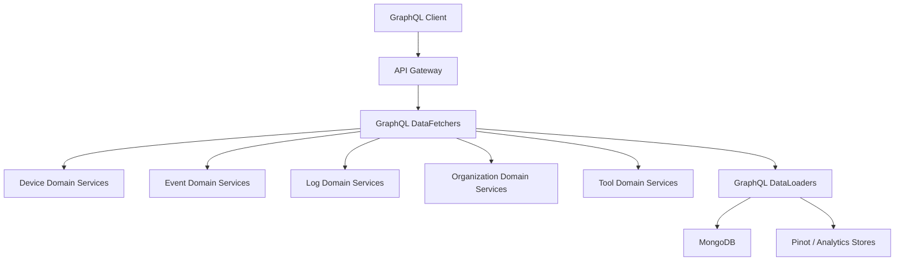
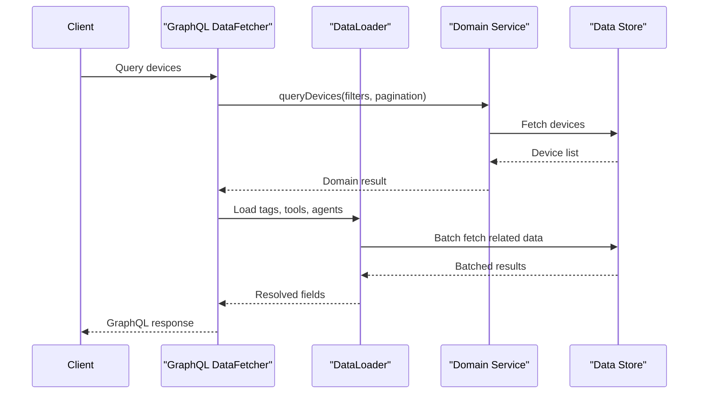

# API Service GraphQL Layer

## Overview

The **API Service GraphQL Layer** is the primary GraphQL façade for the OpenFrame API service. It is built using **Netflix DGS** on top of Spring Boot and exposes strongly-typed GraphQL queries and mutations to frontend clients and internal consumers.

This layer is responsible for:

- Defining GraphQL **queries and mutations** for core domains (devices, events, logs, organizations, tools)
- Translating GraphQL inputs into **domain filter options**
- Delegating business logic to underlying **domain services**
- Optimizing data fetching using **GraphQL DataLoaders** to avoid N+1 query problems
- Returning **cursor-paginated connections** aligned with Relay-style GraphQL patterns

The module sits between the frontend GraphQL clients and the core domain services, acting as a thin orchestration and mapping layer.

---

## High-Level Architecture

**Key points:**

- GraphQL DataFetchers expose schema-bound entry points
- Domain services encapsulate business rules and persistence
- DataLoaders batch and cache related entity lookups per request

---

## Core Responsibilities

### 1. GraphQL Query & Mutation Handling

Each `@DgsComponent` defines queries or mutations that:

- Validate GraphQL inputs
- Convert inputs into filter or pagination criteria
- Call the appropriate domain service
- Map domain results back into GraphQL DTOs

### 2. Cursor-Based Pagination

The module consistently uses cursor-based pagination:

- `CursorPaginationInput`
- `CursorPaginationCriteria`
- `GenericConnection` / `CountedGenericConnection`

This ensures scalability and consistent pagination semantics across entities.

### 3. N+1 Query Prevention

Field-level resolvers use **DataLoader** abstractions to batch-load:

- Tags
- Tool connections
- Installed agents
- Organizations

This drastically reduces database round-trips during nested GraphQL queries.

---

## Sub-Modules

The GraphQL layer is composed of two major sub-modules:

### Data Fetchers

These define GraphQL queries and mutations:

- [Device Data Fetcher](device_data_fetcher.md)
- [Event Data Fetcher](event_data_fetcher.md)
- [Log Data Fetcher](log_data_fetcher.md)
- [Organization Data Fetcher](organization_data_fetcher.md)
- [Tools Data Fetcher](tools_data_fetcher.md)

### Data Loaders

These provide batched field resolution:

- [Installed Agent DataLoader](installed_agent_data_loader.md)
- [Organization DataLoader](organization_data_loader.md)
- [Tag DataLoader](tag_data_loader.md)
- [Tool Connection DataLoader](tool_connection_data_loader.md)

---

## Typical Request Flow

---

## Relationship to Other Modules

- **API Service Core Domain Services**: Executes business logic and persistence
- **API DTO and Filter Models**: Defines shared filter and pagination models
- **Data Layer (Mongo / Pinot)**: Provides storage and analytics backing
- **Frontend GraphQL Clients**: Consume this layer via typed queries

This module intentionally avoids business logic and focuses on orchestration, mapping, and GraphQL concerns only.

---

## Design Principles

- **Thin GraphQL Layer**: No domain logic embedded in data fetchers
- **Consistency**: Unified pagination, filtering, and sorting patterns
- **Performance**: Mandatory DataLoader usage for nested fields
- **Separation of Concerns**: Mapping, services, and persistence are clearly isolated

---

## When to Extend This Module

Add new components here when:

- Introducing a new GraphQL query or mutation
- Exposing an existing domain service via GraphQL
- Adding a new nested GraphQL field that requires batching

Do **not** add business rules or persistence logic directly to this layer.
