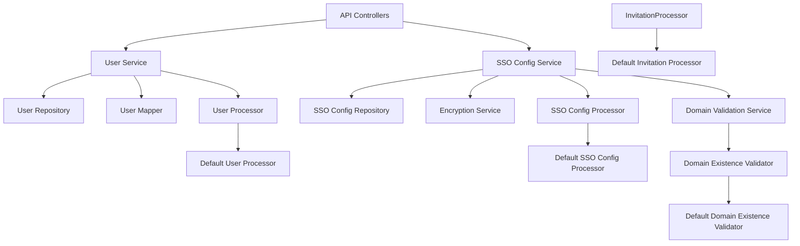
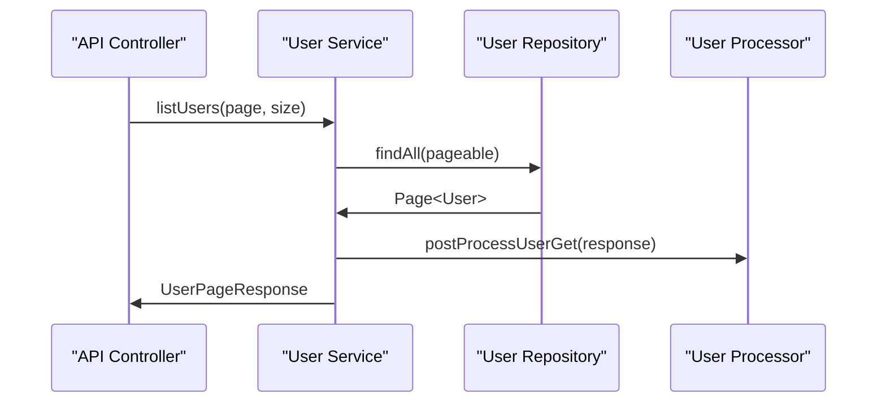

# API Service – Processors and User Services

This module contains **extension points and core user/SSO-related services** for the OpenFrame API service. It provides default implementations that can be overridden by tenants, along with concrete services responsible for **user lifecycle management**, **SSO configuration**, **domain validation**, and **post-processing hooks**.

The design emphasizes:
- Safe defaults via `@ConditionalOnMissingBean`
- Clear separation between **business services** and **post-processing processors**
- Tenant extensibility without forking core code

---

## Responsibilities at a Glance

- Manage **users** (list, update, soft delete)
- Manage **SSO provider configuration** and validation
- Provide **default processors** for invitations, users, and SSO configs
- Offer a **default domain existence validator** that tenants can override

---

## High-Level Architecture

---

## Sub-Modules Overview

### 1. User Service

**Core component:**
- `UserService`

Responsibilities:
- Fetch users by ID or email
- Paginated listing of users
- Update mutable user fields
- Soft-delete users with safety checks

Key rules enforced:
- Users cannot delete themselves
- OWNER-role users cannot be deleted
- Deletion is implemented as a **status change**, not hard delete

The service emits lifecycle events through the `UserProcessor` extension point.

---

### 2. SSO Configuration Service

**Core component:**
- `SSOConfigService`

Responsibilities:
- List enabled SSO providers (for login flows)
- Expose available providers from configuration
- Get, create, update, delete, and toggle SSO configurations
- Validate auto-provisioning rules and allowed domains

Important behaviors:
- Client secrets are encrypted at rest and decrypted only when required
- Domain lists are normalized (trimmed, lowercased, deduplicated)
- Auto-provisioning requires valid domains and provider-specific constraints

Post-save, delete, and toggle hooks are delegated to `SSOConfigProcessor`.

---

### 3. Default Processors (Extension Points)

These processors are **no-op defaults** that log lifecycle events. They are only used when no tenant-specific implementation is provided.

#### User Processor
- Logs user fetch, update, and delete events

#### Invitation Processor
- Logs invitation creation and revocation

#### SSO Config Processor
- Logs SSO configuration save, delete, and toggle events

All processors use `@ConditionalOnMissingBean`, making them safe defaults.

---

### 4. Domain Existence Validation

**Core component:**
- `DefaultDomainExistenceValidator`

Purpose:
- Acts as a pluggable policy for validating whether domains already exist

Default behavior:
- Always returns `false` (does not block)

This allows SaaS or enterprise tenants to override domain validation logic without changing core API behavior.

---

## Typical User Lifecycle Flow

---

## Extensibility Model

This module is intentionally designed for extension:

- Override **processors** to integrate:
  - Audit logs
  - Notifications
  - External identity systems
- Override **domain validation** to enforce tenant-specific policies
- Reuse services without modification through Spring dependency injection

No core service logic needs to be forked to customize behavior.

---

## How This Module Fits in the Platform

- Used by **REST controllers** and **GraphQL layers** for user and SSO operations
- Relies on:
  - Data layer repositories (MongoDB)
  - Shared DTOs and mappers
  - Security and encryption services
- Acts as a bridge between **API exposure layers** and **domain logic**

---

## Summary

The `api_service_processors_and_user_services` module provides:

- ✅ Robust user management services
- ✅ Secure and flexible SSO configuration handling
- ✅ Safe default processors with tenant override support
- ✅ Clean extension points aligned with Spring Boot best practices

It is a cornerstone for **identity, access, and tenant customization** within the OpenFrame API service.
