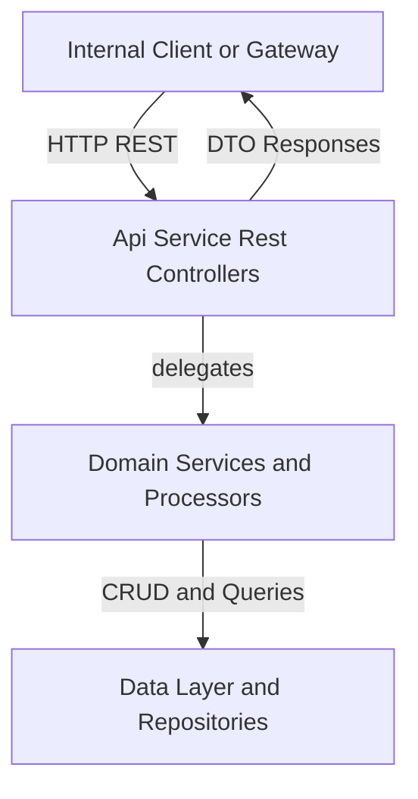
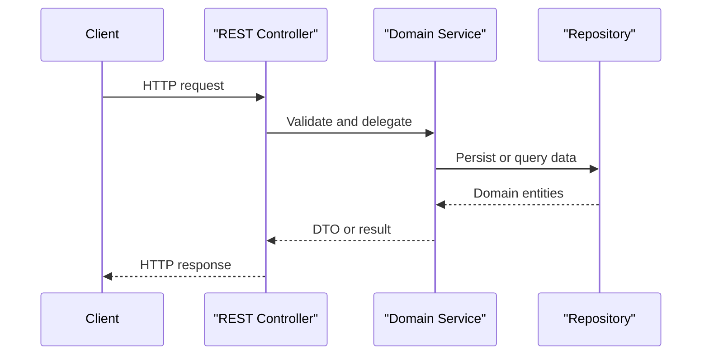

# Api Service Rest Controllers

## Overview

The **Api Service Rest Controllers** module exposes the internal REST API surface of the OpenFrame API Service. It is responsible for handling authenticated HTTP requests from trusted internal clients (frontend BFFs, gateways, and internal services), validating input, extracting security context, and delegating business logic to domain services.

This module does **not** implement business rules directly. Instead, each controller acts as a thin orchestration layer on top of:
- Domain services and processors
- DTOs and mappers from shared API libraries
- Security context provided by the authentication layer

Typical responsibilities include:
- HTTP request routing and version-stable endpoints
- Authentication principal extraction
- Request validation and response shaping
- Translating domain exceptions into HTTP status codes

---

## Architectural Context

Within the overall OpenFrame platform, Api Service Rest Controllers sit at the boundary between the API Gateway and the internal domain layer.

**Key characteristics:**
- Stateless REST controllers
- Spring Web MVC based
- Security enforced upstream and via injected authentication principal
- Clear separation between read models, write models, and commands

---

## Controller Responsibilities

The module is composed of multiple focused controllers, each aligned with a specific domain capability. Together, they form the internal REST API of the Api Service.

### Agent Registration Secret Controller

**Purpose:**
Manages agent registration secrets used by client and tool agents during secure onboarding.

**Key capabilities:**
- Retrieve the currently active registration secret
- List all historical secrets
- Generate and activate a new secret

**Typical usage:**
Used by management and automation flows that provision or rotate agent credentials.

---

### Api Key Controller

**Purpose:**
Manages lifecycle operations for user-scoped API keys.

**Key capabilities:**
- List API keys for the authenticated user
- Create new API keys
- Retrieve, update, delete, and regenerate existing keys

**Security model:**
- Requires an authenticated principal
- All operations are scoped to the requesting user

---

### Device Controller

**Purpose:**
Provides internal endpoints for device state mutation.

**Key capabilities:**
- Update device status by machine identifier

**Notes:**
This controller is intended for **internal service-to-service usage** rather than public access.

---

### Force Agent Controller

**Purpose:**
Exposes administrative endpoints to force client and tool agent actions across fleets.

**Key capabilities:**
- Force tool agent installation, update, or reinstallation
- Force client updates
- Execute operations on individual machines or across all machines

**Operational impact:**
Endpoints in this controller can trigger large-scale actions and should be protected by strict authorization policies upstream.

---

### Health Controller

**Purpose:**
Provides a lightweight health check endpoint for service monitoring.

**Key capabilities:**
- Returns a simple OK response indicating service availability

**Typical usage:**
Used by orchestration platforms, load balancers, and uptime monitors.

---

### Invitation Controller

**Purpose:**
Manages user invitations within a tenant.

**Key capabilities:**
- Create new invitations
- List existing invitations with pagination
- Revoke invitations
- Resend invitation links

**Domain alignment:**
Delegates to invitation services responsible for validation, persistence, and notification workflows.

---

### Me Controller

**Purpose:**
Exposes information about the currently authenticated user.

**Key capabilities:**
- Return authentication status
- Return user identity, roles, and tenant context

**Notes:**
This endpoint is commonly used by frontend applications during session initialization.

---

### OpenFrame Client Configuration Controller

**Purpose:**
Exposes runtime configuration required by OpenFrame clients.

**Key capabilities:**
- Retrieve the effective client configuration

**Usage:**
Consumed by client applications to adapt behavior based on server-side configuration.

---

### Organization Controller

**Purpose:**
Handles organization lifecycle mutations.

**Key capabilities:**
- Create organizations
- Update organization metadata
- Delete organizations with safety checks

**Error handling:**
- Returns NOT FOUND when organizations do not exist
- Returns CONFLICT when deletion is blocked by existing machines

---

### Release Version Controller

**Purpose:**
Exposes the currently deployed release version metadata.

**Key capabilities:**
- Retrieve release version, creation time, and update time

**Typical usage:**
Used for diagnostics, UI display, and compatibility checks.

---

### SSO Config Controller

**Purpose:**
Manages Single Sign-On provider configuration.

**Key capabilities:**
- List enabled SSO providers
- List all available providers
- Retrieve, create, update, and delete provider configurations
- Enable or disable providers dynamically

**Domain alignment:**
Delegates to SSO configuration services and strategy-based provider implementations.

---

### User Controller

**Purpose:**
Manages user accounts within a tenant.

**Key capabilities:**
- List users with pagination
- Retrieve user details
- Update user information
- Soft-delete users with audit context

**Security considerations:**
Deletion operations record the acting principal for traceability.

---

## Request Processing Flow

The following sequence illustrates how a typical request is handled by this module.

---

## Design Principles

- **Thin Controllers**: No business logic inside controllers
- **Explicit Contracts**: Strongly typed request and response DTOs
- **Security First**: Authentication context is mandatory where required
- **Clear Ownership**: Each controller maps to a well-defined domain capability
- **Operational Safety**: Administrative endpoints are explicit and auditable

---

## Summary

The **Api Service Rest Controllers** module defines the internal REST API surface for the OpenFrame platform. It plays a critical role in enforcing API boundaries, ensuring secure access to domain functionality, and providing a stable contract for internal consumers. By delegating all business logic to dedicated services, the module remains maintainable, testable, and aligned with clean architecture principles.
