# API Service REST Controllers

The **API Service REST Controllers** module provides internal REST API endpoints for managing core OpenFrame entities including devices, organizations, and users. These controllers handle mutation operations (create, update, delete) and are secured with JWT-based OAuth2 authentication.

---

## Table of Contents

1. [Overview](#overview)
2. [Architecture](#architecture)
3. [Core Controllers](#core-controllers)
4. [Security Model](#security-model)
5. [API Endpoints](#api-endpoints)
6. [Data Flow](#data-flow)
7. [Error Handling](#error-handling)
8. [Integration Points](#integration-points)
9. [Related Modules](#related-modules)

---

## Overview

### Purpose

The REST Controllers module serves as the **internal API layer** for OpenFrame's core management operations. Unlike the [external_api](external_api.md) module which provides public-facing read-only endpoints, this module handles:

- **Device Management**: Update device status and metadata
- **Organization Management**: Full CRUD operations for organizations
- **User Management**: User profile management and soft deletion

### Key Characteristics

- **Internal-Only Access**: Designed for service-to-service communication within OpenFrame
- **Mutation-Focused**: Primarily handles write operations (POST, PUT, PATCH, DELETE)
- **JWT-Secured**: All endpoints protected by OAuth2 JWT authentication
- **RESTful Design**: Follows REST conventions with proper HTTP status codes
- **Validation**: Request validation using Jakarta Bean Validation

### Technology Stack

- **Framework**: Spring Boot 3.x with Spring Web MVC
- **Security**: Spring Security OAuth2 Resource Server
- **Validation**: Jakarta Validation API
- **Serialization**: Jackson for JSON processing
- **Logging**: SLF4J with Lombok

---

## Architecture

### High-Level Architecture

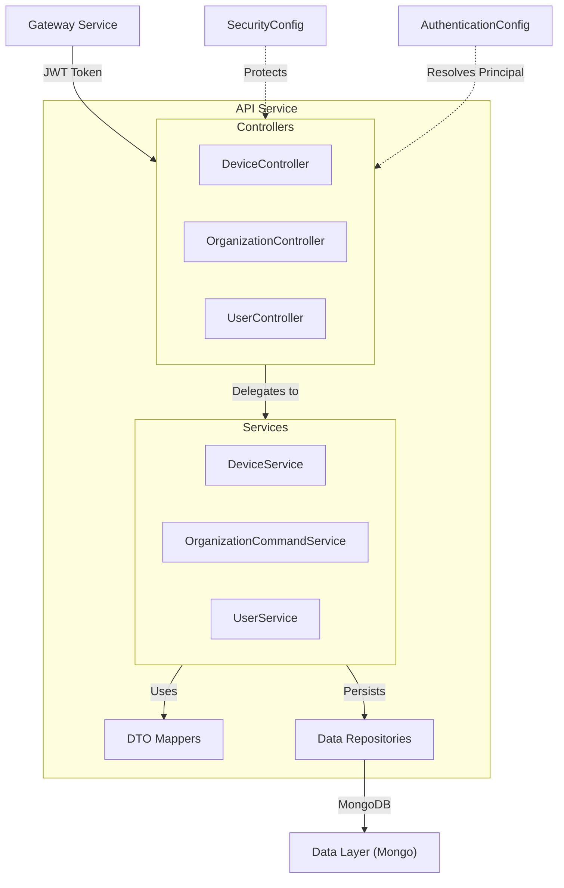

### Component Relationships

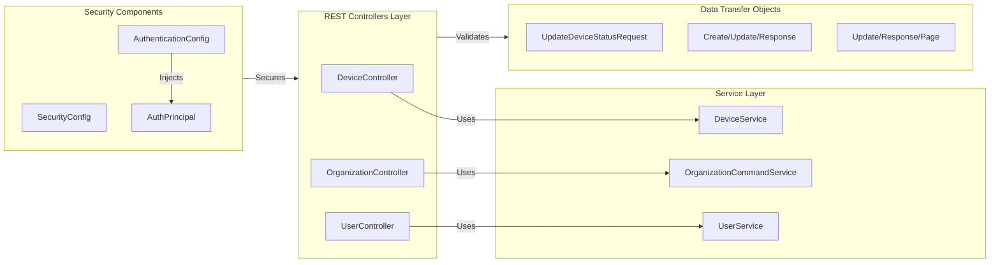

### Module Dependencies

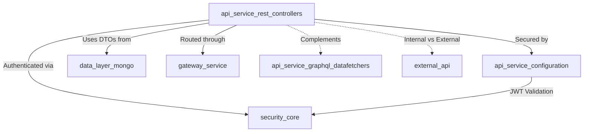

---

## Core Controllers

### DeviceController

**Purpose**: Manages device status updates for machines in the OpenFrame system.

**Endpoint**: `PATCH /devices/{machineId}`

**Key Features**:
- Updates device operational status
- Accepts machine ID as path parameter
- Returns 204 No Content on success

**Code Structure**:

```java
@RestController
@RequestMapping("/devices")
@RequiredArgsConstructor
@Slf4j
public class DeviceController {
    private final DeviceService deviceService;

    @PatchMapping("/{machineId}")
    @ResponseStatus(HttpStatus.NO_CONTENT)
    public void updateDeviceStatus(
        @PathVariable String machineId,
        @RequestBody UpdateDeviceStatusRequest request
    ) {
        log.info("Internal API: Update device status {} -> {}", 
                 machineId, request.status());
        deviceService.updateStatusByMachineId(machineId, request.status());
    }
}
```

**Use Cases**:
- Agent heartbeat status updates
- Device lifecycle state transitions
- Health check status reporting

---

### OrganizationController

**Purpose**: Provides full CRUD operations for organization management.

**Endpoints**:
- `POST /organizations` - Create organization
- `PUT /organizations/{id}` - Update organization
- `DELETE /organizations/{id}` - Delete organization

**Key Features**:
- Jakarta Bean Validation on requests
- Conflict detection (409) when deleting orgs with machines
- Proper HTTP status codes (201 Created, 200 OK, 204 No Content)
- Exception mapping to HTTP responses

**Code Structure**:

```java
@RestController
@RequestMapping("/organizations")
@RequiredArgsConstructor
@Slf4j
public class OrganizationController {
    private final OrganizationCommandService organizationCommandService;
    private final OrganizationMapper organizationMapper;

    @PostMapping
    @ResponseStatus(HttpStatus.CREATED)
    public OrganizationResponse createOrganization(
        @Valid @RequestBody CreateOrganizationRequest request
    ) { /* ... */ }

    @PutMapping("/{id}")
    @ResponseStatus(HttpStatus.OK)
    public OrganizationResponse updateOrganization(
        @PathVariable String id,
        @Valid @RequestBody UpdateOrganizationRequest request
    ) { /* ... */ }

    @DeleteMapping("/{id}")
    @ResponseStatus(HttpStatus.NO_CONTENT)
    public void deleteOrganization(@PathVariable String id) { /* ... */ }
}
```

**Business Rules**:
- Organizations cannot be deleted if they have associated machines
- All mutations require valid JWT authentication
- Read operations delegated to external-api module

---

### UserController

**Purpose**: Manages user profile operations and lifecycle.

**Endpoints**:
- `GET /users` - List users (paginated)
- `GET /users/{id}` - Get user by ID
- `PUT /users/{id}` - Update user profile
- `DELETE /users/{id}` - Soft delete user

**Key Features**:
- Pagination support for list operations
- Soft deletion (preserves data)
- Principal injection for audit trails
- Request validation

**Code Structure**:

```java
@RestController
@RequestMapping("/users")
@RequiredArgsConstructor
public class UserController {
    private final UserService userService;

    @GetMapping
    @ResponseStatus(HttpStatus.OK)
    public UserPageResponse listUsers(
        @RequestParam(defaultValue = "0") int page,
        @RequestParam(defaultValue = "20") int size
    ) { /* ... */ }

    @GetMapping("/{id}")
    @ResponseStatus(HttpStatus.OK)
    public UserResponse getUserById(@PathVariable String id) { /* ... */ }

    @PutMapping("/{id}")
    @ResponseStatus(HttpStatus.OK)
    public UserResponse updateUserById(
        @PathVariable String id,
        @Valid @RequestBody UpdateUserRequest request
    ) { /* ... */ }

    @DeleteMapping("/{id}")
    @ResponseStatus(HttpStatus.NO_CONTENT)
    public void deleteUser(
        @PathVariable String id,
        @AuthenticationPrincipal AuthPrincipal principal
    ) { /* ... */ }
}
```

**Security Features**:
- `AuthPrincipal` injection for tracking who performed deletion
- Soft delete preserves user data for audit purposes
- All operations require authenticated JWT token

---

## Security Model

### JWT-Based Authentication

The module uses Spring Security OAuth2 Resource Server with multi-tenant JWT validation:

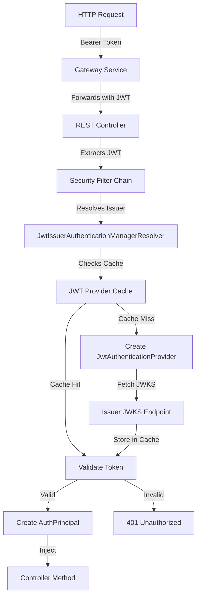

### SecurityConfig

**Key Features**:
- **Dynamic JWT Provider Cache**: Uses Caffeine cache for JWT decoders per issuer
- **Multi-Tenant Support**: Resolves authentication provider based on JWT issuer
- **CSRF Disabled**: Stateless API design
- **Permit All Strategy**: Authorization handled at gateway level

**Configuration**:

```java
@Configuration
@EnableWebSecurity
public class SecurityConfig {
    @Bean
    public LoadingCache<String, JwtAuthenticationProvider> jwtProviderCache() {
        return Caffeine.newBuilder()
            .maximumSize(maximumSize)
            .expireAfterWrite(expireAfter)
            .refreshAfterWrite(refreshAfter)
            .build(issuer -> {
                var decoder = JwtDecoders.fromIssuerLocation(issuer);
                return new JwtAuthenticationProvider(decoder);
            });
    }

    @Bean
    public SecurityFilterChain securityFilterChain(
        HttpSecurity http, 
        LoadingCache<String, JwtAuthenticationProvider> jwtProviderCache
    ) throws Exception {
        JwtIssuerAuthenticationManagerResolver issuerResolver = 
            new JwtIssuerAuthenticationManagerResolver(
                issuer -> jwtProviderCache.get(issuer)::authenticate
            );
        
        return http
            .csrf(AbstractHttpConfigurer::disable)
            .authorizeHttpRequests(auth -> auth.anyRequest().permitAll())
            .oauth2ResourceServer(oauth2 -> 
                oauth2.authenticationManagerResolver(issuerResolver))
            .build();
    }
}
```

**Cache Configuration Properties**:
- `openframe.security.jwt.cache.expire-after`: Token cache expiration
- `openframe.security.jwt.cache.refresh-after`: Token cache refresh interval
- `openframe.security.jwt.cache.maximum-size`: Maximum cached providers

### AuthenticationConfig

**Purpose**: Configures custom argument resolvers for controller methods.

**Key Feature**: Enables `@AuthenticationPrincipal AuthPrincipal` injection in controller methods.

```java
@Configuration
public class AuthenticationConfig implements WebMvcConfigurer {
    @Override
    public void addArgumentResolvers(
        List<HandlerMethodArgumentResolver> resolvers
    ) {
        resolvers.add(new AuthPrincipalArgumentResolver());
    }
}
```

**Usage in Controllers**:

```java
@DeleteMapping("/{id}")
public void deleteUser(
    @PathVariable String id,
    @AuthenticationPrincipal AuthPrincipal principal
) {
    // principal.getId() provides authenticated user ID
    userService.softDeleteUser(id, principal.getId());
}
```

---

## API Endpoints

### Device Endpoints

| Method | Endpoint | Description | Request Body | Response | Status Codes |
|--------|----------|-------------|--------------|----------|--------------|
| PATCH | `/devices/{machineId}` | Update device status | `UpdateDeviceStatusRequest` | None | 204 No Content |

**Example Request**:

```bash
curl -X PATCH https://api.openframe.ai/devices/machine-123 \
  -H "Authorization: Bearer $JWT_TOKEN" \
  -H "Content-Type: application/json" \
  -d '{"status": "ONLINE"}'
```

---

### Organization Endpoints

| Method | Endpoint | Description | Request Body | Response | Status Codes |
|--------|----------|-------------|--------------|----------|--------------|
| POST | `/organizations` | Create organization | `CreateOrganizationRequest` | `OrganizationResponse` | 201 Created, 400 Bad Request |
| PUT | `/organizations/{id}` | Update organization | `UpdateOrganizationRequest` | `OrganizationResponse` | 200 OK, 404 Not Found |
| DELETE | `/organizations/{id}` | Delete organization | None | None | 204 No Content, 404 Not Found, 409 Conflict |

**Example Create Request**:

```bash
curl -X POST https://api.openframe.ai/organizations \
  -H "Authorization: Bearer $JWT_TOKEN" \
  -H "Content-Type: application/json" \
  -d '{
    "name": "Acme Corp",
    "description": "Main organization",
    "settings": {}
  }'
```

**Example Update Request**:

```bash
curl -X PUT https://api.openframe.ai/organizations/org-123 \
  -H "Authorization: Bearer $JWT_TOKEN" \
  -H "Content-Type: application/json" \
  -d '{
    "name": "Acme Corporation",
    "description": "Updated description"
  }'
```

**Example Delete Request**:

```bash
curl -X DELETE https://api.openframe.ai/organizations/org-123 \
  -H "Authorization: Bearer $JWT_TOKEN"
```

---

### User Endpoints

| Method | Endpoint | Description | Query Params | Request Body | Response | Status Codes |
|--------|----------|-------------|--------------|--------------|----------|--------------|
| GET | `/users` | List users (paginated) | `page`, `size` | None | `UserPageResponse` | 200 OK |
| GET | `/users/{id}` | Get user by ID | None | None | `UserResponse` | 200 OK, 404 Not Found |
| PUT | `/users/{id}` | Update user | None | `UpdateUserRequest` | `UserResponse` | 200 OK, 404 Not Found |
| DELETE | `/users/{id}` | Soft delete user | None | None | None | 204 No Content |

**Example List Request**:

```bash
curl -X GET "https://api.openframe.ai/users?page=0&size=20" \
  -H "Authorization: Bearer $JWT_TOKEN"
```

**Example Get Request**:

```bash
curl -X GET https://api.openframe.ai/users/user-123 \
  -H "Authorization: Bearer $JWT_TOKEN"
```

**Example Update Request**:

```bash
curl -X PUT https://api.openframe.ai/users/user-123 \
  -H "Authorization: Bearer $JWT_TOKEN" \
  -H "Content-Type: application/json" \
  -d '{
    "firstName": "John",
    "lastName": "Doe",
    "email": "john.doe@example.com"
  }'
```

**Example Delete Request**:

```bash
curl -X DELETE https://api.openframe.ai/users/user-123 \
  -H "Authorization: Bearer $JWT_TOKEN"
```

---

## Data Flow

### Request Processing Flow

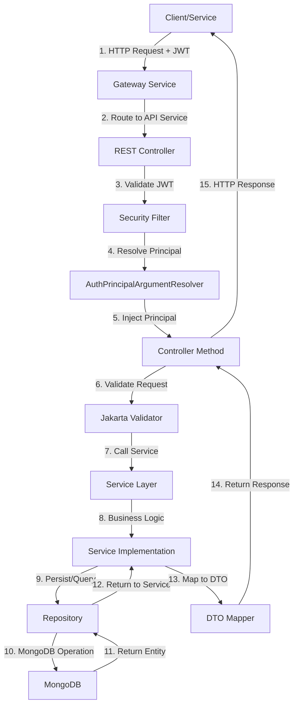

### Organization Creation Flow

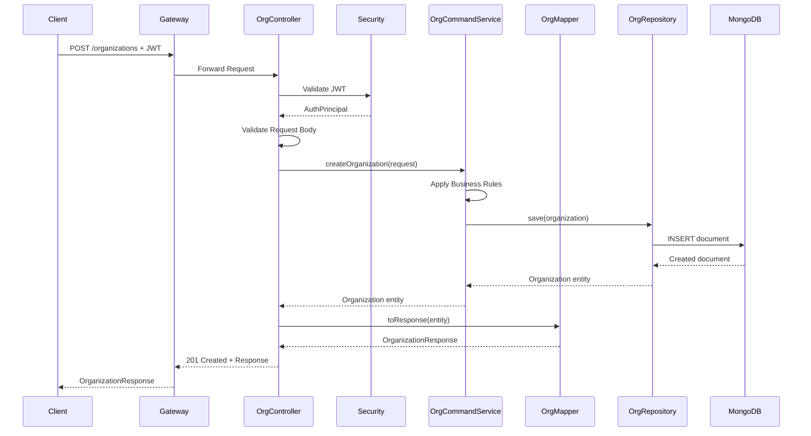

### Device Status Update Flow

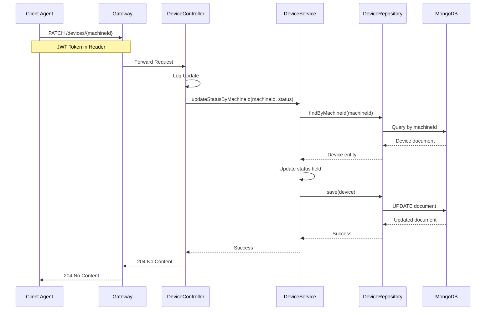

### User Soft Delete Flow

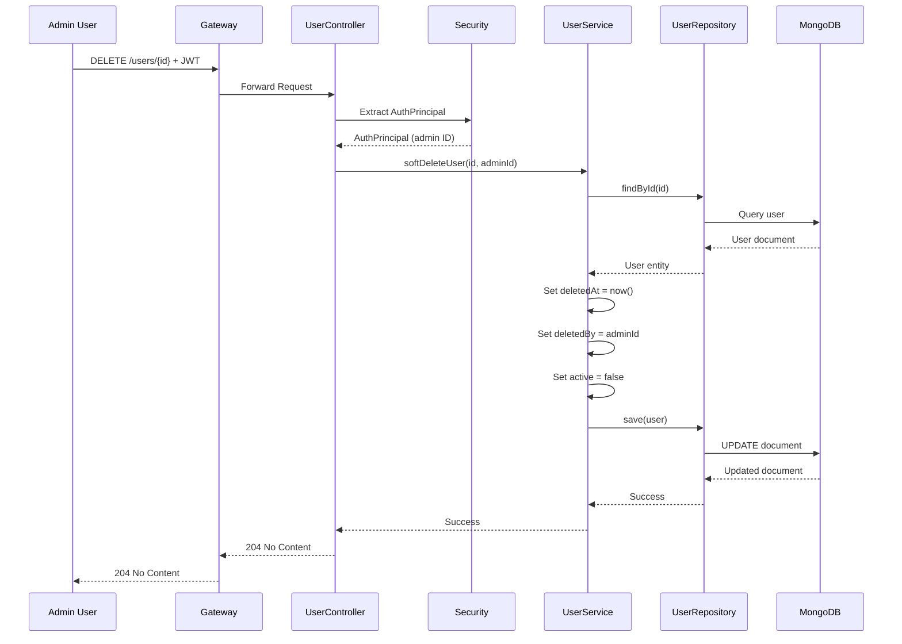

---

## Error Handling

### Exception Mapping Strategy

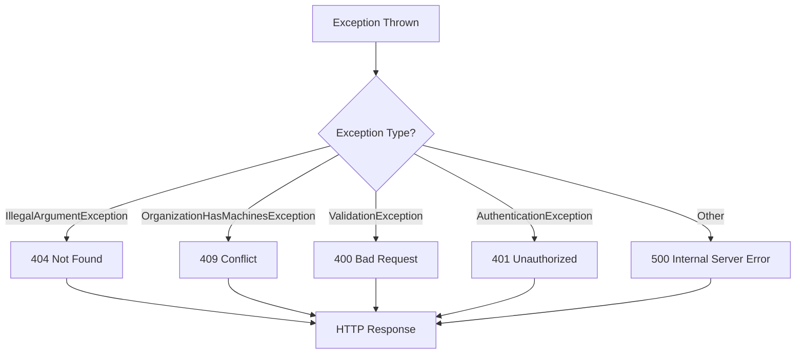

### HTTP Status Codes

| Status Code | Scenario | Example |
|-------------|----------|---------|
| **200 OK** | Successful GET/PUT | User profile retrieved/updated |
| **201 Created** | Successful POST | Organization created |
| **204 No Content** | Successful DELETE/PATCH | User deleted, device status updated |
| **400 Bad Request** | Validation failure | Invalid request body |
| **401 Unauthorized** | Missing/invalid JWT | Expired token |
| **404 Not Found** | Resource not found | User ID doesn't exist |
| **409 Conflict** | Business rule violation | Delete org with machines |
| **500 Internal Server Error** | Unexpected error | Database connection failure |

### Error Response Examples

**404 Not Found**:

```json
{
  "timestamp": "2024-01-15T10:30:00Z",
  "status": 404,
  "error": "Not Found",
  "message": "Organization not found with id: org-123",
  "path": "/organizations/org-123"
}
```

**409 Conflict**:

```json
{
  "timestamp": "2024-01-15T10:30:00Z",
  "status": 409,
  "error": "Conflict",
  "message": "Cannot delete organization: 5 machines still associated",
  "path": "/organizations/org-123"
}
```

**400 Bad Request (Validation)**:

```json
{
  "timestamp": "2024-01-15T10:30:00Z",
  "status": 400,
  "error": "Bad Request",
  "message": "Validation failed",
  "errors": [
    {
      "field": "name",
      "message": "must not be blank"
    },
    {
      "field": "email",
      "message": "must be a valid email address"
    }
  ],
  "path": "/organizations"
}
```

### Controller Exception Handling

**Pattern Used**:

```java
try {
    var result = service.performOperation(id, request);
    return mapper.toResponse(result);
} catch (IllegalArgumentException e) {
    throw new ResponseStatusException(HttpStatus.NOT_FOUND, e.getMessage());
} catch (OrganizationHasMachinesException e) {
    throw new ResponseStatusException(HttpStatus.CONFLICT, e.getMessage());
}
```

---

## Integration Points

### Upstream Dependencies

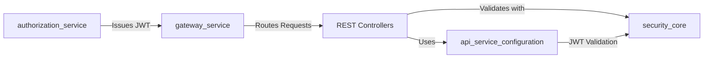

**Key Integrations**:

1. **Gateway Service**: All requests routed through gateway with JWT validation
2. **Authorization Service**: Issues JWT tokens consumed by this module
3. **Security Core**: Provides JWT validation and principal resolution
4. **Configuration Module**: Supplies security and authentication configuration

### Downstream Dependencies

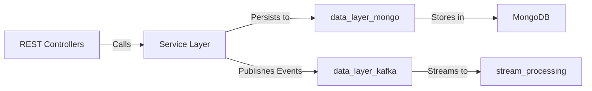

**Key Integrations**:

1. **Data Layer (Mongo)**: Persists entities to MongoDB
2. **Data Layer (Kafka)**: Publishes change events for stream processing
3. **Stream Processing**: Consumes events for real-time analytics

### Complementary Modules

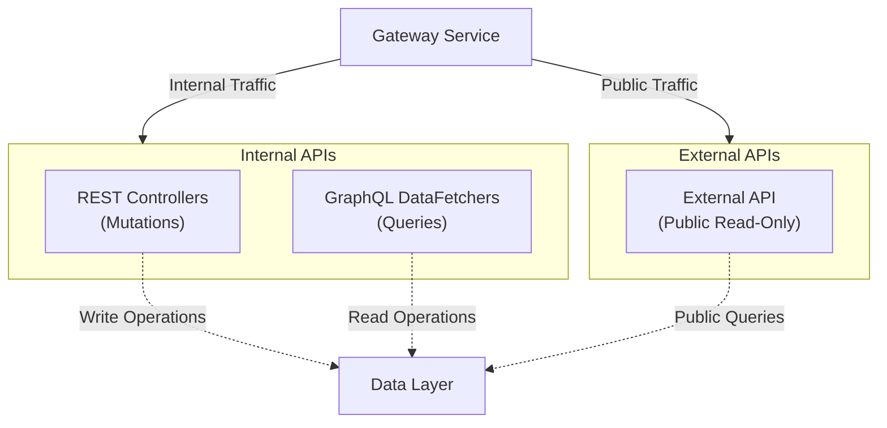

**Division of Responsibilities**:

| Module | Purpose | Access Level | Operations |
|--------|---------|--------------|------------|
| **REST Controllers** | Internal mutations | Service-to-service | POST, PUT, PATCH, DELETE |
| **GraphQL DataFetchers** | Internal queries | Service-to-service | Complex queries, nested data |
| **External API** | Public access | External clients | GET (read-only) |

---

## Related Modules

### Parent Module
- **[api_service](api_service.md)**: Parent module containing all API service components

### Sibling Modules
- **[api_service_configuration](api_service_configuration.md)**: Security and authentication configuration
- **[api_service_graphql_datafetchers](api_service_graphql_datafetchers.md)**: GraphQL query layer
- **[api_service_application](api_service_application.md)**: Spring Boot application entry point

### Dependency Modules
- **[security_core](security_core.md)**: JWT validation and authentication primitives
- **[data_layer_mongo](data_layer_mongo.md)**: MongoDB repositories and entities
- **[data_layer_kafka](data_layer_kafka.md)**: Event streaming for change data capture

### Related Services
- **[gateway_service](gateway_service.md)**: API gateway routing and initial JWT validation
- **[authorization_service](authorization_service.md)**: OAuth2 authorization server issuing JWT tokens
- **[external_api](external_api.md)**: Public-facing read-only API endpoints

---

## Best Practices

### Controller Design

1. **Keep Controllers Thin**: Delegate business logic to service layer
2. **Use DTOs**: Never expose domain entities directly
3. **Validate Early**: Use `@Valid` on request bodies
4. **Log Operations**: Log all mutation operations for audit trails
5. **Proper Status Codes**: Use appropriate HTTP status codes

### Security

1. **Always Validate JWT**: Rely on Spring Security filter chain
2. **Inject Principal**: Use `@AuthenticationPrincipal` for audit trails
3. **Never Trust Input**: Validate all request parameters
4. **Rate Limiting**: Implement at gateway level

### Error Handling

1. **Map Exceptions**: Convert domain exceptions to HTTP status codes
2. **Provide Context**: Include meaningful error messages
3. **Don't Leak Details**: Avoid exposing internal implementation details
4. **Log Errors**: Log all errors with context for debugging

### Testing

1. **Unit Tests**: Test controller logic with mocked services
2. **Integration Tests**: Test full request/response cycle
3. **Security Tests**: Verify JWT validation and authorization
4. **Contract Tests**: Ensure API contract stability

---

## Configuration

### Application Properties

```yaml
# JWT Cache Configuration
openframe:
  security:
    jwt:
      cache:
        expire-after: 1h
        refresh-after: 30m
        maximum-size: 100

# Server Configuration
server:
  port: 8080
  servlet:
    context-path: /api

# Logging
logging:
  level:
    com.openframe.api.controller: INFO
    org.springframework.security: DEBUG
```

### Environment Variables

| Variable | Description | Default |
|----------|-------------|---------|
| `SERVER_PORT` | API service port | 8080 |
| `JWT_CACHE_SIZE` | Maximum JWT providers cached | 100 |
| `JWT_CACHE_EXPIRE` | JWT cache expiration | 1h |
| `MONGODB_URI` | MongoDB connection string | `mongodb://localhost:27017` |

---

## Troubleshooting

### Common Issues

**Issue**: 401 Unauthorized on all requests

**Solution**: 
- Verify JWT token is valid and not expired
- Check issuer URL is accessible from API service
- Verify JWT cache configuration

**Issue**: 409 Conflict when deleting organization

**Solution**:
- Check if organization has associated machines
- Remove or reassign machines before deletion
- Use cascade delete if appropriate

**Issue**: 404 Not Found for valid resource

**Solution**:
- Verify resource ID format
- Check MongoDB connection
- Verify tenant isolation is working correctly

---

## Additional Resources

- **Spring Security OAuth2**: https://spring.io/projects/spring-security-oauth
- **Jakarta Bean Validation**: https://beanvalidation.org/
- **REST API Design**: https://restfulapi.net/
- **OpenFrame Documentation**: https://docs.openframe.ai

---

**Questions or Issues?**  
Join the OpenMSP Slack community: https://www.openmsp.ai/

**Slack Invite**: https://join.slack.com/t/openmsp/shared_invite/zt-36bl7mx0h-3~U2nFH6nqHqoTPXMaHEHA
