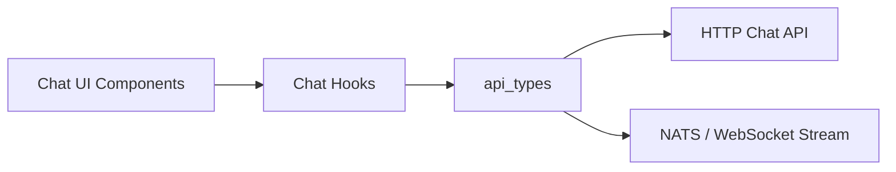
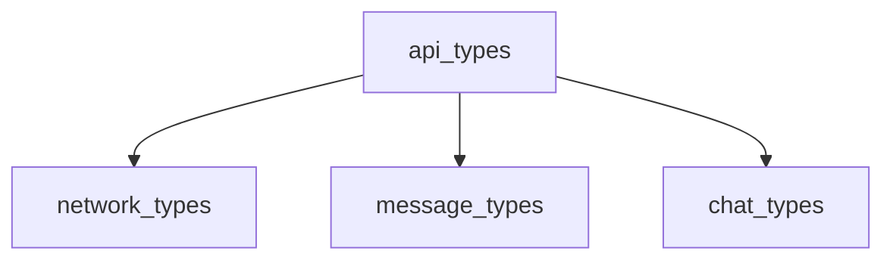
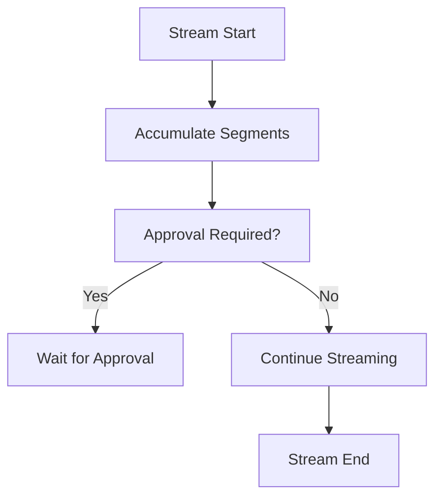

# Chat API Types (`api_types`)

## Overview

The **`api_types`** module defines the **TypeScript contracts** used by the OpenFrame frontend chat system to communicate with backend chat APIs and real-time infrastructure. It acts as the **single source of truth** for:

- Chat-related **HTTP API requests and responses**
- **Approval and settings** update payloads
- **Realtime and streaming hook contracts** used by React hooks

These types are consumed by frontend services (for example chat API clients and hooks) and align with backend chat, approval, and dialog management endpoints.

This module lives under:

````text
frontend_chat_shared_types
└── api_types   (this module)
````

---

## Responsibilities

- Provide **stable API contracts** between frontend chat components and backend services
- Encapsulate **request/response shapes** for dialogs, messages, approvals, and settings
- Define **hook option and return types** for realtime chat streaming (NATS/WebSocket based)
- Ensure type safety across chat UI, services, and state management

---

## High-Level Architecture

The `api_types` module sits at the boundary between:

- **UI components & hooks** (chat UI, dialogs, approvals)
- **Network layer** (REST + NATS/WebSocket streaming)



---

## Dependency Relationships

This module depends on shared chat type definitions for messages, network chunks, and enums.



> **Note**: UI-specific props and rendering concerns are intentionally excluded and live in component-related type modules.

---

## API Request & Response Contracts

### Chat Message API

Used to send a user message to an existing dialog.

```typescript
export interface ChatAPIRequest {
  dialogId: string
  message: string
  metadata?: Record<string, any>
}

export interface ChatAPIResponse {
  success: boolean
  messageId?: string
  error?: string
}
```

**Usage context**:
- Called by chat services when a user sends a message
- Response correlates to realtime stream events by `messageId`

---

### Dialog Management APIs

#### Create Dialog

```typescript
export interface DialogCreateRequest {
  name?: string
  metadata?: Record<string, any>
}

export interface DialogCreateResponse {
  id: string
  name?: string
  createdAt: string
}
```

#### List Dialogs

```typescript
export interface DialogListRequest {
  page?: number
  pageSize?: number
  orderBy?: 'createdAt' | 'updatedAt' | 'name'
  orderDirection?: 'asc' | 'desc'
}

export interface DialogListResponse {
  dialogs: Array<{
    id: string
    name?: string
    createdAt: string
    updatedAt?: string
    lastMessage?: string
    messageCount?: number
  }>
  total: number
  page: number
  pageSize: number
}
```

**Design notes**:
- Supports pagination and sorting
- Optimized for dialog sidebar and history views

---

## Approval APIs

Approval flows are used when AI actions or tool executions require user confirmation.

```typescript
export interface ApprovalRequest {
  requestId: string
  approved: boolean
  reason?: string
}

export interface ApprovalResponse {
  success: boolean
  error?: string
}
```

**Key concepts**:
- `requestId` correlates with realtime approval messages
- Supports both approval and rejection flows

---

## Chat Settings APIs

Used to persist per-user or per-dialog chat preferences.

```typescript
export interface ChatSettings {
  assistantName?: string
  assistantType?: string
  avatarUrl?: string
  autoScroll?: boolean
  soundEnabled?: boolean
  notificationsEnabled?: boolean
}

export interface UpdateSettingsRequest {
  settings: Partial<ChatSettings>
}

export interface UpdateSettingsResponse {
  success: boolean
  settings?: ChatSettings
  error?: string
}
```

---

## Realtime & Streaming Hook Types

The chat system supports realtime streaming of AI responses using chunked messages.

### Chunk Catch-up Hook

Used when reconnecting or loading historical data.

```typescript
export interface UseChunkCatchupOptions {
  dialogId: string | null
  onChunkReceived: (chunk: ChunkData, messageType: NatsMessageType) => void
  chatTypes?: ChatType[]
  fetchChunks?: FetchChunksFunction
}

export interface UseChunkCatchupReturn {
  catchUpChunks: (fromSequenceId?: number | null) => Promise<void>
  processChunk: (chunk: ChunkData, messageType: NatsMessageType, forceProcess?: boolean) => boolean
  resetChunkTracking: () => void
  startInitialBuffering: () => void
  isBufferingActive: () => boolean
  processedCount: number
}
```

---

### NATS Dialog Subscription Hook

Defines how frontend clients subscribe to realtime dialog events.

```typescript
export interface UseNatsDialogSubscriptionOptions {
  enabled: boolean
  dialogId: string | null
  topics?: NatsMessageType[]
  onEvent?: (payload: unknown, messageType: NatsMessageType) => void
  onConnect?: () => void
  onDisconnect?: () => void
  onSubscribed?: () => void
  getNatsWsUrl: () => string | null
  clientConfig?: {
    name?: string
    user?: string
    pass?: string
  }
}

export interface UseNatsDialogSubscriptionReturn {
  isConnected: boolean
  isSubscribed: boolean
}
```

---

### Realtime Chunk Processor

Handles the lifecycle of streaming AI responses, approvals, and tool executions.



Key interfaces:

```typescript
export interface RealtimeChunkCallbacks {
  onStreamStart?: () => void
  onStreamEnd?: () => void
  onMetadata?: (metadata: { modelName: string; providerName: string; contextWindow: number }) => void
  onSegmentsUpdate?: (segments: MessageSegment[]) => void
  onError?: (error: string, details?: string) => void
  onUserMessage?: (text: string) => void
  onApprove?: (requestId?: string) => Promise<void> | void
  onReject?: (requestId?: string) => Promise<void> | void
}
```

---

## How This Module Fits in the System

- **Consumed by**: chat services, React hooks, frontend API clients
- **Backed by**: chat APIs, approval endpoints, realtime streaming infrastructure
- **Complements**:
  - Message and network type modules for lower-level streaming details
  - Component type modules for UI rendering contracts

The separation ensures that **API contracts remain stable**, even as UI components or backend implementations evolve.

---

## Summary

The `api_types` module provides a clean, well-scoped contract layer for the OpenFrame chat system. By centralizing API and hook-related types, it enables:

- Predictable frontend-backend integration
- Robust realtime streaming support
- Safe evolution of chat, approval, and settings features

This module should be updated **only when API semantics change**, not for UI-specific concerns.