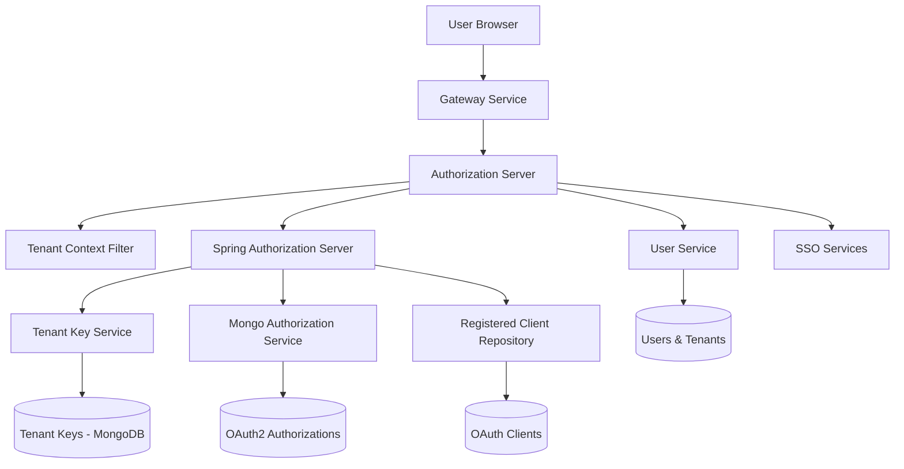

# Authorization Server

## Overview

The **authorization-server** module is the central authentication and authorization service for OpenFrame. It implements a **multi-tenant OAuth 2.1 / OpenID Connect (OIDC) Authorization Server** responsible for:

- User authentication (password-based and SSO)
- Tenant-aware OAuth2 token issuance
- Per-tenant signing keys (JWKS)
- SSO onboarding, tenant registration, and invitation flows
- Secure password reset and account lifecycle hooks

This service is built on **Spring Authorization Server** and integrates tightly with:
- MongoDB data layer (users, tenants, OAuth clients, tokens)
- Gateway service (OAuth entry points)
- Frontend authentication flows

---

## High-Level Architecture

---

## Core Responsibilities

### 1. OAuth2 / OIDC Authorization Server

- Issues **access tokens**, **refresh tokens**, and **ID tokens**
- Supports Authorization Code + PKCE
- Supports multiple issuers (multi-tenant)
- Publishes tenant-specific JWKS endpoints

Implemented primarily in:
- `AuthorizationServerConfig`
- `MongoAuthorizationService`
- `MongoRegisteredClientRepository`

---

### 2. Multi-Tenant Resolution

Each request is resolved to a tenant using:
- URL path prefix (e.g. `/sas/{tenantId}/oauth2/...`)
- Query parameter fallback
- HTTP session persistence

The resolved tenant is stored in a thread-local context for the request lifecycle.

Key components:
- `TenantContext`
- `TenantContextFilter`

---

### 3. Token Signing & Key Management

- Each tenant has its own RSA key pair
- Keys are stored encrypted in MongoDB
- JWKS is dynamically served per tenant

Key components:
- `TenantKeyService`
- `RsaAuthenticationKeyPairGenerator`
- `PemUtil`

---

### 4. Authentication Flows

Supported flows:

- Username/password login
- Google SSO
- Microsoft SSO
- Invitation-based onboarding
- SSO-based tenant registration

Key components:
- `LoginController`
- `AuthSuccessHandler`
- `InviteSsoHandler`
- `TenantRegSsoHandler`

---

### 5. Tenant & User Lifecycle APIs

REST endpoints for:

- Tenant discovery by email
- Tenant registration (password or SSO)
- Invitation acceptance
- Password reset

Key controllers:
- `TenantDiscoveryController`
- `TenantRegistrationController`
- `InvitationRegistrationController`
- `PasswordResetController`

---

## Sub-Modules

The authorization server is composed of several logical sub-modules. Each is documented separately:

- [Tenant Context & Resolution](authorization-server-tenant-context.md)
- [OAuth2 & Token Management](authorization-server-oauth.md)
- [SSO & Registration Flows](authorization-server-sso.md)
- [Key Management & JWKS](authorization-server-keys.md)
- [Persistence Layer](authorization-server-persistence.md)

---

## Integration With Other Services

- **Gateway Service**: Acts as OAuth entry point and forwards authentication traffic
- **API Service**: Consumes issued JWTs for API authorization
- **Frontend**: Uses tenant discovery and OAuth redirects for login & onboarding

Refer to platform documentation for end-to-end authentication flow details.

---

## Startup

The service entry point is:

- `OpenFrameAuthorizationServerApplication`

This bootstraps Spring Boot with component scanning across:
- Authorization components
- Core utilities
- Data layer
- Notification services

---

## Security Notes

- BCrypt password hashing
- PKCE enforced where applicable
- Encrypted private keys at rest
- Secure, HTTP-only cookies for SSO flows
- Tenant isolation enforced at token and key level

---

## Summary

The **authorization-server** is the security backbone of OpenFrame. It provides a scalable, tenant-aware OAuth2/OIDC implementation with first-class support for SSO, secure onboarding, and extensible lifecycle hooks—designed to integrate cleanly with the broader OpenFrame microservice ecosystem.
