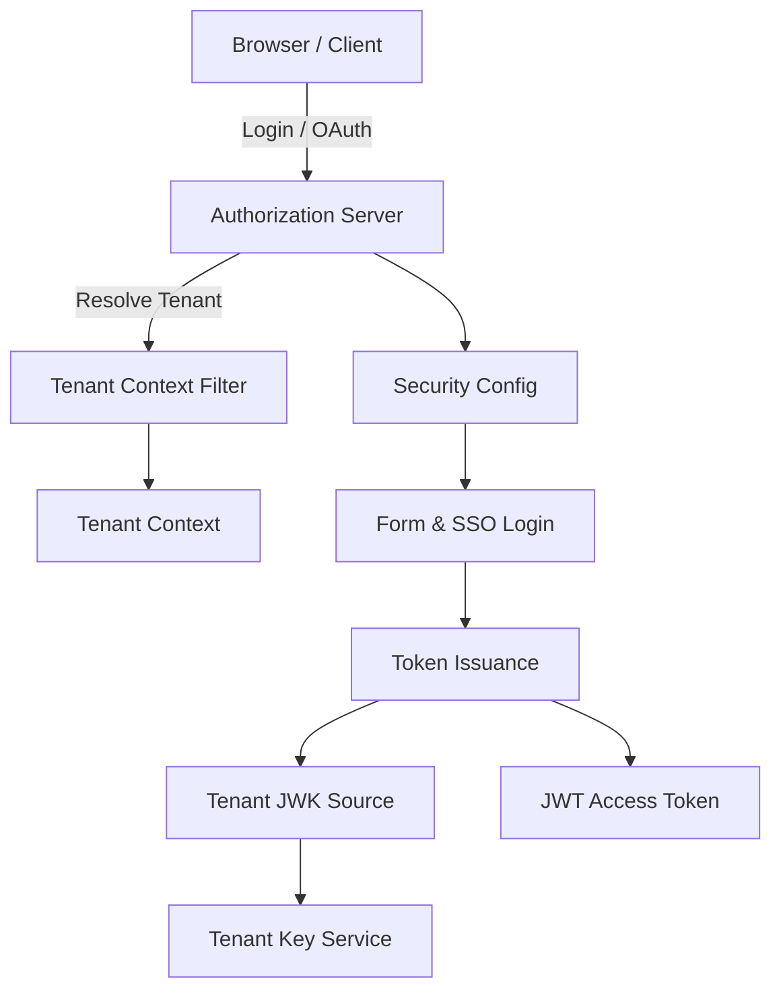
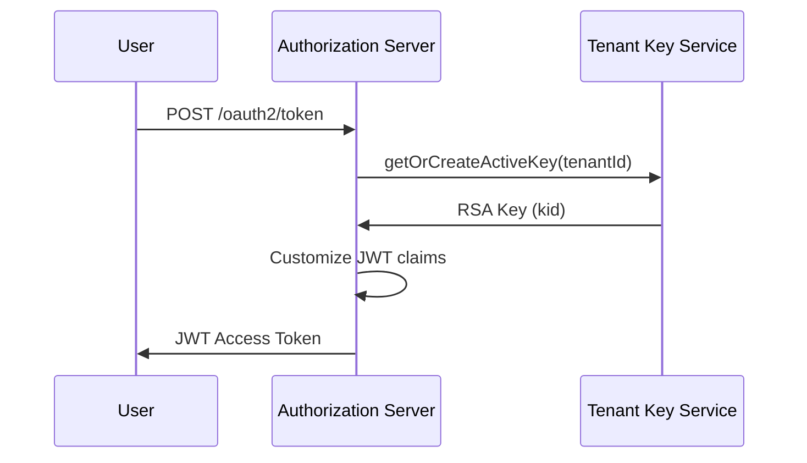

# Authorization Server Application and Core

This module implements the **OpenFrame Authorization Server**, providing OAuth2 / OpenID Connect (OIDC) authentication, multi-tenant isolation, and SSO-based user onboarding for the OpenFrame platform.

It acts as the central **identity and token authority** for tenant-scoped applications, issuing JWT access tokens, handling login and SSO flows, and managing tenant-aware cryptographic keys.

---

## Responsibilities

- OAuth2 Authorization Server and OIDC Provider
- Tenant-aware token issuance (multi-issuer support)
- Local username/password authentication
- SSO login and auto-provisioning (Google, Microsoft, etc.)
- Secure JWT signing with per-tenant RSA keys
- Tenant resolution and request scoping

---

## High-Level Architecture

---

## Core Components Overview

### Application Bootstrap

- **OpenFrameAuthorizationServerApplication**  
  Entry point for the Spring Boot Authorization Server. Enables discovery, scans shared core and data packages, and initializes all authorization components.

---

### Configuration Layer

- **AuthorizationServerConfig**  
  Configures Spring Authorization Server, JWT encoding/decoding, per-tenant JWK resolution, token customization, and authentication providers.

- **SecurityConfig**  
  Defines default security rules for non-OAuth endpoints, login pages, SSO login handling, and auto-provisioning behavior.

See:
- [Authorization Server Security](Authorization Server Security.md)

---

### Tenant Awareness

- **TenantContext**  
  Thread-local holder for the active tenant ID.

- **TenantContextFilter**  
  Resolves tenant identity from URL paths, query parameters, or session state and ensures isolation across requests.

See:
- [Tenant Context and Resolution](Tenant Context and Resolution.md)

---

### Dynamic OAuth Client Registration

- **DynamicClientRegistrationRepository**  
  Dynamically resolves OAuth client registrations (SSO providers) per tenant at runtime, based on session or request-scoped tenant identity.

This enables:
- Tenant-specific Google / Microsoft client IDs
- Runtime onboarding without static configuration

---

## Token Issuance Flow

Custom claims include:
- `tenant_id`
- `userId`
- `roles`

---

## SSO and Auto-Provisioning

When a user authenticates via an external IdP:

1. Tenant is resolved via request context
2. SSO provider configuration is loaded per tenant
3. Domain and auto-provisioning policies are evaluated
4. Users may be auto-created or reactivated
5. Post-registration processors are executed

This logic is primarily orchestrated in **SecurityConfig** and delegated services.

---

## How This Module Fits in the Platform

- Issues JWTs consumed by:
  - API Service
  - Gateway Service
  - External API Service

- Integrates with:
  - MongoDB for users, tokens, and OAuth clients
  - Gateway for request authentication
  - Frontend applications for login and onboarding

This module is **security-critical** and should be deployed with strict network and secret management controls.

---

## Summary

The Authorization Server module provides:

- ✅ Standards-compliant OAuth2 / OIDC implementation
- ✅ Strong tenant isolation via context propagation
- ✅ Secure per-tenant key management
- ✅ Flexible SSO onboarding strategies
- ✅ Centralized identity for the OpenFrame ecosystem

It is the foundation of authentication and trust across all OpenFrame services.
