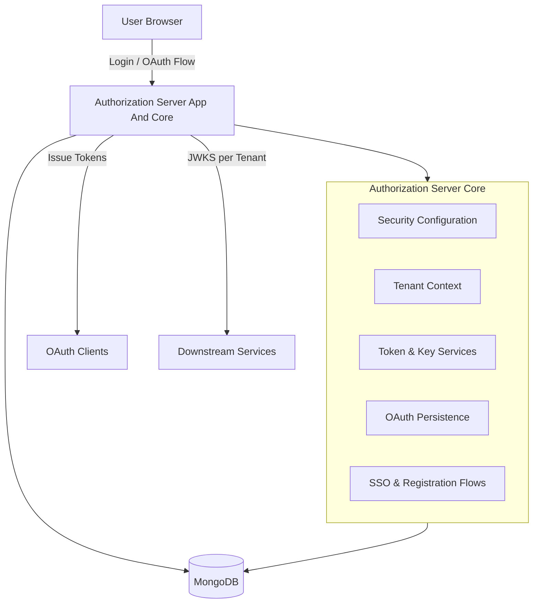
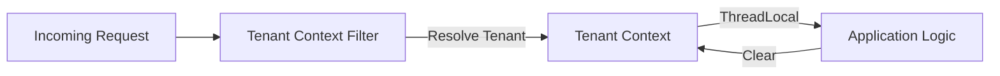
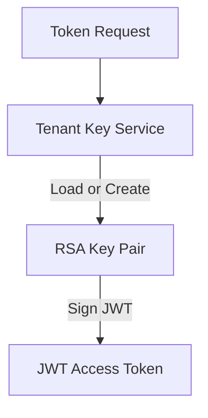
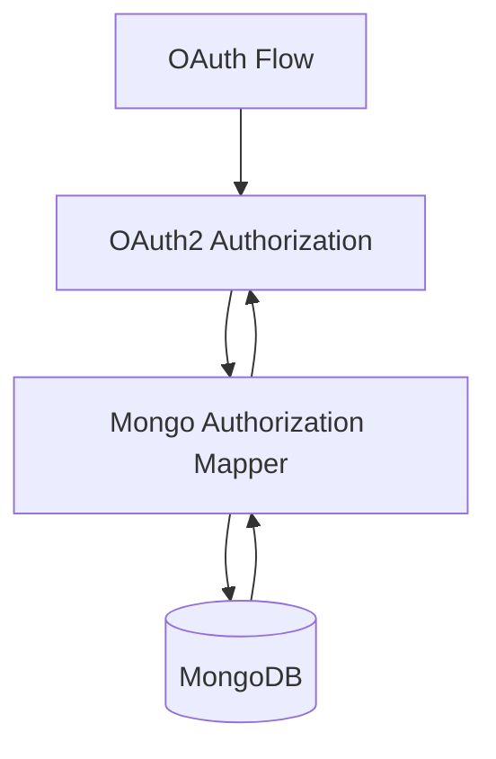
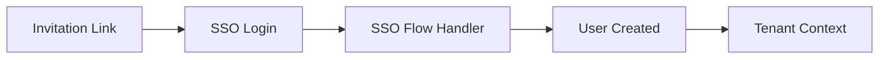

# Authorization Server App And Core

## Overview

The **Authorization Server App And Core** module is the heart of OpenFrame's identity, authentication, and authorization layer. It implements a multi-tenant OAuth 2.1 / OpenID Connect (OIDC) Authorization Server with first-class support for:

- Multi-tenant isolation and tenant-aware security
- OAuth2 Authorization Server (authorization code, refresh tokens, PKCE)
- Per-tenant JWT signing keys and JWKS endpoints
- Username/password authentication and enterprise SSO (Google, Microsoft)
- Tenant onboarding, invitations, and SSO-driven registration flows
- Secure persistence of OAuth clients, authorizations, and tokens

This module is deployed as a standalone Spring Boot service and is consumed by other OpenFrame services such as the API service, Gateway, Frontend BFF, and external clients.

---

## Position in the Platform

The Authorization Server App And Core module acts as the **source of truth for identity and tokens** across the platform:

- Issues access and refresh tokens used by downstream services
- Provides OIDC discovery and JWKS per tenant
- Integrates with MongoDB for OAuth state persistence
- Integrates with shared data, security, and core utility modules

Other services **never implement authentication themselves**; instead, they validate JWTs issued by this service.

---

## High-Level Architecture

---

## Application Entry Point

### OpenFrame Authorization Server Application

The service is bootstrapped by **OpenFrameAuthorizationServerApplication**, which:

- Starts the Spring Boot application
- Enables service discovery
- Scans authorization, core, data, and notification packages

This class defines the **runtime boundary** of the Authorization Server App And Core module.

---

## Core Configuration Layers

### Authorization Server Configuration

The Authorization Server configuration is responsible for enabling OAuth2 and OIDC features.

Key responsibilities:

- Registers OAuth2 Authorization Server endpoints
- Enables OpenID Connect support
- Configures JWT encoding and decoding
- Supports multiple issuers (multi-tenant)

Notable behaviors:

- Authorization Server endpoints are isolated in a dedicated security filter chain
- CSRF is disabled only for OAuth endpoints
- JWT access tokens are issued and validated using tenant-specific keys

---

### Default Security Configuration

The default security configuration governs **all non-OAuth endpoints**, including:

- Login pages
- SSO callbacks
- Tenant discovery and onboarding endpoints

Key features:

- Form-based login for username/password authentication
- OAuth2 login for external identity providers
- Fine-grained permit/deny rules for public endpoints
- Custom authentication success handling

This configuration also injects provider-specific behavior, such as Microsoft multi-tenant issuer validation.

---

## Tenant Awareness and Isolation

### Tenant Context

Multi-tenancy is enforced through a **tenant context** that is resolved for every request.

Responsibilities:

- Stores the active tenant ID in a thread-local context
- Makes tenant information accessible across all layers
- Ensures complete isolation between tenants

### Tenant Context Filter

The tenant context filter:

- Resolves tenant ID from URL paths, query parameters, or session
- Handles safe tenant switching during SSO onboarding
- Invalidates sessions when tenant context changes unexpectedly
- Clears tenant context after request completion

---

## Token Issuance and Customization

### JWT Customization

Access tokens issued by the Authorization Server are customized to include:

- Tenant identifier
- Internal user identifier
- Effective user roles

Behavioral highlights:

- Last login timestamp is updated on refresh token usage
- OWNER roles automatically imply ADMIN privileges

This ensures downstream services can perform **authorization without additional database lookups**.

---

## Tenant-Specific Signing Keys

### Tenant Key Service

Each tenant has its **own RSA signing key pair**.

Key characteristics:

- Keys are generated lazily on first use
- Only one active key is expected per tenant
- Private keys are encrypted before storage
- Keys are exposed via JWKS using tenant resolution

### PEM Utilities and Key Generation

Supporting utilities handle:

- RSA key pair generation
- PEM encoding and decoding
- Safe conversion between stored and runtime formats

---

## OAuth Client Management

### Mongo Registered Client Repository

OAuth clients are persisted in MongoDB and mapped to Spring Authorization Server structures.

Capabilities:

- Supports multiple grant types and authentication methods
- Configures token lifetimes and refresh behavior
- Enables PKCE and consent requirements

This allows dynamic client configuration without redeploying the service.

---

## OAuth Authorization Persistence

### Mongo Authorization Service

All OAuth authorization state is stored in MongoDB, including:

- Authorization codes
- Access and refresh tokens
- PKCE parameters
- Authorization requests

The mapper layer ensures:

- Complete round-trip integrity
- Correct restoration of PKCE parameters
- Compatibility with Spring Authorization Server internals

---

## SSO and Identity Provider Integration

### Dynamic Client Registration

The Authorization Server dynamically resolves OAuth client registrations per tenant.

Features:

- Client configuration loaded at runtime
- Tenant-aware resolution
- Graceful handling of missing or invalid providers

### Provider Strategies

Built-in strategies exist for:

- Google
- Microsoft

Each provider:

- Supplies default client configuration
- Applies provider-specific validation rules
- Integrates with tenant-level SSO configuration

---

## Authentication Success Handling

### Authentication Success Handler

On successful authentication:

- User last login timestamp is updated
- Email verification status may be updated (for trusted IdPs)
- Control is delegated to SSO-specific success handlers

This design ensures **consistent post-login behavior** across all authentication methods.

---

## SSO Registration and Invitation Flows

### Tenant Registration via SSO

Users can create new tenants using SSO providers.

Flow highlights:

- Temporary onboarding tenant context is used
- Tenant is finalized after successful SSO
- Session continuity is preserved across tenant switch

### Invitation-Based Registration

Invited users can:

- Accept invitations using SSO
- Be automatically associated with the correct tenant
- Complete registration without manual passwords

---

## Registration and Lifecycle Hooks

### Registration Processors

The module defines extension points for:

- Tenant registration
- Invitation acceptance
- Automatic user provisioning

Default implementations are **no-ops**, allowing downstream deployments to inject custom business logic without modifying core code.

### User Lifecycle Processors

Hooks also exist for:

- User deactivation
- Email verification events

These processors support compliance, auditing, and external integrations.

---

## Utility Components

### OIDC User Utilities

Helper utilities standardize:

- Email resolution across providers
- Claim normalization

### Reset Token Utility

Secure token generation is used for password reset and recovery flows.

### Redirect and Auth State Utilities

Common helpers manage:

- HTTP redirects
- Session invalidation
- Cookie cleanup

---

## Security Model Summary

The Authorization Server App And Core module enforces a strict security model:

- Tenant isolation at every layer
- Short-lived JWTs with tenant-scoped claims
- Encrypted private key storage
- PKCE enforcement for public clients
- Minimal trust boundaries between services

This design enables OpenFrame to scale securely across many tenants while supporting modern authentication patterns.

---

## When to Extend This Module

You should extend or customize this module when:

- Adding new SSO providers
- Enforcing custom domain or tenant policies
- Integrating with external compliance or audit systems
- Customizing tenant or user lifecycle behavior

For most deployments, the default implementations are sufficient and production-ready.

---

## Summary

The **Authorization Server App And Core** module provides a robust, extensible, and secure foundation for identity and access management across the OpenFrame platform. By combining OAuth2, OIDC, multi-tenancy, and pluggable business logic, it enables both SaaS-scale operation and deep customization without compromising security or maintainability.
