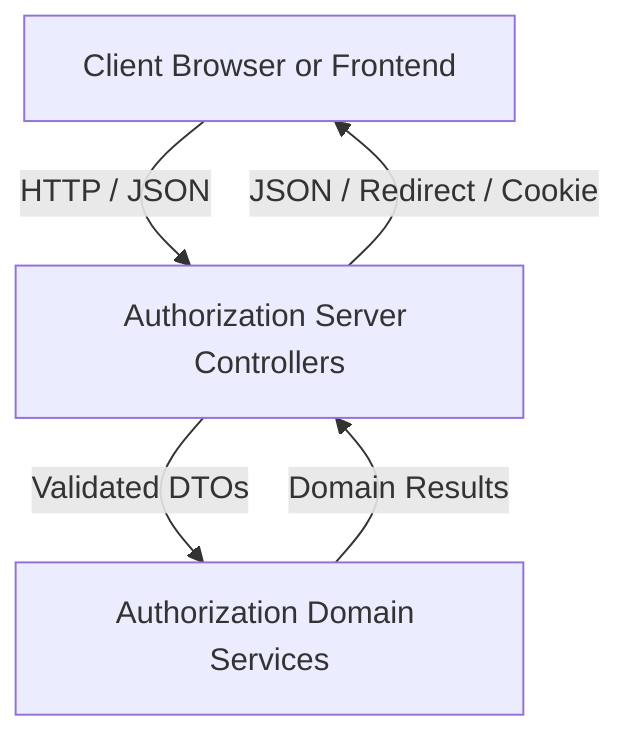
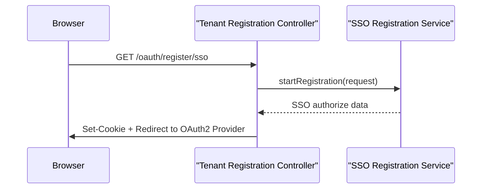

# Authorization Server Controllers And Dtos

## Overview

The **Authorization Server Controllers And Dtos** module defines the public HTTP surface of the OpenFrame Authorization Server for **authentication, tenant onboarding, invitation-based access, SSO discovery, and password recovery**. It consists of Spring MVC / REST controllers and a set of validated Data Transfer Objects (DTOs) that model requests and responses exchanged with frontend and gateway layers.

This module does **not** implement core security, persistence, or SSO logic itself. Instead, it acts as a thin orchestration layer that:

- Exposes well-defined REST endpoints
- Performs input validation and request normalization
- Delegates execution to domain services in the authorization server core
- Manages short-lived cookies and redirects required for OAuth2 and SSO flows

It is a critical boundary between user-facing clients (browser, frontend apps, gateway) and the internal authorization domain.

---

## Architectural Role

Within the overall OpenFrame security architecture, this module sits at the **edge of the Authorization Server**, translating HTTP requests into domain-level commands and returning domain-safe responses.

### Key Responsibilities

- Entry point for login, registration, and discovery flows
- Validation of user input using Jakarta Validation and custom validators
- Coordination of OAuth2 and SSO redirects
- Stateless handling of password reset and invitation acceptance
- Stable API contract via DTOs shared with frontend clients

---

## Controller Layer

The controller layer exposes purpose-driven endpoints, each aligned to a specific phase of the authentication or onboarding lifecycle.

### Invitation Registration Controller

**Purpose:** Handle invitation-based user onboarding, including both password-based and SSO-based acceptance flows.

**Key Endpoints:**

- `POST /invitations/accept`
  - Registers a user using an invitation token
  - Returns an authenticated user representation

- `GET /invitations/accept/sso`
  - Initiates SSO-based invitation acceptance
  - Clears existing auth state
  - Sets a short-lived, secure cookie
  - Redirects to the OAuth2 authorization endpoint

**Notable Characteristics:**

- Uses HTTP-only, secure cookies for SSO continuity
- Relies on redirect-based flow rather than JSON responses
- Explicitly clears previous authentication state to avoid session confusion

---

### Login Controller

**Purpose:** Serve simple server-rendered login and index pages for the multi-tenant authorization server.

**Key Endpoints:**

- `GET /login`
  - Displays the login page
  - Supports error and logout messaging

- `GET /`
  - Displays a basic index page identifying the authorization service

**Notable Characteristics:**

- MVC-style controller (not REST)
- Intended primarily for browser-based login flows
- Keeps UI concerns isolated from REST APIs

---

### Password Reset Controller

**Purpose:** Provide a secure, stateless password reset workflow.

**Key Endpoints:**

- `POST /password-reset/request`
  - Accepts an email address
  - Triggers generation of a reset token
  - Always responds with `202 Accepted` to avoid account enumeration

- `POST /password-reset/confirm`
  - Accepts reset token and new password
  - Enforces strong password validation rules
  - Completes password update

**Security Considerations:**

- Email addresses are normalized to lowercase
- Password complexity is enforced at the DTO level
- No sensitive information is returned in responses

---

### SSO Discovery Controller

**Purpose:** Advertise available SSO providers for different onboarding contexts.

**Key Endpoints:**

- `GET /sso/providers/invite`
  - Returns providers available for a specific invitation
  - Resolves tenant context from invitation

- `GET /sso/providers/registration`
  - Returns default system-wide SSO providers
  - Used during initial tenant registration

**Notable Characteristics:**

- Read-only, side-effect-free endpoints
- Enables dynamic frontend provider selection

---

### Tenant Discovery Controller

**Purpose:** Support returning-user login flows by discovering tenant and authentication options based on email address.

**Key Endpoint:**

- `GET /tenant/discover`
  - Accepts an email address
  - Returns tenant existence and available authentication providers

**Behavior:**

- Normalizes email input
- Logs discovery attempts for observability
- Central to multi-tenant user experience

---

### Tenant Registration Controller

**Purpose:** Handle creation of new tenants using either direct registration or SSO-based onboarding.

**Key Endpoints:**

- `POST /oauth/register`
  - Creates a new tenant and initial user
  - Returns the created tenant entity

- `GET /oauth/register/sso`
  - Initiates SSO-based tenant registration
  - Sets secure, short-lived registration cookie
  - Redirects to OAuth2 authorization endpoint

**Notable Characteristics:**

- Shares redirect-based mechanics with invitation SSO flow
- Explicitly separates direct and SSO-based registration paths

---

## DTO Layer

The DTOs in this module define the **external contract** of the authorization server. They are designed to be:

- Explicit and self-describing
- Strongly validated
- Stable across frontend and backend releases

### Core Request DTOs

- **Invitation Registration Request**
  - Extends a common user request model
  - Includes invitation identifier and optional tenant switch flag

- **Tenant Registration Request**
  - Used for direct (non-SSO) tenant creation
  - Captures tenant name, domain, email, and optional access code

- **SSO Tenant Registration Init Request**
  - Used to bootstrap SSO-based tenant registration
  - Includes provider selection and optional final redirect target

- **SSO Invitation Accept Request**
  - Used to accept invitations via SSO
  - Captures provider, invitation ID, and redirect preferences

---

### Password Reset DTOs

Encapsulated as nested types to keep the reset flow cohesive:

- **Reset Request**
  - Contains validated email address

- **Reset Confirm**
  - Contains reset token and new password
  - Enforces:
    - Minimum length
    - Uppercase and lowercase characters
    - Digits
    - Special characters

---

### Response DTOs

- **Tenant Discovery Response**
  - Indicates whether existing accounts exist
  - Lists available authentication providers

- **Tenant Availability Response**
  - Indicates domain availability
  - Optionally provides suggested alternative domains

These response objects are optimized for frontend decision-making during login and onboarding flows.

---

## End-to-End Flow Example

The following diagram illustrates a common **SSO-based tenant registration flow**:

---

## Summary

The **Authorization Server Controllers And Dtos** module provides a clean, secure, and well-validated HTTP interface for all user-facing authorization workflows in OpenFrame. By strictly separating controllers and DTOs from domain logic, it ensures:

- Clear API contracts
- Strong validation at system boundaries
- Safe orchestration of complex SSO and multi-tenant flows
- Long-term maintainability of the authorization surface

This module should remain thin by design, with all business logic delegated to underlying authorization and tenant services.