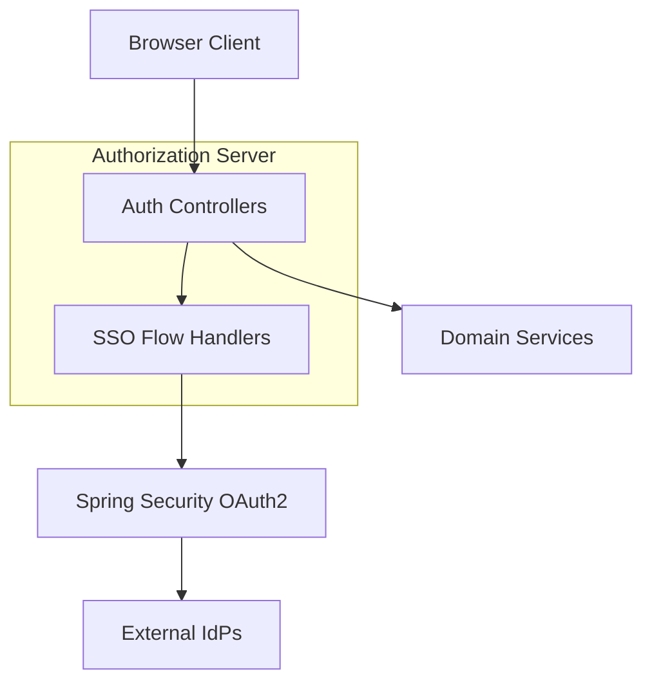
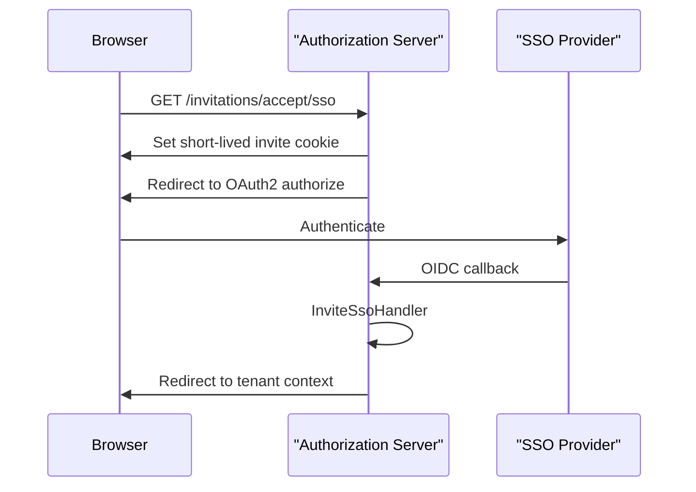

# Authorization Server Controllers and Flows

This module documents the **HTTP controllers and security flow handlers** that implement user login, tenant discovery, invitation-based onboarding, password reset, and SSO-driven tenant and user registration in the OpenFrame Authorization Server.

The module acts as the **entry point for all browser-facing authentication and onboarding flows**, coordinating REST endpoints with Spring Security OAuth2/OIDC and downstream domain services.

---

## Responsibilities

- Expose REST and MVC endpoints for authentication-related UX flows
- Orchestrate **multi-tenant discovery and registration**
- Initiate and complete **SSO-based invitation and tenant registration flows**
- Handle password reset lifecycle
- Bridge HTTP requests with security flow handlers via short-lived cookies

---

## High-Level Architecture

---

## Controllers Overview

### LoginController

**Purpose:**
Provides simple MVC endpoints for rendering login and index pages in a multi-tenant context.

**Endpoints:**
- `GET /login` – Login page with optional error/logout messages
- `GET /` – Landing page

This controller is UI-focused and does not perform authentication itself; it delegates to Spring Security.

---

### TenantDiscoveryController

**Purpose:**
Supports **returning-user flows** by discovering the tenant(s) and authentication methods associated with an email address.

**Endpoint:**
- `GET /tenant/discover`

**Flow:**
1. Normalize email
2. Query tenant discovery service
3. Return tenant and provider metadata

Used heavily by frontend pre-login flows.

---

### SsoDiscoveryController

**Purpose:**
Exposes available SSO providers for:
- Invitation acceptance
- New tenant registration

**Endpoints:**
- `GET /sso/providers/invite`
- `GET /sso/providers/registration`

**Behavior:**
- Invitation-based discovery resolves providers **per tenant**
- Registration discovery returns **system defaults**

---

### InvitationRegistrationController

**Purpose:**
Handles onboarding of users via invitations, supporting both:
- Password-based acceptance
- SSO-based acceptance

**Endpoints:**
- `POST /invitations/accept`
- `GET /invitations/accept/sso`

**SSO Acceptance Flow:**

---

### TenantRegistrationController

**Purpose:**
Handles **new tenant onboarding**, both password-based and SSO-based.

**Endpoints:**
- `POST /oauth/register`
- `GET /oauth/register/sso`

**SSO Registration Characteristics:**
- Clears any existing auth state
- Issues short-lived, HTTP-only cookie
- Redirects into OAuth2 authorization under onboarding context

---

### PasswordResetController

**Purpose:**
Manages password reset lifecycle for local credentials.

**Endpoints:**
- `POST /password-reset/request`
- `POST /password-reset/confirm`

**Flow:**

---

## SSO Flow Handlers

SSO flows are finalized **after OAuth2 authentication** using specialized handlers that read encrypted cookies set during flow initiation.

### InviteSsoHandler

**Purpose:**
Completes invitation-based SSO onboarding.

**Key Actions:**
- Decode invite cookie
- Extract OIDC user attributes
- Register user via invitation
- Clear flow cookie and redirect to tenant

---

### TenantRegSsoHandler

**Purpose:**
Completes SSO-based **tenant registration**.

**Key Actions:**
- Decode tenant registration cookie
- Validate registration context
- Create tenant and admin user
- Redirect into newly created tenant

---

## Cross-Module Interactions

This module depends on:
- **authorization_server_app_and_core** – security configuration, tenant context
- **authorization_server_sso_and_registration_strategies** – SSO providers and processors
- **authorization_server_dtos** – request/response models
- **data_layer_mongo_documents_and_repos** – persistence for users, tenants, invitations

Refer to those modules for implementation details of services and persistence.

---

## Summary

The `authorization_server_controllers_and_flows` module defines the **public authentication surface** of OpenFrame. It cleanly separates:

- HTTP orchestration (controllers)
- Security continuation (SSO handlers)
- Domain logic (services in other modules)

This design enables flexible onboarding flows while keeping security-sensitive logic centralized and auditable.