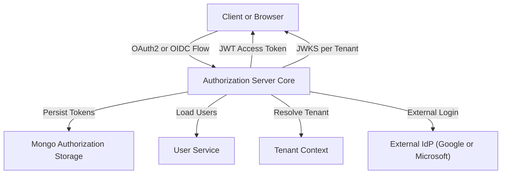
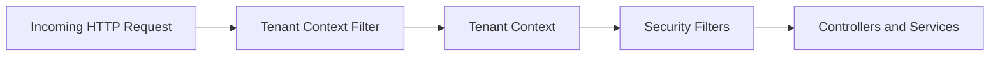
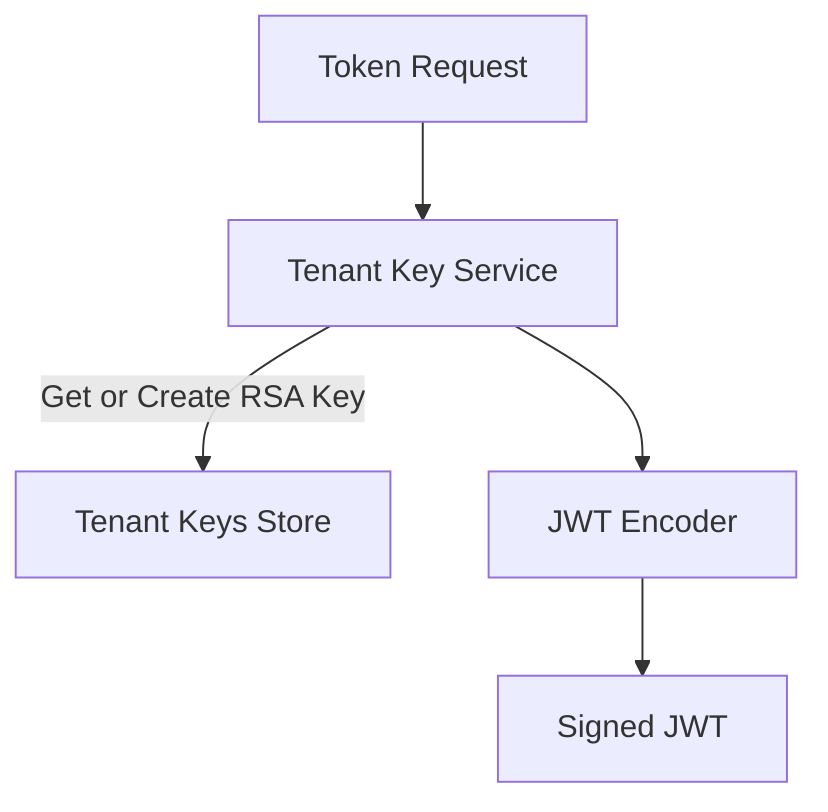
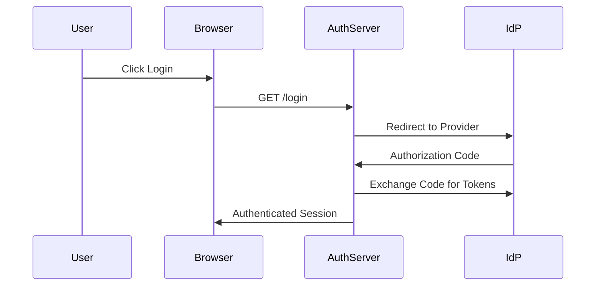
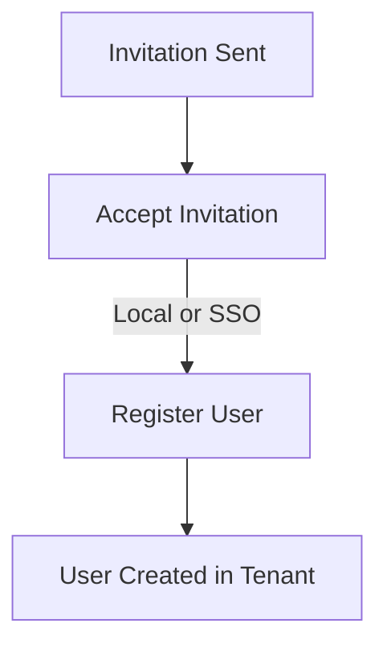

# Authorization Server Core

## Overview

Authorization Server Core is the heart of OpenFrame’s multi-tenant identity and access management. It implements an OAuth2 and OpenID Connect (OIDC) compliant authorization server with strong tenant isolation, dynamic client registration, single sign-on (SSO) onboarding flows, and secure token issuance.

This module is responsible for:
- Acting as the OAuth2 Authorization Server for the platform
- Issuing and validating JWT access and refresh tokens
- Enforcing tenant-aware security boundaries
- Handling user login, password reset, invitations, and tenant registration
- Integrating external identity providers such as Google and Microsoft

Authorization Server Core is designed to be consumed by other platform services (Gateway, API Service, Client Service) and by frontend applications through standardized OAuth2 and OIDC flows.

---

## High-Level Architecture

At a high level, Authorization Server Core sits between clients (browsers, frontend apps, agents) and the rest of the OpenFrame backend. It centralizes authentication, authorization, and identity lifecycle management.

Key characteristics:
- **Multi-tenant by design**: Every request is resolved against a tenant context
- **JWT per tenant**: Each tenant has its own signing key and issuer
- **Pluggable flows**: Invitation, SSO onboarding, and registration flows are extensible

---

## Tenant Resolution and Isolation

### Tenant Context

Tenant isolation is enforced through a request-scoped tenant context. The tenant identifier is resolved early in the request lifecycle and stored in a thread-local context.

Responsibilities:
- Resolve tenant from URL path, query parameter, or session
- Preserve tenant during OAuth2 redirects
- Ensure all downstream services operate within the correct tenant

Core components involved:
- Tenant Context
- Tenant Context Filter

This guarantees that user lookup, token signing, and configuration are always tenant-specific.

---

## Authorization Server Configuration

### OAuth2 and OIDC Setup

Authorization Server Core uses Spring Authorization Server to expose standard OAuth2 and OIDC endpoints, including:
- `/oauth2/authorize`
- `/oauth2/token`
- `/.well-known/openid-configuration`
- `/userinfo`

Key behaviors:
- Multiple issuers are supported (one per tenant)
- CSRF is disabled only for authorization server endpoints
- JWT is used for access tokens

### JWT Signing and JWKS

Each tenant has its own RSA key pair used to sign JWTs. Keys are:
- Generated on-demand
- Stored securely in MongoDB
- Exposed via tenant-specific JWKS endpoints

Custom claims added to access tokens include:
- `tenant_id`
- `userId`
- `roles`

---

## Security Filter Chains

Authorization Server Core defines two distinct security filter chains:

### Authorization Server Filter Chain

Handles OAuth2 and OIDC endpoints only.

Responsibilities:
- Enforce authentication for authorization endpoints
- Act as a resource server for token introspection
- Provide provider-aware authentication entry points

### Default Application Filter Chain

Handles all other endpoints such as login, invitations, and tenant discovery.

Responsibilities:
- Form-based login
- OAuth2 login via external identity providers
- Public access to onboarding and discovery endpoints

---

## Authentication and Login Flows

### Local Authentication

For username and password authentication:
- User details are loaded from the User Service
- Passwords are verified using BCrypt
- Successful login updates the user’s last login timestamp

### OAuth2 and SSO Authentication

External identity providers are integrated using OIDC.

Supported providers:
- Google
- Microsoft (multi-tenant aware)

Key features:
- Dynamic client registration per tenant
- Provider-specific token validation
- Automatic user provisioning when enabled

---

## Registration and Onboarding

### Tenant Registration

Authorization Server Core supports creating new tenants via:
- Direct registration with email and password
- SSO-based tenant onboarding

During SSO registration:
- A temporary onboarding tenant is used
- Context is preserved across redirects
- The real tenant is finalized after successful authentication

### Invitation-Based User Registration

Existing tenants can invite users:
- Invitations are validated before acceptance
- Users can accept invitations using local credentials or SSO
- Tenant switching is handled safely during the flow

---

## Password Reset

Password reset is handled through a secure, token-based mechanism:
- Cryptographically strong reset tokens are generated
- Tokens are time-bound and single-use
- Password complexity is enforced

Flow summary:
1. User requests password reset
2. Reset token is generated and delivered
3. User confirms reset with new password

---

## Authorization Persistence

OAuth2 authorizations and tokens are persisted in MongoDB.

Stored data includes:
- Authorization codes
- Access and refresh tokens
- PKCE parameters
- Token metadata and expiration

This ensures:
- Stateless JWT validation
- Reliable refresh token handling
- Support for PKCE and public clients

---

## Extensibility and Customization

Authorization Server Core is designed to be extensible without forking core logic.

Extension points include:
- Registration processors (pre and post hooks)
- User deactivation processors
- Email verification processors
- SSO client registration strategies

Default implementations are provided and can be overridden by custom beans.

---

## Relationship to Other Modules

Authorization Server Core integrates closely with:
- Data persistence modules for users, tenants, and tokens
- Gateway services that rely on issued JWTs
- Client and API services that consume authenticated identities
- Frontend applications that initiate login and onboarding flows

Rather than duplicating logic, it provides a single source of truth for identity, authentication, and authorization across the OpenFrame platform.

---

## Summary

Authorization Server Core provides a robust, multi-tenant, and extensible identity foundation for OpenFrame. By combining OAuth2, OIDC, tenant-aware security, and flexible SSO flows, it enables secure access for users, services, and integrations across the entire platform.