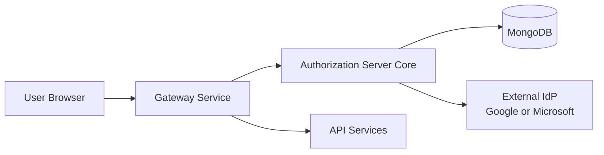
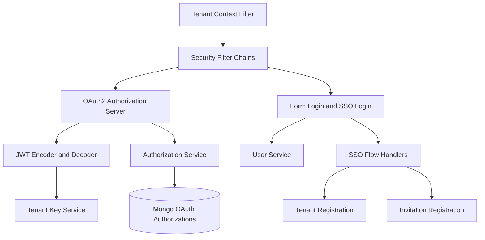
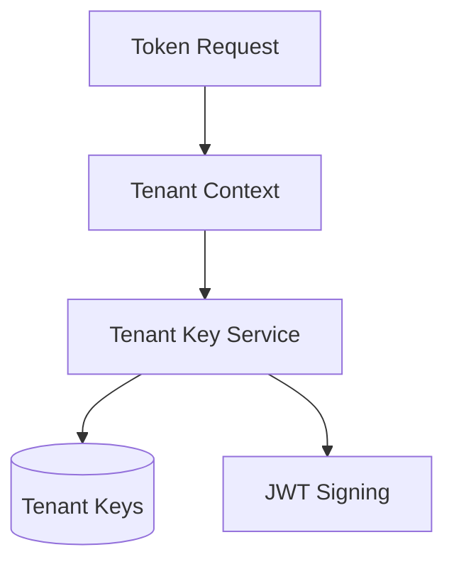
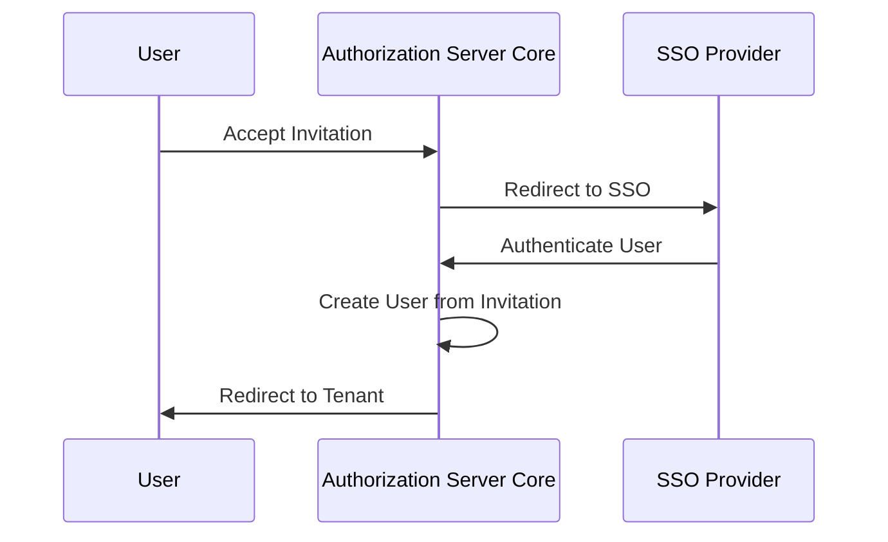

# Authorization Server Core

The **Authorization Server Core** module provides the multi-tenant OAuth 2.1 and OpenID Connect (OIDC) authorization server for the OpenFrame platform. It is responsible for authenticating users, issuing and validating tokens, handling tenant-aware security boundaries, and orchestrating complex authentication flows such as Single Sign-On (SSO), tenant onboarding, and invitation-based registration.

This module is built on **Spring Authorization Server** and **Spring Security**, extended with OpenFrame-specific multi-tenancy, persistence, and SSO automation.

---

## Responsibilities at a Glance

- Multi-tenant OAuth2 and OIDC authorization server
- Per-tenant JWT signing keys and JWKS endpoints
- Username/password and SSO authentication (Google, Microsoft)
- Dynamic OAuth client registration per tenant
- Tenant discovery and onboarding flows
- Invitation-based user registration
- Password reset and email verification support
- Persistent authorization and token storage in MongoDB

---

## Position in the OpenFrame Architecture

The Authorization Server Core sits at the heart of platform security. It is consumed by the API Gateway, frontend clients, and internal services to obtain and validate access tokens.

---

## High-Level Architecture

---

## Core Configuration

### Authorization Server Configuration

The Authorization Server configuration bootstraps Spring Authorization Server with OpenFrame-specific extensions:

- Enables OAuth2 and OIDC endpoints
- Supports multiple issuers for multi-tenant deployments
- Configures JWT encoding and decoding using per-tenant keys
- Customizes issued access tokens with tenant and user claims

Key behaviors:

- **Per-tenant JWKS**: Signing keys are resolved dynamically using the current tenant context
- **Custom JWT claims**: `tenant_id`, `userId`, and effective roles are embedded in access tokens
- **Refresh token handling**: Last-login timestamps are updated on refresh

---

### Default Security Configuration

The default security filter chain applies to non-authorization-server endpoints:

- Public endpoints for login, tenant discovery, SSO, invitations, and onboarding
- Form-based login for username/password authentication
- OAuth2 login for SSO providers
- Microsoft multi-tenant issuer validation support

This configuration ensures that user-facing flows remain accessible while protecting internal endpoints.

---

## Multi-Tenancy Model

Multi-tenancy is enforced through a request-scoped tenant context.

### Tenant Context Resolution

Tenant identifiers can be resolved from:

- URL path prefixes
- Query parameters
- Existing HTTP session attributes

The resolved tenant is stored in a thread-local context and automatically cleared at the end of each request.

---

## OAuth Client Management

### Dynamic Client Registration

OAuth client registrations are resolved dynamically per tenant. Instead of static configuration, client definitions are loaded at runtime based on:

- Current tenant
- Requested SSO provider

This enables:

- Tenant-specific client IDs and secrets
- Per-tenant SSO enablement
- Centralized configuration of default providers

---

## Token Signing and Key Management

### Tenant Key Service

Each tenant has its own RSA signing key pair:

- Keys are generated on-demand
- Only one active key is expected per tenant
- Private keys are encrypted before storage

This approach ensures strong tenant isolation and supports future key rotation strategies.

---

## Authentication Flows

### Username and Password Login

- Uses Spring Security `UserDetailsService`
- Passwords are hashed using BCrypt
- Successful authentication updates last-login timestamps

---

### Single Sign-On (SSO)

Supported providers include:

- Google
- Microsoft

SSO features:

- Dynamic client registration per tenant
- Auto-provisioning of users when enabled
- Domain-based tenant mapping (policy-driven)
- Email verification from trusted identity providers

---

### Invitation-Based Registration

Invitations allow controlled onboarding of users into existing tenants.

Both password-based and SSO-based invitation acceptance are supported.

---

### Tenant Registration and Onboarding

New tenants can be created via:

- Direct registration with email and password
- SSO-based onboarding flows

SSO onboarding temporarily uses a pseudo-tenant until the real tenant is created and activated.

---

## Authorization Persistence

OAuth2 authorizations are persisted in MongoDB, including:

- Authorization codes
- Access tokens
- Refresh tokens
- PKCE parameters

A custom mapper ensures that all OAuth2 state, including PKCE metadata, is faithfully stored and reconstructed.

---

## Extensibility Hooks

The module provides several extension points via conditional beans:

- Registration processors
- User deactivation processors
- Email verification processors
- Global domain policy lookup

These hooks allow integrators to inject custom business logic without modifying core behavior.

---

## Security Considerations

- Strong tenant isolation through context-aware keying and authorization
- Encrypted storage of private signing keys
- Secure cookie handling for SSO flows
- No sensitive secrets exposed in logs or responses

---

## Summary

The **Authorization Server Core** module is the foundation of OpenFrame security. By combining Spring Authorization Server with multi-tenant awareness, dynamic SSO, and extensible onboarding workflows, it enables secure, scalable identity and access management across the entire platform.
