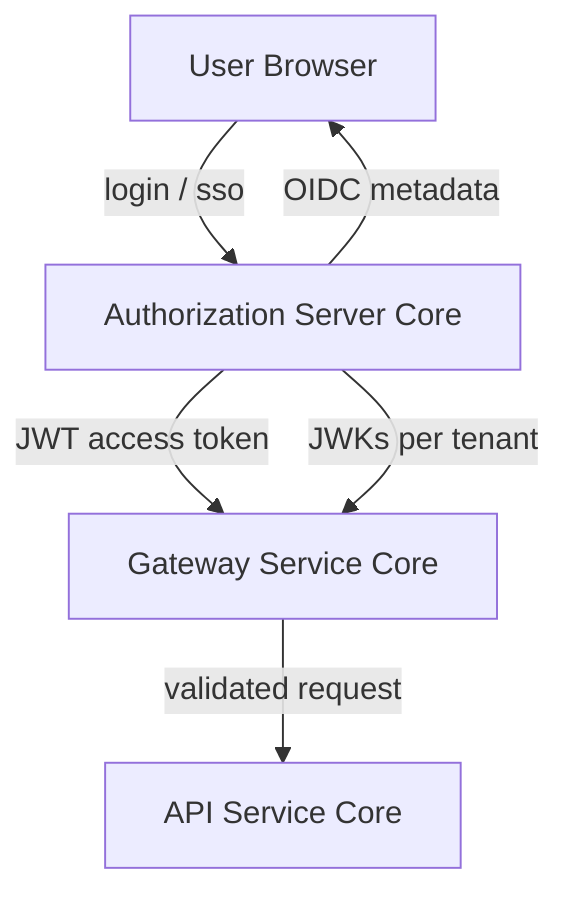
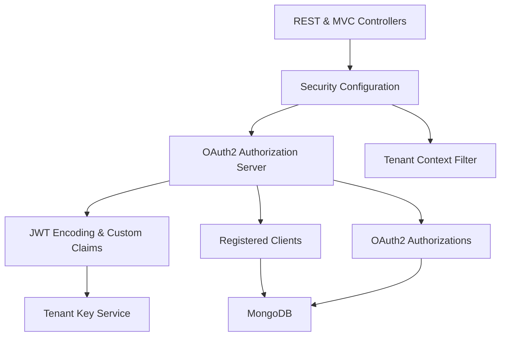
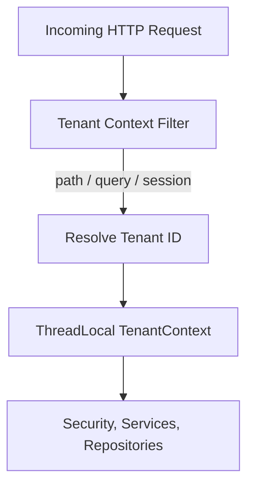
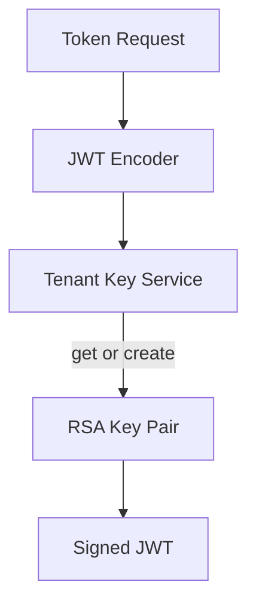
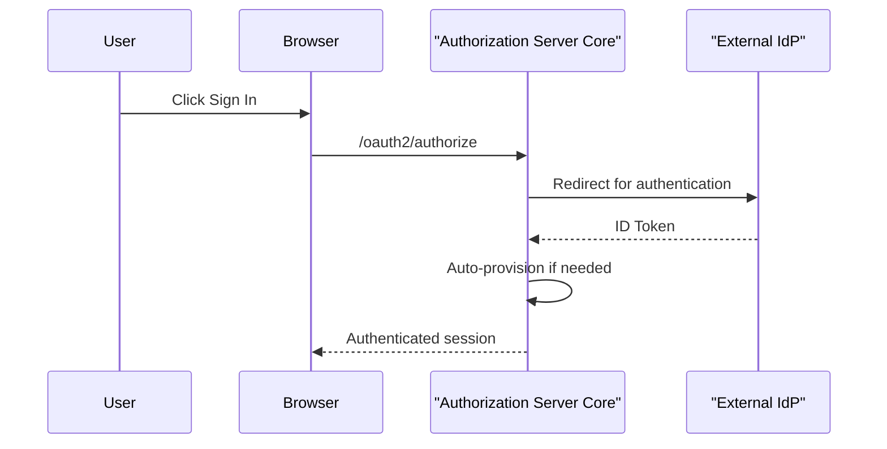
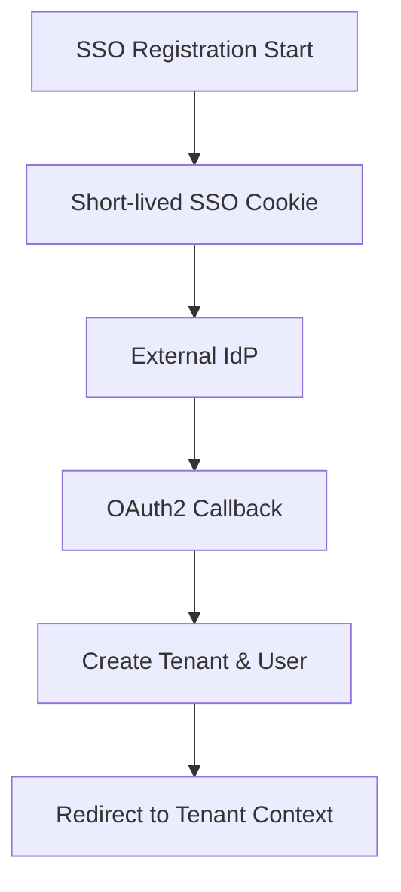
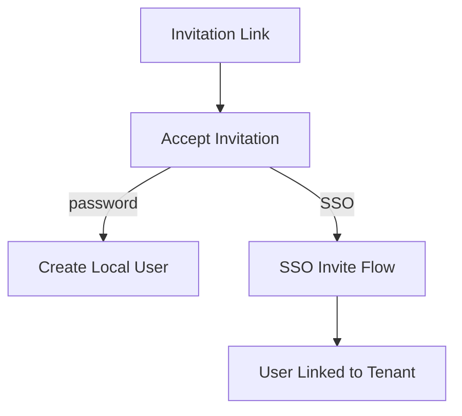

# Authorization Server Core

## Overview

Authorization Server Core is the multi-tenant OAuth2 and OpenID Connect authorization service for the OpenFrame platform. It is responsible for **user authentication**, **tenant-aware token issuance**, **SSO onboarding**, **invitation-based access**, and **secure key management** across all tenants.

This module implements a full **Spring Authorization Server** with deep multi-tenancy support, dynamic client registration, per-tenant signing keys, and extensible SSO flows (Google, Microsoft).

At a high level, Authorization Server Core:

- Acts as the **OAuth2 / OIDC issuer** for all OpenFrame services
- Resolves and enforces **tenant context** for every request
- Issues **tenant-scoped JWTs** with custom claims
- Handles **local login**, **SSO login**, **tenant registration**, and **invitation acceptance**
- Persists OAuth2 authorizations and clients in MongoDB

---

## Position in the OpenFrame Architecture

Authorization Server Core sits at the center of the platform’s security model and is consumed by multiple services:

- **Gateway Service Core** validates issued JWTs and enforces access control
- **API Service Core** relies on tenant and role claims
- **Frontend** uses this service for login, registration, and SSO onboarding

---

## Core Architecture

Authorization Server Core is composed of several tightly integrated layers:

---

## Tenant Context Resolution

Multi-tenancy is enforced through the **Tenant Context**, which is resolved at the very beginning of each request.

### Tenant Context Flow

### Key Components

- **Tenant Context**: Thread-local storage for the active tenant ID
- **Tenant Context Filter**: Extracts tenant ID from:
  - URL path segments
  - Query parameters
  - HTTP session

This guarantees that **all authentication, authorization, and token operations are tenant-scoped**.

---

## OAuth2 and OpenID Connect

Authorization Server Core uses Spring Authorization Server to expose standard OAuth2 and OIDC endpoints:

- Authorization endpoint
- Token endpoint
- UserInfo endpoint
- OIDC discovery (`.well-known`)
- JSON Web Key Sets (JWKS)

### Per-Tenant Issuer and Signing Keys

Each tenant has its **own RSA signing key**, managed automatically.

- Keys are generated on demand
- Private keys are encrypted at rest
- JWKS endpoint serves the **active key for the resolved tenant**

---

## JWT Custom Claims

Issued access tokens include OpenFrame-specific claims:

- `tenant_id`
- `userId`
- `roles`

Roles are automatically expanded (for example, `OWNER` implies `ADMIN`).

Token customization also updates user metadata, such as last login timestamps.

---

## Authentication Models

Authorization Server Core supports multiple authentication paths:

### Local Username and Password

- Backed by `UserDetailsService`
- Passwords are hashed using BCrypt

### OAuth2 / OIDC SSO

- Google
- Microsoft (multi-tenant aware issuer validation)

---

## SSO Auto-Provisioning and Policies

When users authenticate via SSO:

- The system can **auto-provision users** based on:
  - Tenant SSO configuration
  - Allowed email domains
  - Global domain policies

Provisioning behavior is extensible via **Registration Processors**, allowing downstream systems to hook into lifecycle events.

---

## Tenant Registration and Onboarding

Authorization Server Core supports full tenant lifecycle creation.

### Standard Registration

- Email and password based
- Creates tenant, first user, and initial roles

### SSO-Based Registration

An onboarding pseudo-tenant is used during registration to safely complete OAuth flows.

---

## Invitation-Based Registration

Users can be invited to existing tenants.

- Invitations can be accepted via:
  - Password-based registration
  - SSO-based registration

Invitation flows preserve session continuity while securely switching tenant context.

---

## OAuth2 Client and Authorization Persistence

Authorization Server Core persists OAuth2 data in MongoDB:

### Registered Clients

- Stored via a custom Registered Client Repository
- Supports PKCE, refresh tokens, and configurable TTLs

### OAuth2 Authorizations

- Authorization codes
- Access tokens
- Refresh tokens
- PKCE parameters

A dedicated mapper ensures **full fidelity round-tripping** between Spring Security and MongoDB.

---

## Extensibility Hooks

The module is designed for extension without forking:

- **Registration Processor**: tenant and user lifecycle hooks
- **User Deactivation Processor**
- **Email Verified Processor**
- **Global Domain Policy Lookup**

Default implementations are no-ops and can be overridden by downstream services.

---

## Security Considerations

- All cookies are HTTP-only and secure
- Sessions are invalidated on tenant switching
- Private keys are encrypted at rest
- JWT validation supports multi-issuer scenarios

---

## Summary

Authorization Server Core provides a **robust, tenant-aware identity foundation** for OpenFrame. By combining Spring Authorization Server with dynamic tenant resolution, per-tenant cryptography, and extensible SSO flows, it enables secure authentication and authorization across the entire platform.

This module is a critical dependency for every OpenFrame service that requires identity, access control, or secure API communication.
