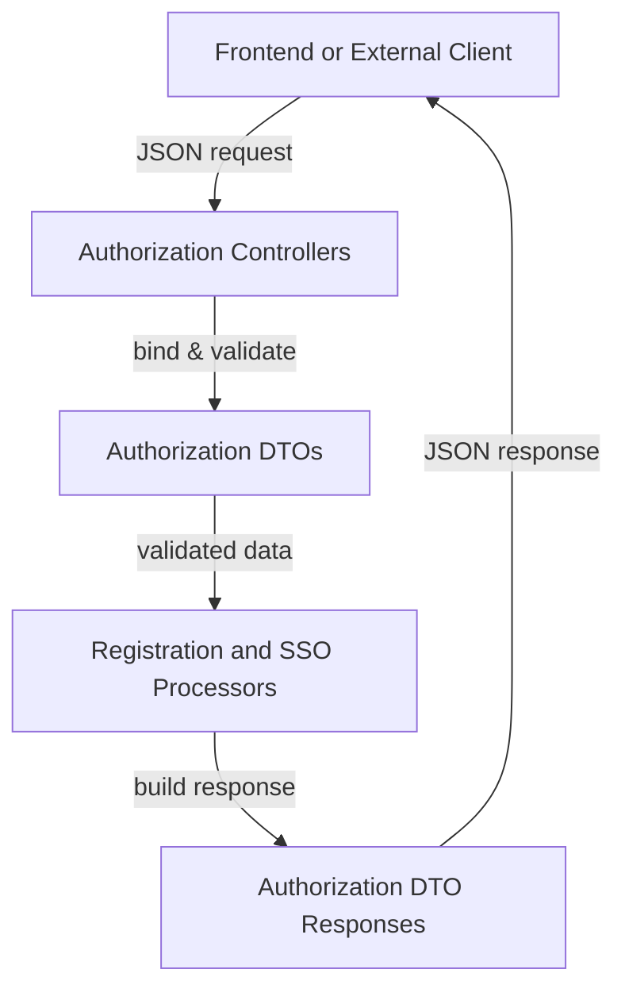

# Authorization Server DTOs

This module contains **Data Transfer Objects (DTOs)** used by the OpenFrame Authorization Server to handle **tenant discovery, tenant registration, invitations, SSO onboarding, and password reset flows**.

These DTOs define the validated request and response payloads exchanged between:
- Authorization server controllers and security flows
- Frontend clients and external identity providers
- Tenant discovery and multi-tenant onboarding logic

The module is intentionally free of business logic and persistence concerns. Its sole responsibility is **schema definition and validation**.

---

## Scope and Responsibilities

The `authorization_server_dtos` module is responsible for:

- Defining request payloads for:
  - Tenant registration (standard and SSO)
  - Invitation-based onboarding
  - Password reset workflows
- Defining response payloads for:
  - Tenant discovery
  - Tenant domain availability checks
- Enforcing **input validation** using Jakarta Validation and OpenFrame custom validators

This module is consumed primarily by:
- Authorization server controllers and flows
- SSO registration and invitation handlers

---

## High-Level Architecture

---

## DTO Groups

The module can be logically divided into the following sub-modules:

- **Invitation and Registration DTOs**
- **SSO Registration and Acceptance DTOs**
- **Tenant Discovery and Availability DTOs**
- **Password Reset DTOs**

Each group is documented in its own file for clarity.

---

## Sub-Module Documentation

- [Invitation and Tenant Registration DTOs](authorization_server_dtos_registration.md)
- [SSO Registration and Invitation DTOs](authorization_server_dtos_sso.md)
- [Tenant Discovery and Availability DTOs](authorization_server_dtos_tenant_discovery.md)
- [Password Reset DTOs](authorization_server_dtos_password_reset.md)

---

## Validation Strategy

All DTOs rely on:

- **Jakarta Bean Validation** (`@NotBlank`, `@Pattern`, `@Size`)
- **Custom OpenFrame validators**:
  - `@ValidEmail`
  - `@TenantDomain`

Validation failures are handled upstream by controller advice and security filters in the authorization server.

---

## Design Notes

- DTOs are immutable from a consumer perspective
- Lombok annotations (`@Data`, `@Builder`) reduce boilerplate
- Nested DTOs are used sparingly (for example, password reset flows)
- No DTO contains persistence or service-layer references

---

## Related Modules

This module is tightly coupled with:
- Authorization server controllers and flows
- Authorization server SSO and registration strategies

See the platform documentation for details on controller behavior and security flows.
