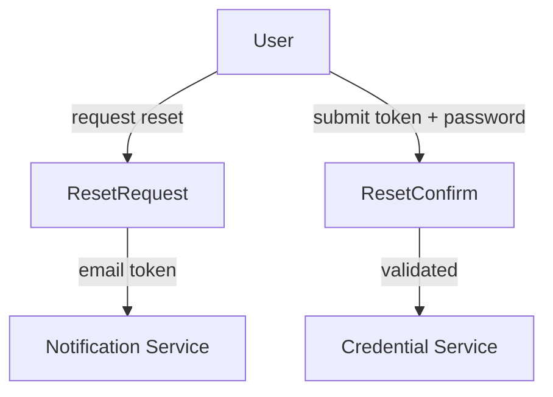

# Password Reset DTOs

This document covers DTOs used for **password reset initiation and confirmation** within the OpenFrame Authorization Server.

---

## Included DTOs

- `PasswordResetDtos.ResetRequest`
- `PasswordResetDtos.ResetConfirm`

These DTOs are defined as nested classes within `PasswordResetDtos`.

---

## ResetRequest

Used to initiate a password reset flow.

### Purpose

- Capture user email
- Trigger reset token generation and delivery

### Fields

| Field | Type | Required | Description |
|------|------|----------|-------------|
| `email` | String | ✅ | Email address associated with the account |

### Validation

- Must be a valid email address

---

## ResetConfirm

Used to confirm a password reset using a previously issued token.

### Purpose

- Validate reset token
- Enforce password strength requirements

### Fields

| Field | Type | Required | Description |
|------|------|----------|-------------|
| `token` | String | ✅ | Password reset token |
| `newPassword` | String | ✅ | New password value |

### Password Policy

The `newPassword` field must:

- Be at least 8 characters long
- Contain at least:
  - One uppercase letter
  - One lowercase letter
  - One digit
  - One special character

This policy is enforced via a regular expression at validation time.

---

## Password Reset Flow

---

## Design Considerations

- No password data is persisted in DTOs
- Strong validation reduces attack surface
- Token semantics are handled outside this module
