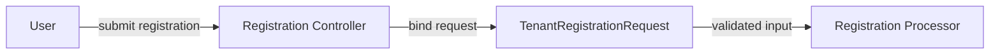

# Invitation and Tenant Registration DTOs

This document describes DTOs used for **invitation-based onboarding** and **standard tenant registration** in the OpenFrame Authorization Server.

These DTOs are consumed by registration and invitation controllers and processors.

---

## Included DTOs

- `InvitationRegistrationRequest`
- `TenantRegistrationRequest`

---

## InvitationRegistrationRequest

Used when a user completes registration via an **invitation link**.

### Purpose

- Bind invitation metadata to a user registration request
- Optionally allow switching tenants during onboarding

### Fields

| Field | Type | Required | Description |
|------|------|----------|-------------|
| `invitationId` | String | ✅ | Identifier of the invitation being accepted |
| `switchTenant` | Boolean | ❌ | Whether the user should switch context to the invited tenant |

This DTO **extends `CoreUserRequest`**, inheriting user identity and credential fields defined at the authorization core layer.

### Validation

- `invitationId` must be non-empty

---

## TenantRegistrationRequest

Used for **standard multi-tenant user registration** when creating or joining a tenant without SSO.

### Purpose

- Register a new user
- Create or associate with a tenant
- Validate tenant naming and domain rules

### Fields

| Field | Type | Required | Description |
|------|------|----------|-------------|
| `email` | String | ✅ | User email address |
| `tenantName` | String | ✅ | Organization or tenant display name |
| `tenantDomain` | String | ❌ | Tenant domain identifier |
| `accessCode` | String | ❌ | Optional registration access code |

### Validation

- `email` must be a valid email address
- `tenantName` must match the allowed organization name pattern
- `tenantDomain` must pass tenant domain validation rules

---

## Registration Flow Context

---

## Design Considerations

- Tenant creation is conditional and handled outside the DTO
- Domain and naming constraints are enforced early via validation
- DTOs remain agnostic of tenant persistence logic
