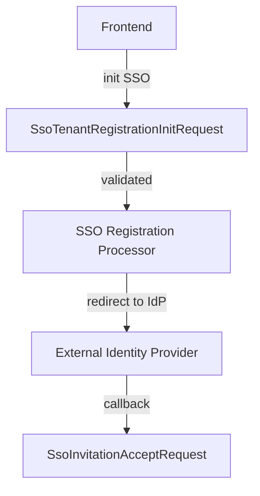

# SSO Registration and Invitation DTOs

This document covers DTOs used during **Single Sign-On (SSO)** based tenant registration and invitation acceptance flows.

These DTOs enable coordination between frontend clients, identity providers, and authorization server SSO processors.

---

## Included DTOs

- `SsoTenantRegistrationInitRequest`
- `SsoInvitationAcceptRequest`

---

## SsoTenantRegistrationInitRequest

Initial payload used to **start SSO-based tenant registration**.

### Purpose

- Capture user identity and tenant intent before redirecting to an external IdP
- Validate tenant metadata prior to SSO initiation

### Fields

| Field | Type | Required | Description |
|------|------|----------|-------------|
| `email` | String | ✅ | User email address |
| `accessCode` | String | ❌ | Optional access or invitation code |
| `tenantName` | String | ✅ | Organization name |
| `tenantDomain` | String | ❌ | Tenant domain identifier |
| `provider` | String | ✅ | SSO provider identifier |
| `redirectTo` | String | ❌ | Final redirect target after SSO completion |

### Validation

- `email` must be valid and non-empty
- `tenantName` must follow organization naming rules
- `tenantDomain` must be valid when provided
- `provider` must be non-empty

---

## SsoInvitationAcceptRequest

Used when accepting an **invitation via an SSO provider**.

### Purpose

- Bind invitation context to an SSO authentication attempt
- Support tenant switching and post-auth redirects

### Fields

| Field | Type | Required | Description |
|------|------|----------|-------------|
| `invitationId` | String | ✅ | Invitation identifier |
| `provider` | String | ✅ | SSO provider identifier |
| `switchTenant` | Boolean | ❌ | Whether to switch tenant context |
| `redirectTo` | String | ❌ | Final redirect destination |

---

## SSO Onboarding Flow

---

## Design Considerations

- DTOs do not encode provider-specific logic
- Redirect targets are validated upstream
- Invitation and registration flows share common SSO infrastructure
