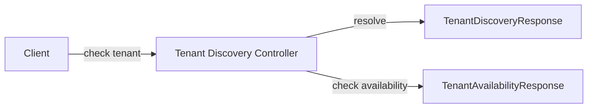

# Tenant Discovery and Availability DTOs

This document describes response DTOs used to **discover tenant context** and **check tenant domain availability** during authentication and onboarding.

---

## Included DTOs

- `TenantDiscoveryResponse`
- `TenantAvailabilityResponse`

---

## TenantDiscoveryResponse

Returned when resolving tenant and authentication options for a given email address.

### Purpose

- Indicate whether the email is associated with existing tenants
- Expose available authentication providers
- Support smart login and registration routing

### Fields

| Field | Type | Description |
|------|------|-------------|
| `email` | String | Email address queried |
| `hasExistingAccounts` | Boolean | Indicates existing tenant memberships |
| `tenantId` | String | Resolved tenant identifier |
| `authProviders` | List<String> | Available authentication providers |

### JSON Mapping Notes

- Uses explicit JSON property names for frontend compatibility

---

## TenantAvailabilityResponse

Returned when checking whether a tenant domain is available during registration.

### Purpose

- Prevent domain collisions
- Provide user-friendly alternatives

### Fields

| Field | Type | Description |
|------|------|-------------|
| `isAvailable` | Boolean | Whether the domain is available |
| `suggestedUrl` | List<String> | Suggested alternative domains |

Null fields are omitted from the JSON response.

---

## Tenant Discovery Flow

---

## Design Considerations

- Responses are optimized for frontend decision-making
- DTOs avoid leaking internal tenant metadata
- Suggested domains are optional and contextual
