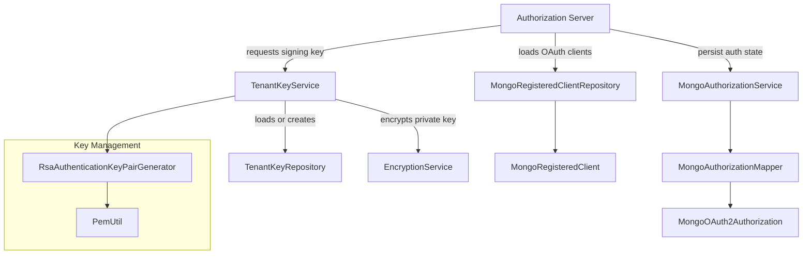

# Authorization Server – Keys and Persistence

## Overview

The **authorization_server_keys_and_persistence** module is responsible for cryptographic key management and OAuth2 authorization persistence within the OpenFrame Authorization Server. It underpins secure token issuance, tenant-isolated signing keys, dynamic OAuth client storage, and durable authorization state handling (including PKCE).

This module integrates tightly with:
- The **Authorization Server application and security configuration** (key material consumption)
- The **MongoDB data layer** (persistent storage of keys, clients, and authorizations)
- The **Security / OAuth infrastructure** (Spring Authorization Server, Nimbus JOSE/JWT)

Its responsibilities can be grouped into three areas:
1. **Tenant-scoped signing key lifecycle**
2. **OAuth2 Registered Client persistence**
3. **OAuth2 Authorization persistence with PKCE support**

---

## Architecture Overview

---

## Core Responsibilities

### 1. Tenant Signing Keys

Each tenant has its own RSA key pair used to sign JWT access and ID tokens. Keys are:
- Generated on demand
- Persisted in MongoDB
- Scoped per tenant
- Rotatable by marking keys inactive

The active key is exposed as a **Nimbus `RSAKey`** for seamless integration with Spring Authorization Server.

See: [Tenant Key Management](Tenant Key Management.md)

---

### 2. OAuth2 Registered Client Persistence

OAuth2 clients (frontend apps, gateways, integrations) are stored in MongoDB instead of in-memory configuration. This allows:
- Dynamic client registration
- Multi-tenant client isolation
- Runtime configuration updates

Spring Security’s `RegisteredClientRepository` abstraction is backed by MongoDB.

See: [Registered Client Persistence](Registered Client Persistence.md)

---

### 3. OAuth2 Authorization Persistence (PKCE-aware)

Authorization codes, access tokens, refresh tokens, and PKCE metadata are persisted to MongoDB. This ensures:
- Stateless Authorization Server instances
- Proper PKCE validation across restarts
- Debuggable and auditable OAuth flows

Special care is taken to correctly store and rehydrate PKCE parameters.

See: [Authorization Persistence](Authorization Persistence.md)

---

## How This Module Fits Into the System

- **Upstream**: Used by authorization server controllers and security flows to issue and validate tokens
- **Downstream**: Persists data to MongoDB via repositories defined in the data layer
- **Cross-cutting**: Relies on encryption services and tenant context resolution

This module does not expose HTTP endpoints directly; it is a **foundational infrastructure layer**.

---

## Summary

The **authorization_server_keys_and_persistence** module provides:

- ✅ Secure, tenant-isolated RSA signing keys
- ✅ Encrypted private key storage
- ✅ Mongo-backed OAuth2 client registry
- ✅ Durable OAuth2 authorization and PKCE persistence

Together, these capabilities enable a horizontally scalable, multi-tenant authorization server with strong cryptographic guarantees.
