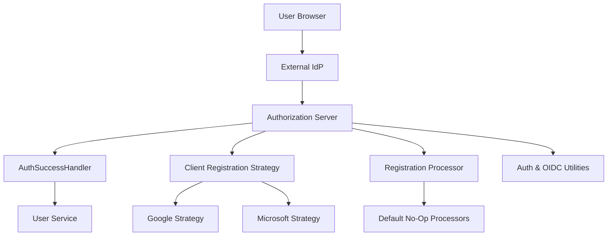

# Authorization Server – SSO and Registration Strategies

This module implements **Single Sign-On (SSO)** integration and **user/tenant registration strategies** for the OpenFrame Authorization Server. It defines how external Identity Providers (IdPs) such as **Google** and **Microsoft** are registered dynamically, how SSO-driven onboarding flows are handled, and how post-authentication and post-registration lifecycle hooks are executed.

The module is designed to be **extensible by default**: most behaviors are provided as conditional, no-op implementations that can be overridden by downstream deployments without forking the core authorization service.

---

## Responsibilities

At a high level, this module is responsible for:

- Executing **SSO client registration strategies** per provider (Google, Microsoft)
- Providing **default IdP configuration** for SSO onboarding
- Handling **authentication success events** and preserving SSO-specific flows
- Managing **SSO onboarding and invitation state** via cookies and constants
- Offering **extension points** for registration, deactivation, and verification workflows
- Supplying shared **utilities** for OIDC claims, reset tokens, auth state cleanup, and redirects

---

## Position in the Overall System

This module sits inside the **Authorization Server** and collaborates closely with:

- `authorization_server_app_and_core` – core auth server bootstrapping and security
- `authorization_server_controllers_and_flows` – login, invitation, tenant registration flows
- `authorization_server_keys_and_persistence` – OAuth clients, tokens, and key material
- `api_service_processors_and_user_services` – downstream user lifecycle handling

It does **not** expose REST endpoints itself; instead, it is invoked by Spring Security, OAuth2/OIDC flows, and controller-level orchestration.

---

## Architecture Overview

---

## High-Level Component Groups

### 1. Authentication Success Handling

- **`AuthSuccessHandler`**
  - Updates last-login timestamps
  - Optionally marks email addresses as verified for trusted IdPs
  - Delegates to SSO-specific success handlers to preserve onboarding flows

See: [Authentication Success Handling](Authentication Success Handling.md)

---

### 2. SSO Client Registration Strategies

- **`GoogleClientRegistrationStrategy`**
- **`MicrosoftClientRegistrationStrategy`**

These strategies dynamically construct OAuth2/OIDC client registrations per tenant using provider-specific defaults and persisted SSO configuration.

See: [SSO Client Registration Strategies](SSO Client Registration Strategies.md)

---

### 3. Default SSO Provider Configuration

- **`GoogleDefaultProviderConfig`**
- **`MicrosoftDefaultProviderConfig`**

Provide fallback client IDs and secrets for onboarding and development scenarios.

See: [Default SSO Provider Configuration](Default SSO Provider Configuration.md)

---

### 4. Registration and Lifecycle Processors

These processors define extension points for reacting to user and tenant lifecycle events:

- `DefaultRegistrationProcessor`
- `DefaultUserDeactivationProcessor`
- `DefaultUserEmailVerifiedProcessor`

All are **conditional no-op implementations** and intended to be overridden.

See: [Registration and Lifecycle Processors](Registration and Lifecycle Processors.md)

---

### 5. Policies, Constants, and Utilities

- **Policies**: `NoopGlobalDomainPolicyLookup`
- **Constants**: `SsoRegistrationConstants`
- **Utilities**:
  - `OidcUserUtils`
  - `ResetTokenUtil`
  - `AuthStateUtils`
  - `Redirects`

These provide shared, reusable behavior across SSO and registration flows.

See: [SSO Utilities and Constants](SSO Utilities and Constants.md)

---

## Extensibility Model

This module heavily relies on Spring Boot’s `@ConditionalOnMissingBean` pattern:

- You can **replace any default processor** by defining your own bean
- You can **add new SSO providers** by implementing additional client registration strategies
- You can **enforce domain policies** by supplying a real `GlobalDomainPolicyLookup`

This allows OpenFrame to support SaaS, self-hosted, and enterprise deployments with minimal friction.

---

## Summary

The `authorization_server_sso_and_registration_strategies` module provides the **policy, strategy, and extension backbone** for SSO-driven authentication and onboarding in OpenFrame. It ensures:

- Secure, provider-aware SSO flows
- Clean separation between core auth logic and business customization
- Safe defaults with powerful override points

Together with the surrounding authorization server modules, it enables OpenFrame to support multi-tenant, enterprise-grade identity workflows.