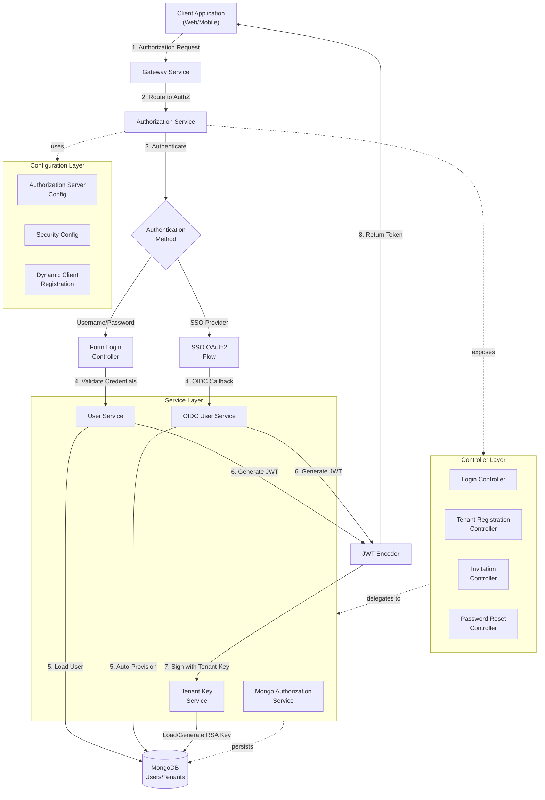
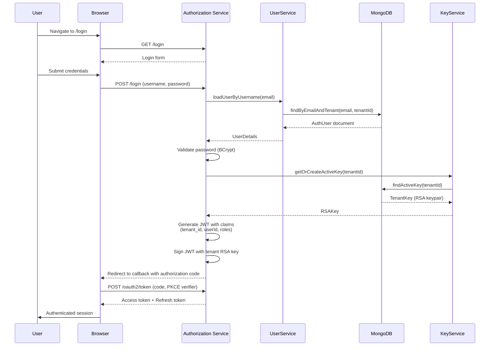
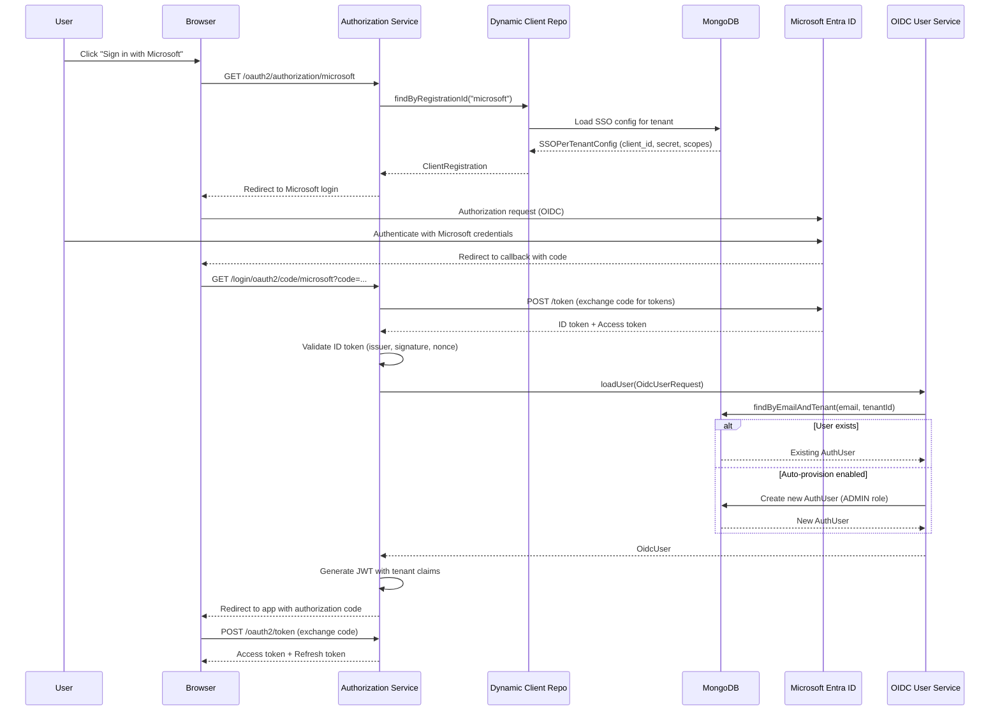
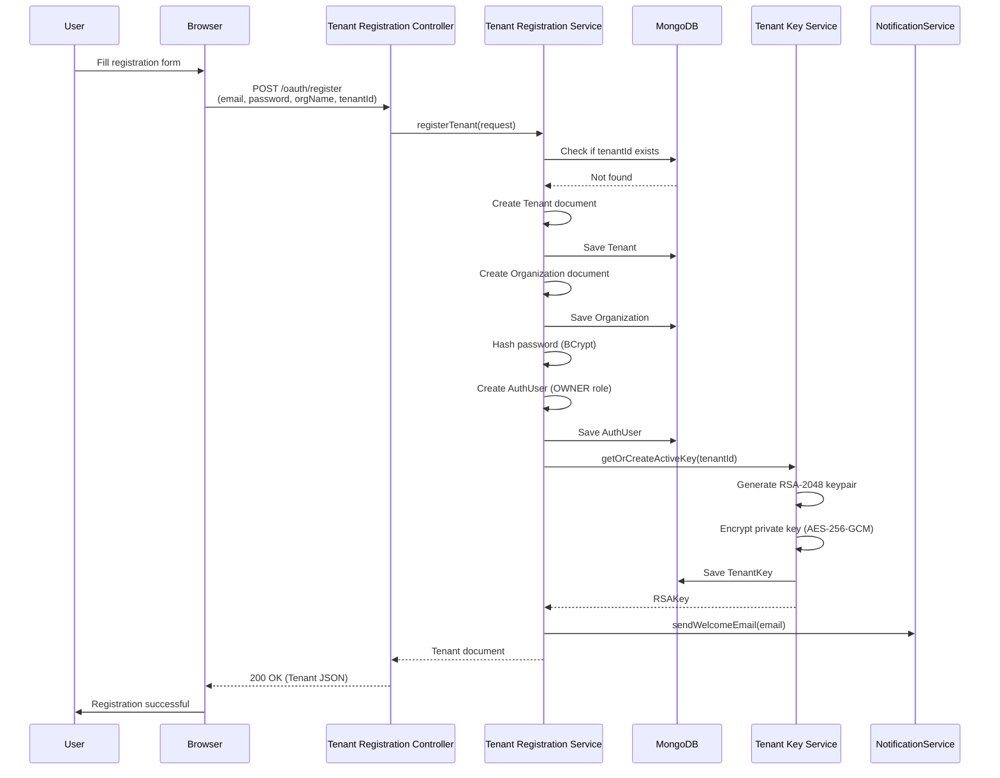
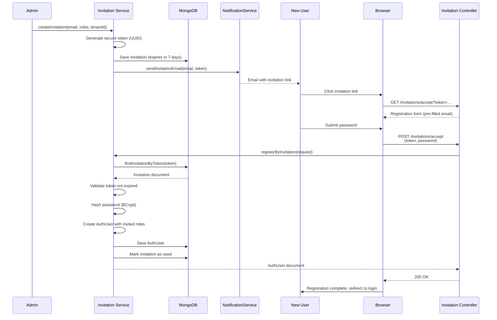

# Authorization Service

## Overview

The **Authorization Service** is OpenFrame's OAuth 2.0/OIDC-compliant multi-tenant authorization server built on Spring Authorization Server. It provides centralized authentication, authorization, and identity management for the entire OpenFrame platform, supporting both traditional username/password authentication and enterprise SSO integration (Microsoft Entra ID, Google Workspace, etc.).

### Key Capabilities

- **Multi-Tenant OAuth 2.0/OIDC Server**: Isolated authorization contexts per tenant with tenant-specific signing keys
- **Enterprise SSO Integration**: Dynamic OIDC client registration for Microsoft, Google, and custom providers
- **User Lifecycle Management**: Registration, invitation-based onboarding, password reset, and auto-provisioning
- **Tenant-Specific JWT Signing**: RSA key pairs per tenant with automatic key generation and rotation support
- **PKCE Support**: Enhanced security for public clients (SPAs, mobile apps)
- **Dynamic Client Registration**: Runtime SSO provider configuration without service restart

### Architecture Position

The Authorization Service sits at the entry point of the OpenFrame platform, working in conjunction with:

- **[Gateway Service](gateway_service.md)**: Validates JWT tokens issued by this service
- **[API Service](api_service.md)**: Consumes user identity and tenant context from JWT claims
- **[Data Layer (Mongo)](data_layer_mongo.md)**: Stores users, tenants, OAuth authorizations, and SSO configurations
- **Frontend Applications**: Receive OAuth tokens for authenticated API access

---

## Architecture Overview



---

## Core Components

### 1. Configuration Layer

The configuration layer establishes the OAuth 2.0 authorization server and security policies.

#### [AuthorizationServerConfig](authorization_service_configuration.md#authorizationserverconfig)

**Purpose**: Configures Spring Authorization Server with multi-tenant support and custom JWT claims.

**Key Responsibilities**:
- OAuth 2.0 endpoint configuration (authorize, token, introspection, revocation)
- OIDC discovery endpoint (`/.well-known/openid-configuration`)
- Multi-issuer support for tenant-specific issuers
- JWT encoder/decoder with tenant-aware JWK source
- Custom token claims injection (tenant_id, userId, roles)
- User authentication via `UserDetailsService`

**Key Beans**:
- `authorizationServerSecurityFilterChain`: OAuth 2.0 endpoint security
- `jwkSource`: Tenant-specific RSA key provider
- `jwtEncoder`/`jwtDecoder`: JWT token handling
- `tokenCustomizer`: Adds custom claims to access tokens
- `userDetailsService`: Loads users from MongoDB
- `authenticationManager`: Programmatic authentication support

#### [SecurityConfig](authorization_service_configuration.md#securityconfig)

**Purpose**: Configures security for non-OAuth endpoints (login, registration, SSO callbacks).

**Key Responsibilities**:
- Form-based login configuration
- OAuth2 client login (SSO) with OIDC
- Auto-provisioning users from SSO providers
- Microsoft Entra ID multi-tenant issuer validation
- Public endpoint access (registration, password reset, health checks)

**Key Features**:
- Custom `OidcUserService` for SSO user auto-provisioning
- Domain-based tenant resolution for SSO
- Microsoft-specific JWT decoder with issuer pattern validation
- Preferred principal claim resolution (email, preferred_username, upn, sub)

#### [DynamicClientRegistrationRepository](authorization_service_configuration.md#dynamicclientregistrationrepository)

**Purpose**: Dynamically loads OAuth2 client registrations for SSO providers at runtime.

**Key Responsibilities**:
- Resolves tenant context from session or `TenantContext`
- Loads SSO provider configurations from MongoDB
- Builds `ClientRegistration` objects for Spring Security OAuth2 client

**Integration**: Works with `DynamicClientRegistrationService` to fetch tenant-specific SSO configs.

**See**: [Configuration Layer Documentation](authorization_service_configuration.md)

---

### 2. Controller Layer

REST controllers expose authentication and user management endpoints.

#### [LoginController](authorization_service_controllers.md#logincontroller)

**Purpose**: Serves login page and handles login errors/logout messages.

**Endpoints**:
- `GET /login`: Login page with error/logout message support
- `GET /`: Index page with service information

#### [TenantRegistrationController](authorization_service_controllers.md#tenantregistrationcontroller)

**Purpose**: Handles new tenant registration via username/password or SSO.

**Endpoints**:
- `POST /oauth/register`: Register tenant with email/password
- `GET /oauth/register/sso`: Initiate SSO-based tenant registration

**Flow**:
1. Client initiates registration with tenant details
2. Service creates tenant, owner user, and default organization
3. For SSO: Sets registration cookie and redirects to SSO provider
4. On SSO callback: Completes registration with SSO user info

#### [InvitationRegistrationController](authorization_service_controllers.md#invitationregistrationcontroller)

**Purpose**: Handles user registration via email invitation.

**Endpoints**:
- `POST /invitations/accept`: Accept invitation with password
- `GET /invitations/accept/sso`: Accept invitation via SSO

**Flow**:
1. User receives invitation email with token
2. User submits token + password (or initiates SSO)
3. Service validates invitation, creates user, assigns roles
4. User can immediately log in

#### [PasswordResetController](authorization_service_controllers.md#passwordresetcontroller)

**Purpose**: Handles password reset flow.

**Endpoints**:
- `POST /password-reset/request`: Request reset token via email
- `POST /password-reset/confirm`: Confirm reset with token + new password

**Flow**:
1. User requests reset with email
2. Service generates time-limited token, sends email
3. User submits token + new password
4. Service validates token, updates password hash

**See**: [Controller Layer Documentation](authorization_service_controllers.md)

---

### 3. Service Layer

Business logic for authentication, authorization, and key management.

#### [MongoAuthorizationService](authorization_service_services.md#mongoauthorizationservice)

**Purpose**: Implements `OAuth2AuthorizationService` to persist OAuth 2.0 authorizations in MongoDB.

**Key Responsibilities**:
- Save/retrieve OAuth 2.0 authorization codes, access tokens, refresh tokens
- PKCE parameter preservation (code_challenge, code_verifier)
- Token lookup by value and type
- Authorization cleanup on token revocation

**Storage**: Uses `MongoOAuth2AuthorizationRepository` to store `MongoOAuth2Authorization` documents.

#### [TenantKeyService](authorization_service_services.md#tenantkeyservice)

**Purpose**: Manages RSA key pairs for tenant-specific JWT signing.

**Key Responsibilities**:
- Generate RSA-2048 key pairs on first tenant creation
- Store public key as PEM, private key encrypted with `EncryptionService`
- Retrieve active signing key for JWT encoding
- Support key rotation (future: mark old keys inactive, generate new)

**Security**:
- Private keys encrypted at rest using AES-256-GCM
- Each tenant has isolated signing keys (prevents cross-tenant token forgery)
- Key ID (kid) included in JWT header for key rotation support

**See**: [Service Layer Documentation](authorization_service_services.md)

---

### 4. Application Entry Point

#### [OpenFrameAuthorizationServerApplication](authorization_service_application.md)

**Purpose**: Spring Boot application entry point.

**Configuration**:
- `@EnableDiscoveryClient`: Registers with Consul for service discovery
- Component scanning: `com.openframe.authz`, `com.openframe.core`, `com.openframe.data`, `com.openframe.notification`

**Dependencies**:
- Spring Authorization Server
- Spring Security OAuth2 Client (for SSO)
- MongoDB (user/tenant/authorization storage)
- Consul (service discovery)
- Notification service (email for invitations/password reset)

**See**: [Application Documentation](authorization_service_application.md)

---

## Key Workflows

### 1. Username/Password Authentication Flow



### 2. SSO Authentication Flow (Microsoft Entra ID)



### 3. Tenant Registration Flow



### 4. Invitation-Based User Registration



---

## Multi-Tenancy Implementation

### Tenant Context Resolution

The Authorization Service uses a multi-layered approach to resolve tenant context:

1. **URL Path Prefix**: `/t/{tenantId}/...` (highest priority)
2. **Subdomain**: `{tenantId}.openframe.ai`
3. **Custom Domain**: Mapped via `Tenant.customDomain` field
4. **Session Attribute**: `TENANT_ID` stored in HTTP session (for SSO flows)

**Implementation**: `TenantContextFilter` (order 10) extracts tenant ID and stores in `TenantContext` ThreadLocal.

### Tenant Isolation

**Data Isolation**:
- All user queries include `tenantId` filter
- MongoDB indexes on `(tenantId, email)` for fast lookups
- OAuth authorizations scoped to tenant via `registeredClientId` (includes tenant prefix)

**Key Isolation**:
- Each tenant has unique RSA signing keys
- JWT `iss` claim includes tenant-specific issuer URL
- JWK Set endpoint returns only the requesting tenant's public keys

**SSO Isolation**:
- SSO configurations stored per tenant in `SSOPerTenantConfig`
- Dynamic client registration resolves tenant before loading config
- SSO callback validates tenant context matches original request

---

## Security Features

### 1. Password Security

- **Hashing**: BCrypt with strength 10 (2^10 rounds)
- **Storage**: Only password hash stored, never plaintext
- **Reset Tokens**: Time-limited (1 hour), single-use, cryptographically random

### 2. JWT Security

- **Signing Algorithm**: RS256 (RSA-SHA256)
- **Key Size**: 2048-bit RSA keys
- **Key Storage**: Private keys encrypted at rest with AES-256-GCM
- **Token Expiration**: Access tokens (1 hour), Refresh tokens (30 days, configurable)
- **Claims Validation**: Issuer, audience, expiration, not-before

### 3. PKCE Support

- **Code Challenge Method**: S256 (SHA-256)
- **Storage**: PKCE parameters preserved in `MongoOAuth2Authorization`
- **Validation**: Code verifier validated on token exchange

### 4. SSO Security

- **State Parameter**: CSRF protection for OAuth flows
- **Nonce Validation**: Replay attack prevention for OIDC
- **Issuer Validation**: Microsoft multi-tenant issuer pattern matching
- **Token Validation**: ID token signature, expiration, audience verification

### 5. Rate Limiting (Future)

- Login attempts: 5 per 15 minutes per IP
- Password reset requests: 3 per hour per email
- Token refresh: 10 per minute per user

---

## Configuration

### Environment Variables

| Variable | Description | Default | Required |
|----------|-------------|---------|----------|
| `SPRING_DATA_MONGODB_URI` | MongoDB connection string | - | Yes |
| `SPRING_DATA_MONGODB_DATABASE` | Database name | `openframe` | Yes |
| `CONSUL_HOST` | Consul server host | `localhost` | Yes |
| `CONSUL_PORT` | Consul server port | `8500` | Yes |
| `ENCRYPTION_KEY` | AES-256 key for private key encryption | - | Yes |
| `JWT_ACCESS_TOKEN_TTL` | Access token TTL (seconds) | `3600` | No |
| `JWT_REFRESH_TOKEN_TTL` | Refresh token TTL (seconds) | `2592000` | No |
| `FRONTEND_URL` | Frontend base URL for redirects | `http://localhost:3000` | Yes |
| `SMTP_HOST` | SMTP server for emails | - | Yes |
| `SMTP_PORT` | SMTP server port | `587` | Yes |
| `SMTP_USERNAME` | SMTP username | - | Yes |
| `SMTP_PASSWORD` | SMTP password | - | Yes |

### Application Properties

```yaml
spring:
  application:
    name: openframe-authorization-server
  
  data:
    mongodb:
      uri: ${SPRING_DATA_MONGODB_URI}
      database: ${SPRING_DATA_MONGODB_DATABASE}
  
  security:
    oauth2:
      authorizationserver:
        issuer: ${ISSUER_BASE_URL:http://localhost:9000}

server:
  port: 9000
  forward-headers-strategy: framework

logging:
  level:
    org.springframework.security: DEBUG
    com.openframe.authz: DEBUG
```

---

## API Endpoints

### OAuth 2.0 / OIDC Endpoints

| Endpoint | Method | Description |
|----------|--------|-------------|
| `/.well-known/openid-configuration` | GET | OIDC discovery document |
| `/.well-known/jwks.json` | GET | JSON Web Key Set (public keys) |
| `/oauth2/authorize` | GET | Authorization endpoint (OAuth 2.0) |
| `/oauth2/token` | POST | Token endpoint (exchange code for tokens) |
| `/oauth2/introspect` | POST | Token introspection |
| `/oauth2/revoke` | POST | Token revocation |
| `/userinfo` | GET | OIDC UserInfo endpoint |

### Authentication Endpoints

| Endpoint | Method | Description |
|----------|--------|-------------|
| `/login` | GET | Login page |
| `/login` | POST | Form login submission |
| `/oauth2/authorization/{provider}` | GET | Initiate SSO login |
| `/login/oauth2/code/{provider}` | GET | SSO callback endpoint |

### Registration Endpoints

| Endpoint | Method | Description |
|----------|--------|-------------|
| `/oauth/register` | POST | Register new tenant (username/password) |
| `/oauth/register/sso` | GET | Register new tenant (SSO) |
| `/invitations/accept` | POST | Accept invitation (username/password) |
| `/invitations/accept/sso` | GET | Accept invitation (SSO) |

### Password Management

| Endpoint | Method | Description |
|----------|--------|-------------|
| `/password-reset/request` | POST | Request password reset token |
| `/password-reset/confirm` | POST | Confirm password reset with token |

---

## Database Schema

### Collections

#### `tenants`

```json
{
  "_id": "tenant-uuid",
  "tenantId": "acme-corp",
  "name": "Acme Corporation",
  "customDomain": "auth.acme.com",
  "active": true,
  "createdAt": "2024-01-15T10:30:00Z"
}
```

#### `auth_users`

```json
{
  "_id": "user-uuid",
  "email": "admin@acme.com",
  "passwordHash": "$2a$10$...",
  "tenantId": "acme-corp",
  "roles": ["OWNER", "ADMIN"],
  "active": true,
  "emailVerified": true,
  "lastLogin": "2024-01-20T14:22:00Z",
  "createdAt": "2024-01-15T10:30:00Z"
}
```

#### `tenant_keys`

```json
{
  "_id": "key-uuid",
  "tenantId": "acme-corp",
  "keyId": "kid-abc123",
  "publicPem": "-----BEGIN PUBLIC KEY-----\n...",
  "privateEncrypted": "encrypted-base64-string",
  "active": true,
  "createdAt": "2024-01-15T10:30:00Z"
}
```

#### `oauth2_authorizations`

```json
{
  "_id": "authz-uuid",
  "registeredClientId": "acme-corp_web-client",
  "principalName": "admin@acme.com",
  "authorizationGrantType": "authorization_code",
  "authorizationCodeValue": "code-xyz",
  "authorizationCodeIssuedAt": "2024-01-20T14:22:00Z",
  "authorizationCodeExpiresAt": "2024-01-20T14:27:00Z",
  "authorizationCodeMetadata": {
    "code_challenge": "sha256-hash",
    "code_challenge_method": "S256"
  },
  "accessTokenValue": "encrypted-token",
  "accessTokenIssuedAt": "2024-01-20T14:22:30Z",
  "accessTokenExpiresAt": "2024-01-20T15:22:30Z",
  "refreshTokenValue": "encrypted-refresh",
  "refreshTokenIssuedAt": "2024-01-20T14:22:30Z",
  "refreshTokenExpiresAt": "2024-02-19T14:22:30Z"
}
```

#### `sso_configs`

```json
{
  "_id": "sso-config-uuid",
  "tenantId": "acme-corp",
  "provider": "microsoft",
  "enabled": true,
  "clientId": "azure-app-id",
  "clientSecret": "encrypted-secret",
  "scopes": ["openid", "profile", "email"],
  "autoProvisionUsers": true,
  "allowedDomains": ["acme.com"],
  "createdAt": "2024-01-15T11:00:00Z"
}
```

---

## Integration Points

### Upstream Dependencies

- **[Data Layer (Mongo)](data_layer_mongo.md)**: User, tenant, authorization, and SSO config storage
- **Notification Service**: Email delivery for invitations and password resets
- **Core Service**: Encryption utilities for private key storage

### Downstream Consumers

- **[Gateway Service](gateway_service.md)**: Validates JWT tokens, extracts tenant/user context
- **[API Service](api_service.md)**: Consumes user identity from JWT claims
- **Frontend Applications**: Obtain OAuth tokens for API access

### Service Discovery

- **Consul Registration**: Service registers as `openframe-authorization-server`
- **Health Checks**: Spring Boot Actuator endpoints (`/actuator/health`)

---

## Monitoring and Observability

### Logging

**Key Log Events**:
- User authentication attempts (success/failure)
- SSO provider redirects and callbacks
- JWT token generation and validation
- Tenant key generation and retrieval
- OAuth authorization code exchanges

**Log Levels**:
- `INFO`: Authentication events, tenant registration
- `DEBUG`: OAuth flow details, PKCE parameters, JWT claims
- `WARN`: Invalid credentials, expired tokens, SSO config issues
- `ERROR`: Key generation failures, database errors

### Metrics (Future)

- Authentication success/failure rate
- Token generation rate
- SSO provider usage distribution
- Average authentication latency
- Active sessions per tenant

---

## Troubleshooting

### Common Issues

#### 1. "Tenant id not resolved for JWK request"

**Cause**: JWK Set endpoint called without tenant context.

**Solution**: Ensure requests include tenant identifier (subdomain, path prefix, or custom domain).

#### 2. "Multiple active signing keys detected"

**Cause**: Database inconsistency with multiple active keys for a tenant.

**Solution**: Run cleanup script to mark old keys as inactive:

```javascript
db.tenant_keys.updateMany(
  { tenantId: "acme-corp", active: true },
  { $set: { active: false } }
);
// Keep only the latest key active
db.tenant_keys.updateOne(
  { tenantId: "acme-corp", _id: "latest-key-id" },
  { $set: { active: true } }
);
```

#### 3. "Invalid issuer for Microsoft multi-tenant"

**Cause**: Microsoft Entra ID returns tenant-specific issuer, but validator expects exact match.

**Solution**: Already handled by `microsoftAwareJwtDecoderFactory` with regex pattern matching.

#### 4. SSO Auto-Provisioning Not Working

**Cause**: Domain not in `allowedDomains` or `autoProvisionUsers` disabled.

**Solution**: Update SSO config:

```json
{
  "autoProvisionUsers": true,
  "allowedDomains": ["acme.com", "acme.co.uk"]
}
```

---

## Development

### Running Locally

```bash
# Start dependencies
docker-compose up -d mongodb consul

# Set environment variables
export SPRING_DATA_MONGODB_URI=mongodb://localhost:27017
export SPRING_DATA_MONGODB_DATABASE=openframe
export CONSUL_HOST=localhost
export ENCRYPTION_KEY=$(openssl rand -base64 32)
export FRONTEND_URL=http://localhost:3000

# Run service
./mvnw spring-boot:run -pl services/openframe-authorization-server
```

### Testing

```bash
# Unit tests
./mvnw test -pl deps/openframe-oss-lib/openframe-authorization-service-core

# Integration tests
./mvnw verify -pl services/openframe-authorization-server
```

### Adding a New SSO Provider

1. **Create SSO Config Document**:

```java
SSOPerTenantConfig config = new SSOPerTenantConfig();
config.setTenantId("acme-corp");
config.setProvider("google");
config.setEnabled(true);
config.setClientId("google-client-id");
config.setClientSecret(encryptionService.encryptClientSecret("google-secret"));
config.setScopes(List.of("openid", "profile", "email"));
config.setAutoProvisionUsers(true);
config.setAllowedDomains(List.of("acme.com"));
ssoConfigRepository.save(config);
```

2. **Configure Provider Metadata** (if not using standard OIDC discovery):

```java
// In DynamicClientRegistrationService
if ("google".equals(provider)) {
    builder.authorizationUri("https://accounts.google.com/o/oauth2/v2/auth");
    builder.tokenUri("https://oauth2.googleapis.com/token");
    builder.userInfoUri("https://openidconnect.googleapis.com/v1/userinfo");
    builder.jwkSetUri("https://www.googleapis.com/oauth2/v3/certs");
}
```

3. **Test SSO Flow**:

```bash
curl -X GET "http://localhost:9000/oauth2/authorization/google" \
  -H "Cookie: TENANT_ID=acme-corp"
```

---

## Future Enhancements

### Planned Features

1. **Key Rotation**:
   - Automatic key rotation every 90 days
   - Graceful transition with overlapping key validity
   - Old keys retained for token validation (30-day grace period)

2. **MFA Support**:
   - TOTP (Time-based One-Time Password)
   - SMS verification
   - Email verification codes

3. **Advanced SSO**:
   - SAML 2.0 support
   - Custom OIDC claim mapping
   - Group/role synchronization from IdP

4. **Audit Logging**:
   - Comprehensive authentication audit trail
   - Failed login attempt tracking
   - Compliance reporting (SOC 2, GDPR)

5. **Session Management**:
   - Active session listing per user
   - Remote session revocation
   - Concurrent session limits

---

## Related Documentation

- [Configuration Layer](authorization_service_configuration.md)
- [Controller Layer](authorization_service_controllers.md)
- [Service Layer](authorization_service_services.md)
- [Application Entry Point](authorization_service_application.md)
- [Gateway Service](gateway_service.md) - JWT validation
- [API Service](api_service.md) - Token consumption
- [Data Layer (Mongo)](data_layer_mongo.md) - Data persistence

---

## Support

For questions or issues related to the Authorization Service:

- **Slack Community**: [OpenMSP Slack](https://join.slack.com/t/openmsp/shared_invite/zt-36bl7mx0h-3~U2nFH6nqHqoTPXMaHEHA)
- **Documentation**: [OpenFrame Docs](https://www.flamingo.run/openframe)
- **Platform**: [Flamingo MSP](https://flamingo.run)
