# Authorization Service Application

The **Authorization Service Application** is the Spring Boot entry point for OpenFrame's OAuth 2.0/OIDC authorization server. It provides multi-tenant authentication, SSO integration, and JWT token issuance for the entire OpenFrame platform.

---

## Table of Contents

1. [Overview](#overview)
2. [Architecture](#architecture)
3. [Core Components](#core-components)
4. [Multi-Tenancy](#multi-tenancy)
5. [Security Features](#security-features)
6. [Integration Points](#integration-points)
7. [Configuration](#configuration)
8. [Deployment](#deployment)
9. [Related Modules](#related-modules)

---

## Overview

### Purpose

The Authorization Service Application serves as the **centralized identity and access management (IAM)** system for OpenFrame. It implements:

- **OAuth 2.0 Authorization Server** with PKCE support
- **OpenID Connect (OIDC)** provider with multi-tenant isolation
- **SSO Integration** (Microsoft, Google, custom OIDC providers)
- **JWT Token Issuance** with tenant-specific signing keys
- **User Registration & Password Management**
- **Dynamic Client Registration** for integrated tools

### Key Capabilities

| Feature | Description |
|---------|-------------|
| **Multi-Tenant Isolation** | Each tenant has isolated users, keys, and SSO configurations |
| **JWT Signing** | Tenant-specific RSA key pairs with automatic rotation support |
| **SSO Auto-Provisioning** | Automatic user creation from trusted identity providers |
| **Password Reset** | Secure token-based password recovery flow |
| **Invitation System** | Email-based user onboarding with role assignment |
| **Service Discovery** | Eureka client for microservice registration |

---

## Architecture

### High-Level Architecture

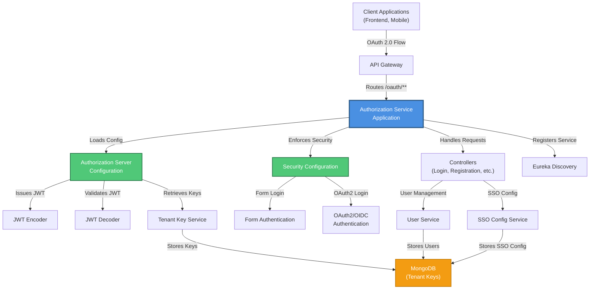

### Component Interaction Flow

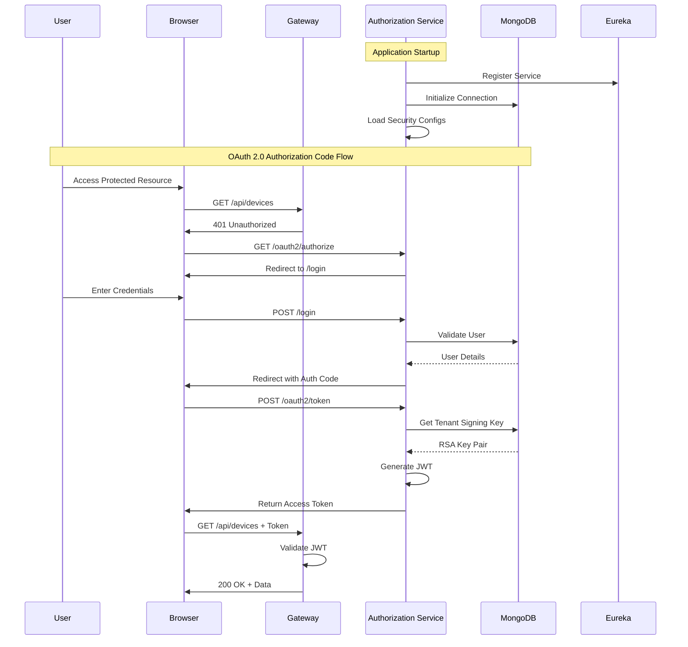

---

## Core Components

### 1. OpenFrameAuthorizationServerApplication

**Location:** `openframe.services.openframe-authorization-server`

The main Spring Boot application class that bootstraps the authorization server.

```java
@SpringBootApplication
@EnableDiscoveryClient
@ComponentScan(
    basePackages = {
        "com.openframe.authz",      // Authorization service components
        "com.openframe.core",        // Core utilities
        "com.openframe.data",        // Data layer (MongoDB)
        "com.openframe.notification" // Email notifications
    }
)
public class OpenFrameAuthorizationServerApplication {
    public static void main(String[] args) {
        SpringApplication.run(OpenFrameAuthorizationServerApplication.class, args);
    }
}
```

**Key Annotations:**

| Annotation | Purpose |
|------------|---------|
| `@SpringBootApplication` | Enables auto-configuration and component scanning |
| `@EnableDiscoveryClient` | Registers with Eureka service registry |
| `@ComponentScan` | Scans multiple packages for Spring beans |

**Component Scan Packages:**

- **`com.openframe.authz`**: Authorization-specific controllers, services, and configurations
- **`com.openframe.core`**: Shared utilities (tenant context, encryption, etc.)
- **`com.openframe.data`**: MongoDB repositories and document models
- **`com.openframe.notification`**: Email service for password reset and invitations

### 2. Dependency Injection Flow

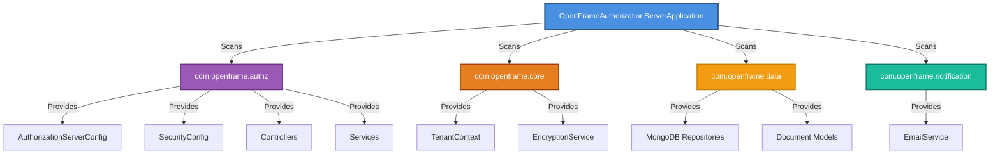

---

## Multi-Tenancy

### Tenant Isolation Strategy

The authorization server implements **strict tenant isolation** at multiple layers:

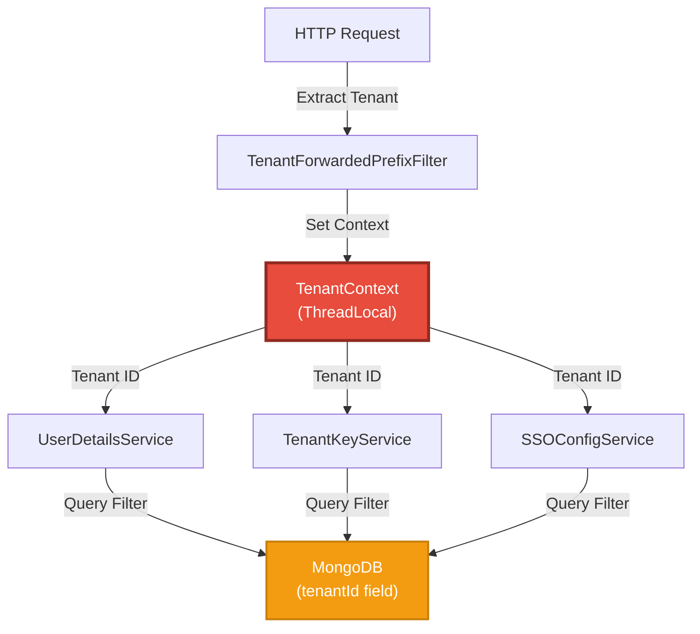

### Tenant Context Resolution

**Filter Chain Order:**

1. **`ForwardedHeaderFilter`** (Priority: `HIGHEST_PRECEDENCE + 20`)
   - Processes `X-Forwarded-*` headers from reverse proxy
   - Extracts original protocol, host, and port

2. **`TenantForwardedPrefixFilter`** (Priority: `HIGHEST_PRECEDENCE + 15`)
   - Parses tenant ID from URL path prefix (e.g., `/tenant/{tenantId}/oauth2/authorize`)
   - Sets `TenantContext.setTenantId(tenantId)`
   - Removes tenant prefix from request path for downstream processing

**Example Request Flow:**

```text
Original Request:
  GET https://auth.openframe.ai/tenant/acme-corp/oauth2/authorize

After ForwardedHeaderFilter:
  Protocol: https
  Host: auth.openframe.ai
  Path: /tenant/acme-corp/oauth2/authorize

After TenantForwardedPrefixFilter:
  TenantContext.tenantId = "acme-corp"
  Path: /oauth2/authorize (tenant prefix removed)
```

### Tenant-Specific JWT Signing

Each tenant uses **isolated RSA key pairs** for JWT signing:

```mermaid
flowchart LR
    TokenReq["Token Request"] -->|"Get Tenant ID"| TenantCtx["TenantContext"]
    TenantCtx -->|"tenantId"| KeyService["TenantKeyService"]
    
    KeyService -->|"Query"| MongoDB["MongoDB<br/>(tenant_keys)"]
    MongoDB -->|"Active Key"| KeyDoc["TenantKey Document"]
    
    KeyDoc -->|"Decrypt"| EncService["EncryptionService"]
    EncService -->|"RSA Key Pair"| JWKSource["JWKSource"]
    
    JWKSource -->|"Sign Token"| JWTEncoder["JWT Encoder"]
    JWTEncoder -->|"JWT"| TokenResp["Token Response"]
    
    style TenantCtx fill:#E74C3C,stroke:#922B21,stroke-width:2px,color:#fff
    style KeyService fill:#50C878,stroke:#2E7D4E,stroke-width:2px,color:#fff
    style MongoDB fill:#F39C12,stroke:#C87F0A,stroke-width:2px,color:#fff
```

**Key Rotation Support:**

- Multiple keys can exist per tenant (only one marked `active: true`)
- Old keys retained for token validation during rotation window
- Automatic key generation on first tenant access

---

## Security Features

### 1. OAuth 2.0 Authorization Server

**Supported Grant Types:**

| Grant Type | Use Case | Client Type |
|------------|----------|-------------|
| **Authorization Code + PKCE** | Web/mobile apps | Public clients |
| **Client Credentials** | Service-to-service | Confidential clients |
| **Refresh Token** | Token renewal | All clients |

**Configuration Highlights:**

```java
@Bean
@Order(1)
public SecurityFilterChain authorizationServerSecurityFilterChain(HttpSecurity http) {
    OAuth2AuthorizationServerConfigurer as = new OAuth2AuthorizationServerConfigurer();
    
    AuthorizationServerSettings settings = AuthorizationServerSettings.builder()
        .multipleIssuersAllowed(true)  // Multi-tenant support
        .build();
    
    http.with(as, config -> {
        config.oidc(Customizer.withDefaults());  // Enable OIDC
        config.authorizationServerSettings(settings);
    });
    
    return http
        .securityMatcher(as.getEndpointsMatcher())
        .authorizeHttpRequests(a -> a.anyRequest().authenticated())
        .csrf(csrf -> csrf.ignoringRequestMatchers(as.getEndpointsMatcher()))
        .oauth2ResourceServer(o -> o.jwt(Customizer.withDefaults()))
        .build();
}
```

**Standard Endpoints:**

- `/oauth2/authorize` - Authorization endpoint
- `/oauth2/token` - Token endpoint
- `/oauth2/jwks` - JSON Web Key Set (tenant-specific)
- `/oauth2/introspect` - Token introspection
- `/oauth2/revoke` - Token revocation
- `/.well-known/openid-configuration` - OIDC discovery

### 2. Form-Based Authentication

**Login Flow:**

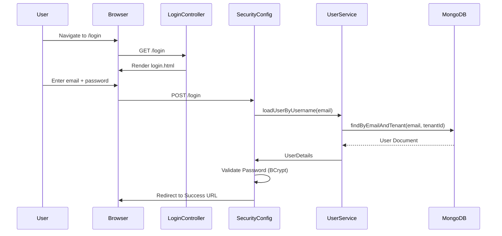

**Password Security:**

- **BCrypt Hashing** with automatic salt generation
- **Configurable Strength**: Default 10 rounds (2^10 iterations)
- **No Plain-Text Storage**: Passwords never stored in readable form

### 3. SSO Integration (OAuth2/OIDC)

**Supported Providers:**

- **Microsoft Azure AD** (multi-tenant with custom issuer validation)
- **Google Workspace**
- **Generic OIDC** (any compliant provider)

**Auto-Provisioning Flow:**

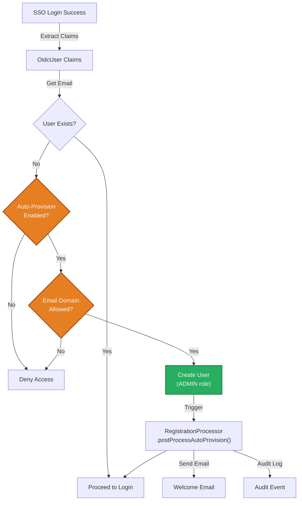

**Configuration Example:**

```json
{
  "tenantId": "acme-corp",
  "provider": "microsoft",
  "enabled": true,
  "autoProvisionUsers": true,
  "allowedDomains": ["acme.com", "acme.co.uk"],
  "clientId": "azure-app-client-id",
  "clientSecret": "encrypted-secret"
}
```

### 4. JWT Token Customization

**Custom Claims Added:**

```json
{
  "sub": "user@example.com",
  "tenant_id": "acme-corp",
  "userId": "507f1f77bcf86cd799439011",
  "roles": ["ADMIN", "USER"],
  "iss": "https://auth.openframe.ai/tenant/acme-corp",
  "aud": "openframe-api",
  "exp": 1735689600,
  "iat": 1735686000
}
```

**Token Customizer Logic:**

```java
@Bean
public OAuth2TokenCustomizer<JwtEncodingContext> tokenCustomizer(UserService userService) {
    return context -> {
        String tenantId = TenantContext.getTenantId();
        String username = context.getPrincipal().getName();
        
        AuthUser user = userService.findActiveByEmailAndTenant(username, tenantId)
            .orElseThrow(() -> new UsernameNotFoundException("User not found"));
        
        if ("access_token".equals(context.getTokenType().getValue())) {
            context.getClaims().claims(claims -> {
                claims.put("tenant_id", tenantId);
                claims.put("userId", user.getId());
                
                // Expand OWNER role to include ADMIN
                Set<UserRole> effective = new LinkedHashSet<>(user.getRoles());
                if (effective.contains(UserRole.OWNER)) {
                    effective.add(UserRole.ADMIN);
                }
                claims.put("roles", effective.stream().map(UserRole::name).toList());
            });
        }
    };
}
```

---

## Integration Points

### 1. Service Discovery (Eureka)

**Registration Configuration:**

```yaml
spring:
  application:
    name: authorization-service

eureka:
  client:
    service-url:
      defaultZone: http://localhost:8761/eureka/
    register-with-eureka: true
    fetch-registry: true
  instance:
    prefer-ip-address: true
    instance-id: ${spring.application.name}:${random.value}
```

**Service Lookup:**

Other services (API Gateway, API Service) discover the authorization server via Eureka:

```java
// Gateway routes requests to authorization-service
- id: auth-service
  uri: lb://authorization-service
  predicates:
    - Path=/oauth2/**, /login, /.well-known/**
```

### 2. MongoDB Data Layer

**Collections Used:**

| Collection | Purpose | Key Fields |
|------------|---------|------------|
| `users` | User accounts | `email`, `tenantId`, `passwordHash`, `roles` |
| `tenant_keys` | RSA signing keys | `tenantId`, `keyId`, `publicPem`, `privateEncrypted`, `active` |
| `sso_configs` | SSO provider settings | `tenantId`, `provider`, `enabled`, `autoProvisionUsers` |
| `oauth2_authorizations` | OAuth2 authorization codes/tokens | `principalName`, `authorizationGrantType`, `state` |
| `oauth2_registered_clients` | Dynamic client registrations | `clientId`, `clientSecret`, `redirectUris` |

**Repository Interfaces:**

```java
public interface UserRepository extends MongoRepository<User, String> {
    Optional<User> findByEmailAndTenantId(String email, String tenantId);
}

public interface TenantKeyRepository extends MongoRepository<TenantKey, String> {
    Optional<TenantKey> findFirstByTenantIdAndActiveTrue(String tenantId);
    long countByTenantIdAndActiveTrue(String tenantId);
}
```

### 3. Email Notifications

**Notification Events:**

- **User Registration**: Welcome email with account details
- **Password Reset**: Secure token link for password recovery
- **Invitation**: Onboarding email with registration link
- **SSO Auto-Provision**: Notification of account creation

**Integration:**

```java
@Autowired
private EmailService emailService;

public void sendPasswordResetEmail(String email, String token) {
    String resetLink = buildResetLink(token);
    emailService.sendEmail(
        email,
        "Password Reset Request",
        "Click here to reset your password: " + resetLink
    );
}
```

### 4. API Gateway Integration

**Request Flow:**

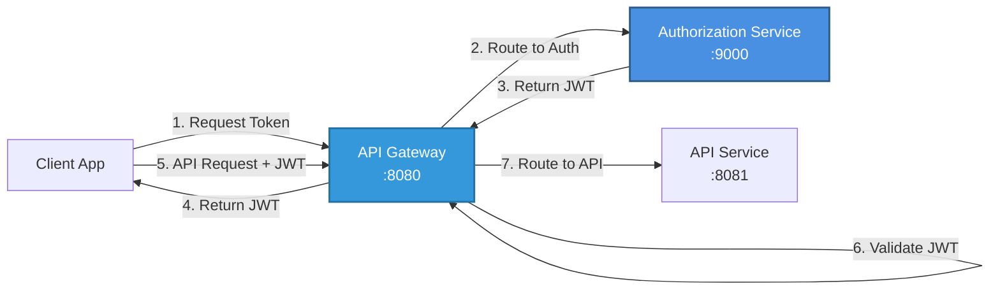

**Gateway Configuration:**

```yaml
spring:
  cloud:
    gateway:
      routes:
        - id: auth-service
          uri: lb://authorization-service
          predicates:
            - Path=/oauth2/**, /login, /tenant/**, /.well-known/**
          filters:
            - StripPrefix=0
```

---

## Configuration

### Application Properties

**`application.yml` (Core Settings):**

```yaml
spring:
  application:
    name: authorization-service
  
  data:
    mongodb:
      uri: mongodb://localhost:27017/openframe
      auto-index-creation: true
  
  security:
    oauth2:
      authorizationserver:
        issuer: https://auth.openframe.ai

server:
  port: 9000
  servlet:
    context-path: /

logging:
  level:
    com.openframe.authz: DEBUG
    org.springframework.security: DEBUG
```

### Environment Variables

| Variable | Description | Default | Required |
|----------|-------------|---------|----------|
| `MONGODB_URI` | MongoDB connection string | `mongodb://localhost:27017/openframe` | Yes |
| `EUREKA_URI` | Eureka server URL | `http://localhost:8761/eureka/` | Yes |
| `ENCRYPTION_KEY` | Master key for encrypting secrets | - | Yes |
| `JWT_ISSUER` | Base issuer URL for JWT tokens | `https://auth.openframe.ai` | Yes |
| `SMTP_HOST` | Email server hostname | - | No |
| `SMTP_PORT` | Email server port | `587` | No |
| `SMTP_USERNAME` | Email authentication username | - | No |
| `SMTP_PASSWORD` | Email authentication password | - | No |

### Docker Deployment

**Dockerfile:**

```dockerfile
FROM eclipse-temurin:21-jre-alpine
WORKDIR /app
COPY target/openframe-authorization-server.jar app.jar
EXPOSE 9000
ENTRYPOINT ["java", "-jar", "app.jar"]
```

**Docker Compose:**

```yaml
version: '3.8'
services:
  authorization-service:
    image: openframe/authorization-service:latest
    ports:
      - "9000:9000"
    environment:
      MONGODB_URI: mongodb://mongodb:27017/openframe
      EUREKA_URI: http://eureka:8761/eureka/
      ENCRYPTION_KEY: ${ENCRYPTION_KEY}
      JWT_ISSUER: https://auth.openframe.ai
    depends_on:
      - mongodb
      - eureka
    networks:
      - openframe-network

  mongodb:
    image: mongo:7
    ports:
      - "27017:27017"
    volumes:
      - mongo-data:/data/db
    networks:
      - openframe-network

  eureka:
    image: openframe/eureka-server:latest
    ports:
      - "8761:8761"
    networks:
      - openframe-network

volumes:
  mongo-data:

networks:
  openframe-network:
    driver: bridge
```

---

## Deployment

### Kubernetes Deployment

**Deployment Manifest:**

```yaml
apiVersion: apps/v1
kind: Deployment
metadata:
  name: authorization-service
  namespace: openframe
spec:
  replicas: 3
  selector:
    matchLabels:
      app: authorization-service
  template:
    metadata:
      labels:
        app: authorization-service
    spec:
      containers:
      - name: authorization-service
        image: openframe/authorization-service:latest
        ports:
        - containerPort: 9000
        env:
        - name: MONGODB_URI
          valueFrom:
            secretKeyRef:
              name: mongodb-credentials
              key: uri
        - name: ENCRYPTION_KEY
          valueFrom:
            secretKeyRef:
              name: encryption-keys
              key: master-key
        - name: EUREKA_URI
          value: "http://eureka-service:8761/eureka/"
        livenessProbe:
          httpGet:
            path: /actuator/health/liveness
            port: 9000
          initialDelaySeconds: 60
          periodSeconds: 10
        readinessProbe:
          httpGet:
            path: /actuator/health/readiness
            port: 9000
          initialDelaySeconds: 30
          periodSeconds: 5
        resources:
          requests:
            memory: "512Mi"
            cpu: "500m"
          limits:
            memory: "1Gi"
            cpu: "1000m"
---
apiVersion: v1
kind: Service
metadata:
  name: authorization-service
  namespace: openframe
spec:
  selector:
    app: authorization-service
  ports:
  - protocol: TCP
    port: 9000
    targetPort: 9000
  type: ClusterIP
```

### Health Checks

**Actuator Endpoints:**

```yaml
management:
  endpoints:
    web:
      exposure:
        include: health,info,metrics,prometheus
  endpoint:
    health:
      show-details: when-authorized
      probes:
        enabled: true
```

**Health Check URLs:**

- **Liveness**: `GET /actuator/health/liveness` (returns 200 if app is running)
- **Readiness**: `GET /actuator/health/readiness` (returns 200 if ready to accept traffic)
- **Full Health**: `GET /actuator/health` (detailed health information)

---

## Related Modules

### Parent Module

- **[authorization_service](authorization_service.md)**: Complete authorization service documentation including all submodules

### Sibling Modules

- **[authorization_service_configuration](authorization_service_configuration.md)**: OAuth2 server and security configuration beans
- **[authorization_service_controllers](authorization_service_controllers.md)**: Login, registration, and password reset controllers
- **[authorization_service_services](authorization_service_services.md)**: Tenant key management and authorization persistence

### Dependent Modules

- **[data_layer_mongo](data_layer_mongo.md)**: MongoDB repositories for users, keys, and OAuth2 data
- **[security_core](security_core.md)**: JWT configuration and security utilities
- **[gateway_service](gateway_service.md)**: API Gateway that routes authentication requests

### Integration Modules

- **[api_service](api_service.md)**: Resource server that validates JWT tokens issued by this service
- **[external_api](external_api.md)**: External API service that uses OAuth2 client credentials flow

---

## Process Flows

### Complete OAuth 2.0 Authorization Code Flow

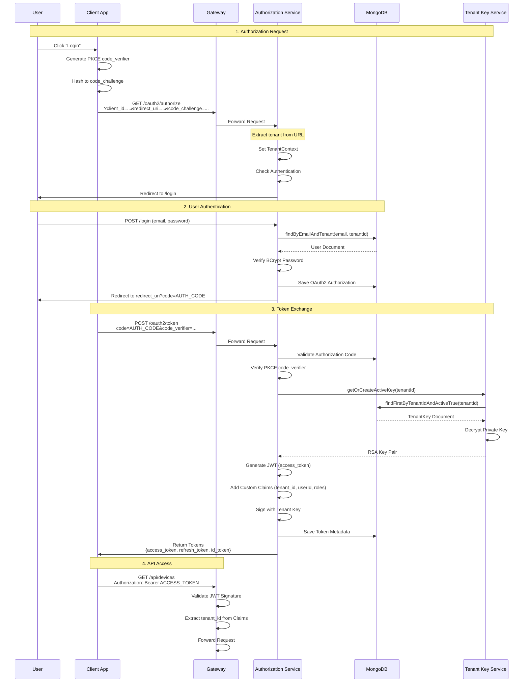

### SSO Auto-Provisioning Flow

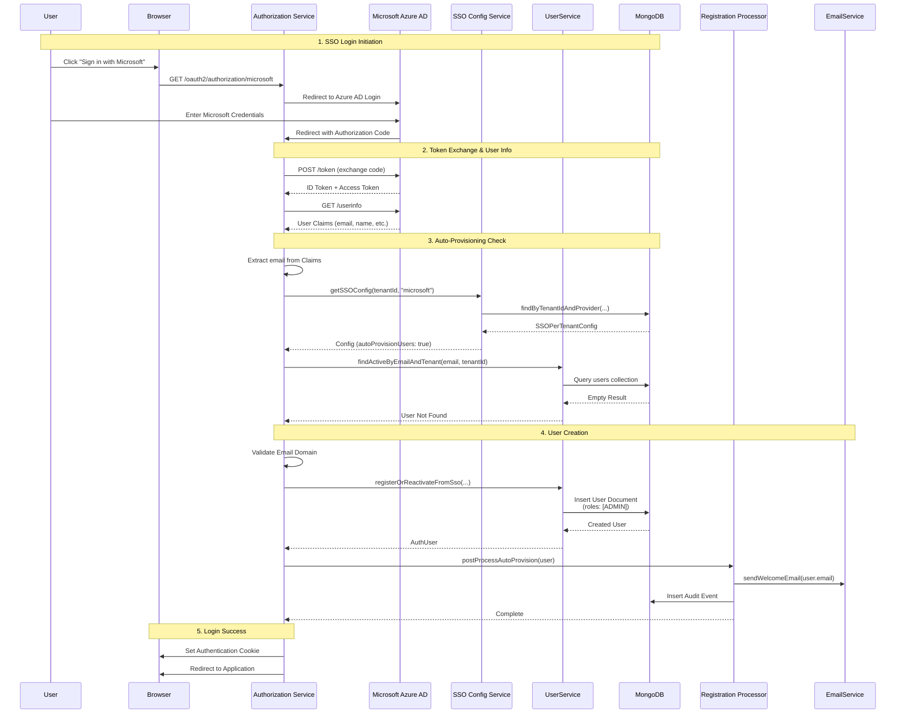

### Tenant Key Rotation Flow

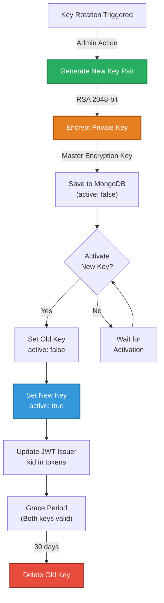

---

## Troubleshooting

### Common Issues

#### 1. Multiple Active Keys Warning

**Symptom:**

```text
WARN: Multiple active signing keys detected for tenantId='acme-corp' (count=2)
```

**Cause:** Database inconsistency with multiple keys marked `active: true`

**Solution:**

```javascript
// MongoDB shell
db.tenant_keys.updateMany(
  { tenantId: "acme-corp", active: true },
  { $set: { active: false } }
);

// Keep only the latest key active
db.tenant_keys.updateOne(
  { 
    tenantId: "acme-corp",
    _id: "latest-key-id"
  },
  { $set: { active: true } }
);
```

#### 2. JWT Signature Validation Failure

**Symptom:**

```text
ERROR: An error occurred while attempting to decode the Jwt: Signed JWT rejected: Invalid signature
```

**Cause:** Token signed with different key than validation key

**Solution:**

1. Verify tenant context is correctly set
2. Check JWKS endpoint returns correct public key: `GET /.well-known/jwks.json`
3. Ensure resource server uses correct issuer URI

#### 3. SSO Auto-Provision Not Working

**Symptom:** User cannot login via SSO despite correct credentials

**Cause:** Domain not in `allowedDomains` list or `autoProvisionUsers: false`

**Solution:**

```javascript
// MongoDB shell - Update SSO config
db.sso_configs.updateOne(
  { tenantId: "acme-corp", provider: "microsoft" },
  { 
    $set: { 
      autoProvisionUsers: true,
      allowedDomains: ["acme.com", "acme.co.uk"]
    }
  }
);
```

#### 4. Tenant Context Not Resolved

**Symptom:**

```text
ERROR: Tenant id not resolved for JWK request
```

**Cause:** Request missing tenant prefix or filter not applied

**Solution:**

1. Ensure URL includes tenant prefix: `/tenant/{tenantId}/oauth2/authorize`
2. Verify `TenantForwardedPrefixFilter` is registered
3. Check filter order in configuration

---

## Security Considerations

### Best Practices

1. **Encryption at Rest**
   - All private keys encrypted with master encryption key
   - Use strong encryption key (256-bit AES recommended)
   - Rotate master encryption key periodically

2. **Password Security**
   - BCrypt with minimum 10 rounds
   - Enforce password complexity requirements
   - Implement rate limiting on login attempts

3. **Token Security**
   - Short-lived access tokens (15 minutes recommended)
   - Longer-lived refresh tokens (7 days) with rotation
   - Implement token revocation for logout

4. **Network Security**
   - Always use HTTPS in production
   - Configure CORS policies restrictively
   - Implement rate limiting on token endpoints

5. **Monitoring**
   - Log all authentication attempts
   - Alert on multiple failed login attempts
   - Monitor token issuance rates for anomalies

---

## Performance Optimization

### Caching Strategy

**Recommended Caching:**

```java
@Cacheable(value = "tenant-keys", key = "#tenantId")
public RSAKey getOrCreateActiveKey(String tenantId) {
    // Cache tenant signing keys to avoid MongoDB queries
}

@Cacheable(value = "sso-configs", key = "#tenantId + '-' + #provider")
public Optional<SSOPerTenantConfig> getSSOConfig(String tenantId, String provider) {
    // Cache SSO configurations
}
```

**Cache Configuration:**

```yaml
spring:
  cache:
    type: caffeine
    caffeine:
      spec: maximumSize=1000,expireAfterWrite=1h
```

### Database Indexing

**Required Indexes:**

```javascript
// Users collection
db.users.createIndex({ email: 1, tenantId: 1 }, { unique: true });
db.users.createIndex({ tenantId: 1, active: 1 });

// Tenant keys collection
db.tenant_keys.createIndex({ tenantId: 1, active: 1 });
db.tenant_keys.createIndex({ keyId: 1 }, { unique: true });

// OAuth2 authorizations
db.oauth2_authorizations.createIndex({ principalName: 1, tenantId: 1 });
db.oauth2_authorizations.createIndex({ state: 1 });
db.oauth2_authorizations.createIndex({ authorizationCode: 1 });
```

---

## Additional Resources

### Documentation

- **[Spring Authorization Server](https://docs.spring.io/spring-authorization-server/reference/)**: Official Spring OAuth2 documentation
- **[OAuth 2.0 RFC 6749](https://datatracker.ietf.org/doc/html/rfc6749)**: OAuth 2.0 specification
- **[OpenID Connect Core](https://openid.net/specs/openid-connect-core-1_0.html)**: OIDC specification
- **[PKCE RFC 7636](https://datatracker.ietf.org/doc/html/rfc7636)**: Proof Key for Code Exchange

### Related OpenFrame Documentation

- **[Authorization Service Overview](authorization_service.md)**: Complete service documentation
- **[Security Core](security_core.md)**: JWT and security utilities
- **[Gateway Service](gateway_service.md)**: API Gateway integration
- **[API Service](api_service.md)**: Resource server configuration

### Community

- **OpenMSP Slack**: [Join the community](https://join.slack.com/t/openmsp/shared_invite/zt-36bl7mx0h-3~U2nFH6nqHqoTPXMaHEHA)
- **Flamingo Platform**: [https://flamingo.run](https://flamingo.run)
- **OpenFrame**: [https://openframe.ai](https://openframe.ai)

---

**Last Updated:** 2024  
**Version:** 1.0  
**Maintained By:** OpenFrame Team
