# Authorization Service Configuration Module

## Overview

The **Authorization Service Configuration** module is the security backbone of the OpenFrame platform, implementing a multi-tenant OAuth2/OIDC authorization server with Spring Security. This module provides centralized authentication, token management, and Single Sign-On (SSO) capabilities across all OpenFrame services.

**Key Capabilities:**
- Multi-tenant OAuth2 Authorization Server with tenant-specific JWT signing keys
- OIDC (OpenID Connect) authentication with SSO provider integration (Microsoft, Google, etc.)
- Dynamic client registration for multi-tenant OAuth2 clients
- Tenant-aware JWT token generation and validation
- Auto-provisioning of users from SSO providers
- PKCE (Proof Key for Code Exchange) support for secure authorization flows
- Custom JWT claims injection (tenant_id, userId, roles)

**Related Modules:**
- [Authorization Service](authorization_service.md) - Parent module containing controllers and services
- [Security Core](security_core.md) - Shared security utilities and JWT configuration
- [Gateway Service](gateway_service.md) - API Gateway that validates tokens issued by this service
- [Data Layer Mongo](data_layer_mongo.md) - User and tenant data persistence

---

## Architecture Overview

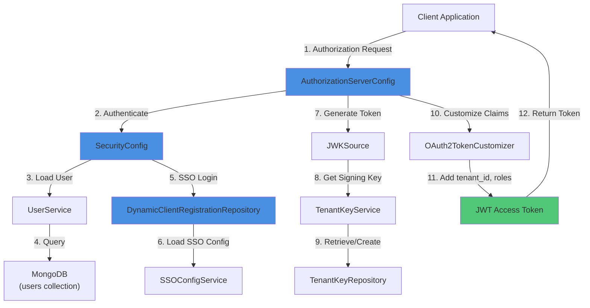

### Component Interaction Flow

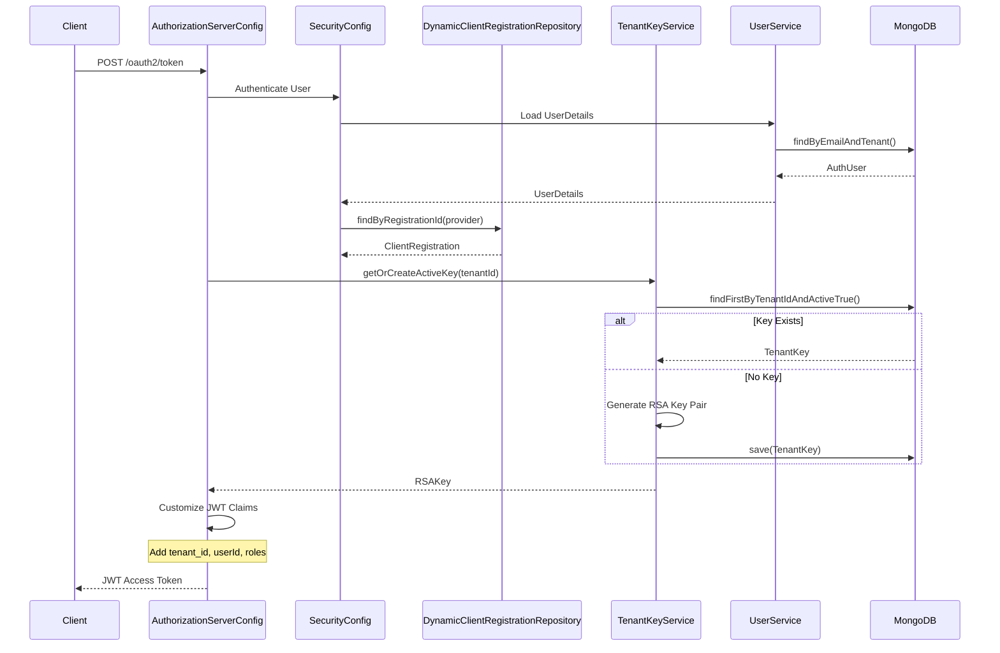

---

## Core Components

### 1. AuthorizationServerConfig

**Purpose:** Configures the OAuth2 Authorization Server with multi-tenant support, JWT encoding/decoding, and custom token claims.

**Key Responsibilities:**
- OAuth2 authorization server endpoint configuration
- Multi-tenant JWT signing key management via `JWKSource`
- JWT encoder/decoder bean registration
- Custom token claim injection (tenant_id, userId, roles)
- User authentication via `UserDetailsService`
- Password encoding with BCrypt

**Configuration Details:**

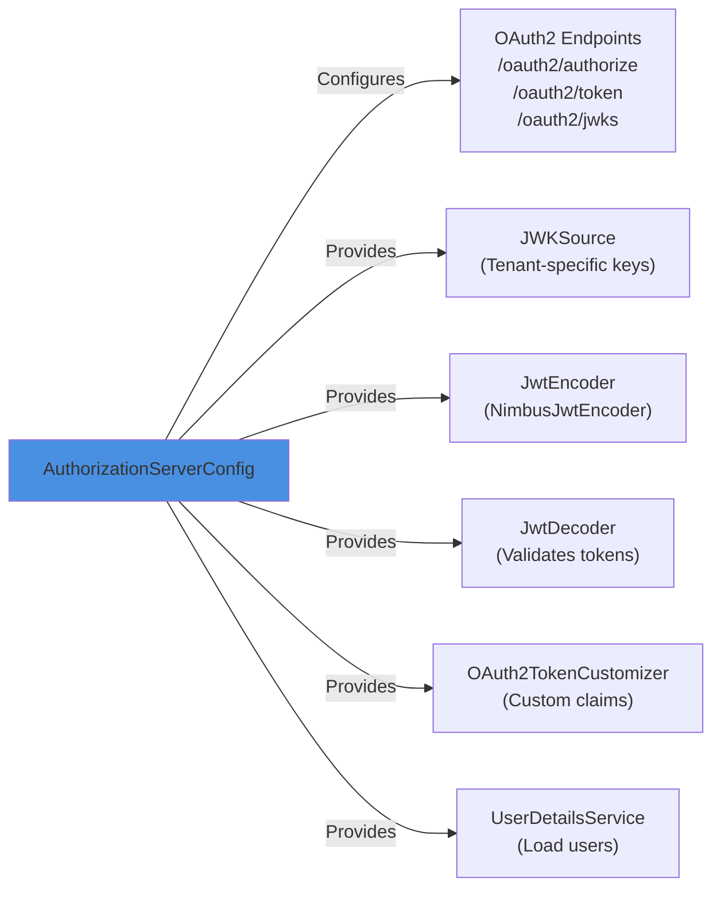

**Key Beans:**

| Bean | Type | Purpose |
|------|------|---------|
| `authorizationServerSecurityFilterChain` | `SecurityFilterChain` | Secures OAuth2 endpoints, enables OIDC, configures CSRF/CORS |
| `jwkSource` | `JWKSource<SecurityContext>` | Provides tenant-specific RSA signing keys for JWT generation |
| `jwtDecoder` | `JwtDecoder` | Decodes and validates JWT tokens |
| `jwtEncoder` | `JwtEncoder` | Encodes JWT tokens with tenant-specific keys |
| `tokenCustomizer` | `OAuth2TokenCustomizer<JwtEncodingContext>` | Adds custom claims (tenant_id, userId, roles) to access tokens |
| `userDetailsService` | `UserDetailsService` | Loads user details from MongoDB for authentication |
| `passwordEncoder` | `PasswordEncoder` | BCrypt password encoder for secure password hashing |
| `authenticationManager` | `AuthenticationManager` | Programmatic authentication for registration flows |

**Multi-Tenant JWT Key Management:**

```java
@Bean
public JWKSource<SecurityContext> jwkSource(TenantKeyService tenantKeyService) {
    return (jwkSelector, securityContext) -> {
        String tenantId = getTenantId(); // From TenantContext
        if (tenantId == null || tenantId.isBlank()) {
            throw new IllegalStateException("Tenant id not resolved for JWK request");
        }
        RSAKey tenantKey = tenantKeyService.getOrCreateActiveKey(tenantId);
        return jwkSelector.select(new JWKSet(tenantKey));
    };
}
```

**Custom JWT Claims Injection:**

```java
@Bean
public OAuth2TokenCustomizer<JwtEncodingContext> tokenCustomizer(UserService userService) {
    return context -> {
        if ("access_token".equals(context.getTokenType().getValue())) {
            String tenantId = getTenantId();
            String username = context.getPrincipal().getName();
            AuthUser user = userService.findActiveByEmailAndTenant(username, tenantId)
                .orElseThrow(() -> new UsernameNotFoundException("User not found"));
            
            context.getClaims().claims(claims -> {
                claims.put("tenant_id", tenantId);
                claims.put("userId", user.getId());
                claims.put("roles", user.getRoles().stream().map(UserRole::name).toList());
            });
        }
    };
}
```

**Security Filter Chain Configuration:**

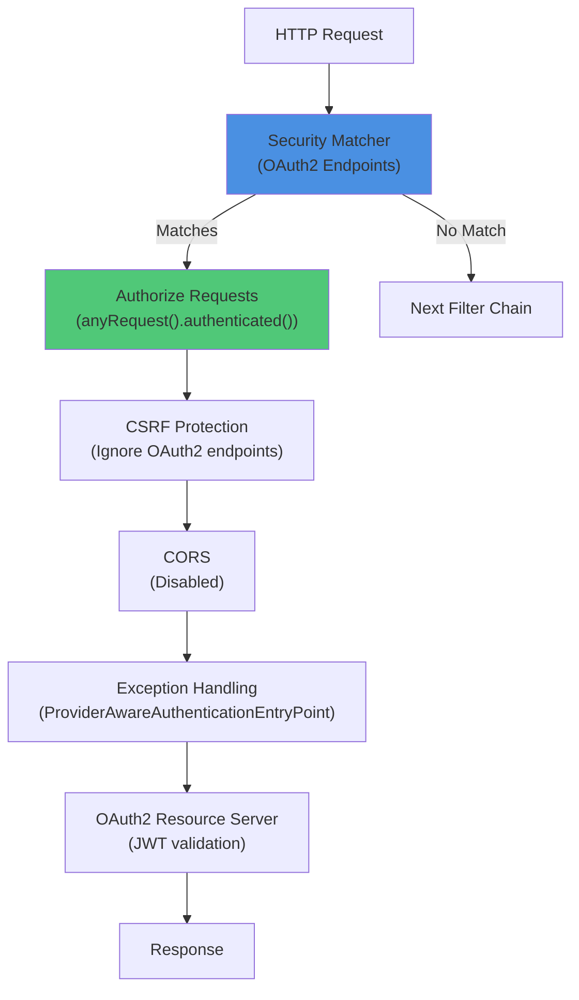

---

### 2. SecurityConfig

**Purpose:** Configures default security for non-OAuth2 endpoints, including form login, OAuth2 client (SSO), and auto-provisioning of users from SSO providers.

**Key Responsibilities:**
- Form-based login configuration
- OAuth2 client configuration for SSO (Microsoft, Google, etc.)
- OIDC user service with auto-provisioning logic
- Microsoft-specific JWT decoder with issuer pattern validation
- Domain-based auto-provisioning policies

**Configuration Details:**

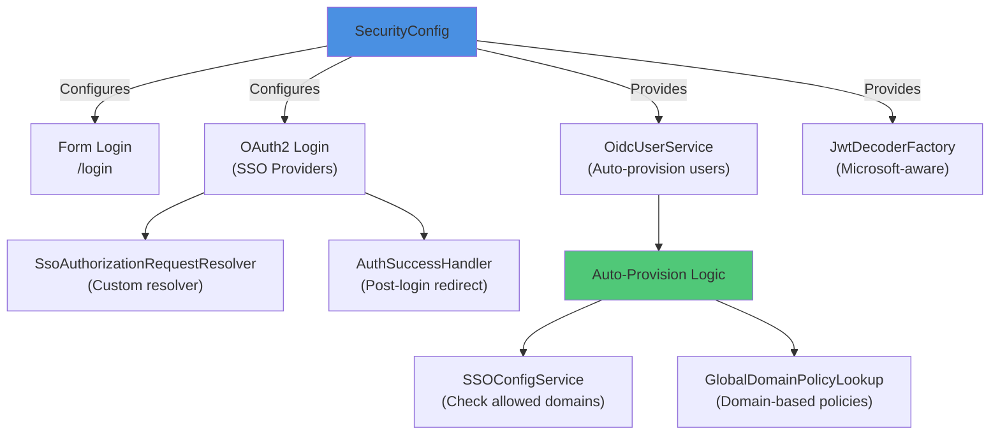

**Security Filter Chain (Order 2):**

```java
@Bean
@Order(2)
public SecurityFilterChain defaultSecurityFilterChain(HttpSecurity http, ...) throws Exception {
    return http
        .csrf(AbstractHttpConfigurer::disable)
        .authorizeHttpRequests(auth -> auth
            .requestMatchers("/oauth/**", "/invitations/**", "/login", ...).permitAll()
            .anyRequest().authenticated()
        )
        .formLogin(form -> form
            .loginPage("/login")
            .successHandler(authSuccessHandler)
        )
        .oauth2Login(o -> o
            .loginPage("/login")
            .authorizationEndpoint(a -> a.authorizationRequestResolver(...))
            .userInfoEndpoint(u -> u.oidcUserService(oidcUserService))
            .successHandler(authSuccessHandler)
        )
        .build();
}
```

**Auto-Provisioning Flow:**

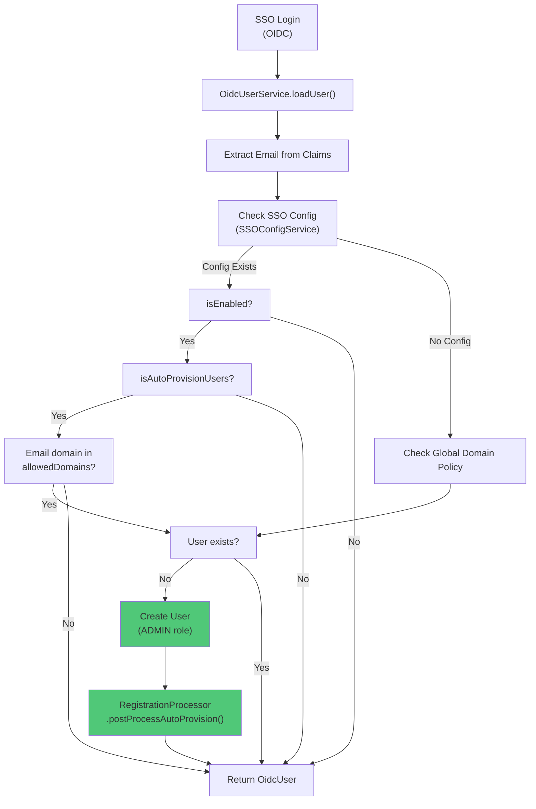

**Microsoft-Specific JWT Decoder:**

Microsoft Azure AD uses a multi-tenant issuer pattern that requires special validation:

```java
@Bean
public JwtDecoderFactory<ClientRegistration> microsoftAwareJwtDecoderFactory() {
    return clientRegistration -> {
        if (!"microsoft".equals(clientRegistration.getRegistrationId())) {
            return JwtDecoders.fromIssuerLocation(issuer);
        }
        
        NimbusJwtDecoder decoder = NimbusJwtDecoder.withJwkSetUri(jwkSetUri).build();
        OAuth2TokenValidator<Jwt> microsoftIssuerPatternValidator = token -> {
            String iss = token.getIssuer().toString();
            if (MS_ISSUER_PATTERN.matcher(iss).matches()) {
                return OAuth2TokenValidatorResult.success();
            }
            return OAuth2TokenValidatorResult.failure(...);
        };
        decoder.setJwtValidator(new DelegatingOAuth2TokenValidator<>(...));
        return decoder;
    };
}
```

**Supported SSO Providers:**
- Microsoft Azure AD (with multi-tenant issuer support)
- Google Workspace
- Generic OIDC providers

---

### 3. DynamicClientRegistrationRepository

**Purpose:** Dynamically loads OAuth2 client registrations (SSO providers) based on tenant context, enabling per-tenant SSO configuration.

**Key Responsibilities:**
- Resolve tenant ID from `TenantContext` or HTTP session
- Load tenant-specific SSO client configurations
- Support multiple SSO providers per tenant
- Fail gracefully when tenant context is unavailable

**Dynamic Client Resolution Flow:**

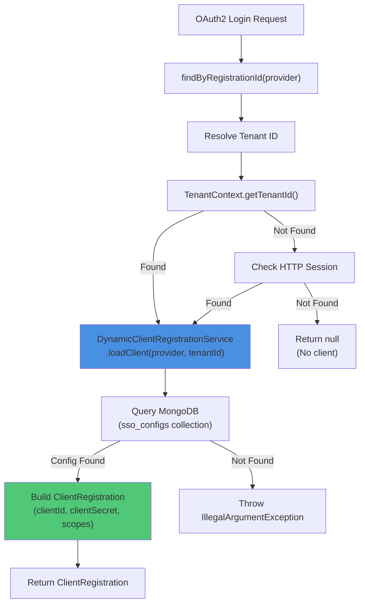

**Implementation Details:**

```java
@Component
@RequiredArgsConstructor
public class DynamicClientRegistrationRepository implements ClientRegistrationRepository {
    private final DynamicClientRegistrationService dynamic;

    @Override
    public ClientRegistration findByRegistrationId(String registrationId) {
        String tenantId = resolveTenantId();
        if (tenantId == null) {
            log.debug("Skipping dynamic client load: tenantId not found");
            return null;
        }
        try {
            return dynamic.loadClient(registrationId, tenantId);
        } catch (IllegalArgumentException ex) {
            log.warn("Dynamic client resolution failed for provider '{}' and tenant {}", 
                registrationId, tenantId);
            return null;
        }
    }

    private String resolveTenantId() {
        // 1. Try TenantContext (set by TenantContextFilter)
        String fromContext = TenantContext.getTenantId();
        if (fromContext != null && !fromContext.isBlank()) {
            return fromContext;
        }
        
        // 2. Fallback to HTTP session
        HttpSession session = getCurrentRequest().getSession(false);
        if (session != null) {
            return (String) session.getAttribute("TENANT_ID");
        }
        
        return null;
    }
}
```

**Tenant Context Resolution Priority:**
1. **TenantContext ThreadLocal** - Set by `TenantContextFilter` from subdomain or header
2. **HTTP Session** - Fallback for SSO callback requests
3. **Null** - Graceful failure if tenant cannot be resolved

---

## Data Flow Diagrams

### OAuth2 Authorization Code Flow with PKCE

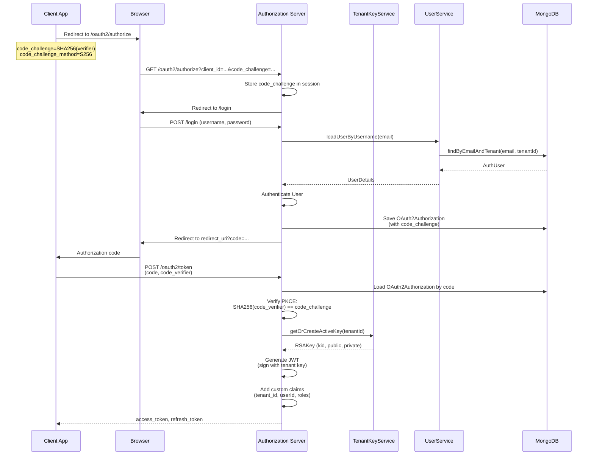

### SSO Login with Auto-Provisioning

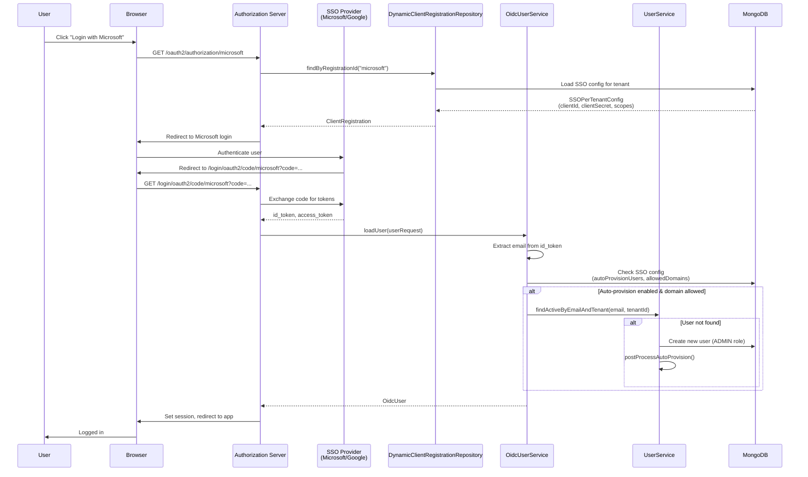

### JWT Token Generation with Custom Claims

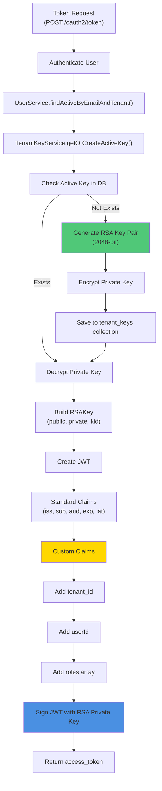

---

## Configuration Properties

### Application Properties

```yaml
# Authorization Server Settings
spring:
  security:
    oauth2:
      authorizationserver:
        # Multiple issuers allowed for multi-tenant support
        multiple-issuers-allowed: true
        
        # Token settings
        token:
          access-token-time-to-live: 3600s  # 1 hour
          refresh-token-time-to-live: 86400s  # 24 hours
          
        # Authorization code settings
        authorization-code-time-to-live: 300s  # 5 minutes

# MongoDB Configuration
spring:
  data:
    mongodb:
      uri: ${MONGO_URI:mongodb://localhost:27017/openframe}
      database: openframe

# Tenant Key Encryption
openframe:
  security:
    encryption:
      # Master key for encrypting tenant private keys
      master-key: ${ENCRYPTION_MASTER_KEY}
      algorithm: AES/GCM/NoPadding
      key-size: 256

# SSO Configuration
openframe:
  sso:
    # Default SSO providers (can be overridden per tenant)
    providers:
      microsoft:
        enabled: true
        auto-provision-users: false
        allowed-domains: []
      google:
        enabled: true
        auto-provision-users: false
        allowed-domains: []
```

### Environment Variables

| Variable | Description | Required | Default |
|----------|-------------|----------|---------|
| `MONGO_URI` | MongoDB connection string | Yes | `mongodb://localhost:27017/openframe` |
| `ENCRYPTION_MASTER_KEY` | Master key for encrypting tenant private keys | Yes | - |
| `SPRING_PROFILES_ACTIVE` | Active Spring profiles | No | `default` |
| `SERVER_PORT` | Server port | No | `8080` |
| `LOGGING_LEVEL_COM_OPENFRAME` | Logging level | No | `INFO` |

---

## Security Considerations

### 1. Multi-Tenant Key Isolation

Each tenant has its own RSA key pair for JWT signing, ensuring cryptographic isolation:

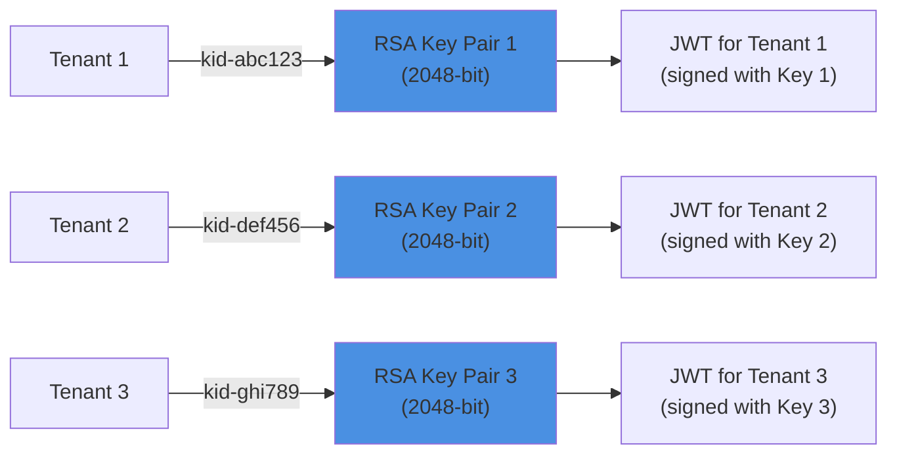

**Key Security Measures:**
- Private keys encrypted at rest using AES-256-GCM
- Master encryption key stored in environment variable
- Key ID (kid) included in JWT header for key rotation support
- Active key flag prevents accidental use of old keys

### 2. PKCE (Proof Key for Code Exchange)

PKCE prevents authorization code interception attacks:

```text
1. Client generates random code_verifier (43-128 chars)
2. Client computes code_challenge = BASE64URL(SHA256(code_verifier))
3. Client sends code_challenge in /authorize request
4. Server stores code_challenge with authorization code
5. Client sends code_verifier in /token request
6. Server verifies: SHA256(code_verifier) == stored code_challenge
```

**Implementation:**
- Stored in `OAuth2Authorization` metadata
- Validated by Spring Security OAuth2 framework
- Logged for debugging (see `MongoAuthorizationService`)

### 3. Password Security

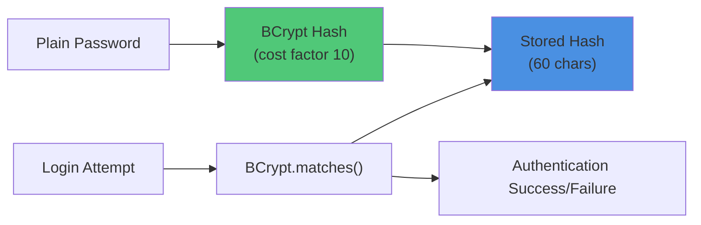

**BCrypt Configuration:**
- Cost factor: 10 (default)
- Salt automatically generated per password
- Resistant to rainbow table attacks
- Adaptive hashing (can increase cost factor over time)

### 4. SSO Auto-Provisioning Security

**Domain Whitelisting:**
```java
// Only allow users from specific domains
SSOPerTenantConfig config = ssoConfigService.getSSOConfig(tenantId, "microsoft");
if (config.isAutoProvisionUsers()) {
    List<String> allowedDomains = config.getAllowedDomains();
    // e.g., ["example.com", "partner.com"]
    
    String userEmail = "user@example.com";
    String domain = userEmail.substring(userEmail.lastIndexOf('@') + 1);
    
    if (allowedDomains.contains(domain)) {
        // Auto-provision user
    }
}
```

**Global Domain Policies:**
```java
// Fallback to global domain-to-tenant mapping
globalDomainPolicyLookup.findTenantIdByDomainIfAutoAllowed("example.com")
    .ifPresent(mappedTenantId -> {
        if (tenantId.equals(mappedTenantId)) {
            // Auto-provision user
        }
    });
```

### 5. Token Security Best Practices

**Access Token:**
- Short-lived (1 hour default)
- Contains minimal claims (tenant_id, userId, roles)
- Signed with tenant-specific RSA key
- Validated by resource servers using JWKS endpoint

**Refresh Token:**
- Long-lived (24 hours default)
- Stored in MongoDB with authorization
- Can be revoked by deleting authorization record
- Used to obtain new access tokens without re-authentication

**Token Validation:**
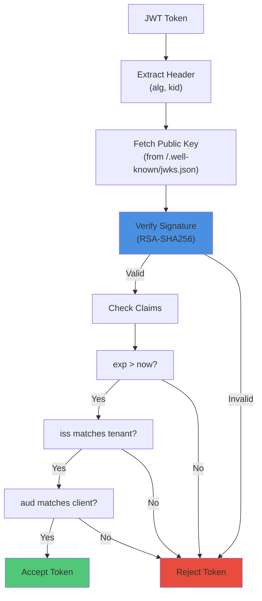

---

## Integration Points

### 1. Gateway Service Integration

The Gateway Service validates tokens issued by this authorization server:

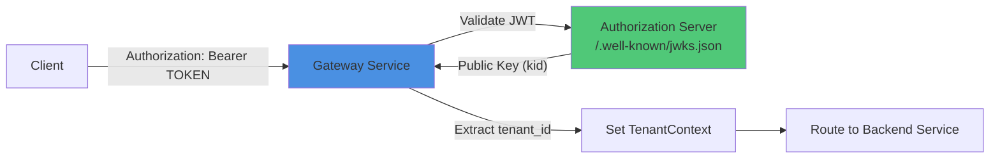

**Gateway Configuration:**
```yaml
spring:
  security:
    oauth2:
      resourceserver:
        jwt:
          # Multi-tenant JWKS endpoint
          jwk-set-uri: ${AUTH_SERVER_URL}/.well-known/jwks.json
          # Issuer validation (per tenant)
          issuer-uri: ${AUTH_SERVER_URL}/{tenantId}
```

### 2. API Service Integration

API services validate tokens and extract user context:

```java
@RestController
@RequestMapping("/api/v1/devices")
public class DeviceController {
    
    @GetMapping
    @PreAuthorize("hasRole('ADMIN')")
    public List<Device> getDevices(@AuthenticationPrincipal Jwt jwt) {
        String tenantId = jwt.getClaimAsString("tenant_id");
        String userId = jwt.getClaimAsString("userId");
        List<String> roles = jwt.getClaimAsStringList("roles");
        
        return deviceService.findByTenant(tenantId);
    }
}
```

### 3. Frontend Integration

Frontend applications use the authorization code flow with PKCE:

```typescript
// 1. Generate PKCE verifier and challenge
const codeVerifier = generateRandomString(128);
const codeChallenge = await sha256(codeVerifier);

// 2. Redirect to authorization endpoint
window.location.href = `${AUTH_SERVER_URL}/oauth2/authorize?` +
  `client_id=${CLIENT_ID}&` +
  `redirect_uri=${REDIRECT_URI}&` +
  `response_type=code&` +
  `scope=openid profile email&` +
  `code_challenge=${codeChallenge}&` +
  `code_challenge_method=S256`;

// 3. Exchange authorization code for tokens
const response = await fetch(`${AUTH_SERVER_URL}/oauth2/token`, {
  method: 'POST',
  headers: { 'Content-Type': 'application/x-www-form-urlencoded' },
  body: new URLSearchParams({
    grant_type: 'authorization_code',
    code: authorizationCode,
    redirect_uri: REDIRECT_URI,
    client_id: CLIENT_ID,
    code_verifier: codeVerifier
  })
});

const { access_token, refresh_token } = await response.json();
```

### 4. Data Layer Integration

**User Management:**
- See [Data Layer Mongo](data_layer_mongo.md) for `User` and `AuthUser` document schemas
- `UserService` queries `users` collection for authentication
- `UserRepository` provides CRUD operations

**Tenant Key Storage:**
```javascript
// MongoDB collection: tenant_keys
{
  "_id": "key-uuid",
  "tenantId": "tenant-123",
  "keyId": "kid-abc123",
  "publicPem": "-----BEGIN PUBLIC KEY-----\n...",
  "privateEncrypted": "AES-GCM encrypted private key",
  "active": true,
  "createdAt": ISODate("2024-01-01T00:00:00Z")
}
```

**OAuth2 Authorization Storage:**
```javascript
// MongoDB collection: oauth2_authorizations
{
  "_id": "auth-uuid",
  "registeredClientId": "client-123",
  "principalName": "user@example.com",
  "authorizationGrantType": "authorization_code",
  "authorizationCodeValue": "code-xyz",
  "authorizationCodeMetadata": {
    "code_challenge": "SHA256(verifier)",
    "code_challenge_method": "S256"
  },
  "accessTokenValue": "jwt-token",
  "refreshTokenValue": "refresh-token",
  "state": "state-abc"
}
```

---

## Error Handling

### Common Error Scenarios

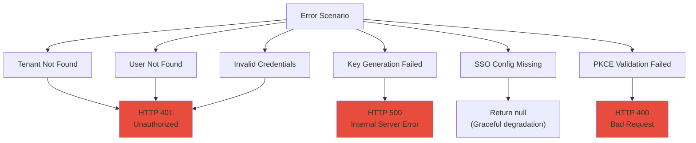

### Error Response Examples

**Invalid Credentials:**
```json
{
  "error": "invalid_grant",
  "error_description": "Bad credentials"
}
```

**Missing Tenant Context:**
```json
{
  "error": "invalid_request",
  "error_description": "Tenant id not resolved for JWK request"
}
```

**PKCE Validation Failed:**
```json
{
  "error": "invalid_grant",
  "error_description": "Invalid code verifier"
}
```

**SSO Auto-Provision Failed:**
```text
// Logged but does not block login flow
WARN: Failed to auto-provision user user@example.com: Domain not in allowedDomains
```

---

## Monitoring and Observability

### Key Metrics to Monitor

| Metric | Description | Alert Threshold |
|--------|-------------|-----------------|
| `oauth2.token.issued` | Number of tokens issued per minute | > 1000/min |
| `oauth2.token.validation.failed` | Failed token validations | > 10/min |
| `oauth2.authorization.created` | New authorizations created | - |
| `oauth2.authorization.expired` | Expired authorizations cleaned up | - |
| `tenant.key.generated` | New tenant keys generated | - |
| `tenant.key.multiple_active` | Multiple active keys detected | > 0 |
| `sso.login.success` | Successful SSO logins | - |
| `sso.login.failed` | Failed SSO logins | > 5/min |
| `sso.auto_provision.success` | Users auto-provisioned | - |
| `sso.auto_provision.failed` | Auto-provision failures | > 1/min |

### Logging Configuration

```yaml
logging:
  level:
    com.openframe.authz: DEBUG
    org.springframework.security: INFO
    org.springframework.security.oauth2: DEBUG
```

**Key Log Messages:**

```text
# Tenant key generation
INFO: No active signing key found for tenantId='tenant-123'. Generating a new key...
INFO: Generated new signing key for tenantId='tenant-123' with kid='kid-abc123'

# Multiple active keys warning
WARN: Multiple active signing keys detected for tenantId='tenant-123' (count=2) - this may cause kid mismatches

# SSO auto-provisioning
DEBUG: Auto-provisioning user user@example.com for tenant tenant-123 via microsoft SSO

# PKCE validation
DEBUG: PKCE in request: {code_challenge=SHA256(...), code_challenge_method=S256}
DEBUG: PKCE in code metadata: {code_challenge=SHA256(...), code_challenge_method=S256}

# Dynamic client resolution
DEBUG: Serving JWKS for tenantId='tenant-123' with kid='kid-abc123'
WARN: Dynamic client resolution failed for provider 'microsoft' and tenant tenant-123: Config not found
```

---

## Testing

### Unit Testing

**Test AuthorizationServerConfig:**

```java
@SpringBootTest
@AutoConfigureMockMvc
class AuthorizationServerConfigTest {
    
    @Autowired
    private MockMvc mockMvc;
    
    @Test
    void testJwksEndpoint() throws Exception {
        mockMvc.perform(get("/.well-known/jwks.json")
                .header("X-Tenant-Id", "tenant-123"))
            .andExpect(status().isOk())
            .andExpect(jsonPath("$.keys[0].kid").exists())
            .andExpect(jsonPath("$.keys[0].kty").value("RSA"));
    }
    
    @Test
    void testTokenCustomizer() {
        // Mock user service
        AuthUser user = AuthUser.builder()
            .id("user-123")
            .email("user@example.com")
            .roles(List.of(UserRole.ADMIN))
            .build();
        
        when(userService.findActiveByEmailAndTenant(any(), any()))
            .thenReturn(Optional.of(user));
        
        // Generate token
        String token = generateToken("user@example.com", "tenant-123");
        
        // Verify custom claims
        Jwt jwt = jwtDecoder.decode(token);
        assertThat(jwt.getClaimAsString("tenant_id")).isEqualTo("tenant-123");
        assertThat(jwt.getClaimAsString("userId")).isEqualTo("user-123");
        assertThat(jwt.getClaimAsStringList("roles")).contains("ADMIN");
    }
}
```

**Test SecurityConfig:**

```java
@SpringBootTest
@AutoConfigureMockMvc
class SecurityConfigTest {
    
    @Autowired
    private MockMvc mockMvc;
    
    @Test
    void testFormLogin() throws Exception {
        mockMvc.perform(post("/login")
                .param("username", "user@example.com")
                .param("password", "password123")
                .header("X-Tenant-Id", "tenant-123"))
            .andExpect(status().is3xxRedirection())
            .andExpect(redirectedUrl("/"));
    }
    
    @Test
    void testOAuth2Login() throws Exception {
        mockMvc.perform(get("/oauth2/authorization/microsoft")
                .header("X-Tenant-Id", "tenant-123"))
            .andExpect(status().is3xxRedirection())
            .andExpect(redirectedUrlPattern("https://login.microsoftonline.com/**"));
    }
}
```

### Integration Testing

**Test OAuth2 Authorization Code Flow:**

```java
@SpringBootTest(webEnvironment = WebEnvironment.RANDOM_PORT)
class OAuth2FlowIntegrationTest {
    
    @LocalServerPort
    private int port;
    
    @Test
    void testAuthorizationCodeFlowWithPKCE() {
        // 1. Generate PKCE verifier and challenge
        String codeVerifier = generateRandomString(128);
        String codeChallenge = sha256(codeVerifier);
        
        // 2. Request authorization code
        String authorizationCode = requestAuthorizationCode(
            "client-123", "http://localhost:3000/callback",
            codeChallenge, "S256"
        );
        
        // 3. Exchange code for tokens
        TokenResponse tokens = exchangeCodeForTokens(
            authorizationCode, codeVerifier, "client-123"
        );
        
        // 4. Verify tokens
        assertThat(tokens.getAccessToken()).isNotNull();
        assertThat(tokens.getRefreshToken()).isNotNull();
        
        Jwt jwt = jwtDecoder.decode(tokens.getAccessToken());
        assertThat(jwt.getClaimAsString("tenant_id")).isEqualTo("tenant-123");
    }
}
```

---

## Troubleshooting

### Issue: Multiple Active Keys Warning

**Symptom:**
```text
WARN: Multiple active signing keys detected for tenantId='tenant-123' (count=2) - this may cause kid mismatches
```

**Cause:** Multiple keys marked as active in `tenant_keys` collection.

**Solution:**
```javascript
// MongoDB query to find duplicate active keys
db.tenant_keys.find({ tenantId: "tenant-123", active: true })

// Deactivate old keys (keep only the latest)
db.tenant_keys.updateMany(
  { tenantId: "tenant-123", active: true, createdAt: { $lt: ISODate("2024-01-01") } },
  { $set: { active: false } }
)
```

### Issue: SSO Login Fails with "Dynamic client resolution failed"

**Symptom:**
```text
WARN: Dynamic client resolution failed for provider 'microsoft' and tenant tenant-123: Config not found
```

**Cause:** SSO configuration not found in database for the tenant.

**Solution:**
1. Verify SSO config exists:
```javascript
db.sso_configs.findOne({ tenantId: "tenant-123", provider: "microsoft" })
```

2. Create SSO config if missing:
```javascript
db.sso_configs.insertOne({
  tenantId: "tenant-123",
  provider: "microsoft",
  enabled: true,
  clientId: "your-client-id",
  clientSecret: "encrypted-secret",
  scopes: ["openid", "profile", "email"],
  autoProvisionUsers: false,
  allowedDomains: []
})
```

### Issue: PKCE Validation Failed

**Symptom:**
```json
{
  "error": "invalid_grant",
  "error_description": "Invalid code verifier"
}
```

**Cause:** `code_verifier` sent in token request doesn't match `code_challenge` from authorization request.

**Solution:**
1. Verify PKCE parameters are stored correctly:
```javascript
db.oauth2_authorizations.findOne({ authorizationCodeValue: "code-xyz" })
// Check authorizationCodeMetadata.code_challenge
```

2. Ensure client sends correct `code_verifier`:
```typescript
// Must be the same verifier used to generate code_challenge
const codeVerifier = sessionStorage.getItem('code_verifier');
```

### Issue: Token Validation Fails in Gateway

**Symptom:** Gateway returns 401 Unauthorized for valid tokens.

**Cause:** Gateway cannot fetch public key from JWKS endpoint.

**Solution:**
1. Verify JWKS endpoint is accessible:
```bash
curl https://auth.openframe.ai/.well-known/jwks.json
```

2. Check tenant context is set correctly:
```bash
curl -H "X-Tenant-Id: tenant-123" https://auth.openframe.ai/.well-known/jwks.json
```

3. Verify `kid` in JWT header matches JWKS:
```bash
# Decode JWT header
echo "eyJhbGc..." | base64 -d
# {"alg":"RS256","kid":"kid-abc123"}

# Check JWKS contains matching kid
curl https://auth.openframe.ai/.well-known/jwks.json | jq '.keys[] | select(.kid=="kid-abc123")'
```

---

## Best Practices

### 1. Key Rotation Strategy

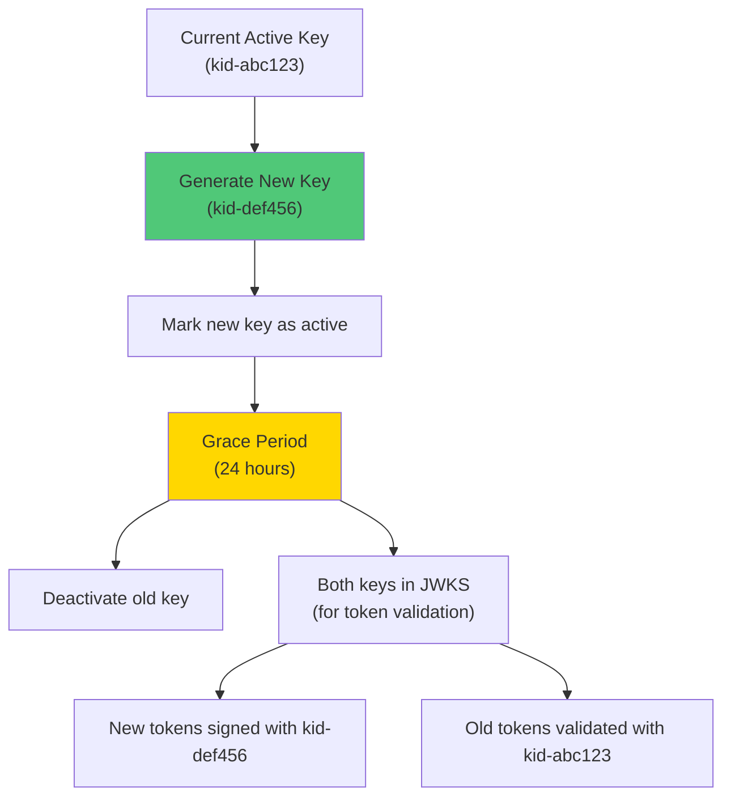

**Implementation:**
```java
public void rotateKey(String tenantId) {
    // 1. Generate new key
    TenantKey newKey = createAndStore(tenantId);
    
    // 2. Keep old key active for grace period
    // (both keys will be in JWKS for validation)
    
    // 3. After grace period, deactivate old key
    scheduler.schedule(() -> {
        tenantKeyRepository.updateActiveStatus(oldKeyId, false);
    }, Duration.ofHours(24));
}
```

### 2. SSO Configuration Best Practices

**Domain Whitelisting:**
```yaml
# Restrict auto-provisioning to specific domains
sso:
  microsoft:
    auto-provision-users: true
    allowed-domains:
      - example.com
      - partner.com
```

**Role Assignment:**
```java
// Auto-provisioned users get ADMIN role by default
// Consider using a more restrictive default role
AuthUser user = userService.registerOrReactivateFromSso(
    tenantId, email, givenName, familyName,
    List.of(UserRole.USER), // Instead of ADMIN
    provider
);
```

### 3. Token Lifetime Configuration

```yaml
# Balance security and user experience
spring:
  security:
    oauth2:
      authorizationserver:
        token:
          # Short-lived access tokens (reduce exposure)
          access-token-time-to-live: 3600s  # 1 hour
          
          # Longer refresh tokens (reduce re-authentication)
          refresh-token-time-to-live: 604800s  # 7 days
          
          # Short authorization codes (prevent replay)
          authorization-code-time-to-live: 300s  # 5 minutes
```

### 4. Monitoring and Alerting

**Critical Alerts:**
- Multiple active keys detected (indicates key rotation issue)
- Token validation failure rate > 5% (indicates configuration issue)
- SSO auto-provision failure rate > 10% (indicates domain policy issue)

**Performance Metrics:**
- Token generation latency (should be < 100ms)
- JWKS endpoint response time (should be < 50ms)
- MongoDB query latency (should be < 10ms)

---

## Related Documentation

- [Authorization Service](authorization_service.md) - Parent module with controllers and services
- [Authorization Service Controllers](authorization_service_controllers.md) - Login, registration, and password reset controllers
- [Authorization Service Services](authorization_service_services.md) - TenantKeyService and MongoAuthorizationService
- [Security Core](security_core.md) - Shared security utilities and JWT configuration
- [Gateway Service](gateway_service.md) - API Gateway that validates tokens
- [Data Layer Mongo](data_layer_mongo.md) - User and tenant data persistence

---

## Additional Resources

### OAuth2 and OIDC Standards
- [OAuth 2.0 RFC 6749](https://datatracker.ietf.org/doc/html/rfc6749)
- [OIDC Core Specification](https://openid.net/specs/openid-connect-core-1_0.html)
- [PKCE RFC 7636](https://datatracker.ietf.org/doc/html/rfc7636)

### Spring Security Documentation
- [Spring Security OAuth2 Authorization Server](https://docs.spring.io/spring-authorization-server/docs/current/reference/html/)
- [Spring Security OAuth2 Client](https://docs.spring.io/spring-security/reference/servlet/oauth2/client/index.html)
- [Spring Security JWT](https://docs.spring.io/spring-security/reference/servlet/oauth2/resource-server/jwt.html)

### OpenFrame Community
- [OpenMSP Slack Community](https://www.openmsp.ai/)
- [Join Slack](https://join.slack.com/t/openmsp/shared_invite/zt-36bl7mx0h-3~U2nFH6nqHqoTPXMaHEHA)

---

**Last Updated:** 2024  
**Module Version:** 1.0  
**Maintained By:** OpenFrame Security Team
