# Authorization Service Controllers

## Overview

The **Authorization Service Controllers** module provides the HTTP endpoint layer for OpenFrame's OAuth 2.0 authorization server, handling user authentication, tenant registration, invitation-based user onboarding, and password management workflows. This module implements RESTful controllers that orchestrate multi-tenant authentication flows, SSO integration, and secure user lifecycle management.

**Key Responsibilities:**
- User login and authentication UI endpoints
- Multi-tenant registration (standard and SSO-based)
- Invitation-based user registration with SSO support
- Password reset request and confirmation workflows
- OAuth 2.0 authorization flow integration
- Secure cookie-based state management for SSO flows

**Related Modules:**
- [Authorization Service Configuration](authorization_service_configuration.md) - Security and OAuth 2.0 server configuration
- [Authorization Service Services](authorization_service_services.md) - Business logic for authentication and authorization
- [Authorization Service](authorization_service.md) - Parent module overview

---

## Architecture

### Component Overview

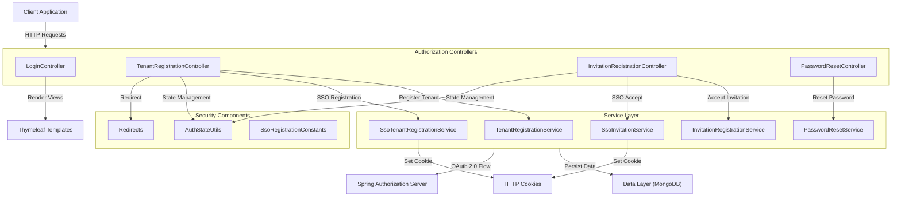

### Controller Responsibilities

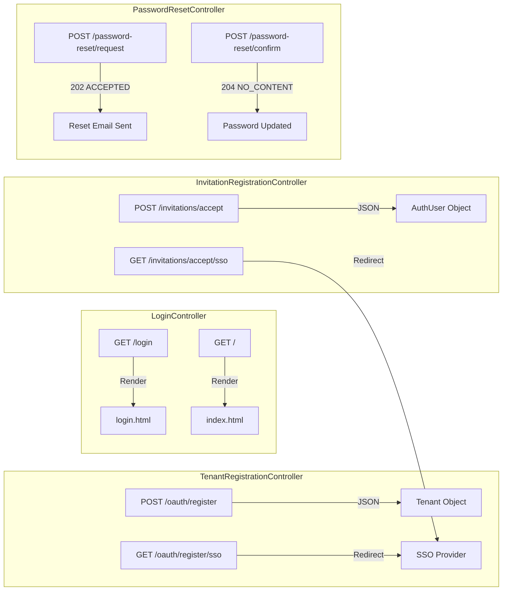

---

## Core Components

### 1. LoginController

**Purpose:** Provides UI endpoints for user authentication and application entry point.

**Endpoints:**

| Method | Path | Description | Response |
|--------|------|-------------|----------|
| `GET` | `/login` | Login page with error/logout messages | HTML view |
| `GET` | `/` | Application index/welcome page | HTML view |

**Key Features:**
- Error message display for failed authentication
- Logout confirmation messages
- Integration with Spring Security authentication flow
- Thymeleaf template rendering

**Request Flow:**

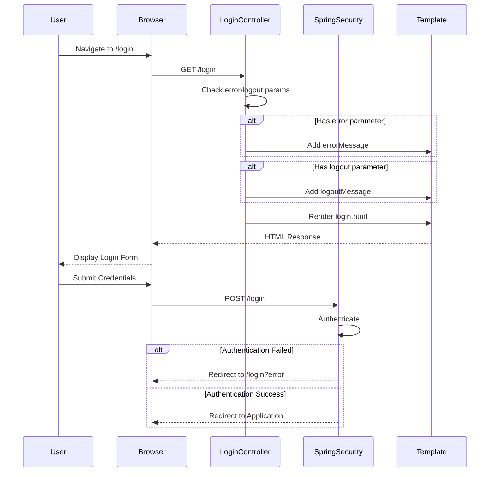

**Code Example:**

```java
@Controller
public class LoginController {

    @GetMapping("/login")
    public String login(Model model,
                        @RequestParam(value = "error", required = false) String error,
                        @RequestParam(value = "logout", required = false) String logout) {

        if (error != null) {
            model.addAttribute("errorMessage", "Invalid credentials");
        }

        if (logout != null) {
            model.addAttribute("logoutMessage", "Logged out successfully");
        }

        return "login";
    }

    @GetMapping("/")
    public String index(Model model) {
        model.addAttribute("message", "OpenFrame Multi-Tenant Authorization");
        return "index";
    }
}
```

---

### 2. TenantRegistrationController

**Purpose:** Handles new tenant (organization) registration via standard form submission or SSO integration.

**Endpoints:**

| Method | Path | Description | Request Body | Response |
|--------|------|-------------|--------------|----------|
| `POST` | `/oauth/register` | Register new tenant | `TenantRegistrationRequest` | `Tenant` (JSON) |
| `GET` | `/oauth/register/sso` | Initiate SSO-based registration | Query params | 303 Redirect |

**Key Features:**
- Multi-tenant organization creation
- SSO provider integration (Google, Microsoft, etc.)
- Secure cookie-based state management
- OAuth 2.0 authorization code flow integration
- HMAC-signed cookies for SSO state validation

**Standard Registration Flow:**

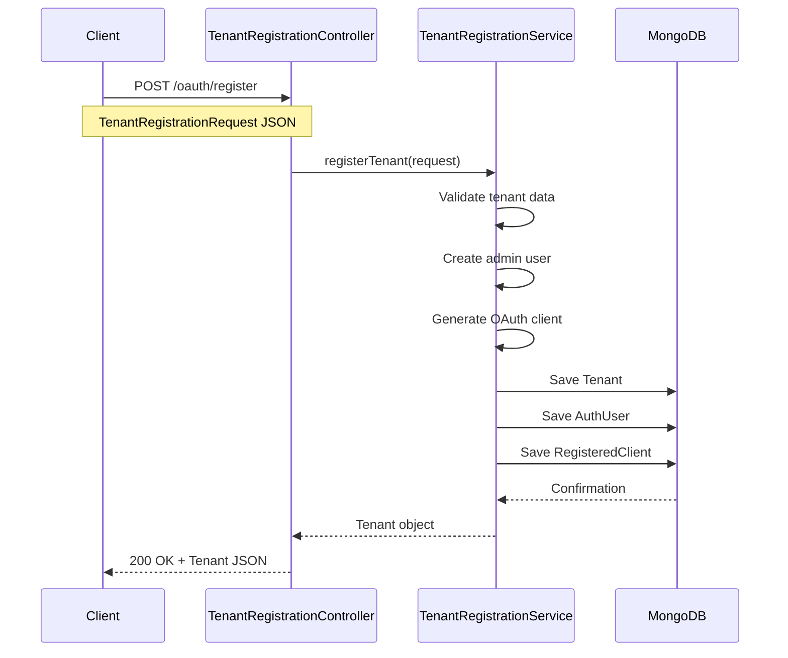

**SSO Registration Flow:**

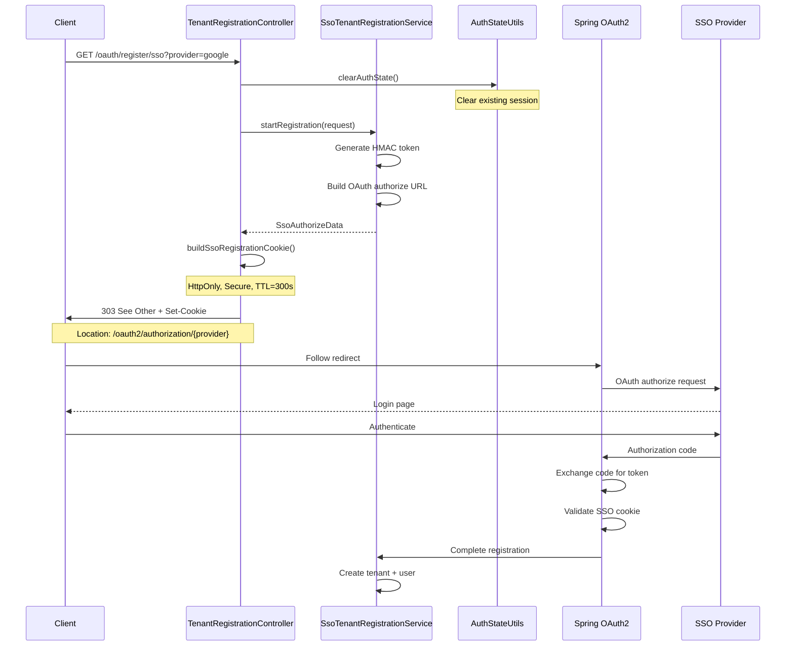

**Cookie Security:**

```java
private Cookie buildSsoRegistrationCookie(String value, int ttlSeconds) {
    Cookie cookie = new Cookie(COOKIE_SSO_REG, value);
    cookie.setHttpOnly(true);  // Prevent XSS attacks
    cookie.setSecure(true);    // HTTPS only
    cookie.setPath("/");       // Available to all paths
    cookie.setMaxAge(ttlSeconds); // Short-lived (5 minutes)
    return cookie;
}
```

**Request/Response Examples:**

**Standard Registration:**

```json
// POST /oauth/register
{
  "tenantName": "Acme Corporation",
  "adminEmail": "admin@acme.com",
  "adminPassword": "SecureP@ssw0rd",
  "organizationDomain": "acme.com"
}

// Response: 200 OK
{
  "id": "tenant_123",
  "name": "Acme Corporation",
  "domain": "acme.com",
  "createdAt": "2024-01-15T10:30:00Z",
  "status": "ACTIVE"
}
```

**SSO Registration:**

```text
GET /oauth/register/sso?provider=google&tenantName=Acme%20Corp

Response: 303 See Other
Location: /oauth2/authorization/google
Set-Cookie: SSO_REG=hmac_token_value; HttpOnly; Secure; Max-Age=300; Path=/
```

---

### 3. InvitationRegistrationController

**Purpose:** Handles user registration via email invitation, supporting both password-based and SSO-based onboarding.

**Endpoints:**

| Method | Path | Description | Request Body | Response |
|--------|------|-------------|--------------|----------|
| `POST` | `/invitations/accept` | Accept invitation with password | `InvitationRegistrationRequest` | `AuthUser` (JSON) |
| `GET` | `/invitations/accept/sso` | Accept invitation via SSO | Query params | 303 Redirect |

**Key Features:**
- Token-based invitation validation
- User creation within existing tenant
- SSO provider integration for invited users
- Secure state management with HMAC cookies
- Automatic tenant association

**Standard Invitation Flow:**

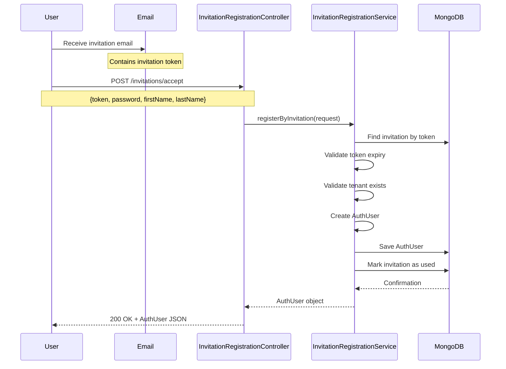

**SSO Invitation Flow:**

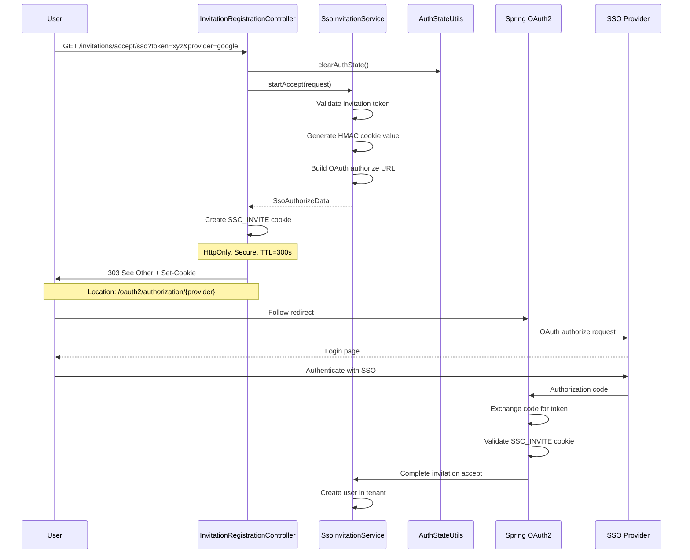

**Request/Response Examples:**

**Standard Invitation Accept:**

```json
// POST /invitations/accept
{
  "token": "inv_abc123xyz",
  "password": "SecureP@ssw0rd",
  "firstName": "John",
  "lastName": "Doe"
}

// Response: 200 OK
{
  "id": "user_456",
  "email": "john.doe@acme.com",
  "firstName": "John",
  "lastName": "Doe",
  "tenantId": "tenant_123",
  "roles": ["USER"],
  "createdAt": "2024-01-15T11:00:00Z"
}
```

**SSO Invitation Accept:**

```text
GET /invitations/accept/sso?token=inv_abc123xyz&provider=microsoft

Response: 303 See Other
Location: /oauth2/authorization/microsoft
Set-Cookie: SSO_INVITE=hmac_token_value; HttpOnly; Secure; Max-Age=300; Path=/
```

---

### 4. PasswordResetController

**Purpose:** Manages password reset workflows including token generation and password update confirmation.

**Endpoints:**

| Method | Path | Description | Request Body | Response |
|--------|------|-------------|--------------|----------|
| `POST` | `/password-reset/request` | Request password reset | `ResetRequest` | 202 ACCEPTED |
| `POST` | `/password-reset/confirm` | Confirm password reset | `ResetConfirm` | 204 NO_CONTENT |

**Key Features:**
- Email-based password reset tokens
- Token expiration validation
- Secure password hashing
- Case-insensitive email handling
- Asynchronous email delivery

**Password Reset Flow:**

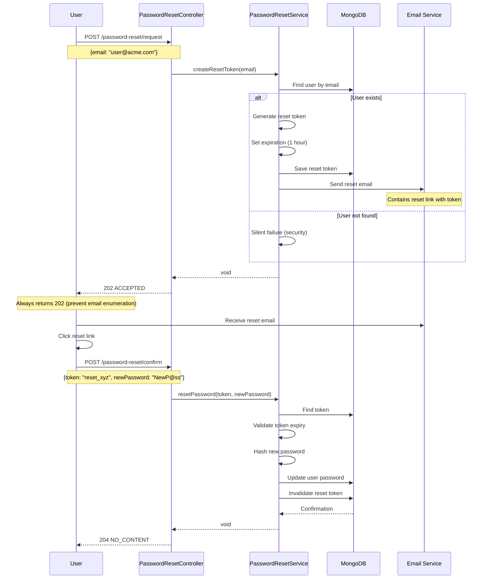

**Security Considerations:**

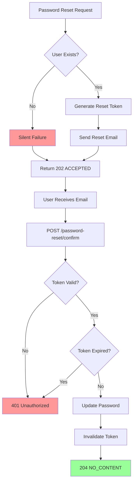

**Request/Response Examples:**

**Request Reset:**

```json
// POST /password-reset/request
{
  "email": "user@acme.com"
}

// Response: 202 ACCEPTED
// (No body - prevents email enumeration)
```

**Confirm Reset:**

```json
// POST /password-reset/confirm
{
  "token": "reset_abc123xyz",
  "newPassword": "NewSecureP@ssw0rd123"
}

// Response: 204 NO_CONTENT
// (No body - password updated successfully)
```

---

## Data Flow

### Complete Registration and Authentication Flow

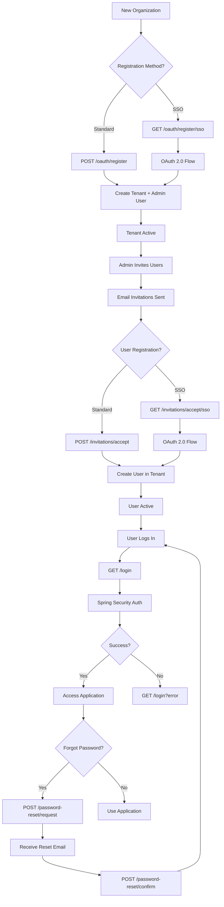

### SSO State Management

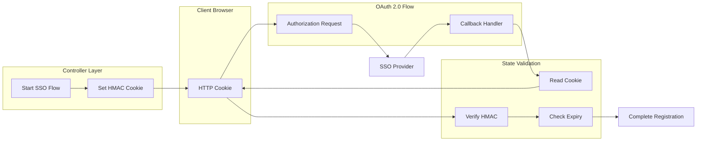

---

## Integration Points

### 1. Service Layer Dependencies

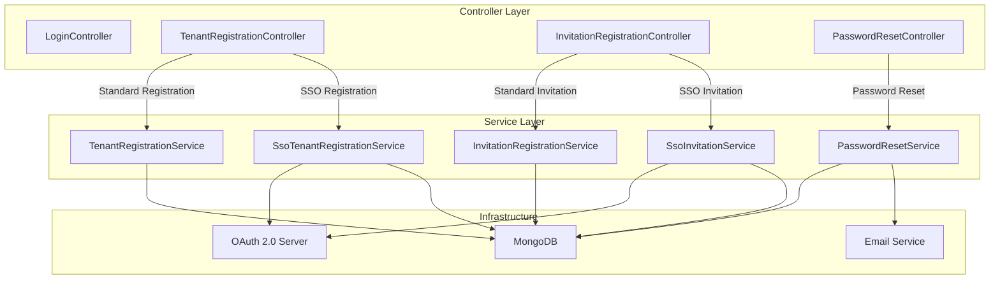

### 2. Security Integration

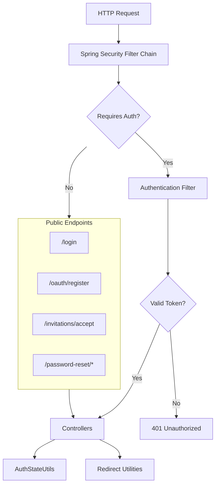

### 3. OAuth 2.0 Integration

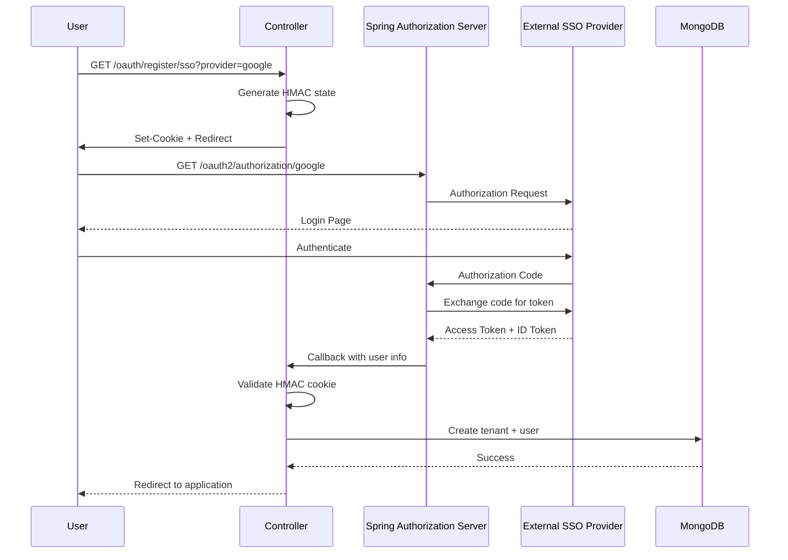

---

## API Reference

### LoginController

#### GET /login

**Description:** Display login page with optional error/logout messages.

**Parameters:**

| Name | Type | Required | Description |
|------|------|----------|-------------|
| `error` | Query | No | Indicates authentication failure |
| `logout` | Query | No | Indicates successful logout |

**Response:** HTML view (`login.html`)

**Example:**

```text
GET /login?error
GET /login?logout
```

#### GET /

**Description:** Display application index page.

**Response:** HTML view (`index.html`)

---

### TenantRegistrationController

#### POST /oauth/register

**Description:** Register a new tenant with admin user.

**Request Body:**

```typescript
interface TenantRegistrationRequest {
  tenantName: string;
  adminEmail: string;
  adminPassword: string;
  organizationDomain?: string;
}
```

**Response:** `200 OK`

```typescript
interface Tenant {
  id: string;
  name: string;
  domain: string;
  createdAt: string;
  status: string;
}
```

**Validation:**
- `tenantName`: Required, 3-100 characters
- `adminEmail`: Required, valid email format
- `adminPassword`: Required, minimum 8 characters, complexity rules
- `organizationDomain`: Optional, valid domain format

#### GET /oauth/register/sso

**Description:** Initiate SSO-based tenant registration.

**Parameters:**

| Name | Type | Required | Description |
|------|------|----------|-------------|
| `provider` | Query | Yes | SSO provider (google, microsoft, etc.) |
| `tenantName` | Query | Yes | Organization name |

**Response:** `303 See Other`

**Headers:**
- `Location`: OAuth 2.0 authorization endpoint
- `Set-Cookie`: `SSO_REG` cookie with HMAC state

**Example:**

```text
GET /oauth/register/sso?provider=google&tenantName=Acme%20Corp

Response:
303 See Other
Location: /oauth2/authorization/google
Set-Cookie: SSO_REG=hmac_value; HttpOnly; Secure; Max-Age=300; Path=/
```

---

### InvitationRegistrationController

#### POST /invitations/accept

**Description:** Accept invitation and create user account.

**Request Body:**

```typescript
interface InvitationRegistrationRequest {
  token: string;
  password: string;
  firstName: string;
  lastName: string;
}
```

**Response:** `200 OK`

```typescript
interface AuthUser {
  id: string;
  email: string;
  firstName: string;
  lastName: string;
  tenantId: string;
  roles: string[];
  createdAt: string;
}
```

**Validation:**
- `token`: Required, valid invitation token
- `password`: Required, minimum 8 characters
- `firstName`: Required, 1-50 characters
- `lastName`: Required, 1-50 characters

**Error Responses:**
- `400 Bad Request`: Invalid token or validation failure
- `404 Not Found`: Invitation not found or expired
- `409 Conflict`: User already exists

#### GET /invitations/accept/sso

**Description:** Accept invitation via SSO provider.

**Parameters:**

| Name | Type | Required | Description |
|------|------|----------|-------------|
| `token` | Query | Yes | Invitation token |
| `provider` | Query | Yes | SSO provider |

**Response:** `303 See Other`

**Headers:**
- `Location`: OAuth 2.0 authorization endpoint
- `Set-Cookie`: `SSO_INVITE` cookie with HMAC state

---

### PasswordResetController

#### POST /password-reset/request

**Description:** Request password reset token via email.

**Request Body:**

```typescript
interface ResetRequest {
  email: string;
}
```

**Response:** `202 ACCEPTED`

**Note:** Always returns 202 to prevent email enumeration attacks.

**Example:**

```json
POST /password-reset/request
{
  "email": "user@example.com"
}

Response: 202 ACCEPTED
```

#### POST /password-reset/confirm

**Description:** Confirm password reset with token.

**Request Body:**

```typescript
interface ResetConfirm {
  token: string;
  newPassword: string;
}
```

**Response:** `204 NO_CONTENT`

**Validation:**
- `token`: Required, valid reset token
- `newPassword`: Required, minimum 8 characters, complexity rules

**Error Responses:**
- `400 Bad Request`: Invalid token or password validation failure
- `401 Unauthorized`: Token expired or invalid
- `404 Not Found`: Token not found

---

## Security Considerations

### 1. Cookie Security

**HMAC-Signed Cookies:**

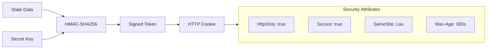

**Cookie Attributes:**
- `HttpOnly`: Prevents JavaScript access (XSS protection)
- `Secure`: HTTPS-only transmission
- `SameSite`: CSRF protection
- `Max-Age`: Short-lived (5 minutes for SSO flows)

### 2. Password Security

**Password Requirements:**
- Minimum 8 characters
- At least one uppercase letter
- At least one lowercase letter
- At least one digit
- At least one special character

**Password Storage:**
- BCrypt hashing with salt
- Cost factor: 12 (configurable)
- Never stored in plain text

### 3. Token Security

**Reset Token Generation:**

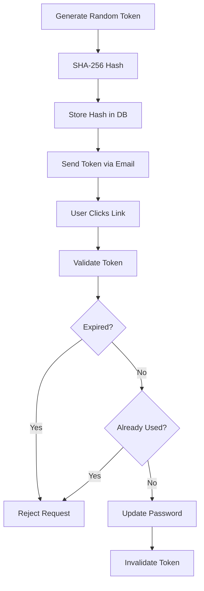

**Token Properties:**
- Cryptographically random (256 bits)
- One-time use only
- Expiration: 1 hour
- Stored as hash in database

### 4. CSRF Protection

**State Parameter Validation:**

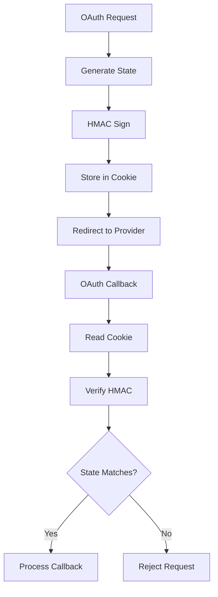

### 5. Rate Limiting

**Recommended Limits:**

| Endpoint | Limit | Window | Purpose |
|----------|-------|--------|---------|
| `/password-reset/request` | 3 requests | 1 hour | Prevent email spam |
| `/password-reset/confirm` | 5 attempts | 15 minutes | Prevent brute force |
| `/oauth/register` | 10 requests | 1 hour | Prevent abuse |
| `/invitations/accept` | 5 attempts | 15 minutes | Prevent brute force |

---

## Error Handling

### Standard Error Responses

```typescript
interface ErrorResponse {
  timestamp: string;
  status: number;
  error: string;
  message: string;
  path: string;
}
```

### Common Error Scenarios

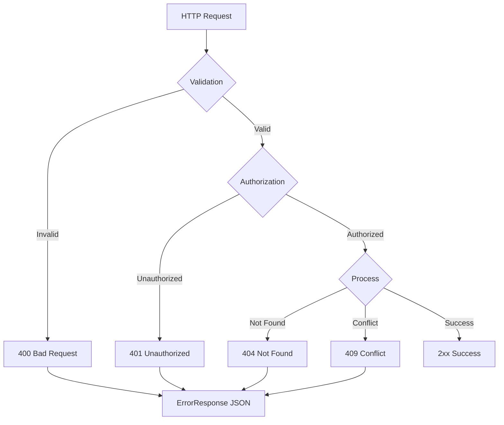

### Error Examples

**Validation Error:**

```json
POST /oauth/register
{
  "tenantName": "A",
  "adminEmail": "invalid-email",
  "adminPassword": "weak"
}

Response: 400 Bad Request
{
  "timestamp": "2024-01-15T10:30:00Z",
  "status": 400,
  "error": "Bad Request",
  "message": "Validation failed: tenantName must be at least 3 characters; adminEmail must be valid; adminPassword must meet complexity requirements",
  "path": "/oauth/register"
}
```

**Token Expired:**

```json
POST /password-reset/confirm
{
  "token": "expired_token",
  "newPassword": "NewP@ssw0rd"
}

Response: 401 Unauthorized
{
  "timestamp": "2024-01-15T10:30:00Z",
  "status": 401,
  "error": "Unauthorized",
  "message": "Reset token has expired",
  "path": "/password-reset/confirm"
}
```

---

## Configuration

### Application Properties

```yaml
# Server Configuration
server:
  port: 9000
  servlet:
    session:
      cookie:
        http-only: true
        secure: true
        same-site: lax

# Security Configuration
openframe:
  security:
    password:
      min-length: 8
      require-uppercase: true
      require-lowercase: true
      require-digit: true
      require-special: true
    
    reset-token:
      expiration-hours: 1
      length: 32
    
    sso:
      cookie-ttl-seconds: 300
      hmac-secret: ${SSO_HMAC_SECRET}
    
    rate-limit:
      password-reset-request:
        max-attempts: 3
        window-hours: 1
      password-reset-confirm:
        max-attempts: 5
        window-minutes: 15

# Email Configuration
spring:
  mail:
    host: ${SMTP_HOST}
    port: ${SMTP_PORT}
    username: ${SMTP_USERNAME}
    password: ${SMTP_PASSWORD}
    properties:
      mail:
        smtp:
          auth: true
          starttls:
            enable: true

# Template Configuration
spring:
  thymeleaf:
    cache: false
    prefix: classpath:/templates/
    suffix: .html
```

### Environment Variables

| Variable | Description | Required | Default |
|----------|-------------|----------|---------|
| `SSO_HMAC_SECRET` | HMAC secret for SSO state | Yes | - |
| `SMTP_HOST` | Email server host | Yes | - |
| `SMTP_PORT` | Email server port | Yes | - |
| `SMTP_USERNAME` | Email username | Yes | - |
| `SMTP_PASSWORD` | Email password | Yes | - |
| `PASSWORD_RESET_URL` | Base URL for reset links | Yes | - |
| `INVITATION_URL` | Base URL for invitation links | Yes | - |

---

## Testing

### Unit Test Examples

**LoginController Test:**

```java
@WebMvcTest(LoginController.class)
class LoginControllerTest {

    @Autowired
    private MockMvc mockMvc;

    @Test
    void testLoginPageWithError() throws Exception {
        mockMvc.perform(get("/login").param("error", ""))
            .andExpect(status().isOk())
            .andExpect(view().name("login"))
            .andExpect(model().attribute("errorMessage", "Invalid credentials"));
    }

    @Test
    void testLoginPageWithLogout() throws Exception {
        mockMvc.perform(get("/login").param("logout", ""))
            .andExpect(status().isOk())
            .andExpect(view().name("login"))
            .andExpect(model().attribute("logoutMessage", "Logged out successfully"));
    }
}
```

**TenantRegistrationController Test:**

```java
@WebMvcTest(TenantRegistrationController.class)
class TenantRegistrationControllerTest {

    @Autowired
    private MockMvc mockMvc;

    @MockBean
    private TenantRegistrationService registrationService;

    @Test
    void testRegisterTenant() throws Exception {
        TenantRegistrationRequest request = new TenantRegistrationRequest();
        request.setTenantName("Acme Corp");
        request.setAdminEmail("admin@acme.com");
        request.setAdminPassword("SecureP@ss123");

        Tenant tenant = new Tenant();
        tenant.setId("tenant_123");
        tenant.setName("Acme Corp");

        when(registrationService.registerTenant(any())).thenReturn(tenant);

        mockMvc.perform(post("/oauth/register")
                .contentType(MediaType.APPLICATION_JSON)
                .content(objectMapper.writeValueAsString(request)))
            .andExpect(status().isOk())
            .andExpect(jsonPath("$.id").value("tenant_123"))
            .andExpect(jsonPath("$.name").value("Acme Corp"));
    }
}
```

### Integration Test Examples

**Password Reset Flow Test:**

```java
@SpringBootTest
@AutoConfigureMockMvc
class PasswordResetIntegrationTest {

    @Autowired
    private MockMvc mockMvc;

    @Autowired
    private PasswordResetService passwordResetService;

    @Test
    void testCompletePasswordResetFlow() throws Exception {
        // Request reset
        mockMvc.perform(post("/password-reset/request")
                .contentType(MediaType.APPLICATION_JSON)
                .content("{\"email\":\"user@example.com\"}"))
            .andExpect(status().isAccepted());

        // Simulate token retrieval (in real scenario, from email)
        String token = passwordResetService.getLatestTokenForEmail("user@example.com");

        // Confirm reset
        mockMvc.perform(post("/password-reset/confirm")
                .contentType(MediaType.APPLICATION_JSON)
                .content("{\"token\":\"" + token + "\",\"newPassword\":\"NewP@ss123\"}"))
            .andExpect(status().isNoContent());
    }
}
```

---

## Monitoring and Observability

### Metrics

**Key Metrics to Track:**

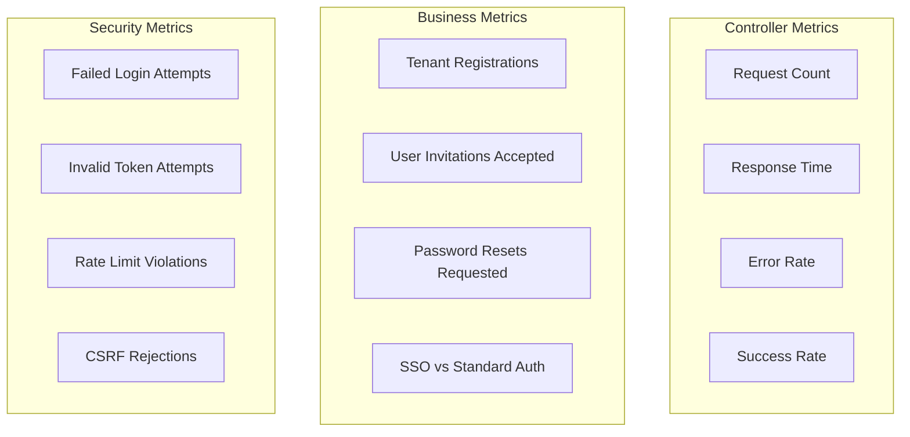

**Prometheus Metrics:**

```yaml
# Request metrics
http_server_requests_seconds_count{uri="/oauth/register",method="POST",status="200"}
http_server_requests_seconds_sum{uri="/oauth/register",method="POST",status="200"}

# Business metrics
tenant_registrations_total{method="standard"}
tenant_registrations_total{method="sso"}
invitation_acceptances_total{method="standard"}
invitation_acceptances_total{method="sso"}
password_resets_total{status="requested"}
password_resets_total{status="confirmed"}

# Security metrics
authentication_failures_total{endpoint="/login"}
invalid_token_attempts_total{type="reset"}
rate_limit_violations_total{endpoint="/password-reset/request"}
```

### Logging

**Log Levels:**

```java
// INFO - Successful operations
log.info("Tenant registered successfully: tenantId={}", tenant.getId());
log.info("User accepted invitation: userId={}, tenantId={}", user.getId(), user.getTenantId());

// WARN - Security events
log.warn("Invalid password reset token attempt: email={}", email);
log.warn("Rate limit exceeded for password reset: ip={}", request.getRemoteAddr());

// ERROR - Failures
log.error("Failed to send password reset email: email={}", email, exception);
log.error("SSO registration failed: provider={}, error={}", provider, error);
```

**Structured Logging Example:**

```json
{
  "timestamp": "2024-01-15T10:30:00Z",
  "level": "INFO",
  "logger": "com.openframe.authz.controller.TenantRegistrationController",
  "message": "Tenant registered successfully",
  "tenantId": "tenant_123",
  "tenantName": "Acme Corp",
  "registrationMethod": "sso",
  "ssoProvider": "google",
  "traceId": "abc123xyz"
}
```

---

## Best Practices

### 1. Controller Design

✅ **DO:**
- Keep controllers thin - delegate to services
- Use DTOs for request/response
- Validate input with `@Valid`
- Return appropriate HTTP status codes
- Use `@ResponseStatus` for clarity

❌ **DON'T:**
- Put business logic in controllers
- Return domain entities directly
- Ignore validation
- Use generic 200 OK for everything

### 2. Security

✅ **DO:**
- Always use HTTPS in production
- Set secure cookie attributes
- Validate all input
- Use HMAC for state management
- Implement rate limiting

❌ **DON'T:**
- Store sensitive data in cookies
- Trust client-side validation
- Expose internal error details
- Allow unlimited requests

### 3. Error Handling

✅ **DO:**
- Return consistent error format
- Log errors with context
- Use appropriate status codes
- Provide helpful error messages

❌ **DON'T:**
- Expose stack traces to clients
- Return generic "error" messages
- Ignore validation errors
- Log sensitive data

### 4. API Design

✅ **DO:**
- Use RESTful conventions
- Version your APIs
- Document all endpoints
- Provide examples

❌ **DON'T:**
- Mix REST and RPC styles
- Break backward compatibility
- Leave endpoints undocumented
- Use inconsistent naming

---

## Troubleshooting

### Common Issues

#### 1. SSO Registration Fails

**Symptoms:**
- Redirect to SSO provider fails
- "Invalid state" error after callback

**Diagnosis:**

```bash
# Check cookie is set
curl -v https://auth.openframe.ai/oauth/register/sso?provider=google

# Verify HMAC secret is configured
echo $SSO_HMAC_SECRET

# Check OAuth client configuration
kubectl get secret oauth-clients -o yaml
```

**Solutions:**
- Verify `SSO_HMAC_SECRET` is set and consistent
- Check cookie domain matches application domain
- Ensure HTTPS is enabled
- Verify OAuth client credentials

#### 2. Password Reset Email Not Received

**Symptoms:**
- User doesn't receive reset email
- 202 response but no email

**Diagnosis:**

```bash
# Check email service logs
kubectl logs -l app=authorization-service | grep "password-reset"

# Verify SMTP configuration
kubectl get configmap email-config -o yaml

# Test SMTP connectivity
telnet smtp.example.com 587
```

**Solutions:**
- Verify SMTP credentials
- Check email service is running
- Verify email address is valid
- Check spam folder

#### 3. Invitation Token Invalid

**Symptoms:**
- "Invalid token" error when accepting invitation
- Token expired message

**Diagnosis:**

```bash
# Check token in database
mongo openframe --eval 'db.invitations.find({token: "inv_xyz"})'

# Verify token expiration
mongo openframe --eval 'db.invitations.find({token: "inv_xyz"}).forEach(i => print(i.expiresAt))'
```

**Solutions:**
- Verify token hasn't expired
- Check token hasn't been used
- Ensure invitation exists in database
- Regenerate invitation if needed

---

## Related Documentation

- [Authorization Service](authorization_service.md) - Parent module overview
- [Authorization Service Configuration](authorization_service_configuration.md) - Security and OAuth 2.0 configuration
- [Authorization Service Services](authorization_service_services.md) - Business logic layer
- [API Service REST Controllers](api_service_rest_controllers.md) - Similar controller patterns
- [Security Core](security_core.md) - JWT and security utilities

---

## Additional Resources

### Spring Security OAuth 2.0
- [Spring Authorization Server Documentation](https://docs.spring.io/spring-authorization-server/docs/current/reference/html/)
- [OAuth 2.0 RFC 6749](https://datatracker.ietf.org/doc/html/rfc6749)

### Multi-Tenancy
- [Multi-Tenant Architecture Patterns](https://docs.microsoft.com/en-us/azure/architecture/guide/multitenant/overview)

### Security Best Practices
- [OWASP Authentication Cheat Sheet](https://cheatsheetseries.owasp.org/cheatsheets/Authentication_Cheat_Sheet.html)
- [OWASP Password Storage Cheat Sheet](https://cheatsheetseries.owasp.org/cheatsheets/Password_Storage_Cheat_Sheet.html)

---

**Questions or Issues?**  
Join our OpenMSP Slack community: https://www.openmsp.ai/  
Slack invite: https://join.slack.com/t/openmsp/shared_invite/zt-36bl7mx0h-3~U2nFH6nqHqoTPXMaHEHA
