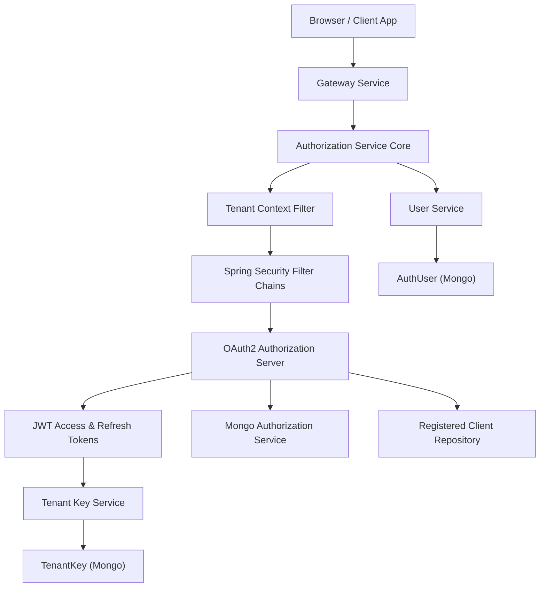
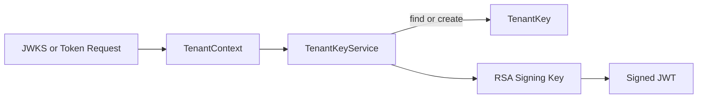
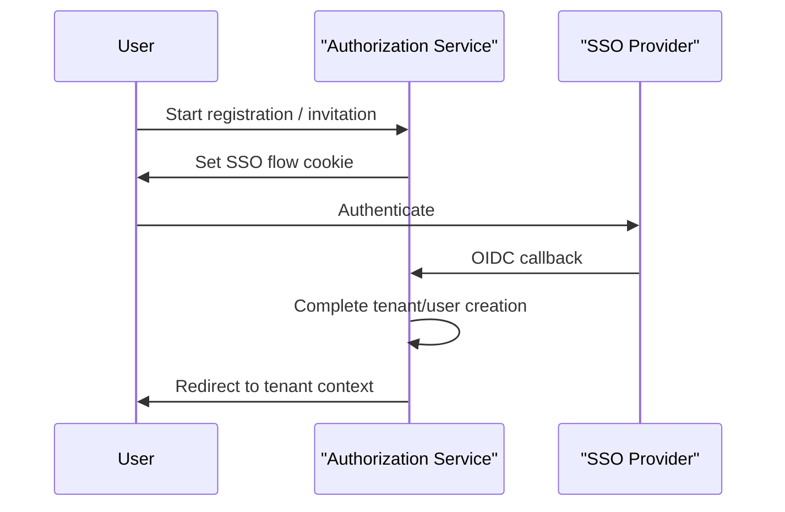

# Authorization Service Core

## Overview
The **authorization_service_core** module implements OpenFrame's multi-tenant OAuth2/OIDC authorization server. It is responsible for authentication, authorization, SSO onboarding, tenant-aware token issuance, and secure key management.

This module is built on **Spring Security OAuth2 Authorization Server** and is designed to work in a fully multi-tenant environment where each tenant has isolated signing keys, users, and SSO configuration.

---

## Responsibilities

- Act as an OAuth2 Authorization Server (OIDC compliant)
- Issue JWT access and refresh tokens per tenant
- Resolve tenants dynamically from request paths, query parameters, or session
- Support password login and SSO (Google, Microsoft)
- Handle tenant onboarding and invitation-based registration
- Persist OAuth2 authorizations and registered clients in MongoDB
- Manage per-tenant signing keys and JWKS

---

## High-Level Architecture

---

## Tenant Awareness

All authentication and authorization operations are **tenant-scoped**.

### Tenant Resolution
Tenant resolution is handled by `TenantContextFilter`:

- Extracts tenant ID from:
  - URL path segments (for OAuth/OIDC endpoints)
  - Query parameter `tenant`
  - Existing HTTP session
- Stores tenant ID in a thread-local `TenantContext`
- Synchronizes tenant ID with HTTP session

This ensures that:
- Tokens are issued with the correct tenant context
- Signing keys are resolved per tenant
- User lookups are tenant-isolated

---

## Security Configuration

The module defines **two security filter chains**:

### 1. Authorization Server Filter Chain
Defined in `AuthorizationServerConfig`:

- Handles `/oauth2/**`, `/.well-known/**`, and OIDC endpoints
- Enables:
  - OAuth2 Authorization Server
  - OIDC support
  - JWT resource server
- Uses per-tenant JWKS via `TenantKeyService`
- Customizes JWT claims:
  - `tenant_id`
  - `userId`
  - `roles`

### 2. Default Application Security
Defined in `SecurityConfig`:

- Handles login pages, SSO, invitations, password reset
- Supports:
  - Form login
  - OAuth2 login (SSO)
- Integrates custom success handlers for SSO flows

---

## Token Issuance and Signing

Each tenant has its **own RSA key pair**:

- Keys are generated on-demand
- Private keys are encrypted before storage
- Public keys are exposed via JWKS

### Key Flow

---

## OAuth2 Authorization Persistence

Authorizations are persisted using MongoDB:

- `MongoAuthorizationService` implements `OAuth2AuthorizationService`
- Supports:
  - Authorization codes
  - PKCE parameters
  - Access tokens
  - Refresh tokens

This enables:
- Horizontal scaling
- Restart-safe OAuth flows
- Full PKCE compliance

---

## SSO and Dynamic Client Registration

### Dynamic Client Resolution

- `DynamicClientRegistrationRepository` resolves OAuth clients per tenant
- Uses tenant-aware SSO configuration

### Supported Providers

- Google
- Microsoft (multi-tenant aware issuer validation)

Each provider:
- Has default system-level credentials
- Can be overridden per tenant

---

## Registration and Onboarding Flows

### Tenant Registration

- Password-based registration
- SSO-based tenant onboarding
- Temporary onboarding tenant (`sso-onboarding`) is used

### Invitation Registration

- Accept invitations via password or SSO
- Secure, short-lived cookies maintain flow state

### Flow Overview

---

## Password Reset

- Secure reset tokens generated using `SecureRandom`
- Stateless token confirmation endpoint
- Password complexity enforced at DTO validation level

---

## Extensibility Hooks

The module provides multiple extension points:

- `RegistrationProcessor`
- `UserDeactivationProcessor`
- `UserEmailVerifiedProcessor`
- `GlobalDomainPolicyLookup`

Default implementations are no-ops and can be overridden by downstream services.

---

## Related Modules

This module integrates closely with:

- **api_service_core** – consumes issued JWTs
- **gateway_service_core** – routes auth traffic
- **data_persistence_mongo** – user, tenant, token storage
- **security_oauth_and_jwt** – shared OAuth/JWT utilities

Refer to those modules' documentation for deeper integration details.

---

## Summary

The `authorization_service_core` module is the security backbone of OpenFrame:

- Fully multi-tenant OAuth2/OIDC server
- Secure, per-tenant key management
- Flexible SSO and onboarding flows
- Mongo-backed persistence for scale and resilience

It is designed to be extended, customized, and safely operated in complex MSP environments.
