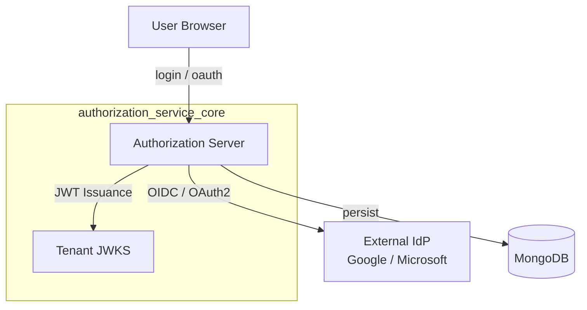
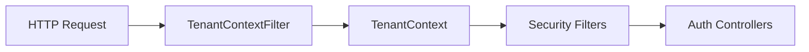
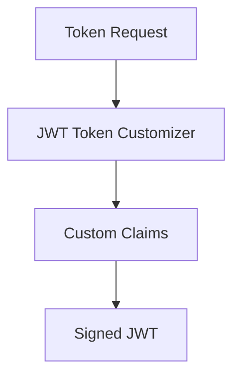
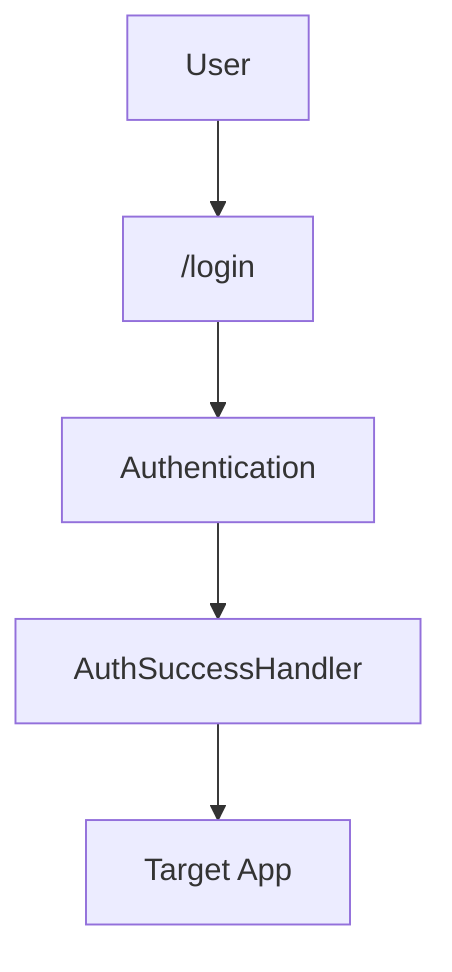
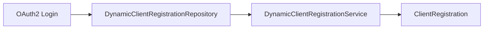
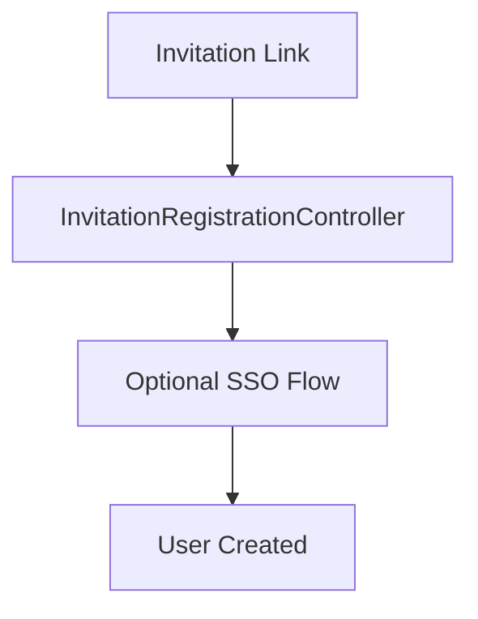
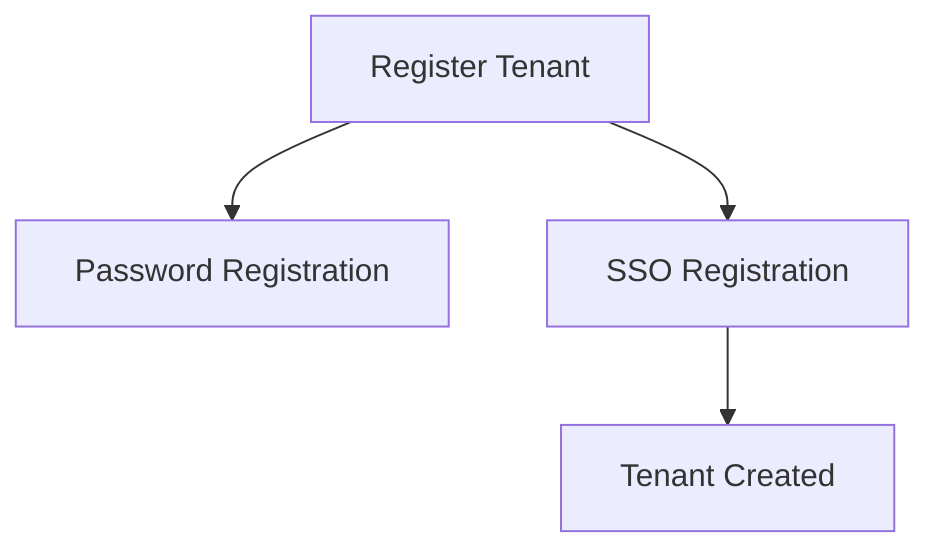
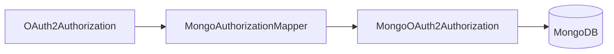

# Authorization Service Core

## Overview
The **authorization_service_core** module implements OpenFrame’s multi-tenant OAuth2 / OpenID Connect authorization server. It is responsible for:

- Acting as an OAuth2 Authorization Server (Spring Authorization Server)
- Managing tenant-aware JWT signing keys
- Handling login, SSO, invitations, password resets, and tenant onboarding
- Persisting OAuth2 authorizations and registered clients in MongoDB
- Enforcing tenant isolation across all authentication and authorization flows

This module is consumed by the **authorization server service** and sits at the center of OpenFrame’s security architecture.

---

## High-Level Architecture

**Key characteristics**:
- Fully **multi-tenant** (tenant resolved per request)
- **Per-tenant signing keys** for JWT isolation
- Supports **password**, **SSO**, **invitations**, and **auto-provisioning**

---

## Tenant Resolution Model

All authorization logic depends on the resolved tenant context.

### Core Components
- **TenantContext** – Thread-local storage for current tenant ID
- **TenantContextFilter** – Extracts tenant ID from:
  - URL path
  - Query parameters
  - HTTP session

Tenant context is cleared after every request to avoid leakage.

---

## Authorization Server Configuration

### AuthorizationServerConfig
This configuration enables Spring Authorization Server and defines:

- OAuth2 & OIDC endpoints
- JWT encoder/decoder
- Tenant-aware JWKS endpoint
- Custom JWT claims

**Key behaviors**:
- Multiple issuers allowed (multi-tenant)
- JWTs include:
  - `tenant_id`
  - `userId`
  - `roles`

### TenantKeyService
Manages per-tenant RSA key pairs:

- Automatically generates keys if none exist
- Encrypts private keys at rest
- Serves keys through JWKS

---

## Security Configuration

### SecurityConfig
Handles **non-authorization-server** endpoints:

- Form login
- OAuth2 login (SSO)
- Public endpoints (login, discovery, invitations)

### Supported Authentication Modes
- Username / password
- Google SSO
- Microsoft SSO

Microsoft SSO includes custom issuer validation for multi-tenant Azure AD.

---

## SSO and Dynamic Client Registration

### DynamicClientRegistrationRepository
Loads OAuth2 client registrations dynamically per tenant.

### Client Registration Strategies
- **GoogleClientRegistrationStrategy**
- **MicrosoftClientRegistrationStrategy**

These strategies combine:
- System defaults
- Tenant-specific overrides

---

## User Lifecycle Flows

### Login & Authentication Success

Handled by **AuthSuccessHandler**:
- Updates last login timestamp
- Marks email verified for trusted IdPs
- Delegates to SSO flow handlers

---

### Invitations

Controllers:
- **InvitationRegistrationController** – Accept invitation (password or SSO)

---

### Tenant Registration

Controllers:
- **TenantRegistrationController**
- **TenantDiscoveryController**

---

### Password Reset

Handled by **PasswordResetController**:
- Secure reset token generation
- Strong password validation

---

## OAuth2 Authorization Persistence

### MongoAuthorizationService
Stores OAuth2 state in MongoDB:

- Authorization codes
- Access tokens
- Refresh tokens
- PKCE parameters

Ensures PKCE parameters survive authorization code exchanges.

---

## Extension Points

The module provides safe defaults that can be overridden:

- **RegistrationProcessor** – Hook into tenant/user creation
- **UserDeactivationProcessor** – React to deactivation
- **UserEmailVerifiedProcessor** – React to email verification
- **GlobalDomainPolicyLookup** – Domain-based tenant auto-mapping

---

## How This Module Fits in OpenFrame

- Used by **authorization server service**
- Consumed by **gateway** and **API services** via JWT validation
- Integrates with **MongoDB**, **Redis**, and **external IdPs**

This module is the **single source of truth for identity, tenants, and tokens** across the OpenFrame platform.

---

## Summary

✅ Multi-tenant OAuth2 & OIDC authorization server  
✅ Per-tenant JWT signing keys  
✅ First-class SSO and invitation flows  
✅ MongoDB-backed authorization persistence  
✅ Designed for extensibility and secure defaults
