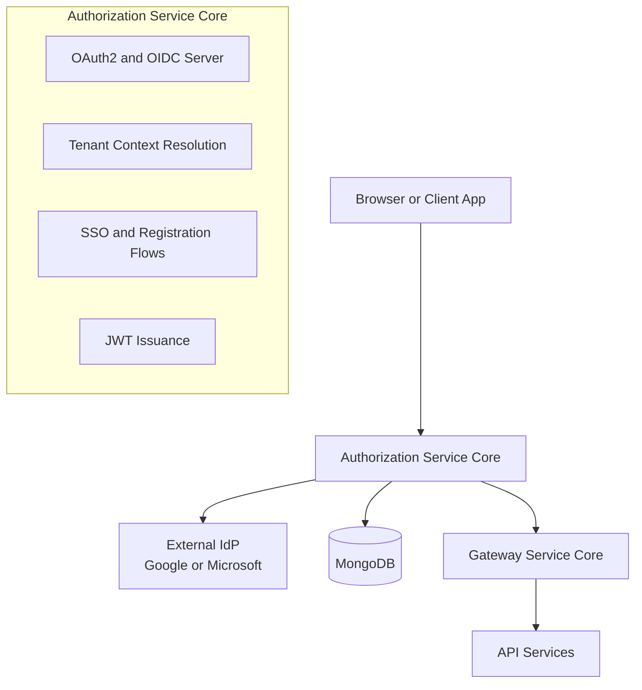
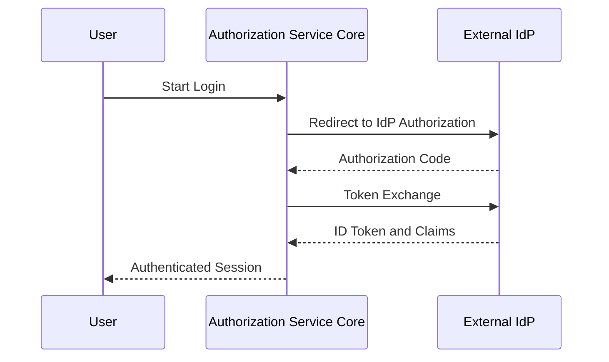

# Authorization Service Core

## Overview

The **Authorization Service Core** is the central identity, authentication, and authorization authority for the OpenFrame platform. It implements a **multi-tenant OAuth2 and OpenID Connect (OIDC) authorization server** with strong tenant isolation, dynamic Single Sign-On (SSO) configuration, invitation-based onboarding, and secure token lifecycle management.

This module is responsible for:
- Issuing OAuth2 access and refresh tokens per tenant
- Acting as an OpenID Provider (OIDC)
- Handling username/password authentication and SSO (Google, Microsoft)
- Managing tenant-aware security context resolution
- Persisting OAuth2 authorizations and registered clients
- Supporting invitation-based user onboarding and tenant registration

The Authorization Service Core is consumed by the API Gateway, API services, and client applications to establish trust and enforce access control across the OpenFrame ecosystem.

---

## Architectural Role

At a high level, the Authorization Service Core sits at the heart of the platform’s security model:

- **Upstream**: Browsers, agents, and external clients initiating login or OAuth2 flows
- **Downstream**: Gateway and API services validating JWTs and enforcing authorization
- **Persistence**: MongoDB-backed storage for OAuth clients, authorizations, users, and tenant keys

### High-Level Architecture

---

## Core Responsibilities

### 1. OAuth2 and OpenID Connect Authorization Server

The Authorization Service Core is implemented using Spring Authorization Server and provides:

- Authorization Code and Refresh Token grants
- PKCE support for public clients
- OIDC endpoints such as `/oauth2/authorize`, `/oauth2/token`, and `/.well-known/openid-configuration`
- Multi-issuer support to allow tenant-specific issuers

Each tenant has its own logical issuer and signing keys, ensuring strict cryptographic isolation.

### 2. Multi-Tenant Context Resolution

Tenant awareness is enforced at the earliest point in request processing using a servlet filter and thread-local context.

#### Tenant Context Flow

**Key characteristics:**
- Tenant identifiers are resolved from URL paths, query parameters, or session attributes
- Context switching is carefully controlled to support SSO onboarding flows
- Tenant context is always cleared at the end of request processing

### 3. JWT Issuance and Tenant-Specific Signing Keys

Each tenant has its own RSA key pair used to sign JWT access tokens.

- Keys are generated on-demand when a tenant first issues tokens
- Private keys are encrypted at rest
- Public keys are exposed via tenant-aware JWKS endpoints

#### Token Customization

Access tokens include custom claims such as:
- `tenant_id`
- `userId`
- `roles` (with role expansion, e.g., OWNER implies ADMIN)

This allows downstream services to enforce authorization without additional database lookups.

---

## Security Configuration Layers

The Authorization Service Core uses **two distinct security filter chains**:

### Authorization Server Security Chain

This chain applies only to OAuth2 and OIDC endpoints:

- Requires authentication for all authorization server requests
- Disables CSRF for OAuth endpoints
- Enables JWT-based resource server support
- Handles browser-based and API-based authentication failures appropriately

### Default Application Security Chain

This chain secures all non-authorization-server endpoints:

- Supports form login for username/password authentication
- Integrates OAuth2 login for SSO providers
- Permits unauthenticated access to public endpoints such as:
  - Login
  - Tenant discovery
  - Invitations
  - Password reset
  - SSO provider discovery

---

## Authentication and Login Flows

### Username and Password Login

- Credentials are validated against tenant-scoped users
- Passwords are securely hashed using BCrypt
- Successful authentication updates the user’s last login timestamp

### Single Sign-On (SSO)

The module supports dynamic, tenant-specific SSO using OIDC providers.

Supported providers include:
- Google
- Microsoft (including multi-tenant Azure AD)

Client registrations are resolved dynamically at runtime based on tenant configuration.

---

## Registration and Onboarding

### Tenant Discovery

For returning users, the service can discover the appropriate tenant and authentication providers based on email address. This enables a smooth multi-tenant login experience.

### Tenant Registration

New tenants can be registered via:
- Traditional username/password registration
- SSO-based registration flows

During SSO registration:
- A temporary onboarding tenant context is used
- Tenant creation is finalized after successful IdP authentication
- The user is automatically provisioned as an administrator

### Invitation-Based User Registration

Users can be invited to existing tenants:

- Invitations can be accepted with a password or via SSO
- SSO invitation flows use short-lived, signed cookies to preserve state
- Users are automatically associated with the correct tenant

---

## OAuth2 Client and Authorization Persistence

### Registered Clients

OAuth2 clients are stored in MongoDB and mapped to Spring Authorization Server’s `RegisteredClient` model. Persisted attributes include:

- Client ID and secret
- Grant types and redirect URIs
- Token lifetimes
- PKCE and consent requirements

### Authorization Storage

Issued authorizations are persisted with full fidelity, including:
- Authorization codes
- Access and refresh tokens
- PKCE parameters
- Token metadata and expiration timestamps

This enables:
- Token introspection and revocation
- Refresh token flows
- Robust recovery across restarts

---

## Extensibility and Customization

The Authorization Service Core is designed to be extended without modification:

- **Registration processors** allow custom logic before and after tenant or user registration
- **User lifecycle processors** hook into deactivation and email verification events
- **Global domain policies** can be introduced to control auto-provisioning based on email domains

Default implementations are provided as no-ops and are automatically replaced when custom beans are defined.

---

## Supporting Utilities

The module includes several focused utilities that support secure operations:

- OIDC user claim resolution helpers
- Secure password reset token generation
- Authentication state cleanup helpers
- Safe redirect utilities for browser-based flows

These utilities ensure consistency and reduce duplication across controllers and security handlers.

---

## How This Module Fits Into the Platform

The Authorization Service Core is foundational to OpenFrame:

- All other backend services trust it as the **source of identity**
- The Gateway validates JWTs issued by this service
- API services rely on embedded claims for authorization decisions
- Client applications depend on it for login, SSO, and onboarding flows

Without this module, secure multi-tenant operation across OpenFrame would not be possible.

---

## Summary

The **Authorization Service Core** provides a robust, extensible, and tenant-aware authentication and authorization foundation for OpenFrame. By combining OAuth2, OIDC, SSO, and strong tenant isolation, it enables secure access control while supporting flexible onboarding and identity workflows across the entire platform.