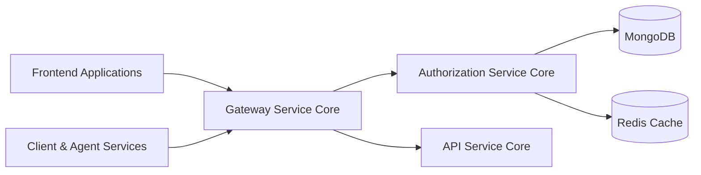
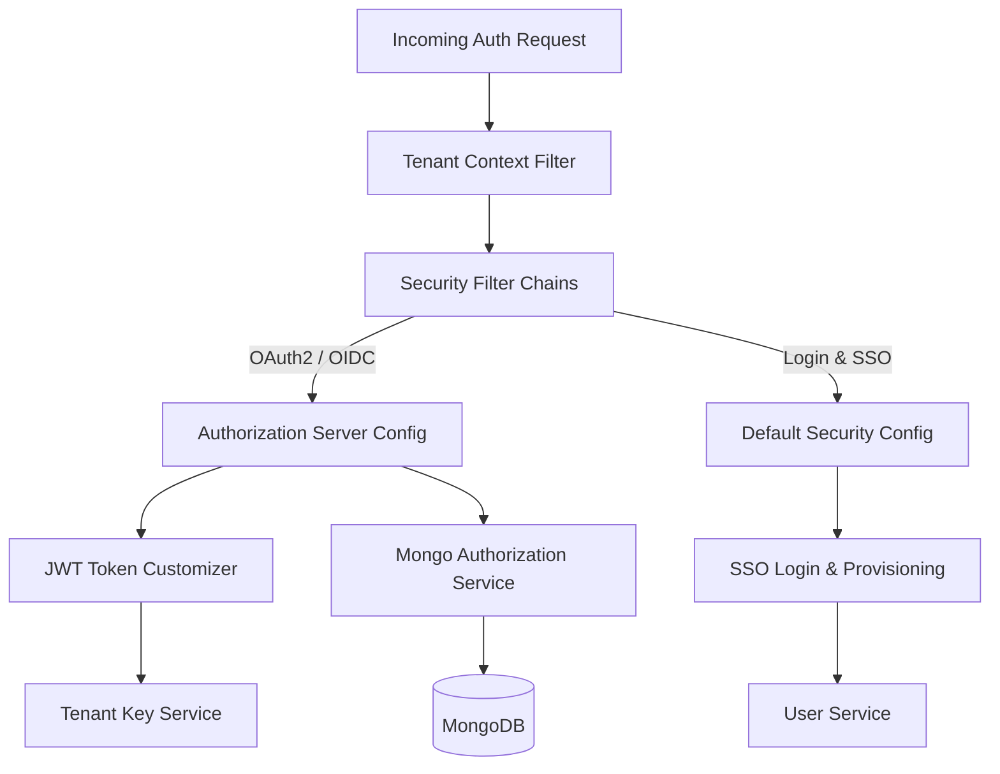
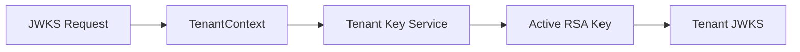
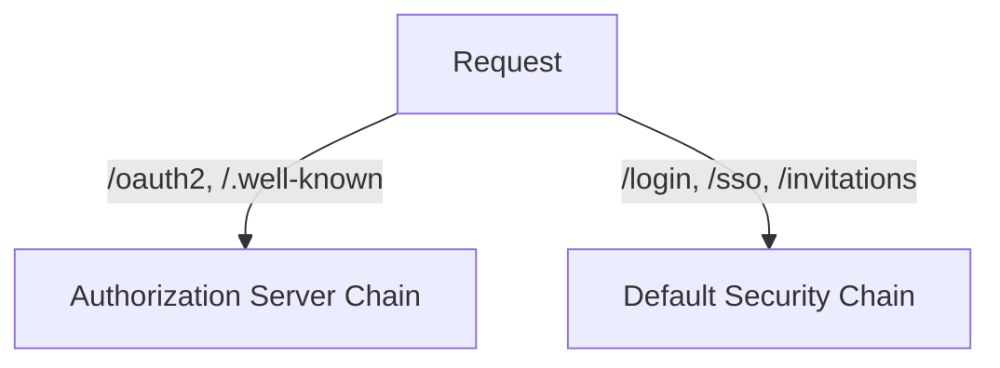
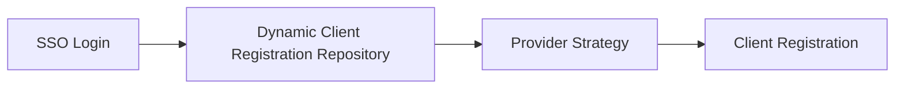
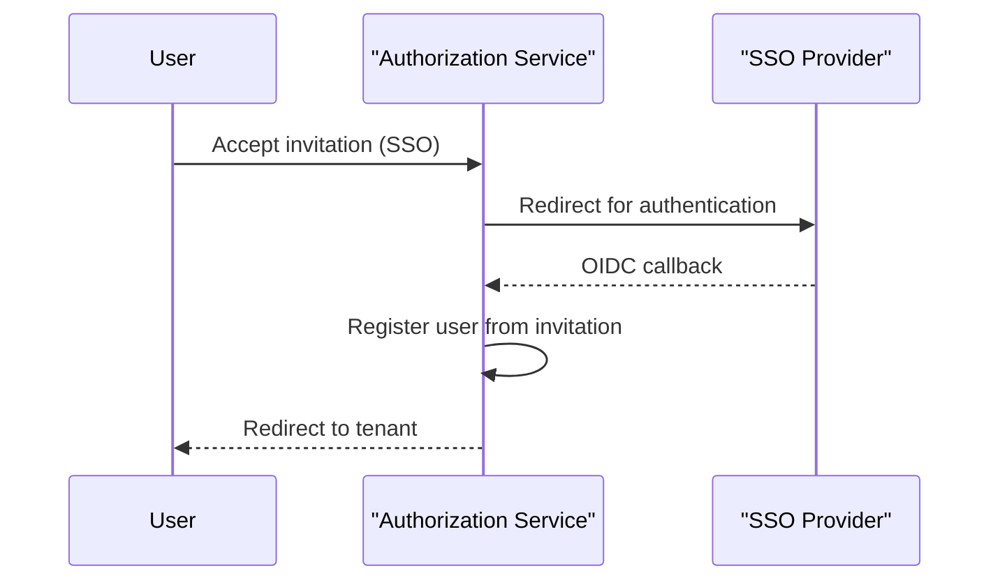
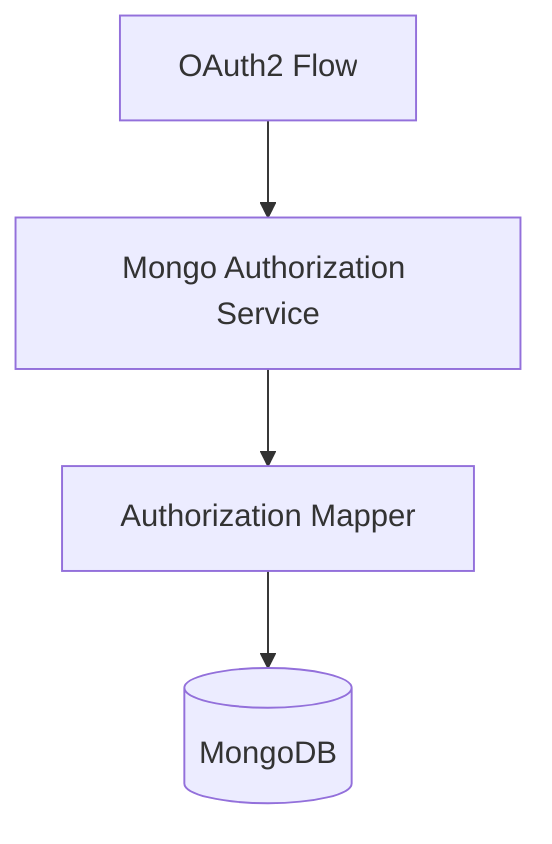
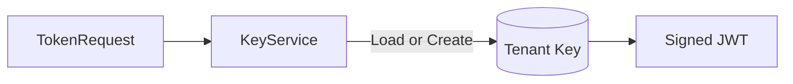

# Authorization Service Core

## Overview

The **Authorization Service Core** module is the heart of OpenFrame's identity, authentication, and authorization layer. It implements a **multi-tenant OAuth 2.1 / OpenID Connect Authorization Server** with first-class support for:

- Multi-tenant authentication and token issuance
- Username/password and federated SSO (Google, Microsoft)
- Tenant-aware JWT signing and JWKS resolution
- Secure invitation-based onboarding and tenant registration
- Password reset and email verification flows
- Persistent OAuth2 authorizations and PKCE support

This module is deployed as the **OpenFrame Authorization Server** entrypoint and is consumed by the Gateway, API, Client, and Frontend applications across the platform.

---

## Position in the OpenFrame Architecture

The Authorization Service Core sits between client-facing entrypoints (Frontend, Client Agents, External APIs) and downstream protected services.

**Key responsibilities:**
- Issuing and validating OAuth2 and OIDC tokens
- Enforcing tenant isolation
- Managing SSO provider configuration per tenant
- Persisting OAuth2 authorizations and client registrations

---

## High-Level Architecture

---

## Core Concepts

### Multi-Tenancy

Every request is resolved into a **tenant context** using path inspection, query parameters, or session state. The resolved tenant ID is stored in a thread-local context for the duration of the request.

- **TenantContext**: Thread-local tenant holder
- **TenantContextFilter**: Resolves and validates tenant per request

This enables:
- Per-tenant JWT issuers
- Per-tenant signing keys
- Per-tenant SSO configuration

---

### Authorization Server Configuration

The Authorization Service Core is built on **Spring Authorization Server**.

**AuthorizationServerConfig** configures:
- OAuth2 and OpenID Connect endpoints
- Multiple issuers per deployment
- Resource server JWT validation
- Custom authentication entrypoints

#### Tenant-Aware JWKS

JWT signing keys are resolved dynamically per tenant:

Each tenant has its own active RSA key pair, stored securely and rotated independently.

---

### Token Customization

Access tokens are enriched with tenant-aware claims:

- `tenant_id`
- `userId`
- `roles`

Role elevation rules are applied automatically (for example, OWNER implies ADMIN).

This allows downstream services to enforce authorization without additional lookups.

---

## Security Filter Chains

The module defines **two distinct security filter chains**:

### 1. Authorization Server Chain

- Matches OAuth2 and OIDC endpoints
- Requires authentication for all requests
- Issues and validates JWTs

### 2. Default Application Chain

Handles:
- Login UI
- OAuth2 client login
- SSO callbacks
- Invitations and password reset endpoints

---

## Single Sign-On (SSO)

The Authorization Service Core provides **pluggable, tenant-aware SSO**.

### Supported Providers

- Google
- Microsoft (multi-tenant aware)

### Dynamic Client Registration

Client registrations are resolved dynamically per tenant and provider:

This allows each tenant to:
- Use its own OAuth client credentials
- Fall back to system defaults when enabled

---

## SSO Provisioning Flows

### Invitation Acceptance via SSO

### Tenant Registration via SSO

- Uses a temporary onboarding tenant
- Finalizes tenant creation after IdP authentication
- Preserves session across tenant switch

---

## Controllers and APIs

The Authorization Service Core exposes REST and web endpoints for:

- **Login and UI rendering**
- **Tenant discovery** (determine tenant and providers from email)
- **Tenant registration** (password or SSO-based)
- **Invitation acceptance**
- **Password reset flows**
- **SSO provider discovery**

These endpoints are consumed primarily by the OpenFrame Frontend and Client applications.

---

## OAuth2 Authorization Persistence

OAuth2 authorizations, tokens, and PKCE parameters are persisted in MongoDB.

### Mongo Authorization Service

- Stores authorization codes, access tokens, and refresh tokens
- Preserves PKCE metadata for secure public clients
- Supports lookup by token, state, or authorization code

---

## Key Management

### Tenant Key Service

Each tenant has its own signing keys:

- RSA 2048-bit key pairs
- Encrypted private keys at rest
- Automatic creation on first use

This design ensures strong tenant isolation and simplifies key rotation strategies.

---

## Extension Points

The module is designed for extensibility using Spring's conditional beans:

- **RegistrationProcessor**: Hook into tenant and user registration
- **UserDeactivationProcessor**: React to user deactivation
- **UserEmailVerifiedProcessor**: React to email verification
- **GlobalDomainPolicyLookup**: Implement domain-based tenant auto-assignment

Default implementations are no-ops and can be overridden by downstream services.

---

## Interaction with Other Modules

- **Gateway Service Core**: Delegates authentication and token validation
- **API Service Core**: Consumes JWTs and enforces role-based access
- **Client Agent Service Core**: Uses OAuth2 and PKCE for secure agent auth
- **Data Layer (Mongo/Redis)**: Persists users, tenants, tokens, and keys

Refer to platform documentation for deployment, scaling, and operational guidance.

---

## Summary

The **Authorization Service Core** provides a robust, multi-tenant, and extensible authorization foundation for OpenFrame. By combining Spring Authorization Server, tenant-aware security, and flexible SSO flows, it enables secure identity management across the entire Flamingo and OpenFrame ecosystem.