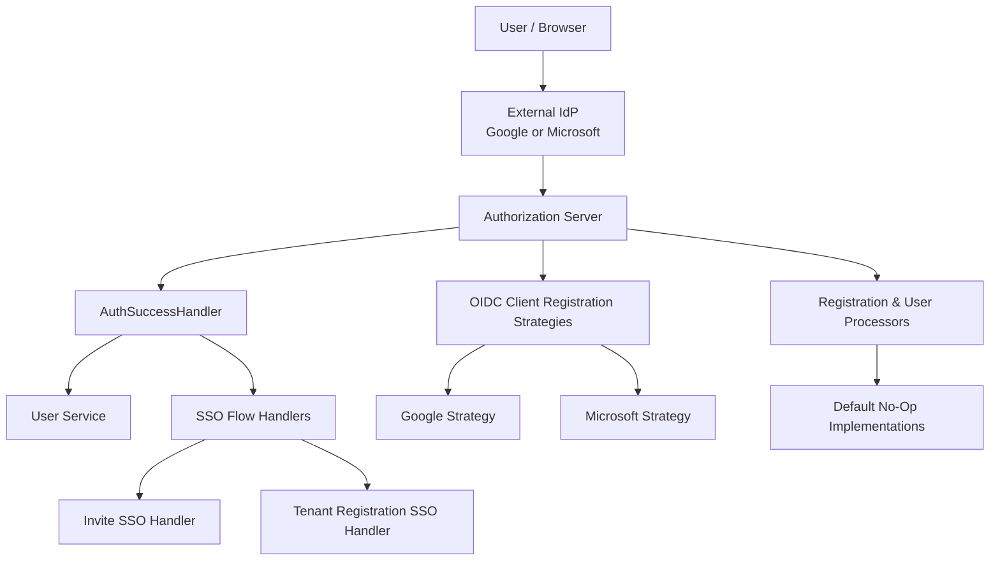
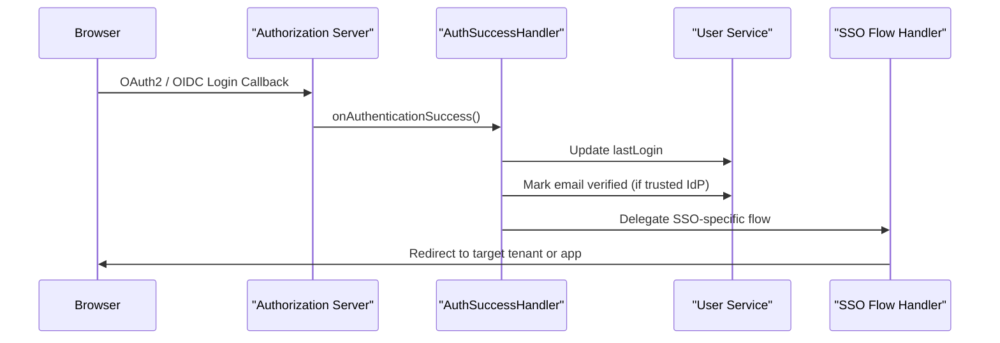

# AuthZ Service – Core Authentication Flow and Processors

## Overview

The **authz_service_core_auth_flow_and_processors** module is a central part of the OpenFrame Authorization Server. It orchestrates **authentication success handling**, **SSO-based onboarding flows**, and a set of **extension processors and strategies** that allow tenant-specific customization without forking the core authorization logic.

This module sits at the intersection of:

- Spring Security / OAuth2 / OIDC authentication
- Multi-tenant authorization context
- SSO onboarding (tenant registration and invitation acceptance)
- Extensible lifecycle processors (registration, deactivation, verification)

It is designed to be **safe by default** (no-op processors, conservative policies) while allowing integrators to override behavior via Spring beans.

---

## Responsibilities

At a high level, this module is responsible for:

- Handling **post-authentication success logic**
- Driving **SSO-based tenant and invitation registration flows**
- Registering **OIDC clients dynamically per provider**
- Providing **default processors and policies** that can be overridden
- Supplying **utility helpers** for OIDC claims, redirects, cookies, and reset tokens

---

## High-Level Architecture

**Key idea:**
- Authentication always succeeds or fails via Spring Security.
- Once successful, this module **augments** the flow with tenant-aware, SSO-aware, and extensible logic.

---

## Authentication Success Flow

The **AuthSuccessHandler** ensures:

- User activity is recorded (`lastLogin`)
- Email verification may be inferred from trusted IdPs
- SSO onboarding flows continue without interruption

---

## Sub-Modules

This module is intentionally decomposed into several focused sub-modules. Each is documented separately for clarity and maintainability.

### 1. Auth Flow Handlers

Responsible for **post-login SSO flows** driven by cookies and OIDC claims:

- Authentication success handling
- Invitation-based SSO onboarding
- Tenant self-registration via SSO

📄 See: [Auth Flow Handlers](Auth Flow Handlers.md)

---

### 2. OIDC Client Registration Strategies

Defines **provider-specific strategies** for registering OAuth2 / OIDC clients dynamically per tenant:

- Google client registration
- Microsoft client registration

These strategies abstract provider differences while sharing a common base.

📄 See: [OIDC Client Registration Strategies](OIDC Client Registration Strategies.md)

---

### 3. Registration and User Processors

Provides **extension points** for reacting to key lifecycle events:

- Tenant registration
- Invitation-based user creation
- User deactivation
- Email verification

Default implementations are **safe no-ops** and can be replaced by custom beans.

📄 See: [Registration and User Processors](Registration and User Processors.md)

---

### 4. SSO Default Provider Configuration

Supplies **default client credentials** for supported SSO providers when tenant-specific configuration is absent:

- Google default provider config
- Microsoft default provider config

📄 See: [SSO Default Provider Config](SSO Default Provider Config.md)

---

### 5. Utilities and Policies

A collection of helper components used across authentication and SSO flows:

- OIDC claim resolution utilities
- Secure reset token generation
- Authentication state cleanup
- HTTP redirect helpers
- Default global domain policy (no-op)

📄 See: [Utilities](Utilities.md)

---

## Design Principles

- **Tenant Awareness First**: All flows operate within a resolved tenant context.
- **Fail-Open for Non-Critical Logic**: Post-auth hooks never block authentication.
- **Extensibility via Spring**: Custom behavior is enabled through bean overrides.
- **Provider Agnostic Core**: Google and Microsoft specifics are isolated.
- **Secure by Default**: No implicit domain auto-provisioning unless explicitly enabled.

---

## How This Module Fits Into the System

- Works alongside **authz_service_core_security_tenant** for tenant context resolution
- Feeds into **authz_service_core_controllers** for login, registration, and discovery
- Persists state through **authz_service_core_keys_and_persistence**
- Interacts with shared user and tenant models from the data layer

This makes the module a **critical orchestration layer** between low-level security infrastructure and higher-level onboarding and user lifecycle management.

---

## Summary

The **authz_service_core_auth_flow_and_processors** module encapsulates the logic that turns a successful OAuth2/OIDC login into a **tenant-aware, extensible, and secure onboarding experience**.

By combining SSO flow handlers, provider strategies, lifecycle processors, and shared utilities, it provides a robust foundation for authentication and authorization flows across OpenFrame.
