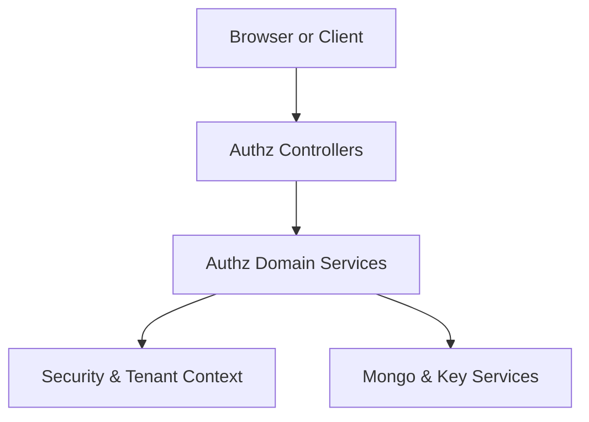
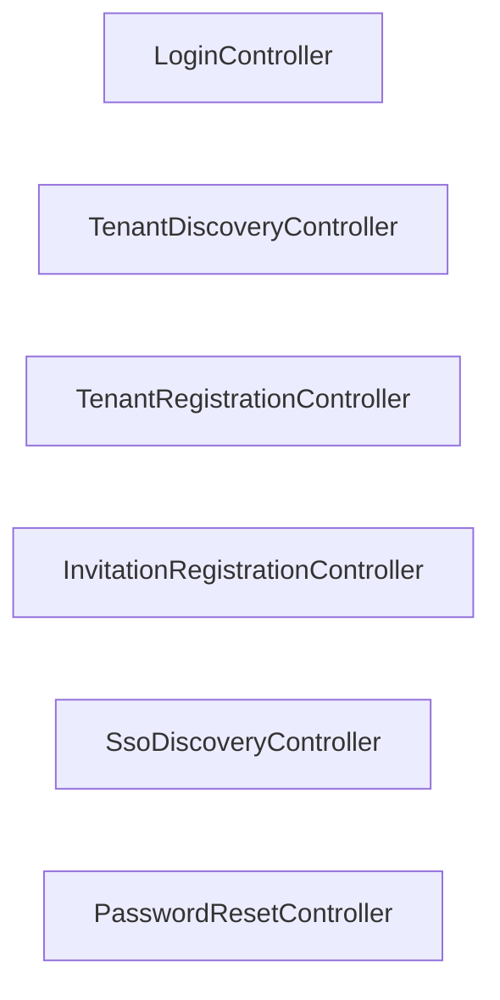
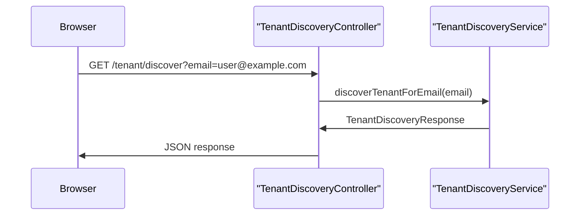
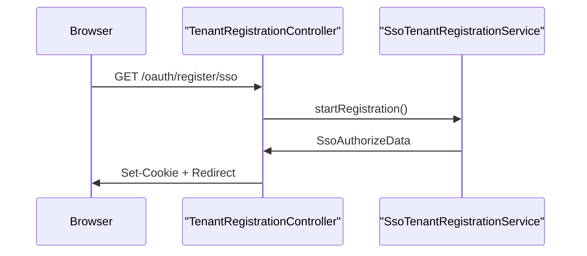
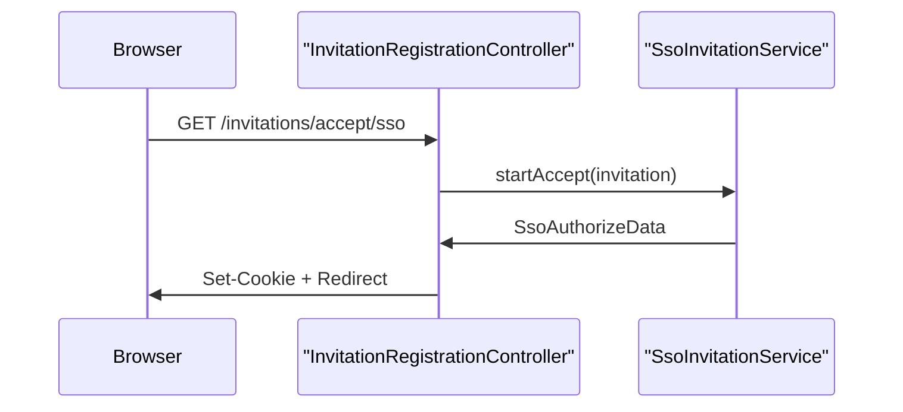
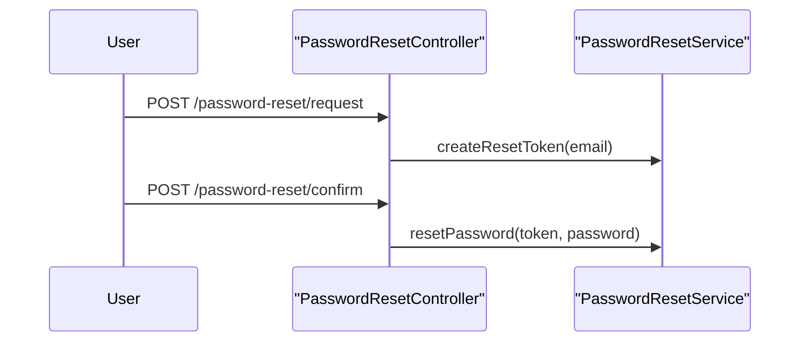

# authz_service_core_controllers

## Overview

The **authz_service_core_controllers** module defines the HTTP entry points of the OpenFrame Authorization Server. These controllers implement the user-facing and system-facing flows required for **multi-tenant authentication, tenant onboarding, invitation-based access, SSO discovery, and credential recovery**.

This module sits at the boundary between:
- Browsers and clients (HTML pages, redirects, JSON APIs)
- The authorization server core (SSO, tenant context, security filters)
- Domain services handling registration, invitations, and password lifecycle

It does **not** contain business logic itself. Instead, it orchestrates flows by delegating to domain services and security utilities defined in other authorization service modules.

---

## Responsibilities

At a high level, this module is responsible for:

- Login UI routing for the authorization server
- Tenant discovery during login and onboarding
- Tenant registration (password-based and SSO-based)
- Invitation acceptance (password-based and SSO-based)
- Password reset initiation and confirmation
- Discovery of available SSO providers for invitations and registration

---

## Architectural Context

The controllers in this module are part of the **Authorization Server** and interact closely with:

- **Security & Tenant Context** (tenant resolution, OAuth2, cookies)
- **SSO Services** (provider discovery, OAuth initiation)
- **Registration & Invitation Services** (user and tenant lifecycle)
- **Persistence & Keys** (indirectly, via services)

### High-Level Placement

---

## Controller Overview

The module contains six primary controllers, each responsible for a distinct part of the authorization flow.

---

## Controllers and Flows

### LoginController

**Purpose**: Provides basic HTML endpoints for login and index pages in a multi-tenant authorization server.

**Key Characteristics**:
- Renders login UI
- Displays error and logout messages
- Acts as the visual entry point for authentication

**Endpoints**:
- `GET /login`
- `GET /`

This controller does not perform authentication itself; it relies on Spring Security for credential handling.

---

### TenantDiscoveryController

**Purpose**: Determines which tenants and authentication methods apply to a given user email.

This controller is critical for **multi-tenant login flows**, where a single email address may belong to different tenants with different authentication configurations.

**Endpoint**:
- `GET /tenant/discover`

**Flow Summary**:

---

### TenantRegistrationController

**Purpose**: Handles onboarding of new tenants into the OpenFrame platform.

Supports two distinct registration modes:
- **Direct registration** (email/password or similar)
- **SSO-based registration** (OAuth2 provider-driven)

**Endpoints**:
- `POST /oauth/register`
- `GET /oauth/register/sso`

**SSO Registration Flow**:

Short-lived, secure cookies are used to preserve state during the OAuth redirect process.

---

### InvitationRegistrationController

**Purpose**: Allows users to join an existing tenant via invitation.

Supports both:
- **Password-based invitation acceptance**
- **SSO-based invitation acceptance**

**Endpoints**:
- `POST /invitations/accept`
- `GET /invitations/accept/sso`

**Key Behaviors**:
- Clears existing authentication state before starting SSO flows
- Issues short-lived, HTTP-only cookies to bind the invitation to the OAuth flow
- Redirects users to provider-specific authorization endpoints

**SSO Invitation Acceptance Flow**:

---

### SsoDiscoveryController

**Purpose**: Exposes which SSO providers are available in different onboarding contexts.

This controller ensures the UI can dynamically adapt to tenant-level and system-level SSO configuration.

**Endpoints**:
- `GET /sso/providers/invite`
- `GET /sso/providers/registration`

**Responsibilities**:
- Validate invitation state before revealing tenant-specific providers
- Return effective SSO providers for:
  - Invitation acceptance
  - New tenant registration

---

### PasswordResetController

**Purpose**: Manages the password reset lifecycle for users.

**Endpoints**:
- `POST /password-reset/request`
- `POST /password-reset/confirm`

**Flow Summary**:

The controller itself remains stateless and delegates all security-sensitive operations to the service layer.

---

## Security Considerations

Across all controllers, the following patterns are consistently applied:

- **HTTP-only, secure cookies** for SSO and invitation state
- **Explicit auth state clearing** before starting OAuth flows
- **Short-lived tokens and cookies** for onboarding operations
- **Delegation to Spring Security** for authentication enforcement

Tenant isolation is enforced by upstream filters and tenant context resolvers defined in the authorization service security modules.

---

## Relationship to Other Modules

This module depends heavily on services and utilities provided by other authorization service modules, including:

- Tenant context and security configuration
- SSO provider configuration and OAuth handling
- Registration and invitation processors
- Persistence and key management

It intentionally contains **no persistence logic** and **no direct security policy definitions**, acting purely as a coordination layer.

---

## Summary

The **authz_service_core_controllers** module forms the public API surface of the OpenFrame Authorization Server. It coordinates complex multi-tenant authentication and onboarding flows while remaining thin, declarative, and security-conscious.

By cleanly separating HTTP concerns from business logic, this module enables flexible evolution of authentication strategies without breaking client-facing contracts.
