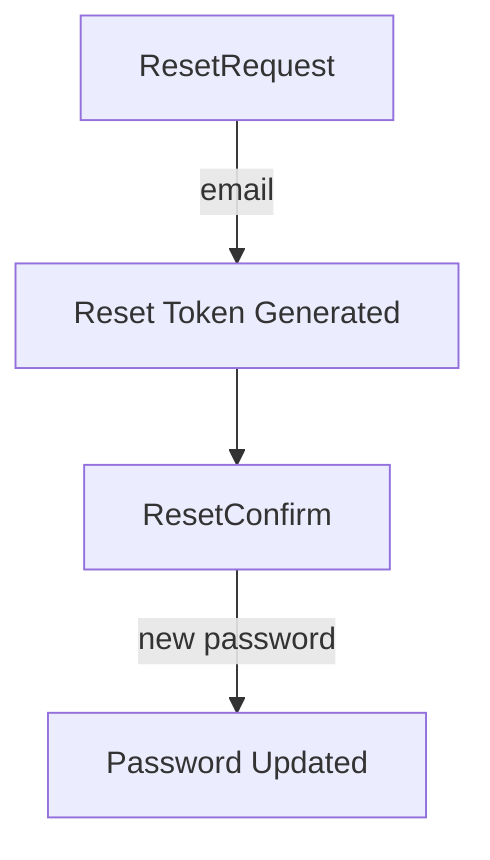
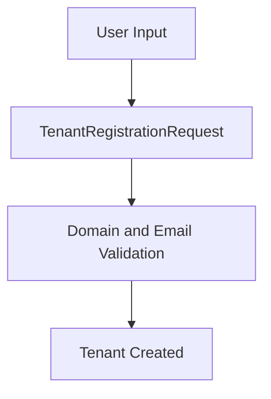

# authz_service_core_dtos

## Overview
The `authz_service_core_dtos` module defines **Data Transfer Objects (DTOs)** used by the OpenFrame Authorization Service. These DTOs model request and response payloads for authentication, tenant onboarding, SSO flows, invitation handling, and password reset operations.

This module is intentionally lightweight and **framework-agnostic**, focusing on:
- Strong input validation (Jakarta Validation annotations)
- Clear separation between API contracts and domain logic
- Reuse across REST controllers, security flows, and processors in the authorization service

The DTOs in this module are primarily consumed by:
- Authorization service controllers
- Authentication and SSO flow handlers
- Tenant discovery and registration endpoints

---

## Architectural Context

Within the Authorization Service, this module sits at the **API boundary**, translating HTTP and OAuth-related payloads into strongly typed Java objects.

**Key characteristics**:
- No business logic
- Validation-driven correctness
- Used by both classic credential flows and SSO-based flows

---

## DTO Categories

The DTOs can be grouped into several functional areas. Each group is documented in its own section below.

### 1. Invitation-Based Registration

These DTOs support onboarding users via invitations, including standard and SSO-based invitations.

#### InvitationRegistrationRequest
- **Purpose**: Register a user using an invitation token
- **Extends**: `CoreUserRequest`
- **Key fields**:
  - `invitationId` (required)
  - `switchTenant` (optional)

Used by invitation registration controllers and processors.

#### SsoInvitationAcceptRequest
- **Purpose**: Accept an invitation using an external SSO provider
- **Key fields**:
  - `invitationId` (required)
  - `provider` (required)
  - `switchTenant` (optional)
  - `redirectTo` (optional)

Commonly used in SSO redirect-based invitation flows.

---

### 2. Password Reset Flow

Password reset DTOs are grouped as nested static classes to clearly express the reset lifecycle.

#### ResetRequest
- **Purpose**: Initiate password reset
- **Key fields**:
  - `email` (validated with custom email validator)

#### ResetConfirm
- **Purpose**: Complete password reset
- **Key fields**:
  - `token` (required)
  - `newPassword` (required)

Password rules enforced via regex:
- Minimum length
- Uppercase and lowercase letters
- Digit
- Special character

---

### 3. Tenant Discovery and Availability

These DTOs support multi-tenant discovery and validation before registration.

#### TenantDiscoveryResponse
- **Purpose**: Inform clients about existing tenants and available authentication providers
- **Key fields**:
  - `email`
  - `hasExistingAccounts`
  - `tenantId`
  - `authProviders`

Typically used before login or registration to decide which auth flow to present.

#### TenantAvailabilityResponse
- **Purpose**: Check if a tenant domain is available
- **Key fields**:
  - `isAvailable`
  - `suggestedUrl`

Used during tenant signup to prevent domain conflicts.

---

### 4. Tenant Registration

Tenant registration DTOs support both classic and SSO-driven tenant onboarding.

#### TenantRegistrationRequest
- **Purpose**: Register a new tenant with an initial user
- **Extends**: `CoreUserRequest`
- **Key fields**:
  - `email`
  - `tenantName`
  - `tenantDomain`
  - `accessCode`

Used in non-SSO tenant registration flows.

#### SsoTenantRegistrationInitRequest
- **Purpose**: Start tenant registration using an SSO provider
- **Key fields**:
  - `email`
  - `tenantName`
  - `tenantDomain`
  - `provider`
  - `accessCode` (optional)
  - `redirectTo` (optional)

This DTO initiates a multi-step SSO registration process handled by auth flow processors.

---

## Validation Strategy

This module relies heavily on **declarative validation**:
- Jakarta Validation annotations (`@NotBlank`, `@Pattern`, `@Size`)
- Custom validators such as:
  - `@ValidEmail`
  - `@TenantDomain`

Validation is enforced automatically at controller boundaries, ensuring invalid requests never reach domain logic.

---

## Relationship to Other Modules

- **Controllers**: Consumed by authorization service controllers for request binding
- **Auth Flow & Processors**: Used as structured inputs for registration, invitation, and SSO processors
- **Security Configuration**: Indirectly tied to OAuth and SSO flows via provider and redirect fields

This module intentionally does **not** depend on persistence, services, or security internals.

---

## Design Principles

- **API-first contracts**: DTOs define stable external interfaces
- **Immutability-friendly**: Lombok builders where appropriate
- **Security-aware**: Strict validation on credentials and tenant identifiers
- **Clear lifecycle modeling**: Separate DTOs for each step in multi-stage flows

---

## Summary

The `authz_service_core_dtos` module forms the **contract layer** of the OpenFrame Authorization Service. By cleanly modeling authentication, tenant onboarding, and SSO-related payloads, it enables secure, scalable, and maintainable auth flows across the platform.
