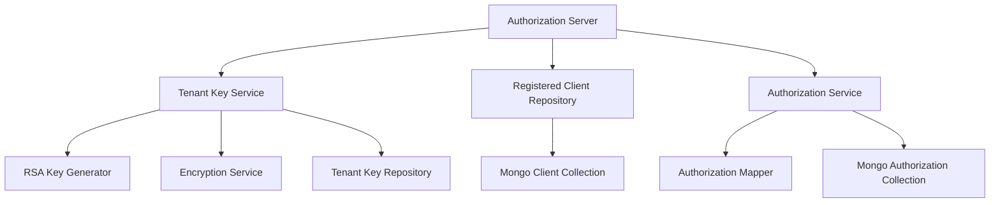

# authz_service_core_keys_and_persistence

## Overview

The **authz_service_core_keys_and_persistence** module is a foundational part of the OpenFrame Authorization Server. It is responsible for:

- **Tenant-scoped cryptographic key management** for signing OAuth2/OpenID Connect tokens
- **Secure persistence of OAuth2 clients and authorizations** in MongoDB
- **Bridging Spring Authorization Server domain models** with OpenFrame Mongo persistence models

This module is heavily used by the Authorization Server runtime and underpins secure, multi-tenant authentication flows across the OpenFrame platform.

---

## Responsibilities at a Glance

- Generate and manage RSA key pairs per tenant
- Encrypt and persist private keys securely
- Expose active signing keys as Nimbus `RSAKey` instances
- Persist OAuth2 Registered Clients in MongoDB
- Persist OAuth2 Authorizations (auth codes, access tokens, refresh tokens)
- Preserve PKCE parameters across authorization lifecycle

---

## High-Level Architecture

---

## Core Sub-Modules

This module is logically split into two main areas:

1. **Tenant Key Management** – generation, serialization, encryption, and retrieval of signing keys
2. **OAuth2 Persistence Layer** – MongoDB-backed implementations for clients and authorizations

Detailed documentation for each area is provided in the following files:

- [Tenant Key Management](Tenant Key Management.md)
- [OAuth2 Persistence](OAuth2 Persistence.md)

---

## How This Module Fits Into the System

- Used directly by **authz_service_app** during startup and request handling
- Integrates with **shared_data_mongo_core** for persistence
- Produces signing keys consumed by token issuance and validation logic
- Ensures PKCE compliance for public OAuth2 clients

This module does **not** expose HTTP endpoints directly; it is consumed internally by authorization controllers, security configuration, and OAuth2 flows.

---

## Security Considerations

- Private keys are **never stored in plaintext**; they are encrypted before persistence
- Each tenant has isolated signing keys to prevent cross-tenant token validation
- Warnings are logged if multiple active signing keys exist for a tenant

---

## Summary

The **authz_service_core_keys_and_persistence** module provides the cryptographic and persistence backbone of the OpenFrame Authorization Server. By cleanly separating key management from OAuth2 storage concerns, it enables secure, scalable, and multi-tenant authentication across the platform.
