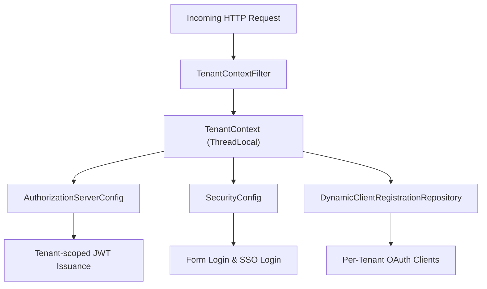
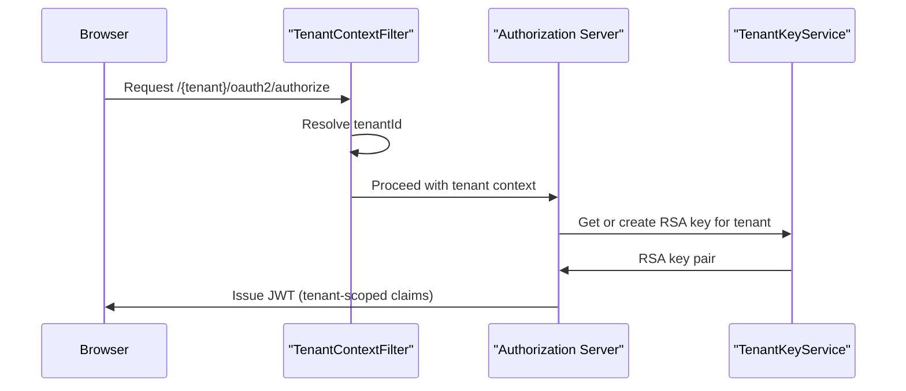

# authz_service_core_security_tenant

## Overview

The **authz_service_core_security_tenant** module provides the tenant-aware security foundation for the OpenFrame Authorization Server. It is responsible for:

- Resolving and propagating the active tenant for each request
- Configuring the OAuth2 / OpenID Connect Authorization Server
- Applying default Spring Security rules for non-authorization endpoints
- Supporting dynamic, per-tenant OAuth client registrations
- Issuing tenant-scoped JWTs with custom claims

This module is central to enabling **multi-tenant authentication and authorization** across OpenFrame services, and it is used directly by the Authorization Server application.

---

## High-Level Architecture

**Key idea:** every security decision (token signing keys, user lookup, SSO configuration) is evaluated in the context of the currently resolved tenant.

---

## Module Responsibilities

### 1. Tenant Resolution and Propagation

The tenant is resolved early in the request lifecycle and stored in a thread-local context. All downstream security components rely on this context.

- Request path inspection (`/{tenant}/oauth2/...`)
- Query parameter fallback (`?tenant=...`)
- HTTP session persistence

📄 Detailed documentation: [Tenant Context](Tenant Context.md)

---

### 2. OAuth2 Authorization Server Configuration

This module configures Spring Authorization Server with tenant awareness:

- Multi-issuer support (one issuer per tenant)
- Per-tenant JWKS resolution
- Tenant-specific RSA signing keys
- Custom JWT claims (`tenant_id`, `userId`, `roles`)

📄 Detailed documentation: [Authorization Server Configuration](Authorization Server Configuration.md)

---

### 3. Default Security Configuration (Non-AS Endpoints)

All non-authorization-server endpoints are secured by a separate filter chain:

- Public access for login, onboarding, discovery, and well-known endpoints
- Form login and OAuth2 login support
- SSO auto-provisioning and domain-based tenant mapping
- Microsoft multi-tenant issuer validation

📄 Detailed documentation: [Security Configuration](Security Configuration.md)

---

### 4. Dynamic Client Registration (Per Tenant)

OAuth client registrations (Google, Microsoft, etc.) are resolved dynamically at runtime based on the active tenant.

- Avoids static client configuration
- Supports per-tenant SSO enablement
- Integrates with tenant session and request context

📄 Detailed documentation: [Dynamic Client Registration](Dynamic Client Registration.md)

---

## Authentication and Token Flow

---

## How This Module Fits in the Platform

- **Used by:** `authz_service_app`
- **Consumes:**
  - Tenant-specific user and SSO configuration
  - Key management services
- **Produces:**
  - Tenant-scoped access and refresh tokens
  - Secure authentication context for downstream services

Other services (API, Gateway, Client, Management) rely on the JWTs issued here to enforce authorization decisions consistently across the platform.

---

## Summary

The **authz_service_core_security_tenant** module is the backbone of OpenFrame's multi-tenant security model. By combining tenant resolution, dynamic OAuth configuration, and strict security filter separation, it enables:

- Secure tenant isolation
- Flexible SSO onboarding per tenant
- Scalable authorization infrastructure

For implementation details, refer to the sub-module documentation linked above.