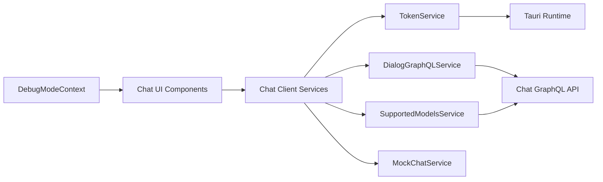
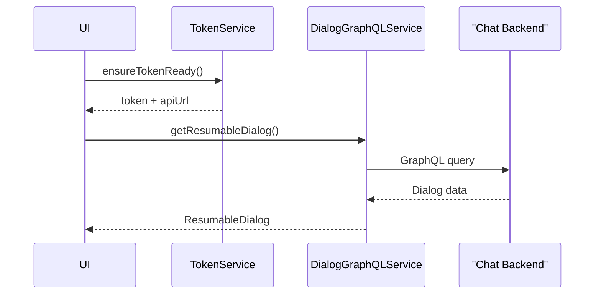

# chat_client_app_services

## Overview

The **chat_client_app_services** module provides all client-side service logic required to power the OpenFrame desktop chat experience (Fae / Mingo AI) inside the OpenFrame Chat client. It acts as the bridge between:

- The **desktop runtime (Tauri + Rust)**
- The **OpenFrame backend chat APIs (REST + GraphQL)**
- The **shared Flamingo/OpenFrame frontend chat types**

This module is intentionally thin on UI concerns and focuses on:
- Authentication and API endpoint resolution
- GraphQL-based dialog and message retrieval
- Streaming and mock chat behavior for development
- Supported AI model discovery
- Global debug-mode state

---

## High-Level Architecture

---

## Core Responsibilities

| Area | Responsibility |
|-----|---------------|
| Authentication | Token and API URL resolution via Tauri |
| Data Access | GraphQL queries for dialogs and messages |
| Streaming | Incremental message streaming support |
| AI Metadata | Supported LLM model discovery |
| Debugging | Global debug-mode context |
| Development | Mock chat streaming and tool execution |

---

## Sub-Modules

The module is composed of several focused sub-modules. Each has its own documentation:

- [DebugModeContext](DebugModeContext.md)
- [TokenService](TokenService.md)
- [DialogGraphQLService](DialogGraphQLService.md)
- [SupportedModelsService](SupportedModelsService.md)
- [MockChatService](MockChatService.md)

---

## Data & Control Flow

---

## Integration Points

- **Backend**: Uses OpenFrame Chat APIs exposed via Gateway and API services
- **Frontend Shared Types**: Relies on `openframe-frontend-core` chat message and streaming types
- **Desktop Runtime**: Uses Tauri commands and events for secure token handling

---

## When to Use This Module

Use this module when:
- Building or extending the OpenFrame desktop chat client
- Integrating AI chat with backend dialog history
- Simulating chat behavior during UI development
- Resolving supported AI models dynamically

---

## Non-Responsibilities

This module deliberately does **not**:
- Render UI components
- Implement backend chat logic
- Manage persistence beyond in-memory caching

Those concerns live in backend services and shared frontend component libraries.
