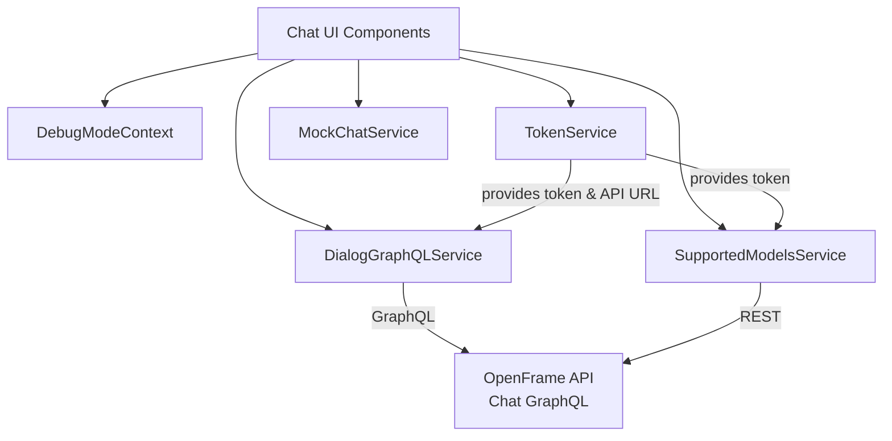
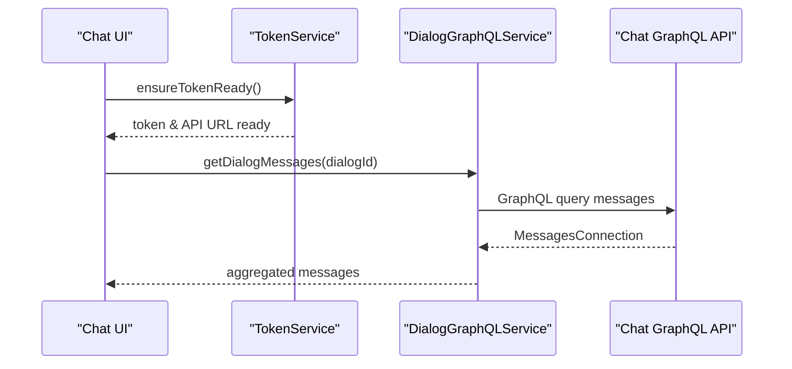

# chat_client_core

## Overview

The **chat_client_core** module provides the client-side foundation for OpenFrame Chat inside the Flamingo / OpenFrame ecosystem. It is responsible for:

- Managing authentication state (tokens and API base URL) in a Tauri-based desktop environment
- Fetching and streaming chat dialogs and messages via GraphQL
- Providing mock chat and tool-execution streams for development and demos
- Managing supported AI model metadata for UI presentation
- Exposing shared React context for debug-mode behavior

This module is consumed primarily by the OpenFrame Chat UI and integrates with backend GraphQL APIs exposed by the OpenFrame API services.

---

## High-Level Architecture

---

## Core Responsibilities

| Area | Description |
|------|-------------|
| Authentication & Configuration | Centralized token and API URL management via Tauri integration |
| Chat Data Access | GraphQL-based dialog and message retrieval with pagination |
| Streaming & Tool Execution | Async streaming of assistant responses and tool execution events |
| AI Model Metadata | Fetching and caching supported AI model information |
| Debug Control | Global debug-mode state for client diagnostics |

---

## Sub-Modules

The module is composed of several focused sub-modules. Each is documented separately:

- **Debug Mode Context** – React context for global debug state  
  See: `debug_mode_context.md`

- **Token Service** – Authentication token and API URL lifecycle management  
  See: `token_service.md`

- **Dialog GraphQL Service** – Chat dialog and message retrieval via GraphQL  
  See: `dialog_graphql_service.md`

- **Supported Models Service** – Supported AI model discovery and caching  
  See: `supported_models_service.md`

- **Mock Chat Service** – Streaming mock responses and tool executions for demos  
  See: `mock_chat_service.md`

---

## Interaction Flow (Message Retrieval)

---

## Relationship to Other Modules

- **API Services**: Communicates with OpenFrame API GraphQL endpoints for chat dialogs and messages
- **Gateway & Security**: Relies on upstream authentication and authorization handled by gateway and auth services
- **Frontend Domain Hooks**: Consumed by chat- and ticket-related frontend hooks and stores

This module intentionally avoids duplicating backend logic and acts strictly as a client-side orchestration layer.
