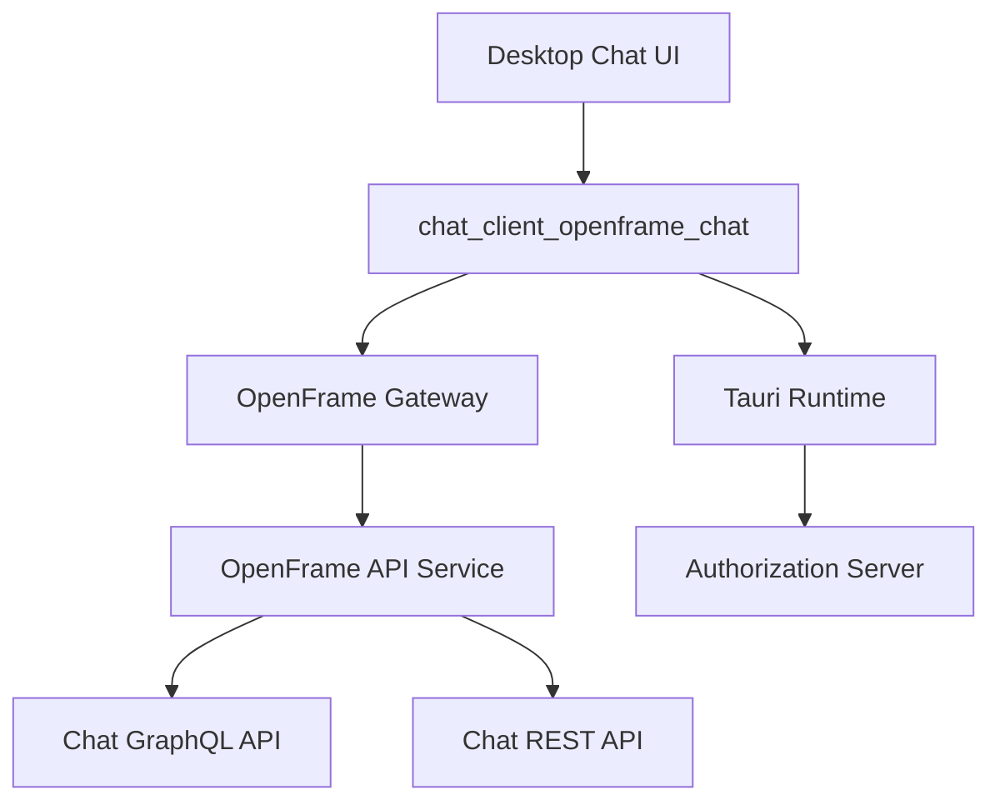
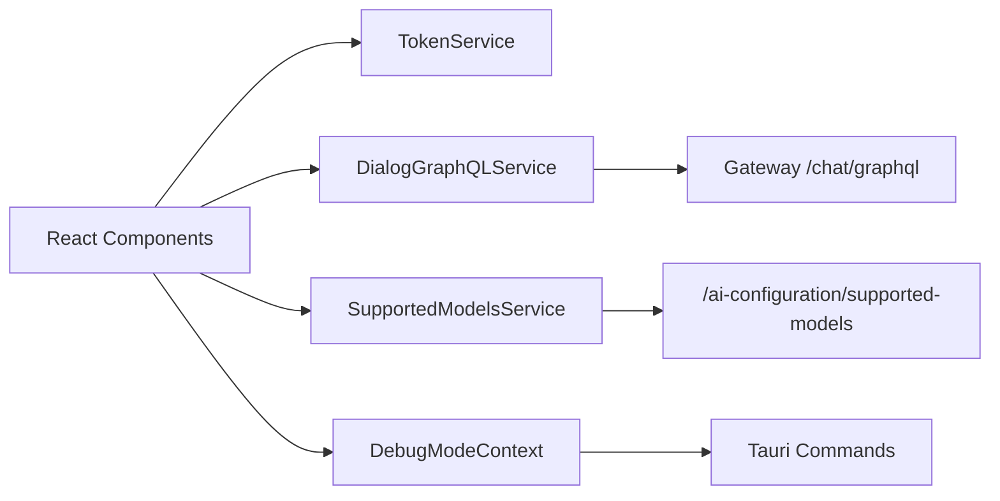

# chat_client_openframe_chat

## Overview
The **chat_client_openframe_chat** module is the desktop chat client layer for OpenFrame, built with React, TypeScript, and Tauri. It provides the end-user chat experience used by OpenFrame clients to interact with AI-powered support (Mingo AI), including:

- Secure authentication and API endpoint discovery via Tauri
- Real-time and paginated chat message retrieval over GraphQL
- Streaming chat responses (including tool execution visualization)
- Debug-mode awareness for local and desktop troubleshooting
- Dynamic discovery of supported AI models from the backend

This module acts as the **presentation and orchestration layer** between the OpenFrame frontend UX and the backend OpenFrame Chat APIs exposed through the gateway and API services.

---

## Position in the OpenFrame Architecture

**Key responsibilities at this layer:**
- Token and API URL bootstrapping from the native runtime
- Client-side state management for chat dialogs and messages
- Communication with backend GraphQL and REST endpoints
- Providing mock and debug-friendly behavior for development

---

## Core Components

### Contexts
- **DebugModeContext** – Provides application-wide debug-mode state sourced from the Tauri backend.

### Services
- **TokenService** – Manages authentication tokens and API base URLs.
- **DialogGraphQLService** – Handles GraphQL queries for dialogs and messages.
- **SupportedModelsService** – Fetches and caches supported AI model metadata.
- **MockChatService** – Streams mock chat and tool-execution responses for demos and testing.

Each of these components is documented in its own file:

- [DebugModeContext](debug_mode_context.md)
- [TokenService](token_service.md)
- [DialogGraphQLService](dialog_graphql_service.md)
- [SupportedModelsService](supported_models_service.md)
- [MockChatService](mock_chat_service.md)

---

## High-Level Data Flow

---

## Interaction with Other Modules

- **service_gateway**: Routes chat GraphQL and REST traffic securely.
- **service_openframe_api**: Hosts chat GraphQL resolvers and REST endpoints.
- **security_oauth_bff_core / authorization services**: Issue and manage tokens consumed by TokenService.
- **frontend_service_core_mingo_chat**: Consumes this module’s services to render chat dialogs and messages.

This module intentionally avoids duplicating backend logic and relies on strongly typed contracts exposed by the OpenFrame API services.

---

## Design Principles

- **Thin client, strong backend** – Minimal business logic in the client.
- **Streaming-first UX** – Designed for incremental AI and tool responses.
- **Native-aware** – Uses Tauri for secure token and configuration handling.
- **Debuggable by design** – Built-in debug mode and mock services.

---

## When to Extend This Module

Extend or modify **chat_client_openframe_chat** when:
- Adding new chat message or tool execution visualizations
- Supporting additional AI providers or model metadata
- Improving authentication, token refresh, or environment bootstrapping
- Enhancing debug, mock, or offline behavior

Backend-related changes should instead be made in the OpenFrame API, gateway, or authorization services.
