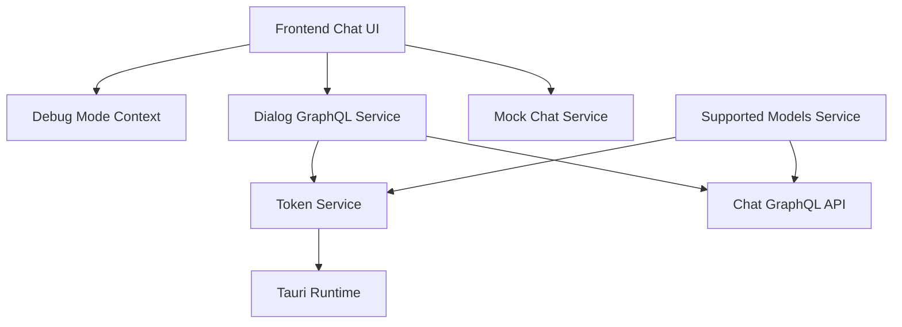
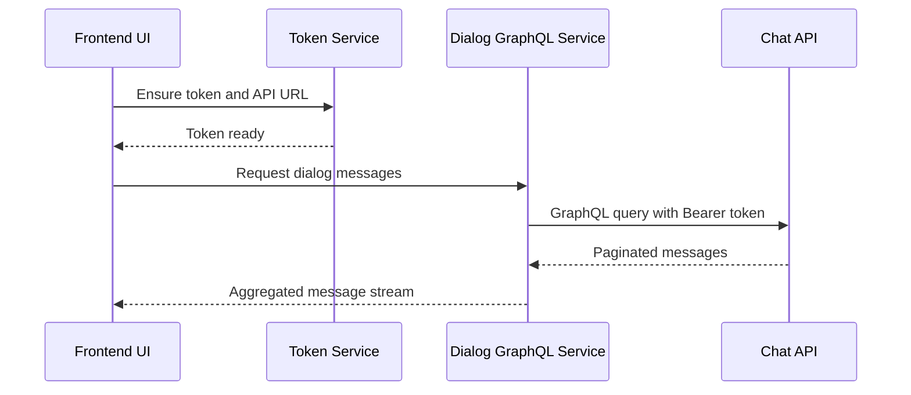

# Chat Client Openframe Chat

## Overview

**Chat Client Openframe Chat** is the client-side chat module used by OpenFrame to deliver an AI-powered conversational experience inside the Flamingo/OpenFrame ecosystem. It is responsible for:

- Managing authentication tokens and API endpoint discovery in a desktop (Tauri) environment
- Fetching and resuming chat dialogs via GraphQL
- Streaming chat messages, including AI tool execution states
- Exposing debug capabilities for development and troubleshooting
- Resolving supported AI models and their metadata for display and validation

This module acts as the **client bridge** between the OpenFrame frontend chat UI, backend chat APIs, and the local Tauri runtime.

---

## Position in the System

Chat Client Openframe Chat sits at the intersection of:

- **Frontend chat components and stream processors** (message rendering, streaming, approvals)
- **Gateway and API services** (GraphQL chat API, REST configuration endpoints)
- **Authorization and security infrastructure** (OAuth, JWT, tenant-aware APIs)
- **Local desktop runtime (Tauri)** for secure token and configuration exchange

It does not implement UI components directly. Instead, it provides **state, services, and streaming primitives** consumed by frontend chat components.

---

## High-Level Architecture

---

## Core Responsibilities

### 1. Authentication and Environment Awareness

The module centralizes authentication and environment discovery through **Token Service**:

- Receives tokens from the Tauri backend via events
- Requests tokens and server URLs on demand
- Normalizes and distributes API base URLs
- Notifies dependent services when tokens or endpoints change

This ensures that all chat-related network requests are **secure, tenant-aware, and dynamically configurable**.

---

### 2. Dialog and Message Retrieval (GraphQL)

**Dialog GraphQL Service** provides a typed interface to the chat backend:

- Fetches resumable dialogs for session continuity
- Retrieves historical messages with cursor-based pagination
- Supports multiple message types (text, tool execution, approvals, errors)
- Automatically injects authorization headers

It is designed to be **stateless at the API level** while maintaining client-side pagination and aggregation logic.

---

### 3. Streaming and Tool Execution Simulation

**Mock Chat Service** enables local development and demos without a backend dependency:

- Streams responses incrementally to simulate real-time AI output
- Emits tool execution lifecycle events (executing → executed)
- Supports conditional logic based on user input
- Can inject random errors for resilience testing

This service mirrors the same message segment structure used by real streaming APIs.

---

### 4. Debug Mode Management

**Debug Mode Context** exposes a React context for enabling or disabling debug behavior:

- Initializes debug state from the Tauri backend
- Makes debug mode globally accessible to child components
- Provides runtime toggling for diagnostics and logging

This allows developers and support engineers to safely expose internal state and logs when needed.

---

### 5. Supported AI Model Resolution

**Supported Models Service** manages AI model metadata retrieved from the backend:

- Fetches supported models grouped by provider
- Caches model definitions locally
- Resolves display names and context window sizes
- Validates whether a requested model is supported

This ensures the chat UI remains aligned with backend AI capabilities and policy enforcement.

---

## Component Overview

| Component | Responsibility |
|---------|---------------|
| Debug Mode Context | Global debug state management via React context |
| Token Service | Token lifecycle, API base URL discovery, Tauri integration |
| Dialog GraphQL Service | Dialog and message retrieval via GraphQL |
| Supported Models Service | AI model metadata loading and validation |
| Mock Chat Service | Local streaming and tool execution simulation |

---

## Data Flow: Fetching and Streaming Messages

---

## Error Handling and Resilience

Chat Client Openframe Chat is designed to degrade gracefully:

- Missing tokens or API URLs result in explicit errors
- GraphQL failures return null-safe responses
- Mock services can simulate network and execution errors
- All async boundaries are wrapped with logging

This approach ensures predictable behavior in both production and development environments.

---

## Development and Debugging Notes

- Debug mode can be toggled without restarting the application
- Mock Chat Service is ideal for UI development and demos
- Token Service supports environment variables for local testing
- All services are implemented as singletons to simplify state sharing

---

## Summary

**Chat Client Openframe Chat** is a foundational client-side module that powers conversational AI experiences in OpenFrame. By combining secure token management, GraphQL-based dialog access, streaming message support, and robust development tooling, it enables a consistent and extensible chat experience across environments.

This module is intentionally focused on **infrastructure and orchestration**, leaving presentation and rendering concerns to frontend chat components.