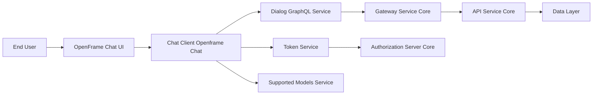
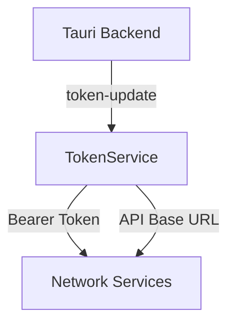
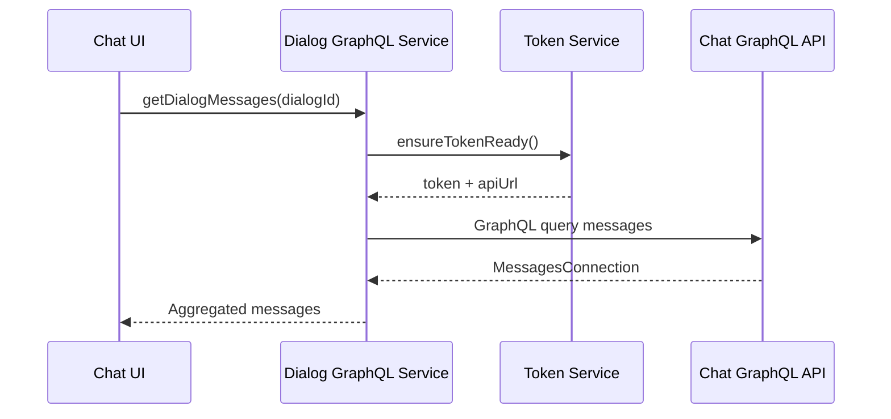
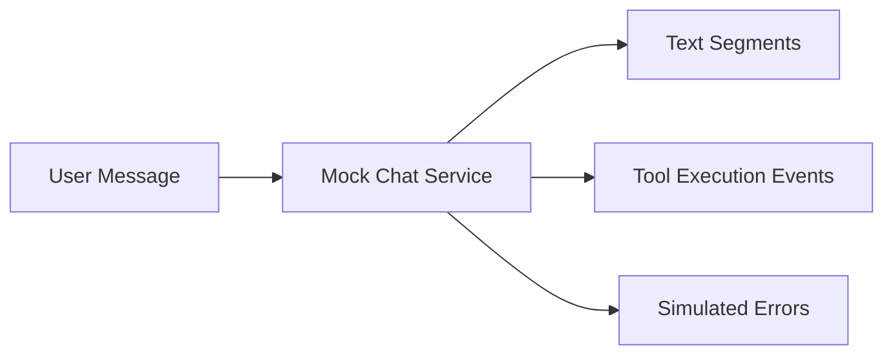

# Chat Client Openframe Chat

## Overview

Chat Client Openframe Chat is the client-side chat module used by OpenFrame to provide an interactive conversational experience between end users and the OpenFrame platform. It is responsible for:

- Managing authentication tokens and API endpoints in a desktop (Tauri-based) environment
- Fetching and streaming chat dialogs and messages over GraphQL
- Displaying AI-driven responses, including tool execution steps
- Supporting multiple AI models and providers
- Enabling developer-oriented debug behavior during runtime

This module runs on the client and acts as the primary bridge between the user interface and backend chat APIs exposed by the OpenFrame platform.

---

## High-Level Architecture

Chat Client Openframe Chat sits at the intersection of the frontend application, the OpenFrame Gateway, and downstream API services. It relies on token propagation from the Tauri runtime and communicates primarily via GraphQL and REST APIs.

---

## Core Responsibilities

### 1. Authentication and Environment Awareness

The module maintains awareness of:

- The current authentication token
- The active API base URL
- Runtime updates coming from the Tauri backend

This ensures chat operations remain authenticated and correctly routed, even when tokens or server configuration change dynamically.

### 2. Dialog and Message Retrieval

Chat Client Openframe Chat retrieves:

- The active or resumable dialog for a user
- Historical messages using cursor-based pagination
- Message metadata such as ownership, timestamps, and dialog state

All dialog communication is handled using GraphQL queries optimized for incremental loading.

### 3. Streaming and Tool-Aware Responses

The module supports streaming responses that may include:

- Plain text segments
- Tool execution lifecycle events (executing, executed, approval required)
- Error states during streaming

This enables rich conversational experiences where AI agents can transparently invoke backend tools.

### 4. AI Model Awareness

Chat Client Openframe Chat dynamically loads supported AI models from the backend, allowing:

- Multiple providers (for example OpenAI, Anthropic, Google Gemini)
- Model capability inspection such as context window size
- Friendly display names for end users

### 5. Debug Mode Support

For development and diagnostics, the module exposes a debug mode flag that can be queried from the Tauri backend and shared across the React component tree.

---

## Core Components

### Debug Mode Context

**Component:** DebugModeContextType

The debug mode context provides a global React context that exposes:

- A boolean flag indicating whether debug mode is enabled
- A setter to update debug mode locally

On initialization, it queries the Tauri backend for the current debug mode state. This allows developers to toggle enhanced logging or experimental features without recompiling the client.

---

### Token Service

**Component:** TokenService

Token Service is a singleton responsible for authentication and configuration state. Its responsibilities include:

- Listening for token updates emitted from the Tauri Rust layer
- Requesting tokens on demand via Tauri commands
- Managing the API base URL and normalizing server addresses
- Notifying subscribers when tokens or API URLs change

It acts as a foundational dependency for all network-facing services in this module.

---

### Dialog GraphQL Service

**Component:** DialogGraphQLService

Dialog GraphQL Service encapsulates all GraphQL communication related to chat dialogs. Key capabilities include:

- Lazy initialization of a GraphQL client using the current token and API URL
- Fetching the resumable dialog for the current user
- Loading dialog messages with cursor-based pagination
- Aggregating paginated results into a single message stream

This service depends directly on Token Service to ensure authentication is always valid before executing requests.

---

### Supported Models Service

**Component:** SupportedModelsService

Supported Models Service loads and caches the list of AI models supported by the backend chat service. Its responsibilities include:

- Fetching supported models from a REST endpoint
- Normalizing models across providers
- Exposing helper methods to:
  - Check if a model is supported
  - Retrieve display names
  - Enumerate all available models

The service ensures models are fetched only once per session unless explicitly reset.

---

### Mock Chat Service

**Component:** MockChatService

Mock Chat Service is a development and demonstration utility that simulates chat responses without backend interaction. It provides:

- Streaming text responses
- Simulated tool execution events
- Artificial delays to mimic real-time AI behavior
- Optional random error injection for resilience testing

This service is especially useful for UI development, demos, and offline testing.

---

## Interaction With Other Modules

Chat Client Openframe Chat does not operate in isolation. It integrates with several other platform modules:

- **Gateway Service Core**: Routes chat GraphQL and REST requests securely
- **API Service Core**: Hosts chat APIs, dialog persistence, and AI orchestration
- **Authorization Server Core**: Issues and refreshes authentication tokens
- **Data Layer**: Persists dialogs, messages, tool execution results, and audit data
- **Frontend App OpenFrame Frontend**: Consumes this module to render chat experiences

Rather than duplicating logic, Chat Client Openframe Chat focuses exclusively on client-side concerns and delegates business logic to backend services.

---

## Summary

Chat Client Openframe Chat is the client-facing backbone of OpenFrame’s conversational interface. By combining robust token management, GraphQL-based dialog handling, streaming AI responses, and flexible model support, it enables a secure, extensible, and developer-friendly chat experience across the OpenFrame platform.
