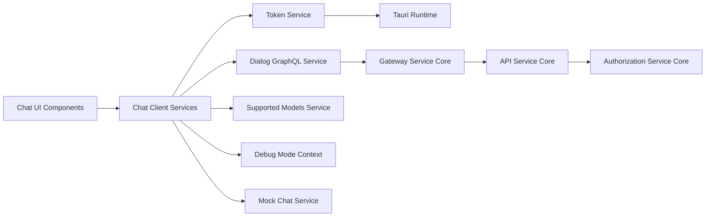
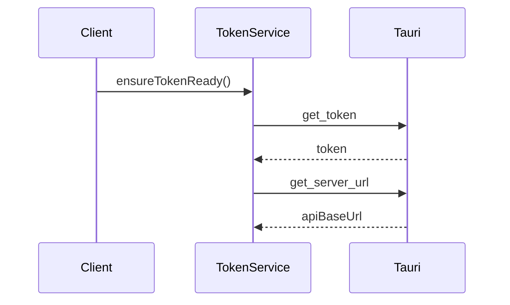
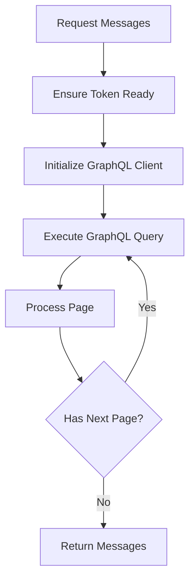
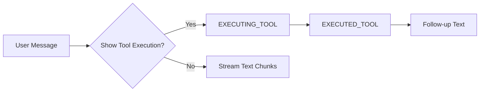

# Chat Client Services

## Overview

**Chat Client Services** is the client-side service layer that powers the OpenFrame chat experience inside the Flamingo platform. It acts as the bridge between the chat user interface, local runtime capabilities (via Tauri), and backend APIs exposed through the OpenFrame stack.

This module is responsible for:
- Managing authentication tokens and API base URLs in a desktop/client context
- Fetching and streaming chat dialogs and messages over GraphQL
- Resolving supported AI models and their metadata
- Providing mock and demo chat behavior for development and testing
- Exposing a debug-mode context that influences client-side behavior

Chat Client Services does **not** render UI components directly. Instead, it provides reusable services and React context utilities that are consumed by the chat UI layer and frontend core types.

---

## High-Level Architecture

Chat Client Services sits at the edge of the system, coordinating between the local client runtime and multiple backend services such as API Service Core, Gateway Service Core, and Authorization Service Core.

---

## Core Responsibilities

### 1. Client Authentication and Configuration

The module centralizes all client-side authentication concerns:
- Receiving tokens from the native runtime
- Reacting to token updates in real time
- Resolving and normalizing API base URLs

This ensures that all downstream services (GraphQL, REST, streaming) operate with a consistent and up-to-date security context.

### 2. Chat Dialog and Message Retrieval

Chat history and live conversation state are retrieved using GraphQL queries optimized for pagination and resumability. The client transparently handles:
- Token readiness and refresh timing
- Cursor-based pagination for message history
- Aggregation of multi-page message results

### 3. AI Model Awareness

The client dynamically loads supported AI models from the backend, allowing:
- Provider-agnostic model selection
- Friendly display names in the UI
- Validation of model availability at runtime

### 4. Development and Demo Support

For local development, demos, and testing scenarios, the module provides:
- A fully streaming mock chat service
- Simulated tool execution events
- Optional injected errors to validate error handling paths

### 5. Debug Mode Propagation

A React context is exposed to allow any part of the chat UI to react to debug-mode state, which is resolved from the native runtime on startup.

---

## Core Components

### Debug Mode Context

**Component:** `DebugModeContextType`

The Debug Mode Context provides a global, reactive flag indicating whether the client is running in debug mode.

**Key characteristics:**
- Initialized asynchronously from the native runtime
- Safe access via a custom React hook
- Centralized toggle point for debug-only UI or logging behavior

**Typical usage:**
- Enabling verbose logs
- Showing internal identifiers or raw payloads
- Unlocking experimental UI features

---

### Token Service

**Component:** `TokenService`

The Token Service is the foundational dependency for all other services in this module.

**Responsibilities:**
- Listening for token updates emitted by the native runtime
- Actively requesting tokens when missing
- Managing API base URL configuration
- Notifying subscribers when token or API URL changes

The Token Service guarantees that downstream requests never execute without valid authentication context.

---

### Dialog GraphQL Service

**Component:** `DialogGraphQLService`

The Dialog GraphQL Service handles all GraphQL-based chat operations.

**Key capabilities:**
- Lazy initialization of the GraphQL client
- Automatic injection of authorization headers
- Fetching resumable dialogs for session continuity
- Retrieving complete message histories using cursor-based pagination

This design allows the chat UI to request message history without needing to manage pagination logic itself.

---

### Supported Models Service

**Component:** `SupportedModelsService`

The Supported Models Service loads and caches the list of AI models supported by the backend.

**Responsibilities:**
- Fetching supported model metadata from the API
- Normalizing models across providers
- Exposing lookup utilities for display names and validation
- Caching results to avoid redundant network calls

This service enables the chat UI to remain decoupled from provider-specific model naming conventions.

---

### Mock Chat Service

**Component:** `MockChatService`

The Mock Chat Service provides a streaming, asynchronous chat simulation.

**Features:**
- Text streaming in small chunks to mimic real LLM output
- Simulated tool execution lifecycle events
- Conditional branching based on user input
- Optional random error injection

This service is intentionally isolated and never used in production environments.

---

## Interaction With Other Modules

Chat Client Services depends heavily on other parts of the OpenFrame platform:

- **Gateway Service Core**: Routes GraphQL and REST traffic
- **API Service Core**: Provides chat, dialog, and AI configuration endpoints
- **Authorization Service Core**: Issues and validates authentication tokens
- **Frontend Chat Core Types**: Defines shared message, dialog, and streaming types

These dependencies are consumed indirectly through network boundaries and shared contracts, keeping this module lightweight and client-focused.

---

## Design Principles

- **Single Source of Truth**: Token Service centralizes authentication state
- **Lazy Initialization**: Network clients are created only when required
- **Streaming First**: APIs are designed to support incremental message delivery
- **Separation of Concerns**: UI, services, and types remain cleanly decoupled
- **Developer Experience**: Mock services and debug context simplify development

---

## Summary

**Chat Client Services** is the backbone of the OpenFrame chat client experience. It abstracts authentication, networking, model awareness, and development tooling into a cohesive service layer that enables the chat UI to remain simple, reactive, and focused on user interaction.

By isolating these concerns, the module ensures consistency across environments while remaining flexible enough to support both production and demo use cases.
