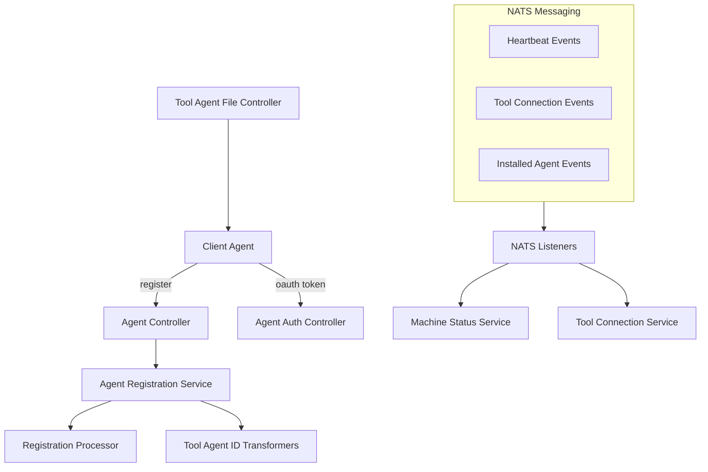

# Client Agent Service Core

## Overview
The **client_agent_service_core** module is responsible for managing the lifecycle and connectivity of OpenFrame client agents installed on managed devices. It provides:

- Secure agent authentication and token issuance
- Agent registration and identity normalization
- Tool agent binary delivery (temporary implementation)
- Real-time machine and tool connectivity tracking via NATS
- Integration points with external device management tools (Fleet MDM, MeshCentral)

This module acts as the **bridge between physical/virtual machines and the OpenFrame control plane**, ensuring devices are authenticated, registered, monitored, and enriched with tool metadata.

---

## High-Level Architecture

---

## Core Responsibilities

### 1. API Surface
- REST endpoints for agent registration and authentication
- Temporary binary download endpoint for tool agents

### 2. Event-Driven State Management
- Consumes NATS events for:
  - Machine online/offline state
  - Heartbeats
  - Tool connections
  - Installed agents

### 3. Agent Identity Normalization
- Transforms external tool identifiers into OpenFrame-compatible IDs
- Supports Fleet MDM and MeshCentral

---

## Sub-Modules

- [Controllers](controllers.md)
- [NATS Listeners](listeners.md)
- [Agent Registration & Transformation](agent_registration.md)

---

## Related Modules

This module collaborates closely with:

- **api_service_core** – persists and exposes device state
- **authorization_service_core** – issues OAuth tokens
- **data_kafka_transport** – downstream event streaming
- **sdk_integrations** – external RMM and MDM integrations

Refer to platform documentation for deeper cross-module workflows.
